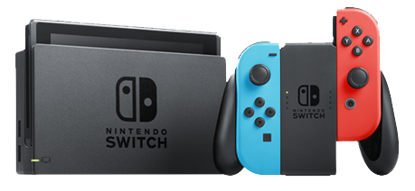

MonoGame is free to use on all platforms from the [public repository](https://github.dev/MonoGame/monogame), but the code for supporting console platforms is only accessible to authorized console developers.

These platforms are provided as private code repositories that add integrations with the console vendor's APIs and platform specific documentation.

## Application process

The process for access to the private console repositories is as follows:

1. Apply to the vendor developer program (required for publishing).
2. Through the program, request access to the MonoGame console repositories.

> [!IMPORTANT]
> The MonoGame Foundation cannot directly give anyone access to the private console repositories without prior approval from the vendor due to NDA requirements set out by each vendor.

The instructions below will help you gain access to each platform.

## Nintendo Switch

Your first step is to register as [Nintendo Developer](https://developer.nintendo.com/register) for Nintendo Switch.

Once you are in the program, you can go to the middleware page and fill out the [MonoGame - Nintendo Developer Authorization](https://developer.nintendo.com/group/development/getting-started/g1kr9vj6/middleware/monogame) form.

We will then contact you with further instructions.

## PlayStation 4, PlayStation 5

To access PlayStation platforms you must register as a [PlayStation Partner](https://partners.playstation.net/).

Once you are registered, you can submit a request in the [PlayStation 4 forums](https://ps4.develop.playstation.net/forums/thread/49561/) and the [PlayStation 5 forums](https://game.develop.playstation.net/forums/thread/251629/).

We will process these requests to give you access and further instructions.

## Xbox One, Xbox Series X

To publish on Xbox, you must first be a member of the [ID@Xbox Program](https://developer.microsoft.com/en-US/games/publish/).

Once you are active in the program you can email `idsetup@xbox.com` and copy the MonoGame`console@monogame.net`account requesting Xbox Developer verification for access to MonoGame for Xbox.

Once Microsoft approves your development status we will respond with further instructions.

## Questions

If you have any further questions feel free to contact us at `console@monogame.net`.
