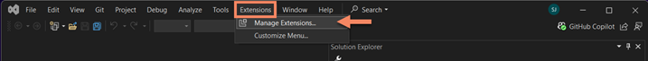
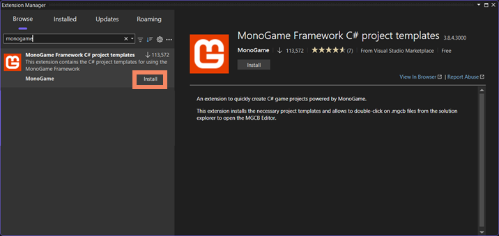

MonoGame can work with most .NET compatible tools, but we recommend [Visual Studio 2022](https://visualstudio.microsoft.com/vs/)

> [!NOTE]
> Alternatively, you can use [JetBrains Rider](https://www.jetbrains.com/rider/) or [Visual Studio Code](https://code.visualstudio.com/).
>
> Check out the guide for [Setting up VSCode / Rider here](./1_setting_up_your_development_environment_vscode.md).

## Install Visual Studio 2022

Before using MonoGame with Visual Studio you need to ensure you have installed the latest [Visual Studio 2022](https://visualstudio.microsoft.com/vs/) along with the required components.

When installing Visual Studio, the following workloads are required depending on your desired [target platform(s)](./platforms.md):

* Mandatory for all platforms:
  * **.Net desktop development**
* Optional
  * **.Net Multi-platform App UI Development** if you wish to target Android, iOS, or iPadOS.
  * **Universal Windows Platform development** if you wish to build for Windows store or Xbox.

> [!WARNING]
> **Targeting Windows**
>
> If you are targeting the standard Windows DirectX backend, you will also need [the DirectX June 2010 runtime](https://www.microsoft.com/en-us/download/details.aspx?id=8109) for audio and gamepads to work properly.
>
> Work is underway however to update to support DirectX 12 on Windows and Xbox very soon.

### Install MonoGame extension for Visual Studio 2022

To create new MonoGame projects from within Visual Studio 2022, you will need to install the **MonoGame Framework C# project templates** extension.  The following steps demonstrate how to install the extension.

1. Launch Visual Studio 2022
2. Select **Continue without code**.  This will launch Visual Studio without any project or solution opened.

    

3. Click "*Extensions -> Manage Extensions* in the Visual Studio 2022 menu bar.  This will open the Manage Extensions dialog window.

    

4. Use the search box in the top-right corner of the Manage Extensions dialog window to search for **MonoGame**, then click the **MonoGame Framework C# project templates** extension as shown below and download it to install it.

    

5. After it is downloaded, an alert will appear at the bottom of the Manage Extensions window that states "Your changes will be scheduled.  The modifications will begin when all Microsoft Visual Studio windows are closed."  Click the **Close** button, then close Visual Studio 2022.

6. After closing Visual Studio 2022, a VSIX Installer window will open confirming that you want to install the **MonoGame Framework C# project templates** extension.  Click the **Modify** button to accept the install.

    

You now have the MonoGame templates installed and are ready to create new projects.

> [!NOTE]
>
> ## [Alternative, use VSCode/Rider on Windows](./1_setting_up_your_development_environment_vscode.md)
>
> If you prefer to use JetBrains Rider or Visual Studio Code, then check out the [Setting up your development environment for VSCode](./1_setting_up_your_development_environment_vscode.md) article instead.

**Next up:** [Creating a new project](2_creating_a_new_project_vs.md)
