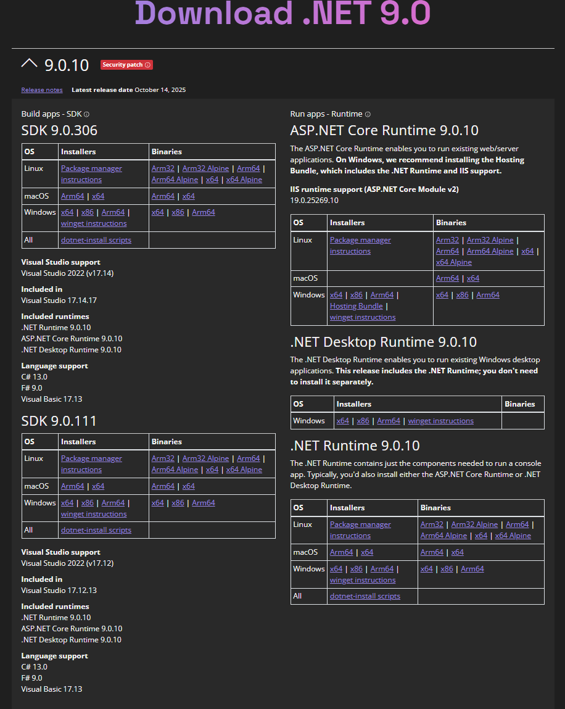

To develop with MonoGame in C#, you will need to install the .NET SDK. As of MonoGame 3.8.4.1 the recommended version is .NET 9.

> [!TIP]
> You can still continue to use .NET 8 if you wish, you will just need to downgrade your client project .NET version in the `csproj` setup for your project (if using the default templates)

## Install .NET 9 SDK

1. Navigate to [https://dotnet.microsoft.com/en-us/download/dotnet/9.0](https://dotnet.microsoft.com/en-us/download/dotnet/9.0)
2. Download the `.NET SDK` Installer for your current platform of `macOS`
3. Once the **.pkg** file finishes downloading, run it and follow the prompts to install the .NET SDK

    

## Install additional workloads

If you intend to also work with platforms such as `Android` or `iOS`, you will need to install the additional .NET workload templates for those platforms which include additional features and simulators to support those platforms.  Just run the following commands from the terminal for the platforms below you wish to install.

> [!IMPORTANT]
> For mobile development with iOS and Android, you must also install the MAUI workload even though MonoGame does not use MAUI. The MAUI workload contains the debugging tools required to run and debug mobile .NET applications. Without it, you will not be able to properly debug your MonoGame mobile projects.

### [Android](#tab/android)

```cli
    dotnet workload install android
```

### [iOS](#tab/iOS)

```cli
    dotnet workload install ios
```

### [Maui](#tab/maui)

```cli
    dotnet workload install maui
```

### [Android, iOS, and Maui](#tab/all)

```cli
    dotnet workload install android ios maui
```

---

> [!NOTE]
> You can use `dotnet workload search` to detect any other available workloads you wish to use.

## Setup Wine For Effect Compilation

Effect (shader) compilation requires access to DirectX.  This means it will not work natively on macOS and Linux systems, but it can be used through [Wine](https://www.winehq.org/).

MonoGame provides a setup script that can be executed to setup the Wine environment for Effect (shader) compilation.

1. Install [brew.sh](https://brew.sh)
1. Enter the following command:

    ```sh
    brew install wget p7zip curl && brew install --cask wine-stable && xattr -dr com.apple.quarantine "/Applications/Wine Stable.app"
    ```

1. Now that the prerequisites are installed, download the [mgfxc_wine_setup.sh](https://monogame.net/downloads/net9_mgfxc_wine_setup.sh) script and execute it by entering the following command in the terminal:

    ```sh
    wget -qO- https://monogame.net/downloads/net9_mgfxc_wine_setup.sh | bash
    ```

This will create new directory called `.winemonogame` in your home directory.  If you ever wish to undo the setup this script performed, just simply delete that directory.

## Next Steps

Choose from one of the two IDE options on macOS:

- [Setting up VSCode](./2_choosing_your_ide_vscode.md)
- [Setting up Rider](./2_choosing_your_ide_rider.md)
