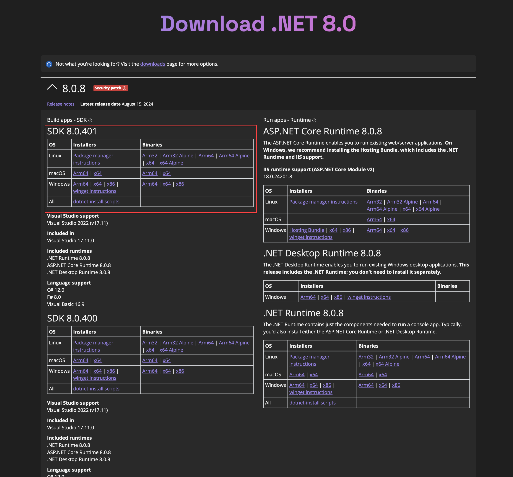

To develop with MonoGame in C#, you will need to install the .NET SDK. As of MonoGame 3.8.2 the minimum supported version is .NET 8.

## Install .NET 8 SDK

1. Navigate to [https://dotnet.microsoft.com/en-us/download/dotnet/8.0](https://dotnet.microsoft.com/en-us/download/dotnet/8.0)
2. Download the `.NET SDK` Installer for `macOS x64`.
3. Once the **.pkg** file finishes downloading, run it and follow the prompts to install the .NET SDK

    

> [!IMPORTANT]
>
> ### Apple Silicon Known Issues
>
> For the time being, MonoGame requires that you install the x64 version of the .NET runtime if you are running on an Apple Silicon mac in order to be able to build content. It is also required that [Rosetta](https://support.apple.com/en-us/HT211861) is enabled. 

## Setup Wine For Effect Compilation

Effect (shader) compilation requires access to DirectX.  This means it will not work natively on macOS and Linux systems, but it can be used through [Wine](https://www.winehq.org/).

MonoGame provides a setup script that can be executed to setup the Wine environment for Effect (shader) compilation.

1. Install [brew.sh](https://brew.sh)
2. Enter the following command:

    ```sh
    brew install p7zip curl && brew install --cask wine-stable
    ```

3. Now that the prerequisites are installed, download the [mgfxc_wine_setup.sh](https://monogame.net/downloads/net6_mgfxc_wine_setup.sh) script and execute it by entering the following command in the terminal:

    ```sh
    wget -qO- https://monogame.net/downloads/net6_mgfxc_wine_setup.sh | bash
    ```

This will create new directory called `.winemonogame` in your home directory.  If you ever wish to undo the setup this script performed, just simply delete that directory.

## Next Steps

Choose from one of the two IDE options on macOS:

- [Setting up VSCode](./2_choosing_your_ide_vscode.md)
- [Setting up Rider](./2_choosing_your_ide_rider.md)
