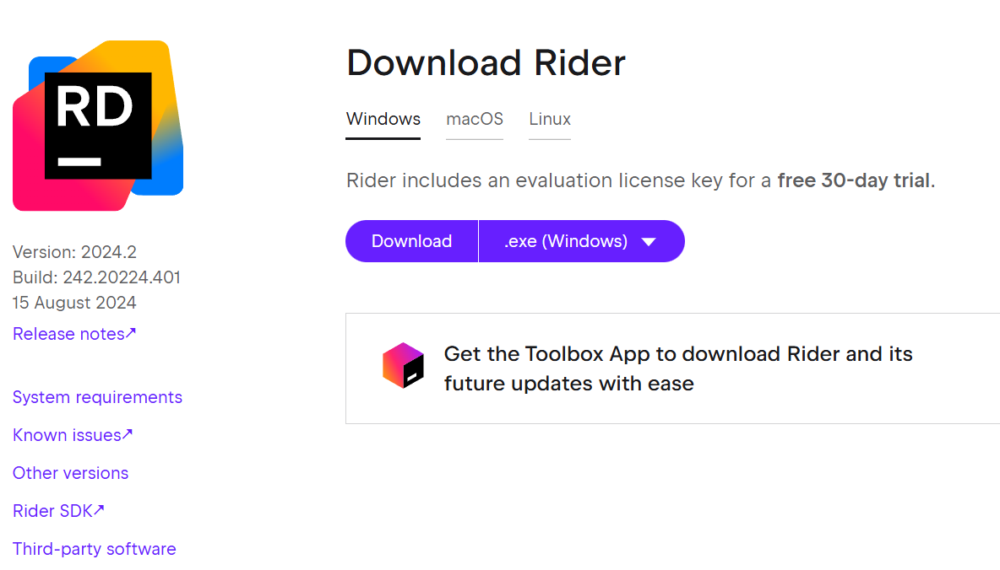
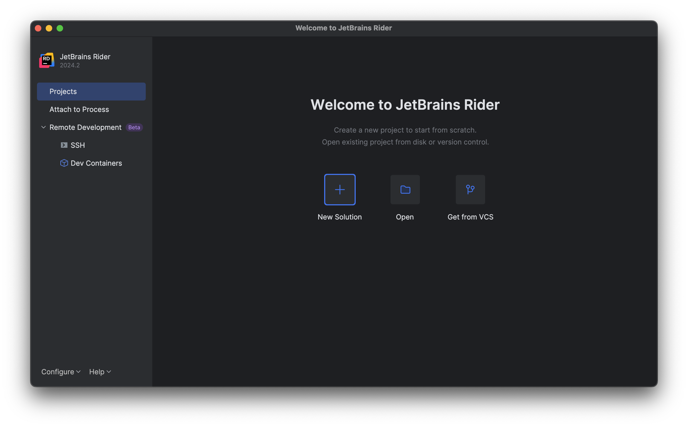
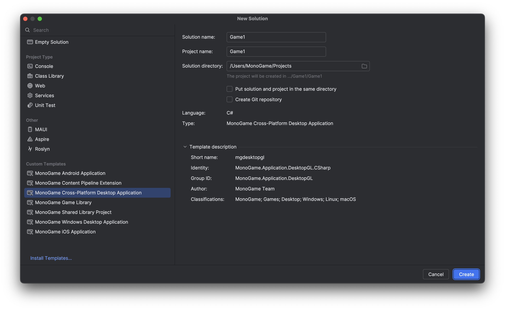

This is a guide on setting up your development environment for creating games with MonoGame using Rider by JetBrains. By following this guide, you will learn how to install the tools for developing C# applications and configure Rider with recommended extensions for C# development.

By the end, you will be fully equipped to start creating games with MonoGame using Rider.

## Install Rider

You can download and install Rider from: [https://www.jetbrains.com/rider/download](https://www.jetbrains.com/rider/download)



> [!NOTE]
> Rider has a 30 day free trial license, but after that you will need to purchase one to continue using it.  It is worth trying to see how it compares it VSCode.
>
> **Hint* - or visit a nearby .NET user group, who often have JetBrains licenses available as giveaways, as they are very a generous and supportive company.

## Setting up Rider for development with MonoGame

1. Open up terminal (or Powershell on Windows)
1. Run the following command to install templates:

    ```sh
    dotnet new install MonoGame.Templates.CSharp
    ```

## Creating a new MonoGame project

To get you started with Rider, here are the steps for setting up a new Rider MonoGame project.

1. Open up Rider
2. Click on the "New Solution" button

    

3. Select "MonoGame Cross-Platform Desktop Application" on the list on the left

    

4. Press "Create"
5. You can now press `F5` to compile and debug you game, happy coding  :)

## Next Steps

Next, get to know MonoGame's code structure and project layout:

- [Understanding the code](3_understanding_the_code.md)
