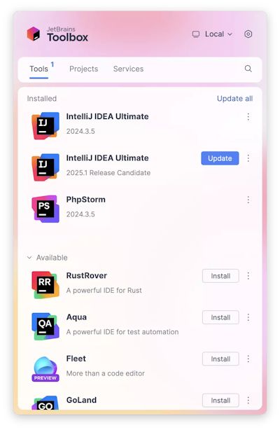
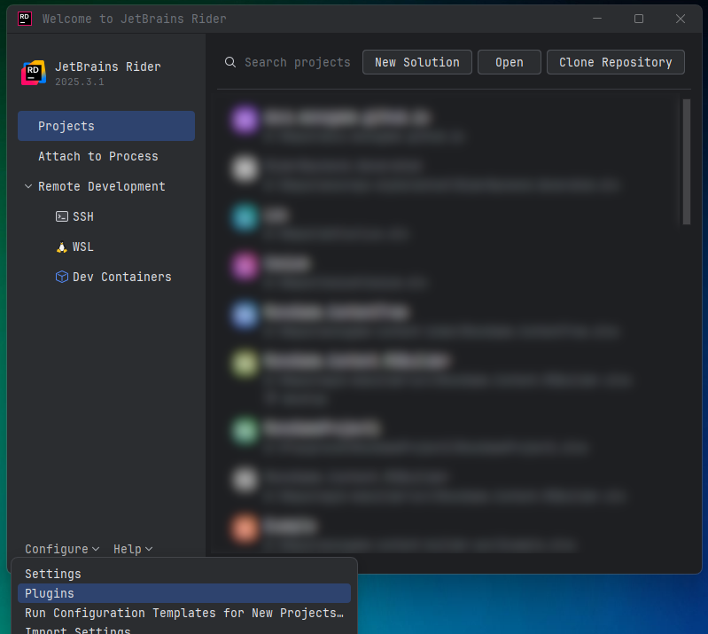
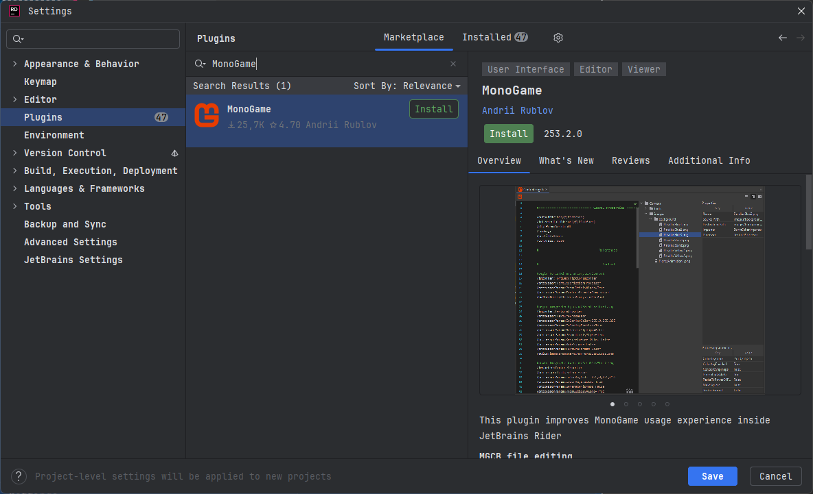
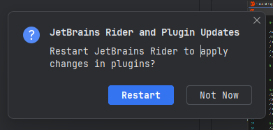
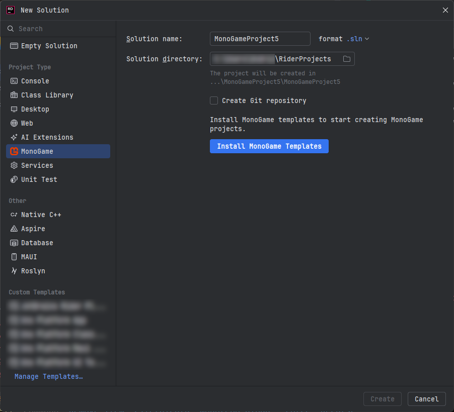
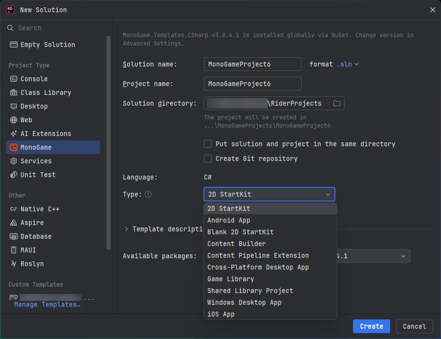
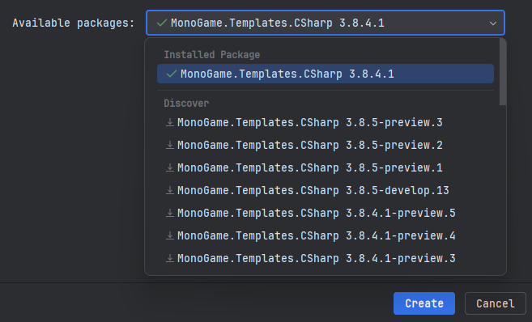
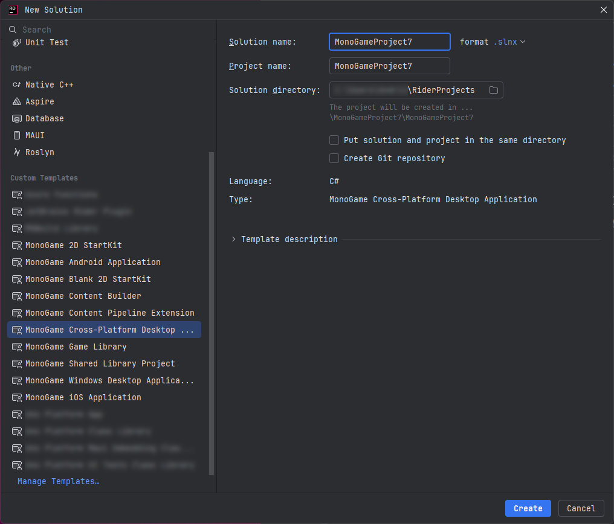
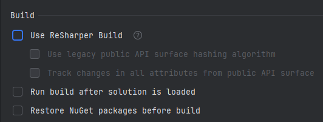

This is a guide on setting up your development environment for creating games with MonoGame using JetBrains Rider.
By following this guide, you will learn how to install and configure Rider with the recommended extension for MonoGame development.

## Installing Rider

> [!NOTE]
> Rider is [free for non-commercial use](https://www.jetbrains.com/non-commercial/), you do have to register and create an account, but otherwise all features will be unlocked.
>

### Toolbox App

The JetBrains Toolbox App is the recommended tool to install JetBrains products. It allows instant rollbacks, 
having multiple Rider instances, auto-updating to the latest version, and unifies the setup experience across OSes.

[Install Rider using JetBrains Toolbox](https://www.jetbrains.com/help/rider/Installation_guide.html#toolbox)



### Standalone installation

In case you prefer manual installation, please follow the corresponding guide that is relevant to your operating system:
- [Windows](https://www.jetbrains.com/help/rider/Installation_guide.html#standalone_windows)
- [macOS](https://www.jetbrains.com/help/rider/Installation_guide.html#standalone_macOS)
- [Linux](https://www.jetbrains.com/help/rider/Installation_guide.html#standalone_linux)

## Configuring MonoGame development environment

It is recommended to use the [MonoGame plugin for JetBrains Rider](https://plugins.jetbrains.com/plugin/18415-monogame) when working under your project in Rider to unlock the most available IDE features. The plugin is free, [open-source](https://github.com/seclerp/rider-monogame), and distributed under the MIT license. However, this step is still optional.

To explore all available features of the MonoGame plugin for Rider, you can refer to the [rider-monogame/README.md](https://github.com/seclerp/rider-monogame?tab=readme-ov-file#monogame-plugin-for-jetbrains-rider).

### [With plugin](#tab/plugin)

#### Installing MonoGame plugin

1. Click on the "Plugins" menu item on the Welcome screen:

    

1. Under the "Marketplace" tab, search for the "MonoGame" in the search bar
1. Click on the "Install" button next to the MonoGame plugin:

    

1. Don't forget to restart Rider after installation, when prompted:

    

#### Installing project templates

1. Click on the "New Solution" button
1. On the left sidebar of the New Project Wizard, find the MonoGame section:

    

1. Click "Install MonoGame Templates".

> [!WARNING]
> As of Rider 2025.3, due to a [known bug](https://youtrack.jetbrains.com/issue/RIDER-135465), the `MonoGame.Templates.CSharp` package that Rider installs globally will not be automatically visible to the `dotnet new` from the terminal. You need to install them manually too.

#### Creating a new MonoGame project

1. Click on the "New Solution" button
1. On the left sidebar of the New Project Wizard, select the MonoGame section
1. Fill the "Solution name" and "Solution directory"
1. Choose the project type:

   

1. Click "Create"
1. You can now press `F5` to compile and debug your game!

> [!NOTE]
> In case you want to use the different versions of the project templates, including preview packages, you can select another available package version under the "Available packages" field:
> 
> 

### [Without plugin](#tab/no-plugin)

#### Installing project templates

1. Open up your favorite terminal
1. Run the following command to install templates:

    ```sh
    dotnet new install MonoGame.Templates.CSharp
    ```

> [!TIP]
> Alternatively, consider using the Preview Packages provided by MonoGame to get access to the latest developments.
>
> * [How to install MonoGame Preview packages](../getting_to_know/howto/HowTo_Install_Preview_Release.md)

#### Creating a new MonoGame project

1. Click on the "New Solution" button
1. On the left sidebar of the New Project Wizard, find the MonoGame template under the "Custom Templates" section
1. Fill the "Solution name" and "Solution directory"
1. Choose the project type:

   

1. Click "Create"
1. You can now press `F5` to compile and debug your game!

---

### Keeping your environment up to date

A couple of advice to keep your development setup up to date:

1. Always use the latest stable version of Rider. 
   Configure the update policy [for the Rider installed via installer](https://www.jetbrains.com/help/rider/Update.html#update-settings) 
   or [for the Rider installed via the Toolbox App](https://www.jetbrains.com/help/rider/Update.html#update-all-tools).

1. It is recommended to enable [the plugins auto-update feature](https://www.jetbrains.com/help/rider/Managing_Plugins.html#update-plugins-automatically).

This way both Rider and installed plugins will always be up to date with the newest fixes and features available.

### Troubleshooting

#### ContentBuilder doesn't detect changes in content files in subsequent runs

It is a bug with ReSharper Solution Builder used by default in Rider. Un-check the "Use ReSharper Build" checkbox
under **Settings** > **Build, Execution, Deployment** > **Toolset and Build** > **Build** section:



and click "Save".

#### Issues with compiling MGFX effects under Linux

You might need to add the `MGFXC_WINE_PATH` environment variable to `/etc/environment` for it to be picked up. See [5777151094034-Rider-cannot-see-all-Environmental-Variables](https://rider-support.jetbrains.com/hc/en-us/community/posts/5777151094034-Rider-cannot-see-all-Environmental-Variables) for details.
