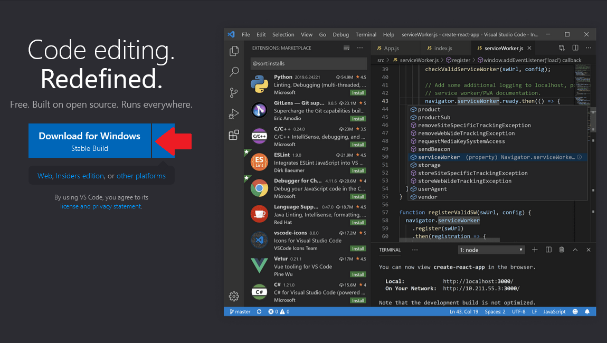

This is a guide on setting up your development IDE for creating games with MonoGame using Visual Studio Code. By following this guide, you will learn how to install the necessary tools for developing C# applications and configure Visual Studio Code with recommended extensions for C# development.

By the end, you will be fully equipped to start creating games with MonoGame using Visual Studio Code.

## Install Visual Studio Code

### [Windows](#tab/windows)

1. Open your web browser and navigate to [https://code.visualstudio.com/](https://code.visualstudio.com/).

    

2. Click the **Download for Windows** button.  This will redirect you to the download page where the installer will automatically download.
3. When the download completes, run the installer and complete the steps to install Visual Studio Code.

### [macOS](#tab/macos)

1. Open your web browser and navigate to [https://code.visualstudio.com/](https://code.visualstudio.com/).

    

2. Click the **Download Mac Universal** button.  This will redirect you to the page where the application archive (.zip) file will begin downloading.
3. Extract the contents of the VSCode archive that downloaded by double-clicking it inside a Finder window.  This will extract the **Visual Studio Code.app** file.
4. Drag the **Visual Studio Code.app** file into the **Applications** folder, making it available in the macOS Launchpad.

### [Ubuntu](#tab/ubuntu)

1. Open your web browser and navigate to [https://code.visualstudio.com/](https://code.visualstudio.com/).

    

2. Click the Download `.deb` button.
3. Double click the `.deb` file and press the `Install` button.

### [Arch Linux](#tab/arch)

On Arch Linux, you have two options for installing Visual Studio Code:

#### Option 1: Code OSS (Open Source Version)

Code OSS is the fully open-source version available under the MIT License. It's available in the official Arch repositories and can be installed with a single command:

```sh
sudo pacman -S code
```

> [!IMPORTANT]
> Code OSS **cannot** use the proprietary Microsoft **C# Dev Kit** extension. However, it can use the base **C#** extension (formerly OmniSharp, now LSP-based), which provides IntelliSense, syntax highlighting, debugging, and code navigation, sufficient for MonoGame development.

#### Option 2: Visual Studio Code (Official Microsoft Version) - Recommended

The official Microsoft version includes proprietary features like settings sync, Microsoft account integration, and **support for the C# Dev Kit extension**. It's available through the AUR (Arch User Repository).

1. First, ensure you have an AUR helper installed. If you don't have one, install `yay`:

    ```sh
    sudo pacman -S git base-devel
    git clone https://aur.archlinux.org/yay.git
    cd yay
    makepkg -si
    ```

2. Install Visual Studio Code using yay:

    ```sh
    yay -S visual-studio-code-bin
    ```

> [!TIP]
> For the best MonoGame development experience with full C# Dev Kit support (enhanced project management, integrated testing, better solution support), install the official Visual Studio Code. Code OSS works but has limitations with Microsoft extensions.

---

## Setting up VS Code for development with MonoGame

1. Open Visual Studio Code
1. Open up its terminal window (`Ctrl` + `` ` ``)
1. Run the following command to install MonoGame Templates

    ```sh
    dotnet new install MonoGame.Templates.CSharp
    ```

> [!TIP]
> Alternatively, consider using the Preview Packages provided by MonoGame to get access to the latest developments.
>
> - [How to install MonoGame Preview packages](../getting_to_know/howto/HowTo_Install_Preview_Release.md)

## Install Visual Studio Code C# Extensions

To transform Visual Studio Code from a simple text editor into a powerful development environment for C# projects, you must install the Visual Studio Code C# extension. This extension enhances the editor by providing syntax highlighting, code analysis, IntelliSense, and other features that significantly improve the development experience and productivity when working with C#.

1. Open Visual Studio Code.
2. Click the **Extensions** icon in the **Activity Bar** on the left.

    

3. In the **Search Box** type `C#`.
4. Click **Install** for the **C# Dev Kit** extension.  Installing this will also install the base **C#** extension.


> [!NOTE]
> **For Arch Linux Code OSS users:** The C# Dev Kit extension is not compatible with Code OSS. Instead, install only the base **C#** extension (by Microsoft), which provides all the core functionality needed for MonoGame development including IntelliSense, debugging, and code navigation.

## (Optional) Install the "MonoGame for VSCode" extension

A community member has built a VSCode extension for VS code to enable:

- Automatically install MonoGame templates
- Create new projects from the file menu or command palette
- Open the MGCB editor with the click of a button (very useful)

You can find this extension by following the steps above and searching for "MonoGame for VS Code" by r88.

> [!NOTE]
> While not built by the MonoGame team, we regularly use this extension ourselves and fully support it.

## (Optional) Install the ".NET MAUI" extension to help with mobile development

This extension is provided by Microsoft and is built on top of the C# and C# Dev Kit extensions. They will be installed as dependencies if they were not already installed. While primarily designed for MAUI development, it provides essential mobile debugging capabilities that MonoGame mobile projects can utilize.

The .NET MAUI extension adds features for building mobile apps, including:

- F5 debugging support - Debug your MonoGame mobile apps on emulators, simulators, and physical devices
- Easy target switching - Change debug/deploy targets between different mobile platforms
- Enhanced C# Dev Kit integration - Leverages Solution Explorer, Test Explorer, and advanced language features


> [!NOTE]
> This extension is recommended if you wish to do iOS or Android development. It is required for debugging support when working on mobile games.

> [!WARNING]
> **For Arch Linux Code OSS users:** The .NET MAUI extension requires C# Dev Kit and therefore is not compatible with Code OSS. You will need to use the official Visual Studio Code for mobile development support.

## Creating a new MonoGame project

1. Open up an empty folder in Visual Studio Code
2. Open up its terminal window (`Ctrl` + `` ` ``)
3. Run the following command to create an empty project for desktop platforms:

    ```sh
    dotnet new mgdesktopgl
    ```

4. Once the files are created, open up the `Game1.cs` file and wait a second for the C# extension to load
5. You can now press F5, select C# and then your projects name if Visual Studio Code asks you, and it should start up your brand new game!

## Update Project Tool references

The MonoGame Content Editor (MGCB) is a tool delivered through NuGet for your project using the tools configuration held in your `dotnet-tools.json` file (located in the `.config` folder of your project).

Once you have created your project you should run the following terminal/command-line command to ensure the tool (and the pipeline) is setup and read for your project:

```dotnetcli
    dotnet tool restore
```

> [!NOTE]
> If you ever change the version of the tools or want to upgrade them by editing the `dotnet-tools.json` configuration, you MUST run this command again to update te tools.
