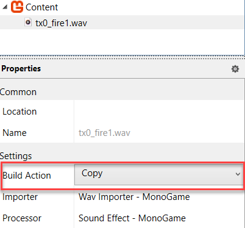

## Overview

In this example, you will walk through the basics of dynamic sounds, using the more advanced [SoundEffectInstance](xref:Microsoft.Xna.Framework.Audio.SoundEffectInstance) cl;ass over the basic [SoundEffect.Play](xref:Microsoft.Xna.Framework.Audio.SoundEffect.Play) method used in [Playing a Sound](HowTo_PlayASound.md).

## Using SoundEffectInstance

The **[SoundEffect.Play](xref:Microsoft.Xna.Framework.Audio.SoundEffect.Play)** method allows you to specify the pitch and volume of a sound to play. However, after you call **[Play](xref:Microsoft.Xna.Framework.Audio.SoundEffect.Play)** you cannot modify the sound. 

Using **[SoundEffectInstance](xref:Microsoft.Xna.Framework.Audio.SoundEffectInstance)** for a given **[SoundEffect](xref:Microsoft.Xna.Framework.Audio.SoundEffect)**, allows you to change the **pitch** and **volume** of a sound at any time during playback.

> [!NOTE]
> The pitch of a sound changes the frequency of the sound, which in turn changes the speed of the sound. The volume of a sound changes the amplitude of the sound, which in turn changes the loudness of the sound.

## Requirements

This sample uses a sound file named [tx0_fire1.wav](files/tx0_fire1.wav), which you can download from [this link here](files/tx0_fire1.wav). (save-as)
But you can use your own if you wish.

## Change Pitch and Volume of Sound

1. Declare a **[SoundEffect](xref:Microsoft.Xna.Framework.Audio.SoundEffect)** and a [Stream](http://msdn.microsoft.com/en-us/library/system.io.stream.aspx) file by using the method shown in [Playing a Sound](HowTo_PlayASound.md). In addition to the method described in [Playing a Sound](HowTo_PlayASound.md), declare a **[SoundEffectInstance](xref:Microsoft.Xna.Framework.Audio.SoundEffectInstance)** and a **Sound Effect** field member. We also create two float fields for **pitch** and **volume** to store the pitch and volume of the sound effect and assign initial values to them.

    ```csharp
    // place these usings at the top of the file
    using System.IO;
    using Microsoft.Xna.Framework;
    using Microsoft.Xna.Framework.Audio;
    using Microsoft.Xna.Framework.Graphics;
    using Microsoft.Xna.Framework.Input;

    // place these fields at the top of the class
    private SoundEffect soundEffect;
    private SoundEffectInstance soundEffectInstance;
    private float pitch = 0.75f;
    private float volume = 0.5f;
    ```

    > [!NOTE]
    > Usings are declared at the top of the file to ensure that the necessary namespaces are available to the class. The fields are declared at the top of the class to ensure that they are accessible to all methods in the class.

2. In the [Game.LoadContent](xref:Microsoft.Xna.Framework.Game.LoadContent) method, set the **SoundEffectInstance** object to the return value of [SoundEffect.CreateInstance](xref:Microsoft.Xna.Framework.Audio.SoundEffect.CreateInstance).

3. In the **[Game.LoadContent](xref:Microsoft.Xna.Framework.Game.LoadContent)** method, set the **SoundEffectInstance** object to the return value of **[SoundEffect.CreateInstance](xref:Microsoft.Xna.Framework.Audio.SoundEffect.CreateInstance)**. We also optionally define a variable **soundFile** to store the location of the sound file being used with the **[TitleContainer.OpenStream](xref:Microsoft.Xna.Framework.TitleContainer#Microsoft_Xna_Framework_TitleContainer_OpenStream_System_String_)** method, which is accessed with the  **using** keyword, and include a field member variable called **soundEffect**, to hold the stream.

    ```csharp
    using Stream soundfile = TitleContainer.OpenStream(@"Content\tx0_fire1.wav");
    soundEffect = SoundEffect.FromStream(soundfile);
    soundEffectInstance = soundEffect.CreateInstance();
    ```

    >[IMPORTANT]
    > As we need the raw wav file and not a compressed version to access its stream, make sure to set the 'Build Action' in the MGCB tool to 'COPY'
    > 

4. Adjust the sound to the desired level using the [SoundEffectInstance.Pitch](xref:Microsoft.Xna.Framework.Audio.SoundEffectInstance.Pitch) and [SoundEffectInstance.Volume](xref:Microsoft.Xna.Framework.Audio.SoundEffectInstance.Volume) properties.

    ```csharp
    // Pitch takes values from -1 to 1
    soundEffectInstance.Pitch = pitch;
    
    // Volume only takes values from 0 to 1
    soundEffectInstance.Volume = volume;
    ```

5. Play the sound using [SoundEffectInstance.Stop](xref:Microsoft.Xna.Framework.Audio.SoundEffectInstance.Play).

    ```csharp
    // Play Sound
    soundEffectInstance.Play();
    ```

     > [!NOTE]
     > An instance will play once, to loop the sound, you can use the **[SoundEffectInstance.IsLooped](xref:Microsoft.Xna.Framework.Audio.SoundEffectInstance.IsLooped)** property to set the sound to loop. Also note that the sound will not repeat until the sound has finished playing. You can utilise the **[SoundEffectInstance.State](xref:Microsoft.Xna.Framework.Audio.SoundEffectInstance.State)** property to check if the sound is playing, paused or stopped. Use the **[SoundEffectInstance.Stop](xref:Microsoft.Xna.Framework.Audio.SoundEffectInstance.Stop)** method to stop the sound.

## An Extended Example

 1. Below the **[Game.Draw](xref:Microsoft.Xna.Framework.Game#Microsoft_Xna_Framework_Game_Draw_Microsoft_Xna_Framework_GameTime_)** method, create a new method called **IsKeyPressed**, which will check if a specified key is pressed and return a boolean value of true if it has been pressed.

    ```csharp
    private bool IsKeyPressed(Keys key)
    {
        return Keyboard.GetState().IsKeyDown(key);
    }
     ```

 2. In the **[Game.Update](xref:Microsoft.Xna.Framework.Game#Microsoft_Xna_Framework_Game_Update_Microsoft_Xna_Framework_GameTime_)** method, we will add a check to see if the **Space** key is pressed and adjust the pitch and volume of the sound effect accordingly. The pitch and volume values are adjusted by +0.1f each time the **Space key** is pressed. The pitch values are clamped to a minimum value of -1.0f and a maximum value of 1.0f, and the volume values are then clamped to a minimum value of 0f and a maximum value of 1.0f. This is done to ensure that the pitch and volume values are within  valid ranges.

 ```csharp
    // Check if the SpaceKey is pressed and play the instance
    if (IsKeyPressed(Keys.Space))
        {
         pitch += 0.1f;
         volume += 0.1f;
         pitch = MathHelper.Clamp(pitch, -1.0f, 1.0f);
         volume = MathHelper.Clamp(volume, 0f, 1.0f);
         soundEffectInstance.Pitch = pitch;
         soundEffectInstance.Volume = volume;
         soundEffectInstance.Play();
        }
 ```

 > [!NOTE]
 > The **MathHelper.Clamp** method is used to ensure that the pitch and volume values are within the valid range. The pitch value is clamped between -1 and 1, while the volume value is clamped between 0 and 1.

 > [!IMPORTANT]
 > The check for the keypress does not prevent the call to the method repeating so any value entered may peak the value in a single key press. To prevent this, you can add a delay to the key press check, or use a boolean value to check if the key has been pressed and released.

## See Also

* [Playing a Sound](HowTo_PlayASound.md)

  Demonstrates how to play a simple sound by using [SoundEffect](xref:Microsoft.Xna.Framework.Audio.SoundEffect).

* [Looping a Sound](HowTo_LoopASound.md)

  Demonstrates how to loop a sound.

* [Stream data from a Wav](HowTo_StreamDataFromWav.md)

  Demonstrates how to load a wav file through a file stream.

* [Creating and Playing Sounds](../../whatis/audio/index.md)

  Provides overviews about audio technology, and presents predefined scenarios to demonstrate how to use audio.

## Reference

* [SoundEffect Class](xref:Microsoft.Xna.Framework.Audio.SoundEffect)

  Provides a loaded sound resource.

* [SoundEffectInstance Class](xref:Microsoft.Xna.Framework.Audio.SoundEffectInstance)

  Provides a single playing, paused, or stopped instance of a [SoundEffect](xref:Microsoft.Xna.Framework.Audio.SoundEffect) sound.
