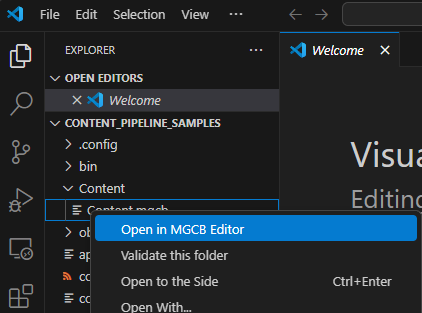

> [!TIP]
> For help with creating a project, please look at the [Creating a New Project](~/articles/getting_started/index.md) section of the Getting Started guide.

## MonoGame Content Builder Tool (MGCB Editor)

The MGCB editor is installed as a "local" DotNet tool with your project, utilizing the `dotnet-tools.json` configuration file located in the `.config` folder of your project.


You will need to install either the Visual Studio 2022 MonoGame extension or the `MonoGame Content Builder (editor)` extension for VSCode. If you are not using the extension, you will need to manually install and use the [MGCB Editor](~/articles/getting_started/tools/mgcb_editor.md).

> [!NOTE]
> This is technically optional, since you can edit the .mgcb files manually if you wish, but the editor is highly recommended for ease of use.

If you are unsure of your setup, please follow one of the "Setting up your development environment" articles in the "Getting Started" section of the [Documentation Site](~/index.md)

## Adding content

First, you will need some content for your game. For this tutorial, use the following image of a ball:


Copy the image to your machine by using **right-click > Save Image As** and save it somewhere locally with the name “ball.png”.

### [VSCode](#tab/vscode)

> [!NOTE]
> Requires the `MonoGame Content Builder (editor)` extension for VSCode.

Now open up your game project and look at the Explorer window. Expand the **Content** folder and open up **Content.mgcb** file by right-clicking on it and selecting `Open in MGCB editor`.



### [Visual Studio](#tab/visualstudio)

> [!NOTE]
> Requires the `MonoGame extension for Visual Studio` to be installed.

Now open up your game project and look at the Solution Explorer window. Expand the **Content** folder and open up **Content.mgcb** file by double-clicking on it.


If a text file opens instead, then right-click on **Content.mgcb** and select **Open With**, then select **MGCB Editor** in the list, click **Set as Default** and then click **OK**, then try again.

> [!NOTE]
> If you do not see the **MGCB Editor** option when you right-click and select **Open With**, then please review the [Tools documentation](~/articles/getting_started/tools/index.md) for installing the MGCB Editor tool for your operating system.

---

You should now see the MGCB Editor window open up.


Your game content is managed from this external tool. You can add content to your game in one of the following ways:

- **Add Existing Item** toolbar button
- **Edit > Add > Existing Item...** menu button
- **right-click > Add > Existing Item...** context menu

Make sure the `Content` MGCB file is selected to the left, then click the **Add Existing Item** toolbar button.


You should now be prompted to select a file. Select the “**ball.png**” image that you downloaded a moment ago. Once you have confirmed your selection, you will be asked whether to copy the file, add a link to it, or skip it. Make sure "**Copy the file to the directory**" option is selected and click **Add**.


Now click the **Save** toolbar button and close the MGCB Editor tool.


---

## Adding the content in your game

Now that you have added the asset to the Content project, it is time to load it into your game. First, open up the `Game1.cs` class file and declare a new `ballTexture` variable of type `Texture2D` in the `Game1` class, so you can store the ball image into memory.

```csharp
public class Game1 : Game
{
    Texture2D ballTexture;

    private GraphicsDeviceManager _graphics;
    private SpriteBatch _spriteBatch;
```

Next, find the `LoadContent` method. Here, use [Content.Load()](xref:Microsoft.Xna.Framework.Content.ContentManager#Microsoft_Xna_Framework_Content_ContentManager_Load__1_System_String_) function to load the "ball" sprite and store it in the `ballTexture` parameter. `Content.Load<T>()` requires you to specify what type of content you are trying to load, in this case it is a `Texture2D`.

```csharp
protected override void LoadContent()
{
    // Create a new SpriteBatch, which can be used to draw textures.
    _spriteBatch = new SpriteBatch(GraphicsDevice);

    // TODO: use this.Content to load your game content here
    ballTexture = Content.Load<Texture2D>("ball");
}
```

Finally, find the Draw method to draw the ball onto the screen. This is done by:

- Opening a SpriteBatch (an image drawing collection function).
- Adding the images you want to draw and specifying where you want to draw them.
- Then finally closing the SpriteBatch to commit the textures you want drawn to the screen.

> [!NOTE]
> If you add multiple images, they will be drawn in the order you place them from back to front (each drawn on top of each other).

As shown below:

```csharp
protected override void Draw(GameTime gameTime)
{
    graphics.GraphicsDevice.Clear(Color.CornflowerBlue);

    // TODO: Add your drawing code here
    _spriteBatch.Begin();
    _spriteBatch.Draw(ballTexture, new Vector2(0, 0), Color.White);
    _spriteBatch.End();

    base.Draw(gameTime);
}
```

Now run the game. You should get the following:


