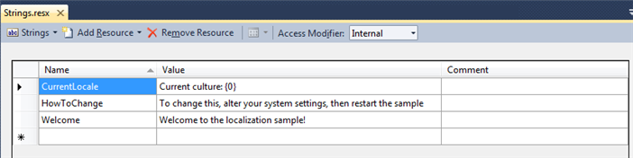

This tutorial demonstrates methods that allow a game to display differing UI text according to the platform's current culture setting stored in [CultureInfo](http://msdn.microsoft.com/en-us/library/system.globalization.cultureinfo.aspx). It also demonstrates how to extend the Content Pipeline so that the minimum number of additionally required font characters are included in the game executable for the localized text.

For more detailed information about both globalization and localization issues for Windows Phone, see [Globalization and Localization for Windows Phone](http://go.microsoft.com/fwlink/?LinkId=254839) in the Windows Phone documentation.

- [Creating Resource Files](#creating-resource-files)
- [Extending the Content Pipeline](#extending-the-content-pipeline)
- [Associating Localization Data and Processors With Fonts](#associating-localization-data-and-processors-with-fonts)
- [Using Localized Strings in the Game](#using-localized-strings-in-the-game)

## Creating Resource Files

A localized game should maintain its resources in resource (.resx) files in the game's code project. The game should maintain at least one resource file for every language/culture it is to support. Each resource file defines identifiers for each localizable UI string in the game, with a localized version of that string for the intended language/culture. In this way, localization can be maintained independently from coding.

### To create resource files

1. In **Solution Explorer**, right-click the code project node, select **Add**, and then click **New Item**.

2. In the **Add New Item** dialog box, select the resources file, and rename it as appropriate, for example, Strings.resx.

    This file will contain the resources for the default language for the application.

3. Identify strings in your application and add them to the resource file.

    Each string has a name, a value, and an optional comment. The name must be unique so make it as descriptive as possible. The value is the string to be displayed in the application to the user. Adding a comment is useful, especially in large resource files as a reminder of the purpose of the string and later as information for the translator to understand the correct context.

    **Figure 1.  An example of English language strings for the Strings.resx resource file**

    

4. Add a new resource file to your project for each language/culture the application will support.

    > **Note**
    >
    > Each resource file must follow the naming convention:
    >
    > _name of the resource file for the default language_._culture name_
    >
    > An example of this format is MyStrings.fr.resx, where the culture name—fr in this instance—is derived from the [CultureInfo](http://msdn.microsoft.com/en-us/library/system.globalization.cultureinfo.aspx) class.

    As shown in the next figure, the strings defined for the resource file must have the same set of identifying names as defined in the default resource file.

    **Figure 2.   An example of French language strings for the resource file Strings.fr.resx**

    

    **Figure 3.  An example of strings in the Japanese language resource file Strings.ja.resx**

    

> **Note**
>
> Universal Windows Applications Specific Information
>
> Universal Windows Applications (UWP) do not use `resx` files. These have been replace with `resw` files, the format is slightly different but the process is the same as `resx`. It does however mean you need to maintain two copies of the language files when targeting UWP and other platforms.

## Extending the Content Pipeline

To accommodate a localized game, you need to create a new Content Pipeline Library Extension project to process the resource files and fonts.

The new content library extension must extend the [FontDescription](xref:Microsoft.Xna.Framework.Content.Pipeline.Graphics.FontDescription) class to support a list of the resource files that later will be included in the .spritefont file.

You also will need to create a new content processor that extends [FontDescriptionProcessor](xref:Microsoft.Xna.Framework.Content.Pipeline.Processors.FontDescriptionProcessor) to process the resource file list, and to include the required characters in the built game executable.

### To create a Content Pipeline Extension Library project

1. On the File menu, click New Project.
2. Select the Content Pipeline Extension Library (4.0) project type.
3. In the Name box, type the name for the new library project.
4. You might name the project LocalizationPipeline for example.
5. Click OK to create and load the new project.

### To extend the FontDescriptor class

You will add a new file to contain the new class.

1. In Solution Explorer, right-click the newly created Content Pipeline Library Extension project, select Add, click New Item, and then select Class.

    Assign the new file a name such as LocalizedFontDescription.cs.

2. In the new class file, declare a new class (for example, LocalizedFontDescription) that derives from [FontDescription](xref:Microsoft.Xna.Framework.Content.Pipeline.Graphics.FontDescription).

    ```csharp
    class LocalizedFontDescription : FontDescription
    ```

3. Within the class, define a new ResourceFiles property.

    This action results in recognition of a ResourceFiles element in the .spritefont XML file, which will contain the list of resource files.

    ```csharp
    [ContentSerializer(Optional = true, CollectionItemName = "Resx")]
    public List<string> ResourceFiles
    {
        get { return resourceFiles; }
    }
    
    List<string> resourceFiles = new List<string>();
    ```

### To extend the FontDescriptionProcessor class

A new file to contain the new FontDescriptionProcessor class will be added.

1. In Solution Explorer, right-click the content pipeline extension project, select Add, click New Item, and then select Class.

    Assign the new file a name, such as LocalizedFontProcessor.cs.

2. In the new class file, declare a new class (for example, LocalizedFontProcessor) that derives from [ContentProcessor](https://monogame.net/api/Microsoft.Xna.Framework.Content.Pipeline.ContentProcessor-2.html), and specifies the new LocalizedFontDescription class as input.

    ```csharp
    [ContentProcessor]
    class LocalizedFontProcessor : ContentProcessor<LocalizedFontDescription, SpriteFontContent>
    ```

    Within the class, override the **Process** method with the new LocalizedFontDescription class as input.

    ```csharp
    public override SpriteFontContent Process(LocalizedFontDescription input, ContentProcessorContext context)
    ```

3. In the new **Process** method, step through the ResourceFiles property of the LocalizedFontDescription object to load each declared resource file.

    ```csharp
    foreach (string resourceFile in input.ResourceFiles)
    {
        string absolutePath = Path.GetFullPath(resourceFile);
    
        // Make sure the .resx file really does exist.
        if (!File.Exists(absolutePath))
        {
            throw new InvalidContentException("Can't find " + absolutePath);
        }
    
        // Load the .resx data.
        XmlDocument xmlDocument = new XmlDocument();
    
        xmlDocument.Load(absolutePath);
    ```

4. For each resource file, scan each string and add found characters to the LocalizedFontDescription object.

    ```csharp
    // Scan each string from the .resx file.
    foreach (XmlNode xmlNode in xmlDocument.SelectNodes("root/data/value"))
    {
        string resourceString = xmlNode.InnerText;
    
        // Scan each character of the string.
        foreach (char usedCharacter in resourceString)
        {
            input.Characters.Add(usedCharacter);
        }
    }
    ```

5. Using **AddDependency**, mark that the font should be rebuilt if the resource file changes.

    ```csharp
    context.AddDependency(absolutePath);
    ```

6. Use the [FontDescription](xref:Microsoft.Xna.Framework.Content.Pipeline.Graphics.FontDescription) class to build the font.

## Associating Localization Data and Processors With Fonts

Now that project data is divided into resource files, and has a custom content processor to consume it, the parts need to be bound together to help them work. This is accomplished by providing extended information in a `.spritefont` file, and binding the file to the custom content processor.

### To extend the .spritefont file

Create a new `.spritefont` file.

1. In **Pipeline Tool**, right-click the content project node, select **Add**, and then click **New Item**.
2. In the **Add New Item** dialog box, select "Localized Sprite Font," and then in the **Name** box, enter a name (for example, `Font.spritefont`) for the new file.
3. Click **Add** to create the new file. This will create a new Localized Sprite Font which is already setup to work with localized resource files.
4. Right Click on the new file and select Open or Open With to open it for editing.
5. Change the asset type declaration to reference the previously created extended FontDescriptor class.

    ```xml
    <Asset Type="LocalizationPipeline.LocalizedFontDescription">
    ```

6. Add a block within `<ResourceFiles>` tags that lists each resource file using the `<Resx>` elements.
    The example tags below specify resource files for the default language, as well as for Danish (da), French (fr), Japanese (ja), and Korean (ko).

    ```xml
    <ResourceFiles>
        <Resx>..\\Strings.resx</Resx>
        <Resx>..\\Strings.da.resx</Resx>
        <Resx>..\\Strings.fr.resx</Resx>
        <Resx>`..\\Strings.ja.resx</Resx>
        <Resx>`..\\Strings.ko.resx</Resx>
    </ResourceFiles>
    ```

7. Save the file.

## Using Localized Strings in the Game

The localized strings will be available in your game as a class with the same name as the base file name of the resource file for the default language (for example, Strings).

Setting the **Culture** property of this class from the [CultureInfo.CurrentCulture](http://msdn.microsoft.com/en-us/library/system.globalization.cultureinfo.currentculture.aspx) property will cause the correct language version of the localized strings to be loaded according to the platform's current culture setting.

```csharp
    Strings.Culture = CultureInfo.CurrentCulture;
```

## See Also

- [Extending a Standard Content Processor](./HowTo_Extend_Processor.md)
- [Adding New Content Types](../../whatis/Content_Pipeline/CP_Content_Advanced.md)
