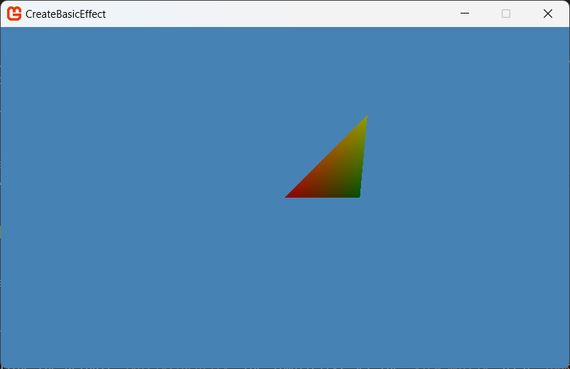

## Overview

The steps described here apply to effects created with the [BasicEffect](xref:Microsoft.Xna.Framework.Graphics.BasicEffect) class using the [Effect](xref:Microsoft.Xna.Framework.Graphics.Effect) class to write a custom effect.

> [!NOTE]
> The example draws aliased geometry, to see an example that draws smoother edges because it also applies anti-aliasing, see [Enabling Anti-aliasing (Multi-sampling)](HowTo_Enable_Anti_Aliasing.md).

### End result



## To use BasicEffect

Using the basic effect class requires a set of `world`, `view`, and `projection` matrices, a `vertex buffer`, a `vertex declaration`, and an instance of the [BasicEffect](xref:Microsoft.Xna.Framework.Graphics.BasicEffect) class.

1. Declare these properties at the beginning of the game class.

    ```csharp
    //Matrices for 3D perspective
    private Matrix worldMatrix, viewMatrix, projectionMatrix;

    // Vertex data for rendering
    private VertexPositionColor[] triangleVertices;

    // A Vertex format structure that contains position, normal data, and one set of texture coordinates
    private BasicEffect basicEffect;
    ```

1. Initialize the world, view, and projection matrices in the `Initialize`.

    Next, create a world matrix using the default `Matrix.Identity` for simplicity. Set the `view matrix` as a `look-at` matrix with a camera position of `(0, 0, 50)`, pointing at the origin. The `projection matrix` is a `perspective` projection matrix based on a a `45-degree` field of view, an aspect ratio equal to the client window, and a set of `near` and `far` planes to render the geometry within in view of the camera.

    ```csharp
    protected override void Initialize()
    {
        // Setup the matrices to look forward
        worldMatrix = Matrix.Identity;
        viewMatrix = Matrix.CreateLookAt(new Vector3(0, 0, 50), Vector3.Zero, Vector3.Up);

        projectionMatrix = Matrix.CreatePerspectiveFieldOfView(
            MathHelper.PiOver4,
            GraphicsDevice.Viewport.AspectRatio,
            1.0f, 300.0f);

        base.Initialize();
    }
    ```

1. Initialize a [BasicEffect](xref:Microsoft.Xna.Framework.Graphics.BasicEffect) with the transformation and light values in the `LoadContent` method.

    ```csharp
    protected override void LoadContent()
    {
        basicEffect = new BasicEffect(_graphics.GraphicsDevice);

        basicEffect.World = worldMatrix;
        basicEffect.View = viewMatrix;
        basicEffect.Projection = projectionMatrix;

        // primitive color
        basicEffect.AmbientLightColor = new Vector3(0.1f, 0.1f, 0.1f);
        basicEffect.DiffuseColor = new Vector3(1.0f, 1.0f, 1.0f);
        basicEffect.SpecularColor = new Vector3(0.25f, 0.25f, 0.25f);
        basicEffect.SpecularPower = 5.0f;
        basicEffect.Alpha = 1.0f;
        // The following MUST be enabled if you want to color your vertices
        basicEffect.VertexColorEnabled = true;

        // Use the built in 3 lighting mode provided with BasicEffect            
        basicEffect.EnableDefaultLighting();
    ```

    > [!NOTE]
    > If you wish, you can set up the lighting manually through code, as follows:
    > [!code-csharp[](./files/basiceffectlighting.cs)]


1. Still in `LoadContent`, create the per vertex data using the `VertexPositionColor` format. This example shows the data for the face of a triangle.

    ```csharp
    triangleVertices = new VertexPositionColor[3];

    triangleVertices[0].Position = new Vector3(0f, 0f, 0f);
    triangleVertices[0].Color = Color.Red;
    triangleVertices[1].Position = new Vector3(10f, 10f, 0f);
    triangleVertices[1].Color = Color.Yellow;
    triangleVertices[2].Position = new Vector3(10f, 0f, -5f);
    triangleVertices[2].Color = Color.Green;
    ```

1. Finally, in the `Draw` Method, call [GraphicsDevice.Clear](xref:Microsoft.Xna.Framework.Graphics.GraphicsDevice#Microsoft_Xna_Framework_Graphics_GraphicsDevice_Clear_Microsoft_Xna_Framework_Color_) to clear the render target.

1. Set the rasterizer state to turn off culling using the [RasterizerState](xref:Microsoft.Xna.Framework.Graphics.GraphicsDevice.RasterizerState) property.

1. Call [EffectPass.Apply](/api/Microsoft.Xna.Framework.Graphics.EffectPass.html#Microsoft_Xna_Framework_Graphics_EffectPass_Apply) to set the effect state in preparation for rendering.

1. Draw the geometry by calling [GraphicsDevice.DrawUserPrimitives](/api/Microsoft.Xna.Framework.Graphics.GraphicsDevice.html#Microsoft_Xna_Framework_Graphics_GraphicsDevice_DrawUserPrimitives__1_Microsoft_Xna_Framework_Graphics_PrimitiveType___0___System_Int32_System_Int32_Microsoft_Xna_Framework_Graphics_VertexDeclaration_).

    ```csharp
    protected override void Draw(GameTime gameTime)
    {
        GraphicsDevice.Clear(Color.SteelBlue);

        RasterizerState rasterizerState1 = new RasterizerState();
        rasterizerState1.CullMode = CullMode.None;
        GraphicsDevice.RasterizerState = rasterizerState1;
        foreach (EffectPass pass in basicEffect.CurrentTechnique.Passes)
        {
            pass.Apply();

            GraphicsDevice.DrawUserPrimitives(
                PrimitiveType.TriangleList,
                triangleVertices,
                0,
                1,
                VertexPositionColor.VertexDeclaration
            );
        }

        base.Draw(gameTime);
    }
    ```

When the sample is run, the basic geometry is rendered using the custom [BasicEffect](xref:Microsoft.Xna.Framework.Graphics.BasicEffect), feel free to play with the position, content or rendering order to enhance the effect.

## See Also

- [How to create a State Object](HowTo_Create_a_StateObject.md)

### Concepts

- [What Is a Configurable Effect?](../../whatis/graphics/WhatIs_ConfigurableEffect.md)

### Reference

- [GraphicsDevice](xref:Microsoft.Xna.Framework.Graphics.GraphicsDevice)
- [BasicEffect](xref:Microsoft.Xna.Framework.Graphics.BasicEffect)
- [RasterizerState](xref:Microsoft.Xna.Framework.Graphics.GraphicsDevice.RasterizerState)
