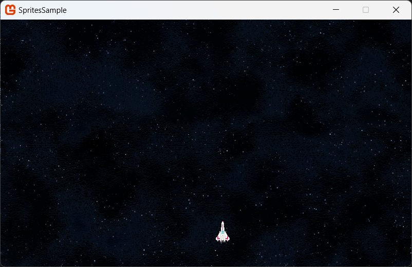

## Overview

In this example, you will draw a background texture, followed by another sprite on top of the background with its transparent elements not showing by using a [Blend State](xref:Microsoft.Xna.Framework.Graphics.BlendState) that supports alpha blending.

### End result



## Requirements

The example assumes the texture you are loading contains multiple images, one for the background and one for the foreground ship texture.

- 
- 

Save the textures to your content project and name it "**AnimatedCharacter**" (this name will used to reference it in the project).

> [!NOTE]
> The tutorial assumes you have already viewed the [How to draw a Sprite](HowTo_Draw_A_Sprite.md) topic.

> [!IMPORTANT]
> The foreground sprite in this example must include masking information, e.g. a PNG or DDS file that supports transparency / an alpha channel.

## Drawing a Foreground and Background Sprite

1. Follow the steps of [How To: Draw a Sprite](HowTo_Draw_A_Sprite.md).
   A good first step to understanding the loading and drawing of textures and setting up your project.

1. Add some variables and update the **LoadContent** method to load and initialize the content.

    ```csharp
    // Position of foreground sprite on screen
    private Vector2 ViperPos;  
    
    // The texture for the ship
    private Texture2D shipTexture;
    
    // The texture for the background
    private Texture2D starTexture;

    protected override void LoadContent()
    {
        // Create a new SpriteBatch, which can be used to draw textures.
        spriteBatch = new SpriteBatch(GraphicsDevice);
    
        starTexture = Content.Load<Texture2D>("starfield");
        shipTexture = Content.Load<Texture2D>("ship");
        Viewport viewport = graphics.GraphicsDevice.Viewport;
    
        ViperPos.X = viewport.Width / 2;
        ViperPos.Y = viewport.Height - 100;
    }
    ```

1. In [Game.Draw](xref:Microsoft.Xna.Framework.Game#Microsoft_Xna_Framework_Game_Draw_Microsoft_Xna_Framework_GameTime_) method of your game class, call [SpriteBatch.Begin](xref:Microsoft.Xna.Framework.Graphics.SpriteBatch#Microsoft_Xna_Framework_Graphics_SpriteBatch_Begin_Microsoft_Xna_Framework_Graphics_SpriteSortMode_Microsoft_Xna_Framework_Graphics_BlendState_Microsoft_Xna_Framework_Graphics_SamplerState_Microsoft_Xna_Framework_Graphics_DepthStencilState_Microsoft_Xna_Framework_Graphics_RasterizerState_Microsoft_Xna_Framework_Graphics_Effect_System_Nullable_Microsoft_Xna_Framework_Matrix__) for the [SpriteBatch](xref:Microsoft.Xna.Framework.Graphics.SpriteBatch).

1. Specify [BlendState.Opaque](xref:Microsoft.Xna.Framework.Graphics.BlendState).

    > [!NOTE]
    > This will tell the [SpriteBatch](xref:Microsoft.Xna.Framework.Graphics.SpriteBatch) to ignore alpha color values when drawing sprites. By default, the z-order of sprites is the order in which they are drawn.

1. Call the [Draw](xref:Microsoft.Xna.Framework.Graphics.SpriteBatch) method, passing in the `starTexture`.  Then call [SpriteBatch.End](xref:Microsoft.Xna.Framework.Graphics.SpriteBatch#Microsoft_Xna_Framework_Graphics_SpriteBatch_End).

    ```csharp
    public override void Draw (GameTime game)
    {
        GraphicsDevice.Clear(Color.CornflowerBlue);

        _spriteBatch.Begin(blendState: BlendState.Opaque);
        _spriteBatch.Draw(starTexture, Vector2.Zero, Color.White);
        _spriteBatch.End();
    }
    ```

1. After this code, call [SpriteBatch.Begin](xref:Microsoft.Xna.Framework.Graphics.SpriteBatch#Microsoft_Xna_Framework_Graphics_SpriteBatch_Begin_Microsoft_Xna_Framework_Graphics_SpriteSortMode_Microsoft_Xna_Framework_Graphics_BlendState_Microsoft_Xna_Framework_Graphics_SamplerState_Microsoft_Xna_Framework_Graphics_DepthStencilState_Microsoft_Xna_Framework_Graphics_RasterizerState_Microsoft_Xna_Framework_Graphics_Effect_System_Nullable_Microsoft_Xna_Framework_Matrix__) for the [SpriteBatch](xref:Microsoft.Xna.Framework.Graphics.SpriteBatch) again.  This time, specify [BlendState.AlphaBlend](xref:Microsoft.Xna.Framework.Graphics.BlendState).

    This will cause pixels on the sprite with an alpha value less than 255 to become progressively transparent based on the magnitude of the alpha value. An alpha of 0 will make the pixel completely transparent.

    > [!IMPORTANT]
    > Calling [SpriteBatch.Begin](xref:Microsoft.Xna.Framework.Graphics.SpriteBatch#Microsoft_Xna_Framework_Graphics_SpriteBatch_Begin_Microsoft_Xna_Framework_Graphics_SpriteSortMode_Microsoft_Xna_Framework_Graphics_BlendState_Microsoft_Xna_Framework_Graphics_SamplerState_Microsoft_Xna_Framework_Graphics_DepthStencilState_Microsoft_Xna_Framework_Graphics_RasterizerState_Microsoft_Xna_Framework_Graphics_Effect_System_Nullable_Microsoft_Xna_Framework_Matrix__) with no parameters causes [SpriteBatch](xref:Microsoft.Xna.Framework.Graphics.SpriteBatch) to **default to [BlendState.AlphaBlend](xref:Microsoft.Xna.Framework.Graphics.BlendState)**.

1. Next in the [Draw](xref:Microsoft.Xna.Framework.Graphics.SpriteBatch) method, we draw the `shipTexture`, `ViperPos` with [Color.White](xref:Microsoft.Xna.Framework.Color), finishing off with a call to [SpriteBatch.End](xref:Microsoft.Xna.Framework.Graphics.SpriteBatch#Microsoft_Xna_Framework_Graphics_SpriteBatch_End).

    ```csharp
    public override void Draw (GameTime game)
    {
        _spriteBatch.Begin(blendState: BlendState.Opaque);
        _spriteBatch.Draw(starTexture, Vector2.Zero, Color.White);
        _spriteBatch.End();
        
        _spriteBatch.Begin(blendState: BlendState.AlphaBlend);
        _spriteBatch.Draw (shipTexture, ViperPos, Color.White);
        _spriteBatch.End();
    }
    ```

The end result is a fixed / opaque background with a semi-transparent ship drawn on top for the player.  You can of course experiment with layers / parallax transparent backgrounds behind the player too, the choice is up to you.

### Extra Credit

Try using this technique on top of the [How To Make A Scrolling Background](HowTo_Make_Scrolling_Background.md) guide for the beginnings of your very own space shooter :D

## See Also

- [Drawing a Sprite](HowTo_Draw_A_Sprite.md)
- [How To Make A Scrolling Background](HowTo_Make_Scrolling_Background.md)

### Concepts

- [What Is a Sprite?](../../whatis/graphics/WhatIs_Sprite.md)

### Reference

- [SpriteBatch](xref:Microsoft.Xna.Framework.Graphics.SpriteBatch)
- [SpriteBatch.Draw](xref:Microsoft.Xna.Framework.Graphics.SpriteBatch#Microsoft_Xna_Framework_Graphics_SpriteBatch_Draw_Microsoft_Xna_Framework_Graphics_Texture2D_Microsoft_Xna_Framework_Vector2_Microsoft_Xna_Framework_Color_)
- [Texture2D](xref:Microsoft.Xna.Framework.Graphics.Texture2D)


