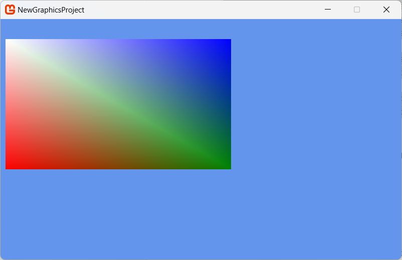

## Overview

Drawing a textured quad is a basic technique to have in any Game Developers arsenal, which can be populated by any texture from either the Content Pipeline (loaded from disk) or generated in memory (which we will use here for simplicity).

> [!NOTE]
> Drawing a texture quad is in effect what a SpriteBatch does under the hood, but while a SpriteBatch natively only draws flat to the screen, a Quad can be positioned in any way you see fit.  Either approach has its pros and cons.

There is a but of setup to draw a quad in MonoGame and there are many ways to achieve it.

> [!NOTE]
> This example draws from community responses to the same question [here, on the MonoGame Community site](https://community.monogame.net/t/minimal-example-of-drawing-a-quad-into-2d-space/11063/2), with a little clean-up to make it simpler.

## To use a custom effect with a texture

1. Create a custom vertex format declaration and a set of indices to indicate the drawing order.

    ``` csharp
    // A Vertex format with Texture information
    private VertexPositionColorTexture[] drawingQuad;
    
    // The indices array for drawing a quad
    private short[] drawingIndices;

    public void SetupUserIndexedVertexRectangle(Rectangle r)
    {
        drawingQuad = new VertexPositionColorTexture[4];
        drawingQuad[0] = new VertexPositionColorTexture(new Vector3(r.Left, r.Top, 0f), Color.White, new Vector2(0f, 0f));
        drawingQuad[1] = new VertexPositionColorTexture(new Vector3(r.Left, r.Bottom, 0f), Color.Red, new Vector2(0f, 1f));
        drawingQuad[2] = new VertexPositionColorTexture(new Vector3(r.Right, r.Bottom, 0f), Color.Green, new Vector2(1f, 1f));
        drawingQuad[3] = new VertexPositionColorTexture(new Vector3(r.Right, r.Top, 0f), Color.Blue, new Vector2(1f, 0f));

        drawingIndices = [0, 2, 1, 2, 0, 3];
    }
    ```

1. To make setup simpler, we will also define two methods to Set the [Graphics State](HowTo_Create_a_StateObject.md) and [create our basic effect](xref:Microsoft.Xna.Framework.Graphics.Effect).

    ``` csharp
    // The basic effect definition
    private BasicEffect basicEffect;

    // A Texture2D that we will generate data into
    private Texture2D generatedTexture;

    /// <summary>
    /// Set the states for the graphics device.
    /// </summary>
    private void SetStates()
    {
        GraphicsDevice.BlendState = BlendState.Opaque;
        GraphicsDevice.DepthStencilState = DepthStencilState.Default;
        GraphicsDevice.SamplerStates[0] = SamplerState.PointWrap;
        GraphicsDevice.RasterizerState = RasterizerState.CullCounterClockwise;
    }

    /// <summary>
    /// Creates a basic effect for drawing a textured quad.
    /// </summary>
    private void SetUpBasicEffect()
    {
        basicEffect = new BasicEffect(this.GraphicsDevice);
        basicEffect.VertexColorEnabled = true;
        basicEffect.TextureEnabled = true;
        basicEffect.Texture = generatedTexture;

        // set up our matrix to match basic effect.
        Viewport viewport = GraphicsDevice.Viewport;
        basicEffect.World = Matrix.Identity;
        Vector3 cameraUp = Vector3.Transform(Vector3.Down, Matrix.CreateRotationZ(0));
        basicEffect.View = Matrix.CreateLookAt(Vector3.Forward, Vector3.Zero, cameraUp);
        basicEffect.Projection = Matrix.CreateScale(1, -1, 1) * Matrix.CreateOrthographicOffCenter(0, viewport.Width, viewport.Height, 0, 0, 1);
    }
    ```

    > [!NOTE]
    > Note that the basic effect is created with `basicEffect.TextureEnabled = true;` and the texture to draw using `basicEffect.Texture = generatedTexture;`, just stating we are drawing a texture and what it is.

1. Next, we will generate a Texture to draw as part of the quad, a simple white texture which the effect will also draw a coloured "tint" over thanks to the `basicEffect.VertexColorEnabled = true;` set in the effect.

    ```csharp
    private Texture2D GenerateTexture2D()
    {
        Texture2D t = new Texture2D(this.GraphicsDevice, 250, 250);
        var cdata = new Color[250 * 250];
        for (int i = 0; i < 250; i++)
        {
            for (int j = 0; j < 250; j++)
            {
                cdata[i * 250 + j] = Color.White;
            }
        }
        t.SetData(cdata);
        return t;
    }
    ```

    > [!NOTE]
    > Alternatively, you can just use a texture loaded from the Content Pipeline, just be sure to change the Vertex format used in Step 1 to `VertexPositionTexture` unless you want the coloured gradient, or simply disable `basicEffect.VertexColorEnabled = false;`.  That is unless you want to apply color tints with the vertex declaration.

1. Putting this together, setup all the relevant artifacts in the `LoadContent` method.

    ```csharp
    protected override void LoadContent()
    {
        // Set render state
        SetStates();
        
        // Setup basic effect
        SetUpBasicEffect();

        // Create the quad to draw
        SetupUserIndexedVertexRectangle(new Rectangle(10, 40, 450, 260));

        // Generate (or load) the Texture
        generatedTexture = GenerateTexture2D();
    }
    ```

1. Finally, draw the primitive quad to the screen using the BasicEffect and generated data.

    ```csharp
    protected override void Draw(GameTime gameTime)
    {
        GraphicsDevice.Clear(Color.CornflowerBlue);

        foreach (EffectPass pass in basicEffect.CurrentTechnique.Passes)
        {
            pass.Apply();
            GraphicsDevice.DrawUserIndexedPrimitives(PrimitiveType.TriangleList, drawingQuad, 0, 4, drawingIndices, 0, 2);
        }

        base.Draw(gameTime);
    } 
    ```

1. Marvel at the wonder of your drawn Textured Quad plus vertex effect.

    

## See Also

- [How to create a Basic Effect](HowTo_Create_a_BasicEffect.md)

### Concepts

- [3D Pipeline Basics](../../whatis/graphics/WhatIs_3DRendering.md)

### Reference

- [GraphicsDevice](xref:Microsoft.Xna.Framework.Graphics.GraphicsDevice)
- [BasicEffect](xref:Microsoft.Xna.Framework.Graphics.BasicEffect)
