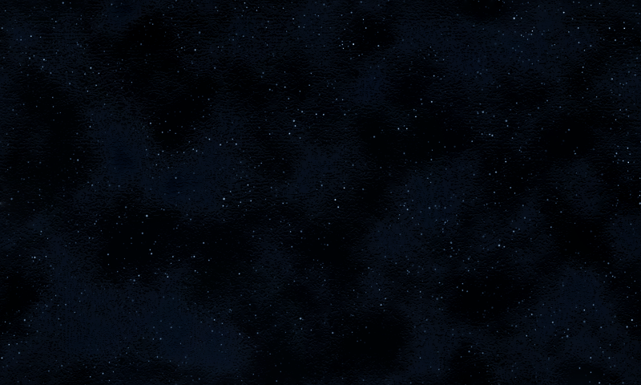

## Overview

In this example, you will draw a texture to the screen and then animate it vertically by scrolling it upwards in a wrapping motion.

### End result


> [!NOTE]
> Textures that scroll, especially over the screen background are best if they use seamless or tileable textures, [For Example](https://www.myfreetextures.com/seamless-textures/).  Essentially, textures that wrap around the edges to look like a single texture when joined together.

## Requirements

The example assumes the texture you are loading contains multiple frames of the same size in a texture whose size is uniform (also known as a spritesheet), for example, the following spritesheet contains 8 Images of a character in different phases of motion, when player together it looks like it is animated.



Save the texture to your content project and name it "**Starfield**" (this name will used to reference it in the project).

> [!NOTE]
> The sample also uses a class named **ScrollingBackground**, which is included with the sample below.
>
> The `ScrollingBackground.cs` is a helper to simplify the scrolling of a texture in the vertical direction. Feel free to modify it to work in different directions.

## Drawing a Scrolling Background Sprite

1. Follow the steps of [How To: Draw a Sprite](HowTo_Draw_A_Sprite.md).
   A good first step to understanding the loading and drawing of textures and setting up your project.

2. Create a new class called `ScrollingBackground.cs` in your project and replace its contents with the following:

    [!code-csharp[](files/ScrollingBackground.cs)]

3. Load the background texture.

    ```csharp
    private ScrollingBackground myBackground;

    protected override void LoadContent()
    {
        _spriteBatch = new SpriteBatch(GraphicsDevice);

        // TODO: use this.Content to load your game content here
        myBackground = new ScrollingBackground();
        Texture2D background = Content.Load<Texture2D>("starfield");
        myBackground.Load(GraphicsDevice, background);
    }
    ```

4. Determine the size of the background texture and the size of the screen.

   The texture size is determined using the [Height](xref:Microsoft.Xna.Framework.Graphics.Texture2D.Height) and [Width](xref:Microsoft.Xna.Framework.Graphics.Texture2D.Width) properties, and the screen size is determined using the [Viewport](xref:Microsoft.Xna.Framework.Graphics.GraphicsDevice.Viewport) property on the graphics device.

5. Using the texture and screen information, set the origin of the texture to the center of the top edge of the texture, and the initial screen position to the center of the screen.

    ```csharp
    // class ScrollingBackground
    private Vector2 screenpos, origin, texturesize;
    private Texture2D mytexture;
    private int screenheight;

    public void Load(GraphicsDevice device, Texture2D backgroundTexture)
    {
        mytexture = backgroundTexture;
        screenheight = device.Viewport.Height;
        int screenwidth = device.Viewport.Width;

        // Set the origin so that we're drawing from the 
        // center of the top edge.
        origin = new Vector2(mytexture.Width / 2, 0);

        // Set the screen position to the center of the screen.
        screenpos = new Vector2(screenwidth / 2, screenheight / 2);

        // Offset to draw the second texture, when necessary.
        texturesize = new Vector2(0, mytexture.Height);
    }
    ```

6. To scroll the background, change the screen position of the background texture in your [Game.Update](xref:Microsoft.Xna.Framework.Game#Microsoft_Xna_Framework_Game_Update_Microsoft_Xna_Framework_GameTime_) method.

    > [!NOTE]
    > This example moves the background down 100 pixels per second by increasing the screen position's Y value.

    ```csharp
    private float scrollingSpeed = 100;

    protected override void Update(GameTime gameTime)
    {
        if (GamePad.GetState(PlayerIndex.One).Buttons.Back == ButtonState.Pressed || Keyboard.GetState().IsKeyDown(Keys.Escape))
            Exit();

        // The time since Update was called last.
        float elapsed = (float)gameTime.ElapsedGameTime.TotalSeconds;
    
        // TODO: Add your game logic here.
        myBackground.Update(elapsed * scrollingSpeed);

        base.Update(gameTime);
    }
    ```

    The `Y` value is kept no larger than the texture height, making the background scroll from the bottom of the screen back to the top.

    ```csharp
    // class ScrollingBackground
    public void Update(float deltaY)
    {
        screenpos.Y += deltaY;
        screenpos.Y %= mytexture.Height;
    }
    ```

7. Draw the background using the origin and screen position calculated in [Game.LoadContent](xref:Microsoft.Xna.Framework.Game#Microsoft_Xna_Framework_Game_LoadContent) and [Game.Update](xref:Microsoft.Xna.Framework.Game#Microsoft_Xna_Framework_Game_Update_Microsoft_Xna_Framework_GameTime_).

    ```csharp
    protected override void Draw(GameTime gameTime)
    {
        GraphicsDevice.Clear(Color.CornflowerBlue);

        _spriteBatch.Begin();
        myBackground.Draw(_spriteBatch, Color.White);
        _spriteBatch.End();

        base.Draw(gameTime);
    }
    ```

    In case the texture does not cover the screen, another texture is drawn. This subtracts the texture height from the screen position using the **texturesize** vector created at load time. This creates the illusion of a loop.

    ```csharp
    // class ScrollingBackground
    public void Draw(SpriteBatch batch, Color color)
    {
        // Draw the texture, if it is still onscreen.
        if (screenpos.Y < screenheight)
        {
            batch.Draw(mytexture, screenpos, null,
                 color, 0, origin, 1, SpriteEffects.None, 0f);
        }
        
        // Draw the texture a second time, behind the first,
        // to create the scrolling illusion.
        batch.Draw(mytexture, screenpos - texturesize, null,
             color, 0, origin, 1, SpriteEffects.None, 0f);
    }
    ```

## See Also

- [Drawing a Sprite](HowTo_Draw_A_Sprite.md)
- [How to animate a sprite](HowTo_Animate_Sprite.md)
- [Drawing a Masked Sprite over a Background](HowTo_Draw_Sprite_Background.md)

### Concepts

- [What Is a Sprite?](../../whatis/graphics/WhatIs_Sprite.md)

### Reference

- [SpriteBatch](xref:Microsoft.Xna.Framework.Graphics.SpriteBatch)
- [SpriteBatch.Draw](xref:Microsoft.Xna.Framework.Graphics.SpriteBatch#Microsoft_Xna_Framework_Graphics_SpriteBatch_Draw_Microsoft_Xna_Framework_Graphics_Texture2D_Microsoft_Xna_Framework_Vector2_Microsoft_Xna_Framework_Color_)
- [Texture2D](xref:Microsoft.Xna.Framework.Graphics.Texture2D)
