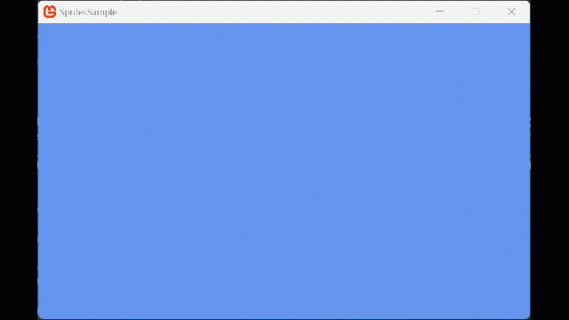

## Overview

There are several implementations to apply scaling to 2D sprites / textures, namely:

- Uniform scale using a single float.
- NonUniform scale using a Vector 2.
- By specifying the Rectangle drawing dimensions of the output texture.

The examples below detail each of the three methods.

### End result



## Drawing a Scaled Sprite with a uniform scale

1. Follow the procedures of [Drawing a Sprite](HowTo_Draw_A_Sprite.md).

2. In your **Update** method, determine how your sprite will be scaled.

   The normal size of the sprite is multiplied by the scale specified. For example, a value of 1.0 draws the sprite full size, where 0.5 will draw it half-sized and 2.0 will draw it at twice its original size.

    ```csharp
    private Vector2 spritePosition = Vector2.Zero;
    protected float spriteScale = 0f;

    protected override void Update(GameTime gameTime)
    {
        if (GamePad.GetState(PlayerIndex.One).Buttons.Back == ButtonState.Pressed || Keyboard.GetState().IsKeyDown(Keys.Escape))
            Exit();

        // The time since Update was called last.
        float elapsed = (float)gameTime.ElapsedGameTime.TotalSeconds;

        // TODO: Add your game logic here.
        spriteScale += elapsed;
        spriteScale %= 6;

        base.Update(gameTime);
    }
    ```

3. When drawing the sprite, specify the scale of the sprite as a parameter if the [SpriteBatch.Draw](xref:Microsoft.Xna.Framework.Graphics.SpriteBatch#Microsoft_Xna_Framework_Graphics_SpriteBatch_Draw_Microsoft_Xna_Framework_Graphics_Texture2D_Microsoft_Xna_Framework_Vector2_System_Nullable_Microsoft_Xna_Framework_Rectangle__Microsoft_Xna_Framework_Color_System_Single_Microsoft_Xna_Framework_Vector2_System_Single_Microsoft_Xna_Framework_Graphics_SpriteEffects_System_Single_) call to draw with a floating-point scale parameter to scale the sprite evenly in both the x and y directions.

    ```csharp
    protected override void Draw(GameTime gameTime)
    {
        GraphicsDevice.Clear(Color.CornflowerBlue);

        // TODO: Add your drawing code here
        _spriteBatch.Begin();
        // Updated draw call using the overload that allows passing the "scale" of a sprite
        _spriteBatch.Draw(spriteTexture, spritePosition, null,
            Color.White, 0f, Vector2.Zero, spriteScale, SpriteEffects.None, 0f);
        _spriteBatch.End();

        base.Draw(gameTime);
    }
    ```

4. When the sprite has been drawn, call [SpriteBatch.End](xref:Microsoft.Xna.Framework.Graphics.SpriteBatch#Microsoft_Xna_Framework_Graphics_SpriteBatch_End) on your [SpriteBatch](xref:Microsoft.Xna.Framework.Graphics.SpriteBatch) object.

    You should now see the sprite scaling in from the top-left hand corner of the screen moving outwards, the same in both the X and Y directions.  It will keep looping in case you miss it.

### To draw a scaled sprite using a nonuniform scale

Alternatively, instead of using a flat scaling factor using a float, we can instead supply a [Vector2](xref:Microsoft.Xna.Framework.Vector2) value with different scaling values for the X and Y axis, as follows:

1. Follow the procedures of [Drawing a Sprite](HowTo_Draw_A_Sprite.md).
2. In your **Update** method, determine how your sprite will be scaled along each axis and store those values in a [Vector2](xref:Microsoft.Xna.Framework.Vector2) object.

    ```csharp
    protected Vector2 nonUniformScale = Vector2.One;
    protected override void Update(GameTime gameTime)
    {
        if (GamePad.GetState(PlayerIndex.One).Buttons.Back == ButtonState.Pressed || Keyboard.GetState().IsKeyDown(Keys.Escape))
            Exit();

        // The time since Update was called last.
        float elapsed = (float)gameTime.ElapsedGameTime.TotalSeconds;

        // TODO: Add your game logic here.
        float basescale = nonUniformScale.Y;
        basescale += elapsed;
        basescale %= 6;
        nonUniformScale.Y = basescale;
        nonUniformScale.X = basescale * .8f;

        base.Update(gameTime);
    }
    ```

3. When drawing the sprite, specify the scale of the sprite using the [Vector2](xref:Microsoft.Xna.Framework.Vector2) object that you updated earlier.

   Specifying a [Vector2](xref:Microsoft.Xna.Framework.Vector2) scales the sprite independently in both the x and y directions.

    ```csharp
    protected override void Draw(GameTime gameTime)
    {
        GraphicsDevice.Clear(Color.CornflowerBlue);

        // TODO: Add your drawing code here
        _spriteBatch.Begin();
        _spriteBatch.Draw(spriteTexture, spritePosition, null,
            Color.White, 0f, Vector2.Zero, nonUniformScale, SpriteEffects.None, 0f);
        _spriteBatch.End();

        base.Draw(gameTime);
    }
    ```

4. When the sprite has been drawn, call [SpriteBatch.End](xref:Microsoft.Xna.Framework.Graphics.SpriteBatch#Microsoft_Xna_Framework_Graphics_SpriteBatch_End) on your [SpriteBatch](xref:Microsoft.Xna.Framework.Graphics.SpriteBatch) object.

    You should now see the sprite scaling in from the top-left hand corner again and still moving outwards, however, the X and Y directions move at different rates.  It will keep looping in case you miss it.

### To draw a scaled sprite using a destination rectangle

Finally, you can control the scale of a sprite by overriding the area in which it is drawn and control the scale values for both the X and Y axis independently, as shown below:

1. Follow the procedures of [Drawing a Sprite](HowTo_Draw_A_Sprite.md).

2. In your **LoadContent** method, construct a rectangle that defines where on screen the sprite will be drawn.

   This rectangle does not need to be the same shape or size as the original sprite. Each dimension of the sprite is scaled independently to fit the destination rectangle.

    ```csharp
    protected float spriteScale = 1.0f;
    protected Rectangle drawingRectangle;
    private Viewport viewport;
    protected override void LoadContent()
    {
        // Create a new SpriteBatch, which can be used to draw textures.
        _spriteBatch = new SpriteBatch(GraphicsDevice);

        spriteTexture = Content.Load<Texture2D>("Character");

        // Get the viewport (window) dimensions
        viewport = _graphics.GraphicsDevice.Viewport;

        // Set the sprite drawing area from the Viewport origin (0,0) to 80% the sprite scale width and 100% of the sprite scale height.
        drawingRectangle.X = viewport.X;
        drawingRectangle.Y = viewport.Y;
        drawingRectangle.Width = (int)spriteScale * 100;
        drawingRectangle.Height = (int)spriteScale * 80;
    }
    ```

3. When drawing the sprite, specify the destination rectangle as a parameter to [SpriteBatch.Draw](xref:Microsoft.Xna.Framework.Graphics.SpriteBatch#Microsoft_Xna_Framework_Graphics_SpriteBatch_Draw_Microsoft_Xna_Framework_Graphics_Texture2D_Microsoft_Xna_Framework_Vector2_Microsoft_Xna_Framework_Color_).

    The sprite will be drawn, filling the destination rectangle.

    ```csharp
    protected override void Draw(GameTime gameTime)
    {
        GraphicsDevice.Clear(Color.CornflowerBlue);

        // TODO: Add your drawing code here
        _spriteBatch.Begin();
        _spriteBatch.Draw(spriteTexture, drawingRectangle, Color.White);
        _spriteBatch.End();

        base.Draw(gameTime);
    }
    ```

4. When the sprite has been drawn, call [SpriteBatch.End](xref:Microsoft.Xna.Framework.Graphics.SpriteBatch#Microsoft_Xna_Framework_Graphics_SpriteBatch_End) on your [SpriteBatch](xref:Microsoft.Xna.Framework.Graphics.SpriteBatch) object.

    You should now see the sprite in the top-left hand corner of the screen in a kind of squished style, feel free to play with the values for the `drawingRectangle` to draw the sprite at different scales.

## See Also

- [Drawing a Sprite](HowTo_Draw_A_Sprite.md)

### Concepts

- [What Is a Sprite?](../../whatis/graphics/WhatIs_Sprite.md)

### Reference

- [SpriteBatch](xref:Microsoft.Xna.Framework.Graphics.SpriteBatch)
- [SpriteBatch.Draw](xref:Microsoft.Xna.Framework.Graphics.SpriteBatch#Microsoft_Xna_Framework_Graphics_SpriteBatch_Draw_Microsoft_Xna_Framework_Graphics_Texture2D_Microsoft_Xna_Framework_Vector2_Microsoft_Xna_Framework_Color_)
- [Texture2D](xref:Microsoft.Xna.Framework.Graphics.Texture2D)
