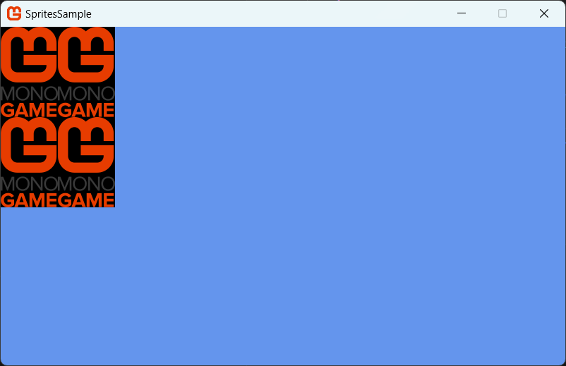

## Overview

This sample uses a texture addressing mode to duplicate a texture across the area defined by [SpriteBatch.Draw](xref:Microsoft.Xna.Framework.Graphics.SpriteBatch#Microsoft_Xna_Framework_Graphics_SpriteBatch_Draw_Microsoft_Xna_Framework_Graphics_Texture2D_Microsoft_Xna_Framework_Vector2_Microsoft_Xna_Framework_Color_). Other address modes, such as mirroring, can create interesting results.

We will simply define an area ([Rectangle](xref:Microsoft.Xna.Framework.Rectangle)) in which to draw our texture, but in a [SpriteBatch](xref:Microsoft.Xna.Framework.Graphics.SpriteBatch) drawing mode that will keep tiling the texture until it fills the area.

### End result



## Requirements


## Drawing a Tiled a Sprite

1. Follow the procedures of [Drawing a Sprite](HowTo_Draw_A_Sprite.md).
1. Setup some new variables to define how we want to draw the tiled area and with which Texture.

    ```csharp
    // Tiling Texture
    private Texture2D monoGameLogo;
    // How many tiles wide
    private int tileCountWidth = 2;
    // How many tiles high
    private int tileCountHeight = 2;
    // Rectangle to draw tiles in
    private Rectangle targetRectangle;
    // Position to draw the tiled Rectangle at
    private Vector2 position;

    ```

1. In the **LoadContent** method, we will load the Texture and then setup our drawing position and target based on the input graphics dimensions.  Feel free to play with these values to alter how the tiling area is drawn.

    ```csharp
    // Load the texture to tile.
    monoGameLogo = Content.Load<Texture2D>("MonoGame");

    // Define a drawing rectangle based on the number of tiles wide and high, using the texture dimensions.
    targetRectangle = new Rectangle(0, 0, monoGameLogo.Width * tileCountWidth, monoGameLogo.Height * tileCountHeight);

    // Get the drawable area of the screen.
    Viewport viewport = GraphicsDevice.Viewport;

    // Center the rectangle on the screen, using both the screen center and the rectangle center.
    position = new Vector2(-targetRectangle.Width / 2 + viewport.Width / 2, -targetRectangle.Height / 2 + viewport.Height / 2);   
    ```

1. In the [Game.Draw](xref:Microsoft.Xna.Framework.Game#Microsoft_Xna_Framework_Game_Draw_Microsoft_Xna_Framework_GameTime_) method, call [SpriteBatch.Begin](xref:Microsoft.Xna.Framework.Graphics.SpriteBatch#Microsoft_Xna_Framework_Graphics_SpriteBatch_Begin_Microsoft_Xna_Framework_Graphics_SpriteSortMode_Microsoft_Xna_Framework_Graphics_BlendState_Microsoft_Xna_Framework_Graphics_SamplerState_Microsoft_Xna_Framework_Graphics_DepthStencilState_Microsoft_Xna_Framework_Graphics_RasterizerState_Microsoft_Xna_Framework_Graphics_Effect_System_Nullable_Microsoft_Xna_Framework_Matrix__) to set the sprite state.

   The destination [Rectangle](xref:Microsoft.Xna.Framework.Rectangle) can be any size. In this example, the width and height of the destination rectangle are integer multiples of the source sprite. This will cause the sprite texture to be tiled, or drawn several times, to fill the destination area.

   The [Begin](xref:Microsoft.Xna.Framework.Graphics.SpriteBatch#Microsoft_Xna_Framework_Graphics_SpriteBatch_Begin_Microsoft_Xna_Framework_Graphics_SpriteSortMode_Microsoft_Xna_Framework_Graphics_BlendState_Microsoft_Xna_Framework_Graphics_SamplerState_Microsoft_Xna_Framework_Graphics_DepthStencilState_Microsoft_Xna_Framework_Graphics_RasterizerState_Microsoft_Xna_Framework_Graphics_Effect_System_Nullable_Microsoft_Xna_Framework_Matrix__) method is also using overrides to define the [SamplerState](xref:Microsoft.Xna.Framework.Graphics.SamplerState) and set it to Wrap (repeat).

    ```csharp
    _spriteBatch.Begin(SpriteSortMode.FrontToBack, BlendState.Opaque, SamplerState.LinearWrap,
        DepthStencilState.Default, RasterizerState.CullNone);
    ```

1. Call [SpriteBatch.Draw](xref:Microsoft.Xna.Framework.Graphics.SpriteBatch#Microsoft_Xna_Framework_Graphics_SpriteBatch_Draw_Microsoft_Xna_Framework_Graphics_Texture2D_Microsoft_Xna_Framework_Vector2_Microsoft_Xna_Framework_Color_) with the sprite, the destination rectangle, and other relevant parameters.

    ```csharp
    _spriteBatch.Draw(monoGameLogo, Vector2.Zero, targetRectangle, Color.White, 0, Vector2.Zero, 1, SpriteEffects.None, 0);
    ```

1. Call [SpriteBatch.End](xref:Microsoft.Xna.Framework.Graphics.SpriteBatch#Microsoft_Xna_Framework_Graphics_SpriteBatch_End) on your [SpriteBatch](xref:Microsoft.Xna.Framework.Graphics.SpriteBatch) object.

    ```csharp
    _spriteBatch.End();
    ```

## See Also

- [Drawing a Sprite](HowTo_Draw_A_Sprite.md)

### Concepts

- [What Is a Sprite?](../../whatis/graphics/WhatIs_Sprite.md)

### Reference

- [SpriteBatch](xref:Microsoft.Xna.Framework.Graphics.SpriteBatch)
- [SpriteBatch.Draw](xref:Microsoft.Xna.Framework.Graphics.SpriteBatch#Microsoft_Xna_Framework_Graphics_SpriteBatch_Draw_Microsoft_Xna_Framework_Graphics_Texture2D_Microsoft_Xna_Framework_Vector2_Microsoft_Xna_Framework_Color_)
- [SpriteSortMode](xref:Microsoft.Xna.Framework.Graphics.SpriteSortMode)
- [Texture2D](xref:Microsoft.Xna.Framework.Graphics.Texture2D)
