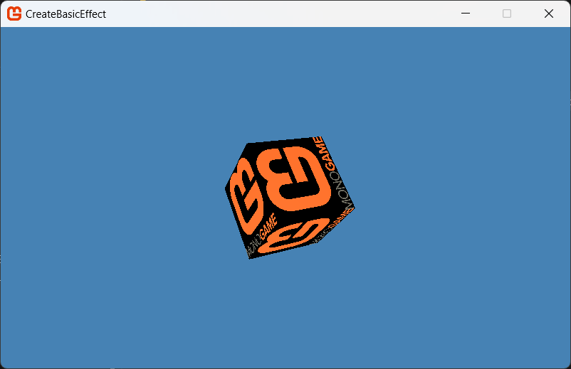
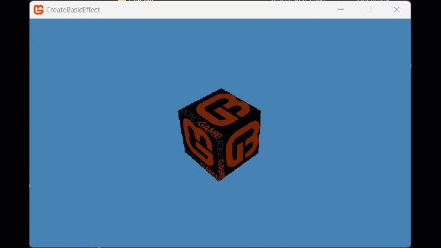

## Overview

MonoGame includes a few predefined classes for common vertex buffer declarations such as [VertexPositionColor](xref:Microsoft.Xna.Framework.Graphics.VertexPositionColor) and [VertexPositionColorTexture](xref:Microsoft.Xna.Framework.Graphics.VertexPositionColorTexture). If you need to create a vertex buffer declaration that includes additional user-defined types, create a custom vertex declaration.



A custom vertex declaration is a class that implements fully customizable per-vertex data. Furthermore, if you derive the class from [IVertexType](xref:Microsoft.Xna.Framework.Graphics.IVertexType), you will not need to create a vertex declaration when creating your vertex buffer or drawing the geometry.

## Requirements

The following texture will be used to render to the screen.


Save it to your content project and name it "**logo**" (this name will used to reference it in the project).  Make sure to [add it to your content project](../content_pipeline/HowTo_GameContent_Add.md).

## Starting from the [Basic Effect](HowTo_Create_a_BasicEffect.md) tutorial

1. Follow the steps of [How to create a Basic Effect](HowTo_Create_a_BasicEffect.md).

   This gives us a starting project that is rendering a 3D scene with a [Basic Effect](xref:Microsoft.Xna.Framework.Graphics.BasicEffect).

## Create a custom vertex declaration

1. Create a new class file called `CustomVertex1.cs`

1. Add the required `using` statements to the top of the file.

    ```csharp
    using Microsoft.Xna.Framework;
    using Microsoft.Xna.Framework.Graphics;
    ```

1. Declare a structure that derives from [IVertexType](xref:Microsoft.Xna.Framework.Graphics.IVertexType).

    ```csharp
    public struct CustomVertex1 : IVertexType
    ```

1. Add members to the struct that describe the per-vertex data.

    This example uses position as a [Vector3 Structure](xref:Microsoft.Xna.Framework.Vector3) type, a texture coordinate using a [Vector2 Structure](xref:Microsoft.Xna.Framework.Vector2) type, and a vertex declaration using the [VertexDeclaration](xref:Microsoft.Xna.Framework.Graphics.VertexDeclaration) type.

    ```csharp
    private Vector3 vertexPosition;
    private Vector2 vertexTextureCoordinate;
    
    public readonly static VertexDeclaration VertexDeclaration = new VertexDeclaration
    (
        new VertexElement(0, VertexElementFormat.Vector3, VertexElementUsage.Position, 0),
        new VertexElement(12, VertexElementFormat.Vector2, VertexElementUsage.TextureCoordinate, 0)
    );
    ```

1. Implement the constructor and public accessor methods.

    ```csharp
    //The constructor for the custom vertex. This allows similar 
    //initialization of custom vertex arrays as compared to arrays of a 
    //standard vertex type, such as VertexPositionColor.
    public CustomVertex1(Vector3 pos, Vector2 textureCoordinate)
    {
        vertexPosition = pos;
        vertexTextureCoordinate = textureCoordinate;
    }
    
    //Public methods for accessing the components of the custom vertex.
    public Vector3 Position
    {
        get { return vertexPosition; }
        set { vertexPosition = value; }
    }
    
    public Vector2 TextureCoordinate
    {
        get { return vertexTextureCoordinate; }
        set { vertexTextureCoordinate = value; }
    }
    ```

1. Implement a non-public method for accessing the vertex declaration.

    ```csharp
    VertexDeclaration IVertexType.VertexDeclaration
    {
        get { return VertexDeclaration; }
    }
    ```

## Using the Custom Vertex Buffer

Using the Custom Vertex buffer, we will render a cube that is textured with the logo texture.

1. Declare some variables at the top of your Game class.

    ```csharp
    private CustomVertex1[] cubeVertices;
    private VertexBuffer vertexBuffer;
    private Texture2D logoTexture;
    ```

    This gives us the necessary data in order to draw our cube.

1. Create a new method called `SetupDrawingCube()` and we will start with initializing the vertex buffer, passing in the **typeof(CustomVertex1)** instead of a vertex declaration to describe the vertex buffer data.

    ```csharp
    public void SetupDrawingCube()
    {
        vertexBuffer = new VertexBuffer(
                        GraphicsDevice,
                        typeof(CustomVertex1),
                        36,
                        BufferUsage.None
                        );
    ```

1. Create the per-vertex data; this shows a portion of the code.

    [!code-csharp[](./files/cubevertexdata.cs)]

    > For a triangle list, you need three vertices for a triangle and two triangles to make the front face of a cube.

1. Finally, set the data into the vertex buffer data by calling [VertexBuffer.SetData](xref:Microsoft.Xna.Framework.Graphics.VertexBuffer) and set the vertex buffer to the device by calling [GraphicsDevice.SetVertexBuffer](xref:Microsoft.Xna.Framework.Graphics.GraphicsDevice).

    ```csharp
    vertexBuffer.SetData<CustomVertex1>(cubeVertices);
    
    graphics.GraphicsDevice.SetVertexBuffer(vertexBuffer);
    }
    ```

1. In `LoadContent` we need to Load the texture we are going to draw, as well as call the new method we defined to setup the primitive Cube.

    ```csharp
    logoTexture = Content.Load<Texture2D>("logo");
    SetupDrawingCube();
    ```

1. At the moment the `BasicEffect` setup from the previous tutorial only draws Vertex Colors, so we need to change that to pass it the [texture](xref:Microsoft.Xna.Framework.Graphics.BasicEffect#Microsoft_Xna_Framework_Graphics_BasicEffect_Texture) we just loaded, as well as enabling [Texture drawing](xref:Microsoft.Xna.Framework.Graphics.BasicEffect#Microsoft_Xna_Framework_Graphics_BasicEffect_TextureEnabled)

    Replace:

    ```csharp
    basicEffect.VertexColorEnabled = true;
    ```

    With the following

    ```csharp
    // Enable Texture Drawing - VERY IMPORTANT!!
    basicEffect.TextureEnabled = true;

    // Set the texture we loaded (does nothing without the above setting)
    basicEffect.Texture = logoTexture;
    ```

1. Finally, Draw the object by calling [GraphicsDevice.DrawPrimitives](xref:Microsoft.Xna.Framework.Graphics.GraphicsDevice).

    ```csharp
    foreach (EffectPass pass in basicEffect.CurrentTechnique.Passes)
    {
        pass.Apply();
    
        graphics.GraphicsDevice.DrawPrimitives(
            PrimitiveType.TriangleList,
            0,  // start vertex
            12  // number of primitives to draw, 2 vertexes per side of the cube
        );
    }
    ```

## Extra credit, make it spin

At the moment all you can see is the front face of the cube, which is not very exciting.  Though [Matrix Transforms](HowTo_TransformPoint.md) however, we make our cube spin.

1. First define a variable to manage the current rotation.

    ```csharp
    float rotation = 0f;
    ```

1. Next, we will update this rotation each frame in the `Update` method.

    ```csharp
    // Update rotation angle
    float deltaTime = (float)gameTime.ElapsedGameTime.TotalSeconds;
    rotation += deltaTime;
    ```

1. Then finally, in the `Draw` method, we need to calculate the rotation matrix and the translation matrix to rotate the cube by and then apply that to the basic effect drawing the cube.

    Add the following to the `Draw` call **BEFORE** the effect drawing loop.

    ```csharp
    // Create rotation matrices
    Matrix rotationMatrix = Matrix.CreateRotationX(rotation) *
                            Matrix.CreateRotationY(rotation) *
                            Matrix.CreateRotationZ(rotation);
    // Apply rotation to the world matrix
    Matrix worldMatrix = rotationMatrix * Matrix.CreateTranslation(new Vector3(0, 0, 0));
    // Update the world matrix in the effect
    basicEffect.World = worldMatrix;    
    ```

> [!NOTE]
> This is a very basic example of applying rotation, just for reference.

With the changes in place, your cube will look a little more snazzy and rotate in the world.



## See Also

- [How to create a Basic Effect](HowTo_Create_a_BasicEffect.md)
- [How to transform a Point](HowTo_TransformPoint.md)

### Concepts

- [What Is 3D Rendering?](../../whatis/graphics/WhatIs_3DRendering.md)

### Reference

- [IVertexType](xref:Microsoft.Xna.Framework.Graphics.IVertexType)
- [VertexDeclaration](xref:Microsoft.Xna.Framework.Graphics.VertexDeclaration)
- [Matrix](xref:Microsoft.Xna.Framework.Matrix)
