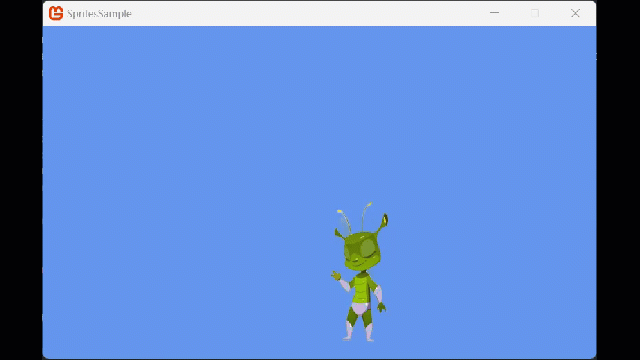

## Overview

In this example, ...

### End result

## Requirements

The example follows on from the [What is a Camera](../../../whatis/graphics/WhatIs_Camera.md) guide and uses the Camera definition defined there.

## Camera Shake

---

## See Also

- [HowTo Create a First Person Camera](../../howto/graphics/camera/HowTo_Create_First_Person_Camera.md)
- [HowTo Create a Third Person Camera](../../howto/graphics/camera/HowTo_Create_Third_Person_Camera.md)
- [HowTo Create a Chase Camera](../../howto/graphics/camera/HowTo_Create_Chase_Camera.md)
- [HowTo Create a Top Down Camera](../../howto/graphics/camera/HowTo_Create_Top_Down_Camera.md)
- [HowTo Apply Camera Effects](../../howto/graphics/camera/HowTo_Apply_Camera_Effects.md)
- [How to display Multiple Screens with Viewports](../../howto/graphics/HowTo_UseViewportForSplitscreenGaming.md)

### Concepts

- [What Is 3D Rendering?](WhatIs_3DRendering.md)
- [What Is a Viewport?](../../whatis/graphics/WhatIs_Viewport.md)
- [What Is a View Frustum?](WhatIs_ViewFrustum.md)
- [What Is a Render Target?](WhatIs_Render_Target.md)

### Reference

- [GraphicsDevice.Viewport](xref:Microsoft.Xna.Framework.Graphics.GraphicsDevice)
- [Matrix](xref:Microsoft.Xna.Framework.Matrix)
- [SpriteBatch](xref:Microsoft.Xna.Framework.Graphics.SpriteBatch)
