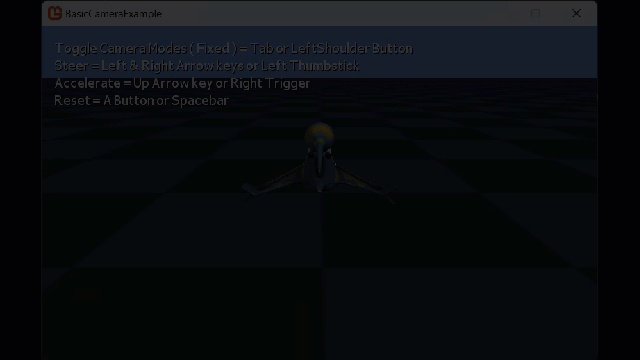
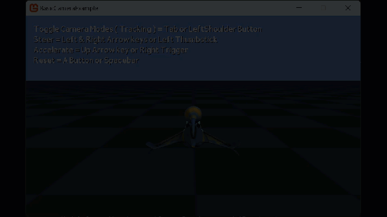
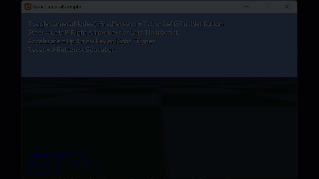
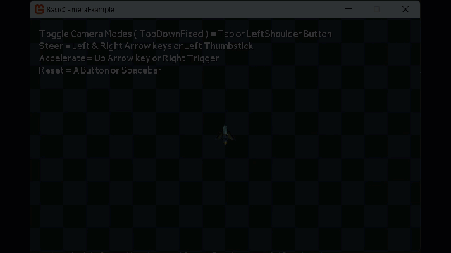

## Overview

This example is different from most as it is demonstrating several techniques to update a camera's view and position to achieve different camera modes or operations, including:

- A Fixed Camera.
- A Fixed tracking camera - follows the target.
- A first person camera.
- A third person camera - with spring.
- A top-down fixed camera view.
- A top-down view centered on a target.

### End result

These are the kinds of camera modes demonstrated in this sample:

|Fixed View|Fixed Tracking|First Person View|
|-|-|-|
||||
|Third Person View|Top Down|Top Down tracking|
||||

## Sample

As the sample is quite large and contains several pieces of content for the demonstration, the full source is available here:

### [Basic Camera Example Source](https://github.com/MonoGame/MonoGame.Samples/tree/3.8.2/Tutorials/BasicCameraExample)

## Understanding the different camera modes

To understand how these different camera modes work, the principle is fairly strait forward.

> [!TIP]
> Please review the [What is Camera](../../../whatis/graphics/WhatIs_Camera.md) guide for more detail on the concepts discussed here.

### World

The world that the camera and models are contained in usually static (at least for a single "world" or game level), for simplicity, this is usually kept at the center of the world which is `0,0,0` or `Matrix.Identity`.

All content is then Transformed / positioned relative to this central world point.

### Projection

The project of the view is also normally fixed for any single camera (although you might use different perspectives for different cameras, e.g. a map view).  This is defined once in either a Perspective or Orthographic (with or without depth).  This is then applied to the drawing methods to define the bounds of what is drawn to the screen.

> [!TIP]
> Elements drawn outside of the camera view / projection are culled or ignored by the graphics device.  However, unless you control what data is sent, you are still paying for the performance to send to the graphics card and consider it for drawing.  This is where techniques are used to limit the data sent to the graphics card and ONLY send models and textures that you know will be actually drawn and limiting what is discarded.

## Camera Views

The sample separates out the actual work in drawing each camera mode based on what is active at the time in the `Update` loop, as shown here:

```csharp
        switch (currentCameraMode)
        {
            case CameraMode.Fixed:
                UpdateFixedCamera();
                break;

            case CameraMode.Tracking:
                UpdateTrackingCamera();
                break;

            case CameraMode.FirstPerson:
                UpdateFirstPersonCamera();
                break;

            case CameraMode.ThirdPerson:
                UpdateThirdPersonCamera((float)gameTime.ElapsedGameTime.TotalSeconds);
                break;

            case CameraMode.TopDownFixed:
                UpdateTopDownFixedCamera();
                break;

            case CameraMode.TopDownCentred:
                UpdateTopDownCenteredCamera();
                break;
        }
```

You would not normally do this, it is only done this way for the purposes of the sample.  In reality you would only use the mode relevant to the current game view (although a lot of first person games do allow switching between First Person and Third Person), however, as you will see, you are only updating the way the View Matrix is generated along with the camera position, in 3D the content is always drawn the same regardless.

### The Fixed Camera view

This is the simplest way of rendering a camera, you just create a `View Matrix` using the Camera's current position and looking at the center of the world (or whatever you want it to look at).  For example:

```csharp
    void UpdateCameraView(Vector3 aCameraPosition, Vector3 aCameraTarget)
    {
        // Update the camera view matrix with the `Matrix.LookAt` method.
        currentCameraView = Matrix.CreateLookAt(aCameraPosition, aCameraTarget, Vector3.Up);
    }

    // Set the position of the camera in world space, for the fixed camera view matrix.
    private Vector3 cameraFixedPosition = new Vector3(0.0f, 1550.0f, 5000.0f);

    void UpdateFixedCamera()
    {
        // Fixed view, the camera is always in the same position and looking the same way, no updates.
        UpdateCameraView(cameraFixedPosition, Vector3.Zero);
    }
```

### The Tracking Camera

Giving the camera something to look at is also quite simple, instead of looking at the center of the world (assuming the world is `Matrix.Identity`), we instead "Look at" the model itself, dymanically updated each frame, as follows:

```csharp
    // Set the position of the camera in world space, for the fixed camera view matrix.
    private Vector3 cameraFixedPosition = new Vector3(0.0f, 1550.0f, 5000.0f);

    void UpdateTrackingCamera()
    {
        // Tracking view, the camera is always in the same position but changes the view matrix to "look" towards a target.

        // Set up our world matrix, view matrix and projection matrix.
        UpdateCameraView(cameraFixedPosition, modelPosition);
    }
```

Run once per update, wherever in the world the target ends up, the camera will rotate to `LookAt` the target.

### The First Person Camera

There are several ways of achieving a first person view, some use the camera as the player and update the camera position, some (as in this example) take the player position and then transform the camera to it.  Either way is fine (although in practice, if you want to use multiple camera views, it is better to keep them separate).

In this example, we apply all the same transformations to the camera we perform on the "player" model to achieve this effect:

```csharp
    // 1st Person camera position relative to player model
    private Vector3 cameraFirstPersonPosition = new Vector3(0.0f, 50.0f, 500.0f);

    void UpdateFirstPersonCamera()
    {
        // First person view, the camera moves based on the Model's position (which is moved by input) and the view matrix is updated to always look "forward" from the model.

        // Create a rotational matrix based on the current model's heading.
        Matrix rotationMatrix = Matrix.CreateRotationY(modelRotation);

        // Create a vector pointing the direction the camera is facing.
        Vector3 transformedReference = Vector3.Transform(cameraFirstPersonPosition, rotationMatrix);

        // Calculate the position the camera is looking from.
        currentCameraPosition = transformedReference + modelPosition;

        // Set up our world matrix, view matrix and projection matrix.
        UpdateCameraView(currentCameraPosition, modelPosition);
    }
```

You may want to look at other examples of First Person translation for cameras before deciding what works best for your game.

### Third Person Camera

Compared to the first person camera, the Third Person view is a much simpler approach, as the Model/Player and the Camera have to be kept separate. In most scenarios though, you have more considerations that the basic first person view, such as:

- Wall clipping
- Obscuring by other world objects
- Bad viewing angles

These are two complex to go into for now, so you may want to do some further reading.

In this sample we have included a simple physics based "Spring" system, so that the camera's view follows the player in a much smoother way (it also looks REALLY cool when the players ship "jumps" to a new location, try resetting the ships position after moving in the sample in this mode).  The code is as follows:

```csharp
    // 3rd Person camera position relative to player model
    private Vector3 cameraThirdPersonPosition = new Vector3(0.0f, 1550.0f, 5000.0f);

    void UpdateThirdPersonCamera(float aElapsed)
    {
        // First person view, the camera is offset behind and above the model and moves with it,the view matrix is updated to always look "forward" from the model.
        // It also includes an optional spring physics system to smooth out the camera movement.

        // Create a rotational matrix based on the current model's heading.
        Matrix rotationMatrix = Matrix.CreateRotationY(modelRotation);

        // Create a vector pointing the direction the camera is facing.
        Vector3 transformedReference = Vector3.Transform(cameraThirdPersonPosition, rotationMatrix);

        // If camera spring is enabled, update the position and rotation of the camera over several frames
        if (cameraSpringEnabled)
        {
            // Calculate the position where we would like the camera to be looking from.
            Vector3 desiredPosition = transformedReference + modelPosition;

            // Calculate spring force            
            Vector3 stretch = currentCameraPosition - desiredPosition;
            Vector3 force = -cameraStiffness * stretch - cameraDamping * cameraVelocity;

            // Apply acceleration 
            Vector3 acceleration = force / cameraMass;
            cameraVelocity += acceleration * aElapsed;

            // Apply velocity
            currentCameraPosition += cameraVelocity * aElapsed;
        }
        // If not, just move the camera without smoothing
        else
        {
            // Calculate the position the camera is looking from.
            currentCameraPosition = transformedReference + modelPosition;
        }

        // Set up our world matrix, view matrix and projection matrix.
        UpdateCameraView(currentCameraPosition, modelPosition);
    }
```

The main difference between the First Person and Third Person views is that the "Position" of the camera is offset behind and above the center of the player, this is then transformed and added to the players current position before constructing the view.

### Top Down Camera

The same as the [Fixed Camera](#the-fixed-camera-view) view, the camera simply has a position and looks at the center of the world, however, it is positioned far above the world so that it is looking down.

> [!TIP]
> In this sample it has been kept as a Perspective Camera and evaluates depth, however, if you are having a Map camera then it is more likely to use an orthographic projection instead.

```csharp
    // Top Down camera position relative to player model
    private Vector3 cameraTopDownPosition = new Vector3(0.0f, 25000.0f, 1.0f);

    void UpdateTopDownFixedCamera()
    {
        // A Top-Down fixed view, the camera is always in the same position and looking down onto the game scene.
        // Note, there are no boundaries to prevent the model from moving out of view.
    
        // Set up our world matrix, view matrix and projection matrix.
        UpdateCameraView(cameraTopDownPosition, Vector3.Zero);
    }
```

### Top Down Tracked Camera

To finish off these camera modes, the top-down tracked view is more of a combination of a third person and top-down view, wherein the camera is way above the world and follows only the target on a 2D plane, like the third person view the camera is simply placed above the model/player and then transforms/updates its position based on the movement of the player.

```csharp
    // Top Down camera position relative to player model
    private Vector3 cameraTopDownPosition = new Vector3(0.0f, 25000.0f, 1.0f);

    void UpdateTopDownCenteredCamera()
    {
        // A Top-Down view that moves according to two dimensional position of the model, looking down onto the model.

        // Create a rotational matrix based on the current model's heading.
        Matrix rotationMatrix = Matrix.CreateRotationY(modelRotation);

        // Create a vector pointing the direction the camera is facing.
        Vector3 transformedReference = Vector3.Transform(cameraTopDownPosition, rotationMatrix);

        // Calculate the position the camera is looking from.
        currentCameraPosition = transformedReference + modelPosition;

        // Set up our world matrix, view matrix and projection matrix.
        UpdateCameraView(currentCameraPosition, modelPosition);
    }
```

## See Also

- [How to display Multiple Screens with Viewports](../HowTo_UseViewportForSplitscreenGaming.md)

### Concepts

- [What Is 3D Rendering?](../../../whatis/graphics/WhatIs_3DRendering.md)
- [What Is a Viewport?](../../../whatis/graphics/WhatIs_Viewport.md)
- [What Is a View Frustum?](../../../whatis/graphics/WhatIs_ViewFrustum.md)
- [What Is a Render Target?](../../../whatis/graphics/WhatIs_Render_Target.md)

### Reference

- [GraphicsDevice.Viewport](xref:Microsoft.Xna.Framework.Graphics.GraphicsDevice)
- [Matrix](xref:Microsoft.Xna.Framework.Matrix)
- [SpriteBatch](xref:Microsoft.Xna.Framework.Graphics.SpriteBatch)