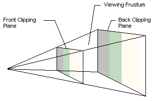

In order to render anything to the screen the Graphics device needs to understand what it needs to render and where, in basic terms, it needs a projection in 3D space with objects in view that need to be rendered.

An easier way to break it down is to compare it to the movies (or movie making), what you need in actuality is a **Camera**.  Where the camera points in the movie scene, what actors are in view and the scenery behind them, that is what makes it into the movie and shows on the screen.  In Game Development the principle is the same.

## The [View Frustrum](./WhatIs_ViewFrustum.md)

The way we describe a camera in 3D terms is to define a [View Frustrum](./WhatIs_ViewFrustum.md), which tells the graphics device:

- Where is it looking in 3D space.
- What is the closest point at which is should be looking from. (Near Plane)
- What is the furthest point objects can be rendered. (Far Plane)
- And what is the angle of projection.

The following diagram shows how this looks.



Everything within the "cone of view" is recognized by the graphics pipeline and is rendered into a Texture for displaying on the screen.  Everything outside these bounds is ignored (culled) and left on the cutting room floor.

> [!CAUTION]
> Be aware, that in 3D rendering EVERYTHING is evaluated to determine if it is in "View", EVERYTHING you send to the graphics card that you want to be rendered.  So if you send a massive scene and ALL your Models, ALL your textures, etc, then everything is evaluated.  Sure, Graphics Processing has evolved considerably over the years and the processes running on Graphics Cards keep getting quicker, but you still want to make that as efficient as possible.

## What defines a camera

Beyond the View Frustrum above, a Camera exists in graphical terms as:

- A position - Where in 3D space is the camera positioned?
- A direction - Which direction is the camera pointing?
- The Target of the camera - What is it looking at? The central point.
- The View Frustrum of the camera - What is in the field of view?
- The World Matrix, where in the world is the camera in relation to the center and other objects?

You will see this defined in many samples as the `World`, `View` and `Projection` Matrices, as shown below:

```csharp
// A centered world with no transformation
Matrix worldMatrix = Matrix.Identity;

// A view pointing at the center of the world from a position 50 units backwards.
Matrix viewMatrix = Matrix.CreateLookAt(
                    // View Position, where it is viewed FROM
                    new Vector3(0, 0, 50), 
                    // The world space coordinates it is looking at (0,0,0)
                    Vector3.Zero,
                    // The rotation of the view, the direction of the upper edge of the camera.
                    Vector3.Up);

// The frustrum of the camera
Matrix projectionMatrix = Matrix.CreatePerspectiveFieldOfView(
    // The width of the camera view.
    MathHelper.PiOver4,
    // The height of the camera view.
    GraphicsDevice.Viewport.AspectRatio,
    // The near plane, when to start rendering objects from.
    1.0f,
    // The far plane, when to stop rendering objects from.
    300.0f);
```

## [2D drawing](../../howto/graphics/HowTo_Draw_A_Sprite.md)

Now to break one illusion, 2D drawing (without all the camera setup) is still 3D drawing but from a fixed point of view with all content drawn at the same physical depth.

The [SpriteBatch](xref:Microsoft.Xna.Framework.Graphics.SpriteBatch) class does a very clever job of setting up this fixed view behind the scenes and also provides some basic ordering/laying of content as it is drawn into view.  Each batch is sent to the graphics card collectively and then processed in order from first to last, each subsequent draw being on top of the last.

> [!NOTE]
> Texture / Font drawing is effectively like placing pieces of paper on a table, one on top of another until you are done.  What can be seen once all the paper has been placed is the final view.

An example 2D drawing method:

```csharp
void DrawTexture(SpriteBatch spriteBatch, Texture2D spriteTexture, Vector2 spritePosition, Color spriteColor)
{
    spriteBatch.Begin();
    spriteBatch.Draw(spriteTexture, spritePosition, spriteColor);
    spriteBatch.End();
}
```

> [!NOTE]
> For more on 2D / Sprite rendering, check the [How To](https://docs.monogame.net/articles/getting_to_know/howto/graphics/#2d-sprite-rendering) series for 2D rendering.

The functionality does provide some techniques to sort what is drawn, provide some additional depth and layers, as well as blending options to effectively merge what is drawn.

## [3D Drawing](../../howto/graphics/HowTo_RenderModel.md)

When drawing 3D content in a scene, the Camera's current `View` and `Projection` are what are fed in to an [Effect](xref:Microsoft.Xna.Framework.Graphics.Effect) that draws the 3D content, together with a [Transformational Matrix](../../howto/graphics/HowTo_TransformPoint.md) (`World` position and rotation of the model) multiplied by the same `World` matrix used by the camera (as they are both part of the same world).

The MonoGame `Model` class has a built in `Draw` Method which performs the basic functions needed in order to render a 3D model into the view, requiring only the `World`, `View`, and `Projection` matrices required to draw it, as follows:

```csharp
    Model myModel;

    protected override void LoadContent()
    {
        myModel = Content.Load<Model>("<model file name>");
    }

    protected override void Draw(GameTime gameTime)
    {
        GraphicsDevice.Clear(Color.CornflowerBlue);

        // Ground drawn from the center of the scene
        myModel.Draw(Matrix.Identity, currentCameraView, currentCameraProjection);
    }
    
```

> [!INFO]
> For information purposes only

Behind the scenes, the `model.Draw()` method is using a `BasicEffect` and performing the necessary matrix calculations to position and render the model, as follows:

```csharp
/// <summary>
/// Draw the model, a model can have multiple meshes, so loop.
/// </summary>
/// <param name="aModel">The Model to draw.</param>
/// <param name="aWorld">The World matrix from the camera or shared world matrix.</param>
/// <param name="aView">The camera view in the world.</param>
/// <param name="aProjection">The camera projection in the world.</param>
void DrawModel(Model aModel, Matrix aWorld, Matrix aView, Matrix aProjection)
{
    //Copy any parent transforms
    Matrix[] transforms = new Matrix[ aModel.Bones.Count ];
    aModel.CopyAbsoluteBoneTransformsTo( transforms );

    //Draw the model, a model can have multiple meshes, so loop
    foreach (ModelMesh mesh in aModel.Meshes)
    {              
        //This is where the mesh orientation is set, as well as our camera and projection
        foreach (BasicEffect effect in mesh.Effects)
        {
            effect.EnableDefaultLighting();
            effect.PreferPerPixelLighting = true;
            effect.World = transforms[ mesh.ParentBone.Index ] * aWorld;
            effect.View = aView;
            effect.Projection = aProjection;
        }

        //Draw the mesh, will use the effects set above.
        mesh.Draw( );
    }
}
```

## Types of Camera

Cameras have many roles in games, in certain cases you may even use multiple cameras to render a scene, or render scenes from different angles to a texture to use as a HUD or mini-map.

Camera types include:

|Camera Type|Description|
|-|-|
|Fixed|A camera that is locked in place and is not intended to move (e.g. a Security Camera)|
|First Person|A camera that represents a players perspective of the world, moving and looking around.|
|Third Person|A camera that is locked behind a player avatar or model, moving with them as they move, can also rotate around the player for alternate views.|
|Top Down|A fixed view that looks from up on high and down in to the game world, sometimes fixed, sometimes tracking the movement of the main player or avatar.|
|Side View|A side scrolling view, or platformer, again, sometimes fixed, sometimes following the player or avatar|

These are just the most common examples as everyone has seen in the many games that have come before.  Some games use a combination of these modes to achieve the games look and feel.

Multiple cameras can be used simultaneously for either a [split screen multi-player](../../howto/graphics/HowTo_UseViewportForSplitscreenGaming.md) effect or by showing an alternate view in a window.

## Views of Cameras

The projection of the camera can also be made to look different, MonoGame supports the two main modes of projection:

- [Perspective](xref:Microsoft.Xna.Framework.Matrix#Microsoft_Xna_Framework_Matrix_CreatePerspective_System_Single_System_Single_System_Single_System_Single_) - A realistic 3D view.
- [Orthographic](xref:Microsoft.Xna.Framework.Matrix#Microsoft_Xna_Framework_Matrix_CreateOrthographic_System_Single_System_Single_System_Single_System_Single_) - Provides a flat 2D view.

Each perspective simply alters the way in which content is rendered into view.

## Camera Example

To demonstrate a camera setup, the following class acts as a base camera definition that can then be extended to meet your needs for rendering:

```csharp
using Microsoft.Xna.Framework;
using Microsoft.Xna.Framework.Input;

public class Camera
{
    private Vector3 position;
    private float yaw;
    private float pitch;
    private int viewportWidth;
    private int viewportHeight;
    private float nearClip = 10.0f;
    private float farClip = 100000.0f;

    public Vector3 Position => position;

    public float Yaw => yaw;

    public float Pitch => pitch;

    public Matrix ViewMatrix
    {
        get
        {
            Vector3 cameraDirection = Vector3.Transform(Vector3.Forward, Matrix.CreateFromYawPitchRoll(yaw, pitch, 0));
            Vector3 cameraTarget = position + cameraDirection;
            return Matrix.CreateLookAt(position, cameraTarget, Vector3.Up);
        }
    }

    public Matrix ProjectionMatrix { get; private set; }

    public Camera(Vector3 startPosition, float startYaw, float startPitch, int viewportWidth, int viewportHeight)
    {
        position = startPosition;
        yaw = startYaw;
        this.viewportWidth = viewportWidth;
        this.viewportHeight = viewportHeight;
        this.nearClip = nearClip;
        this.farClip = farClip;

        ProjectionMatrix = Matrix.CreatePerspectiveFieldOfView(
            MathHelper.ToRadians(45),
            viewportWidth / (float)viewportHeight,
            nearClip,
            farClip
        );
    }
}
```

Using this camera is then as simple as:

```csharp
using Microsoft.Xna.Framework;
using Microsoft.Xna.Framework.Graphics;
using Microsoft.Xna.Framework.Input;

public class MonoGameCameraSample : Game
{
    private GraphicsDeviceManager _graphics;
    private SpriteBatch _spriteBatch;
    private Camera camera;

    private Model myModel;

    public MonoGameCameraSample()
    {
        _graphics = new GraphicsDeviceManager(this);
        Content.RootDirectory = "Content";
    }

    protected override void Initialize()
    {
        // Create a new camera with the following parameters:
        // 1. Position 50 units Up and 100 units back from the center
        // 2. Camera is looking straight forward, no turn.
        // 3. Angle the camera down 25 degrees
        // 4. Pass in the width and height of the Graphics Device
        camera = new Camera(
            new Vector3(0, 50, 100),
            0f,
            -MathHelper.ToRadians(25f),
            GraphicsDevice.Viewport.Width,
            GraphicsDevice.Viewport.Height
        );

        base.Initialize();
    }

    protected override void LoadContent()
    {
        _spriteBatch = new SpriteBatch(GraphicsDevice);

        myModel = Content.Load<Model>("Models/p1_wedge");
    }

    protected override void Draw(GameTime gameTime)
    {
        GraphicsDevice.Clear(Color.CornflowerBlue);
        GraphicsDevice.BlendState = BlendState.Opaque;
        GraphicsDevice.RasterizerState = RasterizerState.CullNone;
        GraphicsDevice.SamplerStates[0] = SamplerState.LinearWrap;
        GraphicsDevice.DepthStencilState = DepthStencilState.Default;

        // Draw a model using the camera's current View and Projection Matrix
        DrawModel(myModel, Matrix.Identity, camera.ViewMatrix, camera.ProjectionMatrix);

        base.Draw(gameTime);
    }

    void DrawModel(Model aModel, Matrix aWorld, Matrix aView, Matrix aProjection)
    {
        //Copy any parent transforms
        Matrix[] transforms = new Matrix[aModel.Bones.Count];
        aModel.CopyAbsoluteBoneTransformsTo(transforms);

        //Draw the model, a model can have multiple meshes, so loop
        foreach (ModelMesh mesh in aModel.Meshes)
        {
            //This is where the mesh orientation is set, as well as our camera and projection
            foreach (BasicEffect effect in mesh.Effects)
            {
                effect.EnableDefaultLighting();
                effect.PreferPerPixelLighting = true;
                effect.World = transforms[mesh.ParentBone.Index] * aWorld;
                effect.View = aView;
                effect.Projection = aProjection;
            }

            //Draw the mesh, will use the effects set above.
            mesh.Draw();
        }
    }
}
```

This is a fixed camera with no movement and only looking in a single direction all the time, it has no movement, input logic or capability to move around the scene.

## See Also

- [How to display Multiple Screens with Viewports](../../howto/graphics/HowTo_UseViewportForSplitscreenGaming.md)

### Concepts

- [What Is 3D Rendering?](WhatIs_3DRendering.md)
- [What Is a Viewport?](WhatIs_Viewport.md)
- [What Is a View Frustum?](WhatIs_ViewFrustum.md)
- [What Is a Render Target?](WhatIs_Render_Target.md)

### Reference

- [GraphicsDevice.Viewport](xref:Microsoft.Xna.Framework.Graphics.GraphicsDevice)
- [Matrix](xref:Microsoft.Xna.Framework.Matrix)
- [SpriteBatch](xref:Microsoft.Xna.Framework.Graphics.SpriteBatch)
