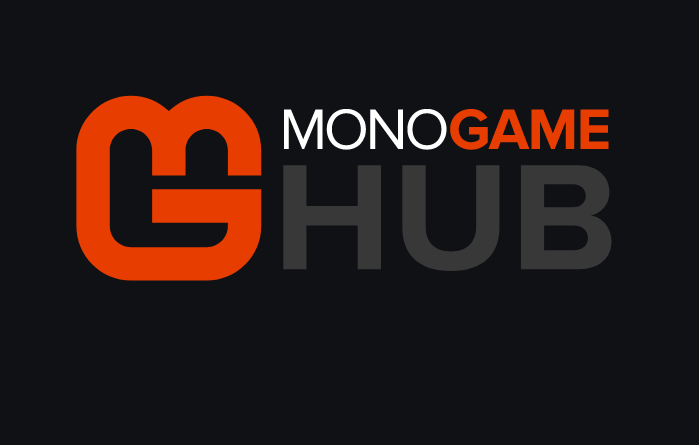
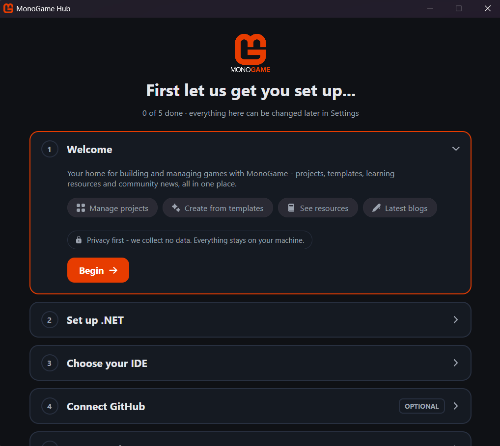
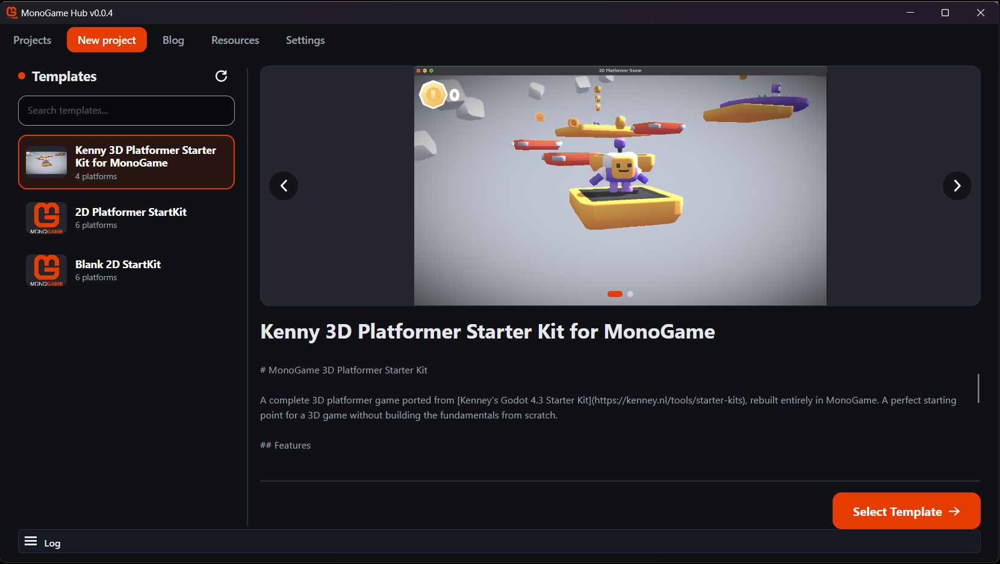
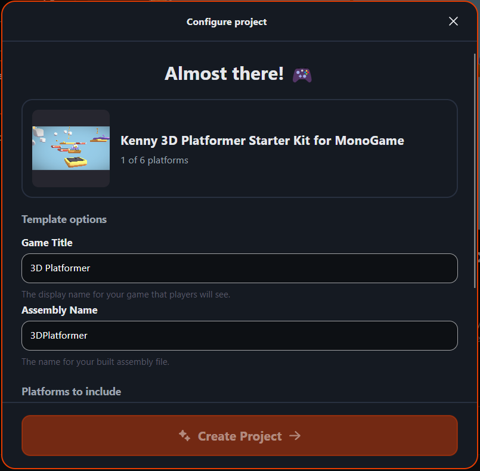
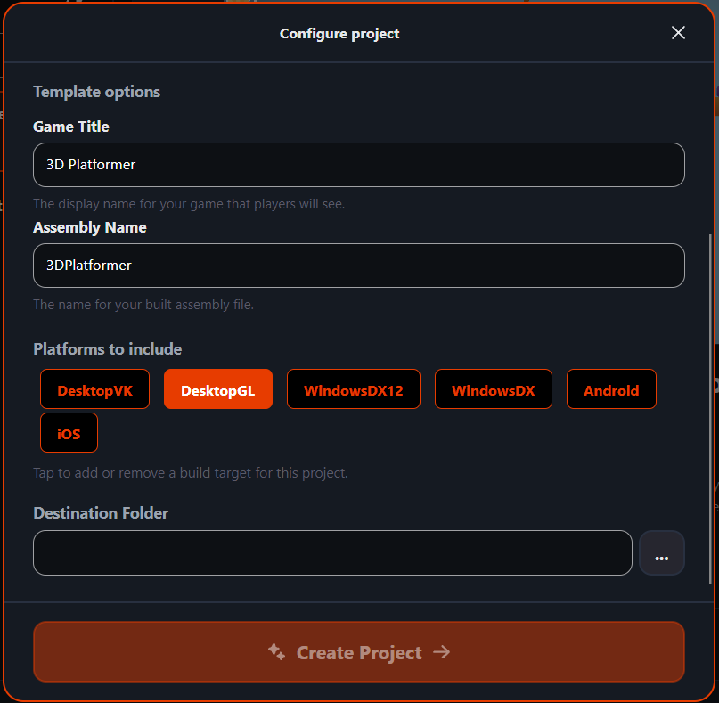
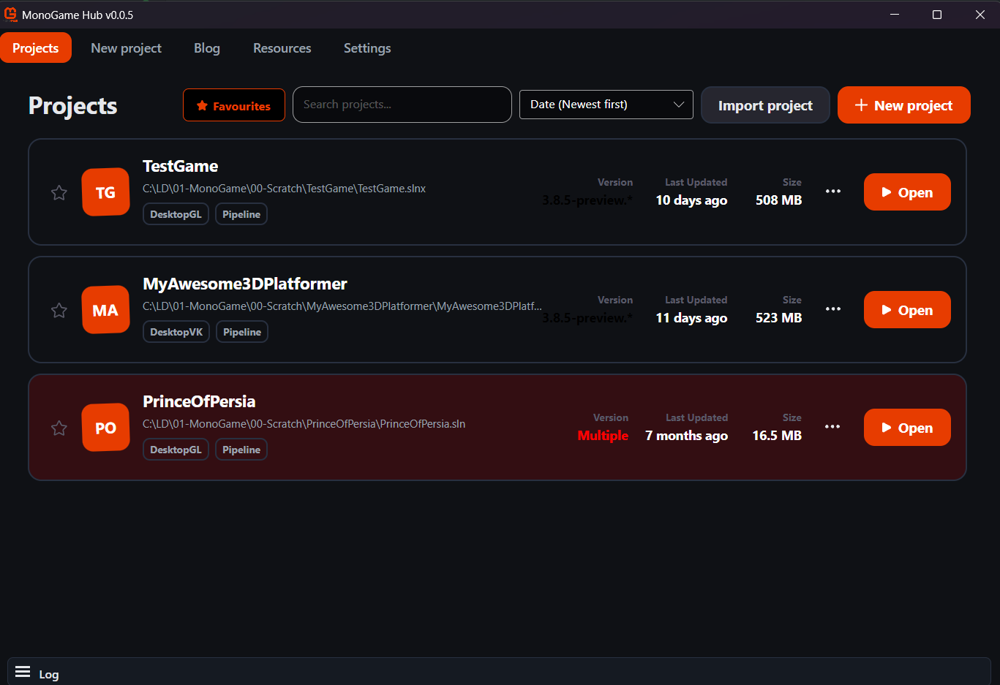
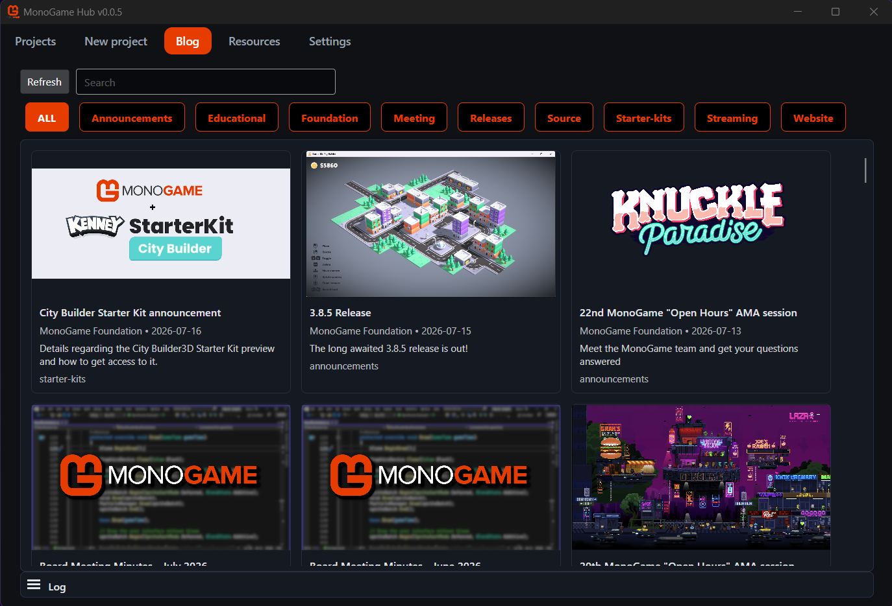
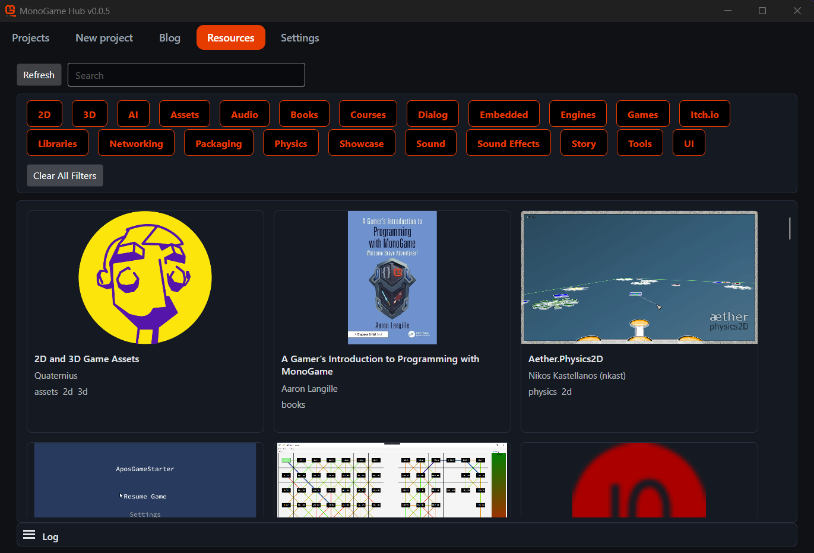

The MonoGame Hub is a new tool whose sole purpose in life is to accelerate the creation of MonoGame projects using well-defined templates and simplify the management of your MonoGame project, with some additional flavour built in to see blog posts and available resources in one handy place.

> [!NOTE]
> Sponsors only
>
> While the tool is still being developed, we are only allowing supporters of MonoGame to get early access and drive the roadmap for the tool.

The Hub offers the following capabilities:

- Surfaces official MonoGame project templates, with capabilities far beyond the simple templates available through DotNet commands today.
- Details more information and highlights of the capabilities of the template prior to generation.  Images/videos/descriptions and so on.
- Solution generation from a template for your selected platforms, allowing you pick the platforms you want and ignore the ones you do not.
- Lists/Manages a set of registered MonoGame Projects either generated through the Hub or imported from pre-existing.
- Lists out the blog posts from the main website, with announcements on launch for new news.
- Provides direct access to published resources from the MonoGame website, searchable and filterable via tags.

## Startup wizard

When you first start the Hub, a wizard will walk you through getting your development environment ready for building MonoGame projects, including:

- Checking you have DotNet installed (mandatory, as MonoGame runs on DotNet)
- Confirming the IDE you wish to use, and pointing you to the download page if it is not yet installed.
- Optionally connecting the Hub to your GitHub account, required if you want to access Private/Sponsored content (for sponsors), or your own templates on your own private repositories.

> [!NOTE]
> GitHub connectivity is completely OPTIONAL.
>
> Without a GitHub connection, you will only be able to see public repositories and samples, which is fine.

From there, everything is ready to create your next great MonoGame creation, or just switch to the Project list and import your current wonder.

> [!NOTE]
> This solves 90% of the "How do I get my machine setup correctly" questions we always face with MonoGame!

## Templates/Create view

MonoGame is trying to open up access to "Good Templates" for starting your next great project, there are only a few at the moment, but expect this to grow quickly over the next few months, with templates ranging from:

- A blank project
- The 3D Platformer sample project
- A quick start project with some default components (the current Blank Starter Kit)
- A 2D platformer sample
- (Sponsors only) The new City Builder Starter kit

Each template contains all the details required to choose which template you want to start from, such as screenshots, videos and a full featured description of what is included.

In the near future, we will open this up to user templates and even community catalogs to make even more types of projects available to create directly from the hub.

> [!NOTE]
> This solves the second most asked question for MonoGame newcomers, HOW do I create my project, what commands to use and where are the samples anyway!

## Project Generation

|||
| :-: | :-: |
|Create Page 1|Create Page 2|

Once you have selected your template, the Hub vastly simplifies the MonoGame project creation by offering you the following options:

- Name of your game
- Assembly Name (also folder name as it cannot have spaces)
- Selected platforms, default is auto-selected and you can add more or change the choice
- Select the folder the game will be created in.  *Note, this will create a new folder with the assembly name in this folder, you do not need to create a game specific folder unless you want to.

> [!NOTE]
> Due to dotnet limitations, you **CANNOT** start your Game assembly name with a number, else it puts a "_" character at the beginning and messes up the template. It is a DotNet thing not the Hub.

Once you are ready (and the button is enabled, which will only happen when everything is correct), click the "Create Project" button, you game will be generated and automatically open with your chosen IDE.  The project will also automatically be added to the Hub Project view below too.

## Project Management

Not much to show off here, it is a very basic Project list view at the moment allowing you to:

- Open projects registered with the hub
- Remove a project from the list
- Import existing projects to the Hub

We have plans to do more to manage your project later, but for now, it is just the quickest way to get your game project open to get to work.

## Blogs and Resources

|||
| :-: | :-: |
|Blogs|Resources|

The blogs and resources are simple lists, detailing information predominately available on the main `MonoGame.Net` website in a more readily accessible way, including the ability to filter/sort or search for what you need.

## Sponsors only

While we are in this early alpha/preview phase, access to the hub is for Sponsors only, providing essential feedback and testing while it is still in heavy development, also as a reward to those helping to fund the evolution of the framework!

With a GitHub connection, private, sponsor only templates (like the City Builder) will also show up.

## The future

As stated, these are early days for the hub and more is planned, including:

- .NET version selection for templates
- Platform management for existing projects
- More templates!

Welcome to the future.
