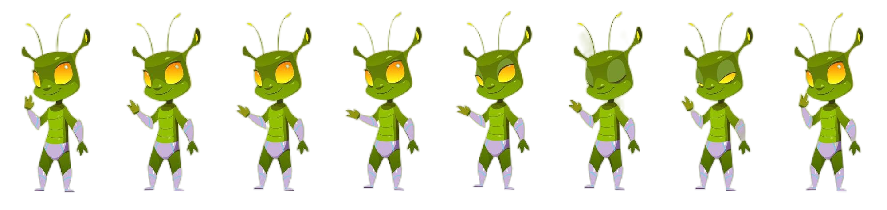

## Overview

In this example, you will draw a sprite to the screen and then

## Requirements

The example assumes the texture you are loading contains multiple frames of the same size in a texture whose size is uniform (also known as a spritesheet), for example, the following spritesheet contains 6 Images of a character in different phases of motion, when player together it looks like it is animated.



Save the spritesheet to your content project and name it "**AnimatedCharacter**" (which will used to reference it in the project).

The sample also uses a class named **AnimatedTexture**, which is included with the sample below.

The `AnimatedTexture.cs` is a helper to simplify the loading and drawing of a texture that contains multiple frames of animation.

> [!NOTE]
> The tutorial assumes you have already [created a new MonoGame project](https://docs.monogame.net/articles/getting_started/index.html#2-creating-a-new-project) using one of the standard templates.

## Drawing an Animated Sprite

1. Follow the steps of [How To: Draw a Sprite](HowTo_Draw_A_Sprite.md).
   A good first step to understanding the loading and drawing of textures.

2. Create a new class called `AnimatedTexture.cs` in your project and replace its contents with the following:

    ```csharp
    using Microsoft.Xna.Framework;
    using Microsoft.Xna.Framework.Content;
    using Microsoft.Xna.Framework.Graphics;
    
    public class AnimatedTexture
    {
        private int frameCount;
        private Texture2D myTexture;
        private float timePerFrame;
        private int frame;
        private float totalElapsed;
        private bool isPaused;
    
        public float Rotation, Scale, Depth;
        public Vector2 Origin;
    
        public AnimatedTexture(Vector2 origin, float rotation, float scale, float depth)
        {
            this.Origin = origin;
            this.Rotation = rotation;
            this.Scale = scale;
            this.Depth = depth;
        }
    
        public void Load(ContentManager content, string asset, int frameCount, int framesPerSec)
        {
            this.frameCount = frameCount;
            myTexture = content.Load<Texture2D>(asset);
            timePerFrame = (float)1 / framesPerSec;
            frame = 0;
            totalElapsed = 0;
            isPaused = false;
        }
    
        public void UpdateFrame(float elapsed)
        {
            if (isPaused)
                return;
            totalElapsed += elapsed;
            if (totalElapsed > timePerFrame)
            {
                frame++;
                // Keep the Frame between 0 and the total frames, minus one.
                frame %= frameCount;
                totalElapsed -= timePerFrame;
            }
        }
    
        public void DrawFrame(SpriteBatch batch, Vector2 screenPos)
        {
            DrawFrame(batch, frame, screenPos);
        }
    
        public void DrawFrame(SpriteBatch batch, int frame, Vector2 screenPos)
        {
            int FrameWidth = myTexture.Width / frameCount;
            Rectangle sourcerect = new Rectangle(FrameWidth * frame, 0,
                FrameWidth, myTexture.Height);
            batch.Draw(myTexture, screenPos, sourcerect, Color.White,
                Rotation, Origin, Scale, SpriteEffects.None, Depth);
        }
    
        public bool IsPaused
        {
            get { return isPaused; }
        }
    
        public void Reset()
        {
            frame = 0;
            totalElapsed = 0f;
        }
    
        public void Stop()
        {
            Pause();
            Reset();
        }
    
        public void Play()
        {
            isPaused = false;
        }
    
        public void Pause()
        {
            isPaused = true;
        }
    }
    ```

3. In your game's constructor, create an instance of the **AnimatedTexture** class.
   This example uses (0,0) as the origin of the texture, no rotation, a scale of 2, and a depth of 0.5.

    ```csharp
    // The reference to the AnimatedTexture for the character
    private AnimatedTexture spriteTexture;
    // The rotation of the character on screen
    private const float Rotation = 0;
    // The scale of the character, how big it is drawn
    private const float Scale = 2.0f;
    // The draw order of the sprite
    private const float Depth = 0.5f;

    public Game1()
    {
        spriteTexture = new AnimatedTexture(Vector2.Zero, Rotation, Scale, Depth);
    }
    ```

4. Load the texture to provide the image data for the animation.
   In this example, the **AnimatedTexture** class loads a single texture and divides it into frames of animation. It uses the last parameter to determine how many frames to draw each second. In this case, it draws four frames at two frames per second (fps).

    ```csharp
    // The game visible area
    private Viewport viewport;
    // The position to draw the character
    private Vector2 characterPos;
    // How many frames/images are included in the animation
    private const int frames = 6;
    // How many frames should be drawn each section, how fast does the animation run
    private const int framesPerSec = 3;

    protected override void LoadContent()
    {
        // Create a new SpriteBatch, which can be used to draw textures.
        _spriteBatch = new SpriteBatch(GraphicsDevice);

        // "AnimatedCharacter" is the name of the sprite asset in the project.
        spriteTexture.Load(Content, "AnimatedCharacter", frames, framesPerSec);
        viewport = _graphics.GraphicsDevice.Viewport;
        characterPos = new Vector2(viewport.Width / 2, viewport.Height / 2);
    }
    ```

5. In your game's [Game.Update](xref:Microsoft.Xna.Framework.Game#Microsoft_Xna_Framework_Game_Update_Microsoft_Xna_Framework_GameTime_) method, determine which animation frame to display.

    ```csharp
    protected override void Update(GameTime gameTime)
    {
        if (GamePad.GetState(PlayerIndex.One).Buttons.Back == ButtonState.Pressed || Keyboard.GetState().IsKeyDown(Keys.Escape))
            Exit();

        // TODO: Add your update logic here
        float elapsed = (float)gameTime.ElapsedGameTime.TotalSeconds;
        spriteTexture.UpdateFrame(elapsed);

        base.Update(gameTime);
    }
    ```

    This is handled by AnimatedTexture's **UpdateFrame** method, which takes the elapsed seconds between updates as a parameter.

    ```csharp
    // class AnimatedTexture
    public void UpdateFrame(float elapsed)
    {
        if (isPaused)
            return;
        totalElapsed += elapsed;
        if (totalElapsed > timePerFrame)
        {
            frame++;
            // Keep the Frame between 0 and the total frames, minus one.
            frame %= frameCount;
            totalElapsed -= timePerFrame;
        }
    }
    ```

6. In your game's [Game.Draw](xref:Microsoft.Xna.Framework.Game#Microsoft_Xna_Framework_Game_Draw_Microsoft_Xna_Framework_GameTime_) method, call [SpriteBatch.Draw](xref:Microsoft.Xna.Framework.Graphics.SpriteBatch#Microsoft_Xna_Framework_Graphics_SpriteBatch_Draw_Microsoft_Xna_Framework_Graphics_Texture2D_Microsoft_Xna_Framework_Vector2_Microsoft_Xna_Framework_Color_) on the **AnimatedTexture** object.

    ```csharp
    protected override void Draw(GameTime gameTime)
    {
        GraphicsDevice.Clear(Color.CornflowerBlue);

        // TODO: Add your drawing code here
        _spriteBatch.Begin();
        spriteTexture.DrawFrame(_spriteBatch, characterPos);
        _spriteBatch.End();

        base.Draw(gameTime);
    }
    ```

    **AnimatedTexture** draws the sprite using the subrectangle of the texture that contains the desired animation.

    ```csharp
    // class AnimatedTexture
    public void DrawFrame(SpriteBatch batch, Vector2 screenPos)
    {
        DrawFrame(batch, frame, screenPos);
    }

    public void DrawFrame(SpriteBatch batch, int frame, Vector2 screenPos)
    {
        int FrameWidth = myTexture.Width / frameCount;
        Rectangle sourcerect = new Rectangle(FrameWidth * frame, 0,
            FrameWidth, myTexture.Height);
        batch.Draw(myTexture, screenPos, sourcerect, Color.White,
            Rotation, Origin, Scale, SpriteEffects.None, Depth);
    }
    ```

There are many ways in which to handle the animation of sprites and they do not all need to be in a single line, some spritesheets use both Rows and Columns, sometimes for different animations for the same characters, or to maintain the same animation for multiple characters (remember it costs memory and time to load multiple textures, so why not just use one for efficiency).

> [!TIP]
> Alternatively, some projects use a [Custom Content Processor](../content_pipeline/HowTo_Extend_Processor.md) to generate the animation when the spritesheet is imported, which is more of an advanced topic.

## See Also

- [Drawing a Sprite](HowTo_Draw_A_Sprite.md)

### Concepts

- [What Is a Sprite?](../../whatis/graphics/WhatIs_Sprite.md)

### Reference

- [SpriteBatch](xref:Microsoft.Xna.Framework.Graphics.SpriteBatch)
- [SpriteBatch.Draw](xref:Microsoft.Xna.Framework.Graphics.SpriteBatch#Microsoft_Xna_Framework_Graphics_SpriteBatch_Draw_Microsoft_Xna_Framework_Graphics_Texture2D_Microsoft_Xna_Framework_Vector2_Microsoft_Xna_Framework_Color_)
- [Texture2D](xref:Microsoft.Xna.Framework.Graphics.Texture2D)
