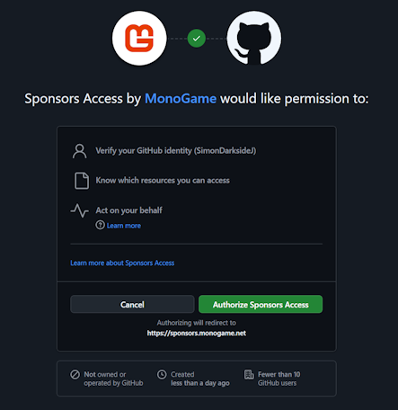

At MonoGame, we are working hard to evolve the framework, to provide fresh resources, tools, samples and content to assist all consumers of the MonoGame Framework.

## Requirements

The minimum sponsorship level required to access the private resources is [SpriteBatch](https://monogame.net/donate/)&nbsp;

## Sponsors Resources

To both celebrate and reward Sponsors of MonoGame, we give you early access to the latest and greatest the team are currently working on, this includes:

### Tutorials

- Early access to the latest tutorial content:

  - An Advanced 2D Shader tutorial - live
  - A Mobile Deployment tutorial - incoming
  - A Beginner 3D tutorial - incoming

### Samples

- Early access to new MonoGame Samples:

  - The 3D Platformer sample - A migrated platformer sample from [Kenny.nl](https://www.kenney.nl/starter-kits)'s sample outfitted for MonoGame
  - The 3D FPS sample (incoming) - A migrated FPS sample from [Kenny.nl](https://www.kenney.nl/starter-kits)'s sample outfitted for MonoGame

> [!NOTE]
> Early access is granted for several months before they become public.

We are also working hard on more resources for the community.

## DrawUserPrimitives exclusive content

Sponsors at DrawUserPrimitives and above also get additional resources:

- The 3D Ascent demo project - An upgraded version of the old [Ship Game](https://github.com/MonoGame/MonoGame.Samples/blob/3.8.4/ShipGame/README.md) sample, modernised for today's platforms.

## Accessing the Private Sponsorship site

The private sponsors only documentation site can be found at the following address:

### [https://sponsors.monogame.net/](https://sponsors.monogame.net/)

Access is granted through your GitHub account, once your sponsorship is confirmed, we will request your GitHub account name so we can assign it to the relevant sponsorship level.

## GitHub Authorisation

In order to verify your identity, GitHub will request you validate the first time you access the site with the following dialog:

### Authorization details

The Sponsors site application connects your GitHub account securely to our sponsorship system.  
By authorizing, you allow us to:

- ✅ Verify your GitHub identity (to confirm you are the correct sponsor)
- ✅ Know which resources you can access (to match benefits to your sponsorship tier)
- ✅ Act on your behalf (to confirm your sponsorship level, unlock exclusive content, and keep content access in sync)

### Why do we need this?

MonoGame needs to request permissions so we can:

- Link your sponsorship to your GitHub account
- Provide you with exclusive sponsor benefits
- Keep your access secure and personalized

### Security & Privacy

- We only request the **minimum permissions** required.
- Your data is handled according to our [Privacy Policy](https://community.monogame.net/privacy).
- You can revoke access anytime from your [GitHub Authorized Apps](https://github.com/settings/applications).

## Questions?

If you have concerns regarding the sponsorship site or the content within, please contact us at [info@monogame.net].
