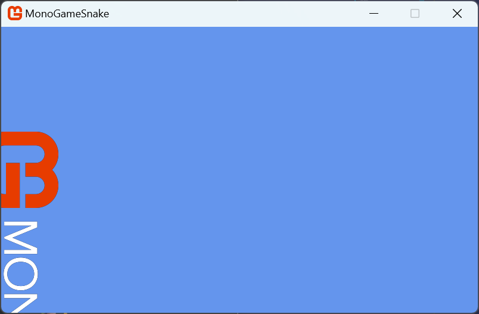
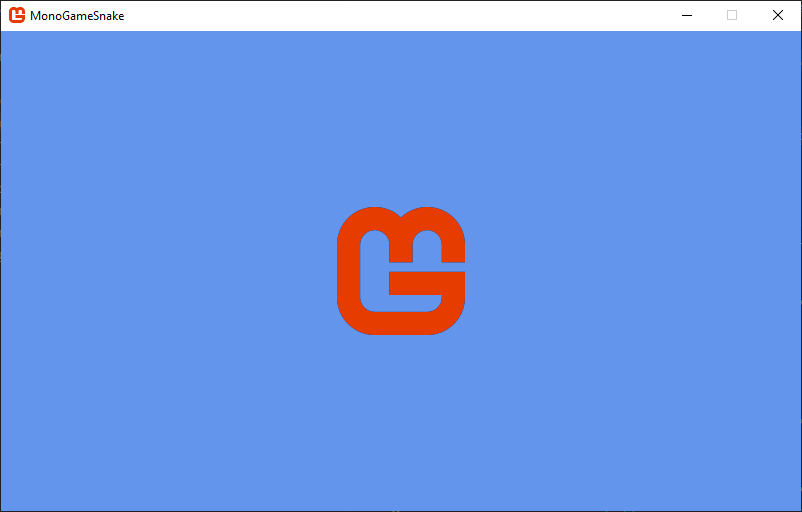

Textures are images that are used in your game to represent the visual graphics.  To use them, you need to either create the texture in code or load them from an existing file before rendering them using the `SpriteBatch`.

## Loading a Texture

Loading textures in MonoGame can be done by loading an image file directly at runtime in game, or it can be loaded through the *content pipeline*.  Both approaches will get the texture loaded and ready to render, but there are trade offs to each approach.

Loading an image file directly at runtime is very straightforward.  To use this workflow you need to:

1. Add the image file to your project
2. Manually configure your project to copy the image file to the game project build directory
3. Load the image file at runtime using the `Texture2D.FromFile` method.

While being a straightforward process, the image file is still in it's compressed format such as *.png* or *.jpg*.  These compression formats are not understood by a Graphics Processing Unit (GPU) so they need to be decompressed into raw bytes that it does understand before it can store the data, potentially leaving a larger memory footprint.

On the other side of this coin, MonoGame offers the *content pipeline*; a workflow for managing assets, such as image files.  The workflow is made up of a set of tools and utilities that are automatically added by default when you create a new MonoGame project using the MonoGame templates.  To use this workflow, you need to:

1. Add the image file to your content project (*Content.mgcb* file) using the MGCB Editor.
2. Perform a project build. Doing this, the *MonoGame.Content.Builder.Tasks* NuGet reference will compile the assets defined in the content project and automatically copy them to the game project build directory.
3. Load the compiled asset at runtime using the `ContentManager`.

The following image illustrates this workflow:

<figure><figcaption><p><strong>Figure 4-1: MonoGame Content Pipeline Workflow</strong></p></figcaption></figure>

For the same amount of steps, you also get the benefit of the image file being pre-processed and compiled to an optimized format that can be understood by GPUs without needing to be decompressed first, reducing the memory footprint.  For instance, on desktops, image files can be compiled using [DXT compression](https://en.wikipedia.org/wiki/S3\_Texture\_Compression).

> [!NOTE]
> For more information on the benefits of compiling assets and what optimizations it can offer, see the [Content Pipeline](../../getting_started/content_pipeline/index.md) documentation.

Enough talk though, let's take a look at using both of these methods.  First, we need an image to load.  Perform the following:

1. Find the *Content* directory inside your game project directory
2. Create a new folder inside the *Content* directory called *images*.
3. Right-click the following image of the MonoGame logo and save it in the *Content/images* directory you just created with the filename *logo.png*

<figure><figcaption><p><strong>Figure 4-2: MonoGame Horizontal Logo</strong></p></figcaption></figure>

Next, open the *Game1.cs* file in your project and add

```cs
private Texture2D _logo;
```

beneath where the `GraphicsDeviceManager` and `SpriteBatch` instance member variables are declared.  This adds a new `Texture2D` instanced called `_logo`.  `Texture2D` is the type used to store a reference to 2D image data in MonoGame.

### Loading From File

To load a an image file directly as a texture at runtime, we can use the `Texture2D.FromFile` method.  Find the `LoadContent` method and add the following after the `_spriteBatch` is instantiated:

```cs
_logo = Texture2D.FromFile(GraphicsDevice, "Content/images/logo.png");
```

This assigns an image loaded from the provided file to the `_logo` texture we declared.  Running the game now though will cause a crash with an exception similar to the following:

```
Exception has occurred: CLR/System.IO.DirectoryNotFoundException
An unhandled exception of type 'System.IO.DirectoryNotFoundException' occurred in System.Private.CoreLib.dll: 'Could not find a part of the path 'C:\dev\MonoGameSnake\MonoGameSnake\bin\Debug\net8.0\Content\images\logo.png'.'
```

This is because even though we added the *logo.png* file, we need to configure the project to copy the file to the build output when we do a project build.  To do this, open the *MonoGameSnake.csproj* file and add the following before the closing `</Project>` element at the bottom:

```xml
<ItemGroup>
    <Content Include="Content\images\logo.png" CopyToOutputDirectory="PreserveNewest" />
</ItemGroup>
```
> [!NOTE]
> If you are using Visual Studio, you can achieve the same result by right-clicking 
> 1. Right-clicking the *logo.png* file in the *Solution Explorer* panel
> 2. Select *Properties* from the context menu.  This will open the *Properties* panel for the item.
> 3. Change the *Copy to Output Directory* property to *Copy Always*.

Now when you run the game, first the build is performed which will copy the image file to the build output directory, then the image is loaded as a texture in the `LoadContent` method using the `Texture2D.FromFile` method call.

Now let's take a look at doing the same process but instead using the content pipeline.

### Loading From Content Pipeline

To use the content pipeline to load our image, we first need to open the *MonoGame Content Builder Editor (MGCB Editor)*. Since we are using VSCode for this tutorial, you should have installed the *MonoGame for VSCode* extension in [Chapter 02](../02_getting_started/index.md#installing-the-monogame-for-vscode-extension). With this extension installed, when you have a code file open, you will see the MonoGame logo in the top-right of the code window like below:

<figure><figcaption><p><strong>Figure 4-3: MonoGame for VSCode extension icon</strong></p></figcaption></figure>

Clicking this icon will open the MGCB Editor with the *Content.mgcb* file in the current project loaded.

> [!NOTE]  
> If you did not install the *MonoGame for VSCode* extension or prefer to not use it, you can use the CLI commands to open the MGCB Editor instead. To do this:
>
> 1. Open the terminal in VSCode pressing `` CTRL+` ``or choosing *View > Terminal* from the top menu
> 2. If the terminal directory is not in the project root directory (the one with the .csproj file), then use the `cd` command to navigate to that directory.
> 3. Enter the command `dotnet mgcb-editor ./Content/Content.mgcb` to open the MGCB Editor using the *Content.mgcb* file from the project.

<figure><figcaption><p><strong>Figure 4-4: MonoGame Content Builder Editor (MGCB Editor) Window</strong></p></figcaption></figure>

With the MGCB Editor now open, perform the following

1. Right-click on the *Content* node in the *Project* panel on the left.
2. Select *Add > New Folder*.
3. Name the folder `images`.
4. Right-click on the new *images* folder
5. Select *Add > Existing Item*.
6. Navigate to the *icon.png* file and choose it

After adding an existing file, you will be prompted with a pop-up asking if you would like to *Copy the file* or *Add a link*. Since the file is already in our *Content/images* directory, the copy option is greyed out, so choose the *Add a link* option, then click the *Add* button.

<figure><figcaption><p><strong>Figure 4-5: Add Existing File Popup</strong></p></figcaption></figure>

> [!CAUTION]  
> When adding existing files in the future, the choice between copying the file and adding a link can make a big difference. When you choose to copy the file, it makes a literal copy of the current file and puts that copy inside the Content directory in your project. This means any changes to the original source file will not be reflected in the copy.
>
> By adding as a link, it will instead reference the source file without making a copy. This means changes made in the source file will be reflected, however the link is stored as a relative link, relative to the *Content.mgcb* file. So if the source file moves, or you move the project, then you'll need to re-add the link.

After adding the *logo.png* file, you're project node should look similar to the following:

<figure><figcaption><p><strong>Figure 4-6: Logo image added to the MGCB Editor</strong></p></figcaption></figure>

Save the changes by pressing `CTRL+S`, or by clicking the *Save* icon in the top tool bar, or by choosing *File > Save* from the top menu. When you save the changes made, the MGCB Editor will write updates to the *Content.mgcb* file in your project to reflect the changes made. After saving, you can close the MGCB Editor.

Now that we have added the logo image to our content project using the MGCB Editor, we need to make some small adjustments in our code to load the image using the content pipeline.  First, open the *MonoGameSnake.csproj* file and remove the `<ItemGroup>` section we added before. We no longer need the project build itself to copy the file over for us.

Next, open the *Game1.cs* file and navigate to the `LoadContent` method. Change the line of code where we loaded the texture from file to the following

```cs
_logo = Content.Load<Texture2D>("images/logo");
```

The change we made now uses the instance of the `ContentManager` object provided by the `Content` property in the `Game` class. We call the `Load<T>` method, where `T` is the content type that we are loading. The parameter we pass to it is the *asset name* which is a string representation of the path to the content to load, without any extensions. The path used as the *asset name* is also relative to the `Content.RootDirectory` value, which was set to `Content` in the `Game1` constructor above. This means the *asset name* of our logo image located at *Content/images/logo.png* is `images/logo`.

Running the game now, the image will be loaded as a texture, just like it did when you loaded it directly from file previously, only now it's loading the compiled asset.  Let's review what is actually happening now that we are using the *content pipeline*.

## Drawing a Texture

As mentioned in [Chapter 03](../03_the_game1_file/index.md#looking-at-the-code), all rendering should be done inside the `Draw` method. The `Draw` method's responsibility is to render the game state that was calculated in `Update`'; it should not contain any game logic or complex calculations.

Locate the `Draw` method in the *Game1.cs* file and add the following after the `Clear` method call is made:

```cs
_spriteBatch.Begin();
_spriteBatch.Draw(_logo, Vector2.Zero, Color.White);
_spriteBatch.End();
```

These lines of code tell the `SpriteBatch` to draw the logo texture you loaded in the top-left corner of the game window. Run the game and you should see something similar to the following:

<figure><figcaption><p><strong>Figure 4-7: The MonoGame logo drawn to the game window.</strong></p></figcaption></figure>

When drawing with MonoGame, the graphics device needs to be prepared and told that it is going to receive data to pass to the GPU to render. When using the `SpriteBatch` for rendering, we do this by using the `SpriteBatch.Begin` method. We can't use the `SpriteBatch.Draw` method without first using the `SpriteBatch.Begin` so the graphics device is set to a state ready to draw.  `SpriteBatch.End()` must always be called when finished rendering with the `SpriteBatch`.  When the `End` method is called, it is at this point that the batched draw calls are submitted to the GPU for rendering.

In the above example, we use the `SpriteBatch.Draw` method with the following parameters

| Parameter  | Type        | Description                                                                                                       |
| ---------- | ----------- | ----------------------------------------------------------------------------------------------------------------- |
| *texture*  | `Texture2D` | The `Texture2D` to draw                                                                                           |
| *position* | `Vector2`   | The xy-coordinate position to draw the texture at. The origin point being the top-left corner of the image.       |
| *color*    | `Color`     | The color mask (tint) to apply to the image drawn. Specifying `Color.White` will render the texture with no tint. |

Try adjusting the position and color parameters to see how they can affect the image being drawn.

In MonoGame, the xy-coordinate space on the screen begins at (0, 0) in the top left corner, with the x-coordinate increasing to the right, and the y-coordinate increasing downward. Knowing this, let's try drawing the logo centered on the game window. To do this, we would first need to know the xy-coordinate position of the center of the game window. We can get this information from the `Window.ClientBounds` property provided by the `Game` class.

`Window.ClientBounds` has both an `X` and `Y` property that represent the top-left coordinates of the game window (0, 0). It also `Width` and `Height` properties that represent the width and height of the game window in pixels. Knowing this, we only need to get half of the width and height to know the xy-coordinate position of the center of the game window. Let's update our draw method to use this information, adjust the `Draw` method call to the following

```cs
_spriteBatch.Draw(_logo, new Vector2(Window.ClientBounds.Width, Window.ClientBounds.Height) * 0.5f, Color.White);
```

> [!TIP]  
> In the example above, we multiply the `Vector2` created by `0.5f` to half the value instead of dividing it by `2.0f`. If you're not used to seeing this, it might seem strange at first, but it's actually an optimization technique. CPUs are able to perform multiplication operations much faster than division operations and reading `* 0.5f` is easily understood to be the same thing as `/ 2.0f` when reading.

We're now telling the position to be a half the width and height of the client bounds. If we run the game now, the logo should be drawn at the center of the game window correct? Well, not exactly. If you run the game now, it will look similar to the following:

<figure><figcaption><p><strong>Figure 4-8: Attempting to draw the MonoGame logo centered on the game window.</strong></p></figcaption></figure>

So what happened here? Recall from the table above that the *position* parameter is the xy-coordinate position to draw the texture at, with the texture's origin being the top-left corner of the texture. This means, that the image will be drawn at that position starting with the top-left corner of the image. So while we are drawing the image at the center of the game window, the image itself is not centered.

One way to correct this is to subtract half the width and height of the logo image from the game window center position like so:

```cs
_spriteBatch.Draw(
  _logo,        // texture
  new Vector2(  // position
    (Window.ClientBounds.Width * 0.5f) - (_logo.Width * 0.5f),
    (Window.ClientBounds.Height * 0.5f) - (_logo.Height * 0.5f)),
  Color.White); // color
```

This offsets the position so that it correctly centers the image to the game window.

<figure><figcaption><p><strong>Figure 4-9: The MonoGame logo drawn centered on the game window.</strong></p></figcaption></figure>

While this works, this may not be the best way to do it. Let's explore why. The `SpriteBatch.Draw` method contains other overloads that accept more parameters. Let's change the `SpriteBatch.Draw` method call to use the one with all parameters. Adjust the code to the following:

```cs
_spriteBatch.Draw(
  _logo,              // texture
  new Vector2(        // position
    (Window.ClientBounds.Width * 0.5f) - (_logo.Width * 0.5f),
    (Window.ClientBounds.Height * 0.5f) - (_logo.Height * 0.5f)),
  null,               // sourceRectangle
  Color.White,        // color
  0.0f,               // rotation
  Vector2.Zero,       // origin
  1.0f,               // scale
  SpriteEffects.None, // effects
  0.0f);              // layerDepth
```

Changing the `SpriteBatch.Draw` method call to this overload will render it the same as before, centered on the game window, only now we can see all of the parameters available. The parameters for this `SpriteBatch.Draw` overload are

| Parameter         | Type            | Description                                                                                                                                                                                                                                                                                          |
| ----------------- | --------------- | ---------------------------------------------------------------------------------------------------------------------------------------------------------------------------------------------------------------------------------------------------------------------------------------------------- |
| *texture*         | `Texture2D`     | The `Texture2D` to draw                                                                                                                                                                                                                                                                              |
| *position*        | `Vector2`       | The xy-coordinate position to draw the texture at. The origin point being the top-left corner of the image.                                                                                                                                                                                          |
| *sourceRectangle* | `Rectangle`     | An optional region within the texture to be rendered in order to draw only a portion of the texture. Specifying `null` will render the entire texture.                                                                                                                                               |
| *color*           | `Color`         | The color mask (tint) to apply to the image drawn. Specifying `Color.White` will render the texture with no tint.                                                                                                                                                                                    |
| *rotation*        | `float`         | The amount of rotation, in radians, to apply to the texture when rendering. Specifying `0.0f` will render the image with no rotation.                                                                                                                                                                |
| *origin*          | `Vector2`       | The xy-coordinate origin point of the texture when rendering. This will affect the offset of the texture when rendered as well being the origin in which the texture is rotated around and scaled from.                                                                                              |
| *scale*           | `float`         | The amount to scale the image across the x- and y-axes. Specifying `1.0f` will render the image at its default size with no scaling.                                                                                                                                                                 |
| *effects*         | `SpriteEffects` | A `SpriteEffects` enum value to that specifies if the texture should be rendered flipped across the horizontal axis, the vertical axis, or both axes.                                                                                                                                                |
| *layerDepth*      | `float`         | Specifies the depth at which the texture is rendered. Textures with a higher layer depth value are drawn on top of those with a lower layer depth value. **Note: This value will only apply when using `SpriteSortMode.FrontToBack` or \`SpriteSortMode.BackToFront. We'll cover this in a moment.** |

Let's adjust the rotation of the texture when it draws so that it is rotation 90°, making it vertical instead of horizontal. Rotation, however, has to be specified in radians, not degrees. We can use the built-in math library in MonoGame to convert from 90° to radians by calling `MathHelper.ToRadians`. Update the code to the following

```cs
_spriteBatch.Draw(
  _logo,                    // texture
  new Vector2(              // position
    (Window.ClientBounds.Width * 0.5f) - (_logo.Width * 0.5f),
    (Window.ClientBounds.Height * 0.5f) - (_logo.Height * 0.5f)),
  null,                     // sourceRectangle
  Color.White,              // color
  MathHelper.ToRadians(90), // rotation
  Vector2.Zero,             // origin
  1.0f,                     // scale
  SpriteEffects.None,       // effects
  0.0f);                    // layerDepth
```

The image should now be drawn centered on the game window and rotated so that it's vertical instead of horizontal right? Let's run it and find out.

<figure><figcaption><p><strong>Figure 4-10: Attempting to draw the MonoGame logo rotated 90° and centered on the game window.</strong></p></figcaption></figure>

What happened here? We told it to draw it at the center position of the game window like before and to rotate it by 90°, which it did, but not exactly how we expected. So why did this happen? Recall from the parameters table above that the *origin* parameter specifies the point of origin in the texture where it is not only rendered from but also the point at which it's rotated from. In the code sample above, we used `Vector2.Zero` as the origin, which is the default origin point, or the top-left corner of the image. So when we told it to rotate 90°, it did so from the top-left corner of the image. Let's fix the code so that the origin is now in the center of the image.

```cs
_spriteBatch.Draw(
  _logo,                    // texture
  new Vector2(              // position
    Window.ClientBounds.Width, 
    Window.ClientBounds.Height) * 0.5f,
  null,                     // sourceRectangle
  Color.White,              // color
  MathHelper.ToRadians(90), // rotation
  new Vector2(              // origin
    _logo.Width, 
    _logo.Height) * 0.5f,
  1.0f,                     // scale
  SpriteEffects.None,       // effects
  0.0f);                    // layerDepth
```

In the code above, we have adjust the *origin* parameter to use the center point of the texture. This will be the origin point at which it will now rotate from. It is also the origin point at which it is rendered from, so we no longer need to subtract half the logo width and height from the *position* parameter. After making this change, if we run the game now, we'll see it drawn correctly rotated 90° and centered on the game window.

<figure><figcaption><p><strong>Figure 4-11: The MonoGame logo drawn rotated 90° and centered on the game window.</strong></p></figcaption></figure>

## Drawing Texture Regions

Above, we saw the full parameter list for drawing a texture using `SpriteBatch.Draw`. One of those parameters was called *sourceRectangle*. So far, we've just set this parameter to `null`, which specifies that the full texture should be rendered. However, we can make use of the *sourceRectangle* parameter to specify a region within the texture itself to draw instead of drawing the full texture.

For instance, take the logo image we've been using. We can break it down into two distinct regions; the logo and the MonoGame word mark.

<figure><figcaption><p><strong>Figure 4-12: The MonoGame logo broken down into texture regions.</strong></p></figcaption></figure>

We can see from this image that the actual logo starts at position (0, 0) and is 128px wide and 128px tall. Likewise, the MonoGame word mark starts at position (150, 34) and is 458px wide and 58px tall. Knowing the starting position and the width and height of the region gives us a defined rectangle that we can use as the *sourceRectangle*.

Let's see this in action by only drawing the MonoGame logo icon part of the texture. First, after the call to the `Clear` method, add the following variable:

```cs
Rectangle iconSourceRect = new Rectangle(0, 0, 128, 128);
```

Next, update the `_spriteBatch.Draw` method call to the following

```cs
_spriteBatch.Draw(
    _logo,              // texture
    new Vector2(        // position
      Window.ClientBounds.Width, 
      Window.ClientBounds.Height) * 0.5f,
    iconSourceRect,     // sourceRectangle
    Color.White,        // color
    0.0f,               // rotation
    new Vector2(        // origin
      iconSourceRect.Width, 
      iconSourceRect.Height) * 0.5f,
    1.0f,               // scale
    SpriteEffects.None, // effects
    0.0f);              // layerDepth
```

The changes you just made first added a new `Rectangle` value called `iconSourceRect` that represents the dimensions of the MonoGame logo icon region within the texture. Then the *sourceRectangle* parameter of the `_spriteBatch.Draw` was updated to use the new `iconSourceRect` value. Notice that we are still telling it to draw the `_logo` for the *texture*, we've just supplied it with a source rectangle this time. Finally, the *origin* parameter was updated to use the width and height of the `iconSourceRect`. Since the overall dimensions of what we'll be rendering has changed due to supplying a source rectangle, the origin needs to be adjusted to those dimensions as well.

If you run the game now, you should see the following:

<figure><figcaption><p><strong>Figure 4-13: The MonoGame logo icon only, from the logo texture, centered in the game window</strong></p></figcaption></figure>

As an exercise for yourself, see if you can adjust the code to draw only the MonoGame word mark from the logo texture the same way we just did the MonoGame logo icon.

## Conclusion

Let's review what you accomplished in this chapter:

- You loaded an image as a texture directly from file.
- You loaded the same image as a texture using the content pipeline.
- You learned about the content pipeline workflow and how MonoGame automates the process for you.
- You used the `SpriteBatch` class to draw a texture.
- You learned the different parameters available when using the `SpriteBatch.Draw` method.
- You learned the importance of the *origin* parameter in relation to the *position*, *rotation*, and *scale* parameters when rendering a texture.
- You learned how to draw a specific sub region within a texture by using the *sourceRectangle* parameter.

In the next chapter, we'll take what we've learned here about drawing textures and apply object-oriented programming concepts to start building a game library that you will use throughout this tutorial and can take to use in future game projects after.

## See Also

The content pipeline was briefly discussed in this chapter, and only touched on adding the image asset file and loading it. As we move through the different chapters, we'll touch on more and more of the content pipeline overtime. However, if you would like to take a deep dive into before, you can view the information in [Appendix 03: The Content Pipeline](../appendix03-the-content-pipeline/index.md)

## Test Your Knowledge

1. What are the two main ways of loading a texture, and what are the pros and cons of each approach?

    <details>
    <summary>Question 1 Answer</summary>

    > The two main ways to load a texture in MonoGame are:
    > 
    > 1. Directly from file using `Texture2D.FromFile`.   This is a more straightforward process, but requires manually setting up file copying, offers no pre-processing benefits, and can have a higher memory footprint.
    >  
    > 2. Using the content pipeline with `Content.Load<Texture2D>`.  Using the content pipeline optimizes textures into formats for the target platform(s), automatically handles compiling and copying assets during build, and reduces memory footprint, but requires additional setup using the MGCB Editor.
    </details><br />

2. During the MonoGame content pipeline workflow, assets are compiled and then copied to the project output directory.  What is responsible for performing this task?

    <details>
    <summary>Question 2 Answer</summary>

    > The *MonoGame.Content.Builder.Tasks* NuGet reference.
    
    </details><br />

3. Define as many of the parameters for the `SpriteBatch.Draw` method as you can remember and what the purpose of them are.

    <details>
    <summary>Question 3 Answer</summary>

    > - `texture`: The `Texture2D` to draw.
    > - `position`: The position to draw the texture at.
    > - `sourceRectangle`: Optional region within the texture to render.
    > - `color`: The color mask (tint) to apply
    > - `rotation`: The rotation, in radians.
    > - `origin`: The center point for positioning, rotation, and scaling.
    > - `scale`: The amount to scale the texture.
    > - `effects` Defines if the sprite should be flipped horizontally, vertically, or both.
    > - `layerDepth`: The depth to render at.
    
    </details><br />

4. Why is the *origin* parameter important?

    <details>
    <summary>Question 4 Answer</summary>

    > The *origin* parameter is important because it determines the reference point for texture position, rotation, and scaling.
    
    </details><br />