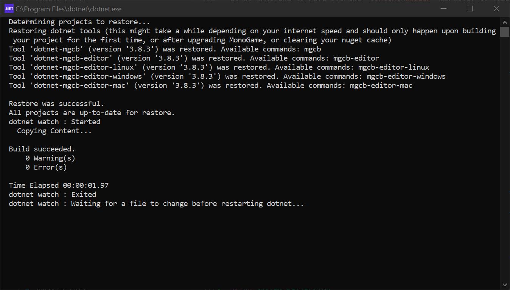
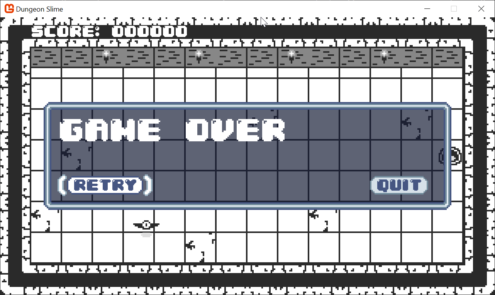

Before we can dive in and start writing shader effects, we should first take a moment to focus on our development environment.

In this chapter, we will build a "hot-reload" system that will automatically detect changes to our shader files, recompile them, and load them into our running game on the fly. Writing shaders is often a highly iterative process, and keeping the cycle time fast is critical to keep development momentum up. By default, MonoGame's shader workflow may feel slow, especially compared to other modern game engines. Imagine you have written 90% of a shader, but to _test_ the shader, you need to:

1. compile the shader,
2. run your game,
3. navigate to the part of your game that _uses_ the shader,
4. and _then_ you need to decide if the shader is working properly.

When you get all the way to step 4, and realize that you accidentally compiled the shader with the wrong variable value, or forgot to call a function, it will be frustrating and it will slow down your development. Now you will need to repeat all of the steps again, and again, as you develop the shader. Worse of all, it takes the fun out of shader development.

A hot-reload system allows you to get to step 4, fix whatever bug appeared, and validate the fix without needing to manually compile a shader, re-run the game, or navigate back to the relevant part of the game. This is a huge time-saver that will let us iterate and experiment with our visual effects much more quickly.

> [!note]
> The hot-reload feature will be enabled during the _development_ of your game, but this system will not allow shaders to be dynamically reloaded in the final built game.

Time to get started!

If you are following along with code, here is the code from the end of the previous tutorial series, [Starting Code](https://github.com/MonoGame/MonoGame.Samples/tree/3.8.4/Tutorials/learn-monogame-2d/src/24-Shaders/)

> [!note]
> This entire chapter is optional. If you just want to skip ahead to shader code, please pick up the code at the start of [Chapter 05: Transition Effect](../05_transition_effect/index.md).

## Compiling Shaders

Our snake-like game already has a shader effect and we can use it to validate the _hot-reload_ system as we develop it. By default, MonoGame compiles the shader from a `.fx` file into a `.xnb` file when the game is compiled. Then, the built `.xnb` file is copied into the game's build directory so it is available to load when the game starts. Our goal is to recompile the `.fx` file, and copy the resulting `.xnb` file whenever the shader is changed. Luckily, we can re-use a lot of the existing capabilities of MonoGame.

### MSBuild Targets

The existing automatic shader compilation is happening because the `DungeonSlime.csproj` file is referencing the `MonoGame.Content.Builder.Task` Nuget package.

[!code-xml[](./snippets/DungeonSlime.csproj?highlight=4)]

Nuget packages can add custom build behaviours and the `MonoGame.Content.Builder.Task` package is adding a step to the game's build that runs the MonoGame Content Builder tool. These sorts of build extensions use a conventional `.prop` and `.target` file system. If you are interested, you can learn more about how Nuget packages may extend MSBuild systems on Microsoft's [documentation website](https://learn.microsoft.com/en-us/visualstudio/msbuild/msbuild?view=vs-2022). For reference, [this](https://github.com/MonoGame/MonoGame/blob/develop/Tools/MonoGame.Content.Builder.Task/MonoGame.Content.Builder.Task.targets#L172) is the `.targets` file for the `MonoGame.Content.Builder.Task`.

This line defines a new MSBuild step, called `IncludeContent`:

[!code-xml[](./snippets/snippet-2-01.xml)]

You can learn more about what all the attributes do in MSBuild. Of particular note, the `BeforeTargets` attribute causes MSBuild to run the `IncludeContent` target before the `BeforeCompile` target is run, which is a standard target in the dotnet sdk.

The `IncludeContent` target can run manually by invoking `dotnet build` by hand. In VSCode, open the embedded terminal to the _DungeonSlime_ project folder, and run the following command:

> [!warning]
> The `dotnet` commands need to be run from the `DungeonSlime` folder, otherwise `dotnet` will not know _which_ project to use.

[!code-sh[](./snippets/snippet-2-02.sh)]

You should see log output indicating that the content for the _DungeonSlime_ game was built.

### Dotnet Watch

There is a tool called [`dotnet watch`](https://learn.microsoft.com/en-us/dotnet/core/tools/dotnet-watch) that comes with the standard installation of `dotnet`. Normally, `dotnet watch` is used to watch for changes to `.cs` code files, recompile, and reload those changes into a program without restarting the program. You can try out `dotnet watch`'s normal behaviour by opening VSCode's embedded terminal to the _DungeonSlime_ project, and running the following command. The game should start normally:

[!code-sh[](./snippets/snippet-2-03.sh)]

> [!Tip]
> Use the `ctrl` + `c` key at the same time to quit the `dotnet watch` terminal process.

Once the game has started, open the `TitleScene.cs` file in the _DungeonSlime_'s "Scenes" folder and comment out the `Clear()` function call in the title screen's `Draw()` method. Save the file, and you should see the title screen immediately stop clearing the background on each frame. If you restore the line and save again, the scene will start clearing the background again:

[!code-csharp[](./snippets/snippet-2-04.cs?highlight=3)]

As we are focusing on only intending to Hot Reload shaders in this tutorial, we do not want to recompile `.cs` files, but rather just the `.fx` files. `dotnet watch` can be configured to execute any MSBuild target rather than just recompile code.  If you want to experiment with also hot-reloading `.cs` files you can, but it is not the focus of this tutorial.

The following command uses the existing target provided by the `MonoGame.Content.Builder.Task`.

[!code-sh[](./snippets/snippet-2-05.sh)]

> [!Tip]
> All arguments passed after the `--` characters are passed to the `build` command itself, not `dotnet watch`:

Now, when you change a _`.fx`_ file, all of the content files are rebuilt into `.xnb` files.

> [!note]
> When you run `dotnet watch`, that is actually short hand for `dotnet watch run`. The `run` command _runs_ your game, but the `build` only _builds_ your program. Going forward, the `dotnet watch build` commands will not start your game, they will just build the content. To learn more, read the official documentation for [`dotnet watch`](https://learn.microsoft.com/en-us/dotnet/core/tools/dotnet-watch).

However, the `.xnb` files are still not being copied from the `Content/bin` folder to _DungeonSlime_'s runtime folder, the `.xnb` files are only copied during the full MSBuild of the game. The `IncludeContent` target on its own does not have all the context it needs to know how to copy the files in the final game project. To solve this, we need to introduce a new `<Target>` that copies the final `.xnb` files into _DungeonSlime_'s runtime folder.

The existing `MonoGame.Content.Builder.Task` system knows what the files are, so we can re-use properties defined in the MonoGame package.

Add this `<Target>` block to your `.csproj` file:

[!code-xml[](./snippets/snippet-2-06.xml)]

Now, instead of calling the `IncludeContent` target directly, change your terminal command to invoke the new `BuildAndCopyContent` target:

[!code-sh[](./snippets/snippet-2-07.sh)]

If you delete the `DungeonSlime/bin/Debug/net8.0/Content` folder, make an edit to a `.cs` file and save, you should see the `DungeonSlime/bin/Debug/net8.0/Content` folder be restored.

> [!note]
> The `DungeonSlime/bin/Debug/net8.0/Content` folder may not appear _immediately_ in your IDE's file view. Sometimes the IDE caches the file system and doesn't notice the file change right away. Try opening the folder in your operating system's file explorer instead.

The next step is to only invoke the target when `.fx` files are edited instead of `.cs` files. These settings can be configured with custom MSBuild item configurations. Open the `DungeonSlime.csproj` file and add this `<ItemGroup>` to specify configuration settings:

[!code-xml[](./snippets/snippet-2-08.xml)]

Now when you re-run the command from earlier, it will only run the `IncludeContent` target when `.fx` files have been changed. All edits to `.cs` files are ignored. Try adding a blank line to the `grayscaleEffect.fx` file, and notice the `dotnet watch` process re-build the content.

However, if you ever use `dotnet watch` for anything else in your workflow, then the configuration settings are too aggressive, because they will be applied _all_ invocations of `dotnet watch`. We need to fix this before moving on, so that `dotnet watch` is not broken for future use cases. The `ItemGroup` can be optionally included when a certain condition is met. We will introduce a new MSBuild property called `OnlyWatchContentFiles`:

[!code-xml[](./snippets/snippet-2-09.xml?highlight=1)]

And now when `dotnet watch` is invoked, it needs to specify the new parameter:

[!code-sh[](./snippets/snippet-2-10.sh)]

The command is getting long and hard to type, and if we want to add more configuration, it will likely get even longer. Instead of invoking `dotnet watch` directly, it can be run as a new `<Target>` MSBuild step. Add this `<Target>` to your `DungeonSlime.csproj` file:

[!code-xml[](./snippets/snippet-2-11.xml)]

And now from the terminal, run the following `dotnet build` command:

[!code-sh[](./snippets/snippet-2-12.sh)]

> [!CAUTION]
> What does `--tl:off` do?
>
> This tutorial series assumes you are using `net8.0`, but theoretically there is nothing stopping you from using later version of `dotnet`. However, in `net9.0`, a [breaking change](https://learn.microsoft.com/en-us/dotnet/core/compatibility/sdk/9.0/terminal-logger) was made to the `dotnet build`'s log output. There is special code that tries to optimize the log output from `dotnet build` so that it does not feel overwhelming to look at. This system is called the _terminal logger_, and sadly it hides the underlying log output from `dotnet watch`. It was _opt-in_ for `net8.0`, but in `net9.0`, it is _enabled_ by default.
>
> **If you are using `net9.0` or above, you _must_ include this option.**
>
> `--tl:off` disables the terminal logger so that the `dotnet watch` log output does not get intercepted by the terminal logger.

We now have a way to dynamically recompile shaders on file changes and copy the `.xnb` files into the game folder! There are a few final adjustments to make to the configuration.

### DotNet Watch, but smarter

First, you may notice some odd characters in the log output after putting the `dotnet watch` inside the `WatchContent` target. This is because there are _emoji_ characters in the standard `dotnet watch` log stream, and some terminals do not understand how to display those, especially when streamed between `dotnet build`. To disable the _emoji_ characters, a `DOTNET_WATCH_SUPPRESS_EMOJIS` environment variable needs to be set:

[!code-xml[](./snippets/snippet-2-13.xml?highlight=3)]

Next, the `IncludeContent` target is doing a little too much work for our use case. It is trying to make sure the MonoGame Content Builder tools are installed. For our use case, we can opt out of that check by disabling the existing `AutoRestoreMGCBTool` MSBuild property. It also makes sense to pass `--restore:false` as well so that Nuget packages are not restored on each content file change:

[!code-xml[](./snippets/snippet-2-14.xml?highlight=2)]

To experiment with the system, re-run the following command:

[!code-sh[](./snippets/snippet-2-15.sh)]

And then cause some sort of compiler-error in the `grayscaleEffect.fx` file, such as adding the line, `"tunafish"` to the top of the file. When you save it, you should see the terminal spit out an error containing information about the compilation failure,

```text
 error X3000: unrecognized identifier 'tunafish'
```

Remove the `"tunafish"` line and save again, and the watch program should log some lines similar to these:

```text
  dotnet watch : Started
    C:/proj/MonoGame.Samples/Tutorials/2dShaders/src/02-Hot-Reload-System/DungeonSlime/Content/effects/grayscaleEffect.fx
    Copying Content...
  
  Build succeeded.
      0 Warning(s)
      0 Error(s)

  Time Elapsed 00:00:01.40
  dotnet watch : Exited
  dotnet watch : Waiting for a file to change before restarting dotnet...

```

## Reload shaders in-game

Now anytime the `.fx` files are modified, they will be recompiled and copied into the game's runtime folder. However, the game itself does not know to _reload_ the `Effect` instances. In this section, we will create a utility to extend the capabilities of the [`ContentManager`](xref:Microsoft.Xna.Framework.Content.ContentManager) to enable it to respond to these dynamic file updates.

It is important to make a distinction between assets the game _expects_ to be reloaded and assets that the game does _not_ care about reloading. This tutorial will demonstrate how to create an explicit system where individual assets opt _into_ being _hot reloadable_, rather than creating a system where all assets automatically handle dynamic reloading.

### Extending Content Manager

Currently, the `grayscaleEffect.fx` is being loaded in the `GameScene` 's `LoadContent()` method like this:

[!code-csharp[](./snippets/snippet-2-16.cs)]

The `.Load()` function in the existing `ContentManager` is almost sufficient for our needs, but it returns a regular `Effect`, which has no understanding of the dynamic nature of the new content workflow.

1. Create a new `Content` folder within the _MonoGameLibrary_ project, add a new file named `ContentManagerExtensions.cs`, and add the following code for the foundation of the new system:

    [!code-csharp[](./snippets/snippet-2-17.cs)]

2. Within this Extension class we will add an [extension method](https://learn.microsoft.com/en-us/dotnet/csharp/programming-guide/classes-and-structs/extension-methods) for the existing `MonoGame`'s `ContentManager` class and give it capabilities it does not currently have:

    [!code-csharp[](./snippets/snippet-2-18.cs)]

3. This new `Watch` function is an opportunity to enhance how content is loaded. Use this new function to load the `_greyscaleEffect` effect in the `GameScene.cs` class `LoadContent()` method:

    [!code-csharp[](./snippets/snippet-2-19.cs)]

4. And finally, adding the `using` statement at the top of the `GameScene` class to let it know where the new extension method we created is located:

    [!code-csharp[](./snippets/snippet-2-19-usings.cs?highlight=9)]

### Setting the correct working path

There are two common ways to run your game as you develop:

- running the game from a terminal by typing `dotnet run`,
- running the game from an IDE.&nbsp;

When you use `dotnet run`, dotnet itself sets the [_working directory_](https://learn.microsoft.com/en-us/dotnet/api/system.io.directory.getcurrentdirectory?view=net-9.0) of the program to the folder that contains your `DungeonSlime.csproj` file. However, many IDEs will set the working directory to be within the `/bin` (output) folder of your project, next to the built `DungeonSlime.dll/exe` file.

The working directory is important, because the `ContentManagerExtensions.cs` class we wrote uses the `manager.RootDirectory` to reassemble content `.xnb` file paths. The `manager.RootDirectory` is derived from the working directory, so if the working directory changes based on how we start the game, our `ContentManagerExtensions.cs` code will produce different `.xnb` paths.

The actual `.xnb` files are copied to the `/bin` subfolder, so at the moment, running the game from the terminal will not work unless you _manually_ specify the working directory. To solve, this we can force the working directory by adding the [`<RunWorkingDirectory>`](https://learn.microsoft.com/en-us/dotnet/core/project-sdk/msbuild-props#runworkingdirectory) property to the `DungeonSlime.csproj` file:

[!code-xml[](./snippets/snippet-2-36.xml?highlight=5)]

### The `WatchedAsset` class

The new system will need to keep track of additional information for each asset that we plan to be _hot-reloadable_, the data will live in a new class, `WatchedAsset<T>`.

1. Add a new file named `WatchedAsset.cs` in the _MonoGameLibrary/Content_ folder and paste the following into the new class:

    [!code-csharp[](./snippets/snippet-2-20.cs)]

2. Next, we need to update the `Watch` method in the _ContentManagerExtensions_ to return a `WatchedAsset<T>` instead of the direct `Effect` it used originally:

    [!code-csharp[](./snippets/snippet-2-21.cs)]

3. Now, any asset that requires hot-reloading, such as the `_greyscaleEffect` in the `GameScene`, also needs to change to use a `WatchedAsset<Effect>` instead of simply an `Effect`:

    [!code-csharp[](./snippets/snippet-2-22.cs)]

    > [!IMPORTANT]
    > This will cause a few compilation errors where the `_greyscaleEffect` is used throughout the rest of the `GameScene`.
    > The compile errors appear because `_greyscaleEffect` used to be an `Effect`, but now the `Effect` is actually available as `_grayscaleEffect.Asset`.

4. To correct the errors found, simply update the `Draw` method of the `GameScene` with the following using the guidance above:

    [!code-csharp[](./snippets/snippet-2-22-draw.cs?highlight=9,12)]

### Reload Extension

It is time to extend the `ContentManagerExtensions` extension method that the game code will use to "opt in" to reloading an asset. From the earlier section, anytime a `.fx` file is updated, the compiled `.xnb` file will be copied into the game's runtime folder, the operating system will keep track of the last time the `.xnb` file was written, and we can leverage that information with the `WatchedAsset<T>.UpdatedAt` property to understand if the `.xnb` file is _newer_ than the current loaded `Effect`.

1. The following `TryRefresh` method will take a `WatchedAsset<T>` and update the inner `Asset` property _if_ the `.xnb` file is newer. The method returns `true` when the asset is reloaded, which will be useful later.
    Add the following method to the `ContentManagerExtensions` class:

    [!code-csharp[](./snippets/snippet-2-23.cs)]

2. Next, at the top of the `Update()` method in the `GameScene` class, add the following line to opt into reloading the `_grayscaleEffect` asset:

    [!code-csharp[](./snippets/snippet-2-24.cs?highlight=3-4)]

3. Now, when the `grayscaleEffect.fx` file is modified, the `dotnet watch` system will compile it to an `.xnb` file, copy it to the game's runtime folder, and then in the `Update()` loop, the `TryRefresh()` method will load the new effect and the new shader code will be running live in the game.

   Try it out by adding this temporary line right before the `return` statement in the `grayscaleEffect.fx` file, make sure the `dotnet build -t:WatchContent --tl:off` is running in the terminal and [start the game in debug](/articles/tutorials/building_2d_games/02_getting_started/index.html?tabs=windows#creating-your-first-monogame-application) as normal:

    [!code-hlsl[](./snippets/snippet-2-25.hlsl?highlight=18-19)]

This video shows the effect changing.

|  |
| :---------------------------------------------------------------------: |
|              **Figure 2-1: The reload system is working**               |

> [!NOTE]
> Make sure to remove the change to the shader, unless you prefer the greyscale background red.

## Final Touches

The _hot reload_ system is almost done, however, there are a few quality of life features to finish up.

### File Locking

There is an edge case in the `TryRefresh()` function that when the `.xnb` file is checked to see if it is more recent than the in-memory asset that it might still be in use (locked) by the MonoGame Content Builder, it may still be _actively_ writing the `.xnb` file when the function runs. The game will fail to read the file while it is being written. The solution to this problem is to simply wait and try loading the `.xnb` file in the next frame. The trick however, is that C# does not have a standard way to check if a file is currently locked.

The best way to check is to simply try and open the file, and if an `Exception` is thrown, assume the file is not readable.

1. To start, add the following function to the `ContentManagerExtensions` class:

    [!code-csharp[](./snippets/snippet-2-26.cs)]

2. Then modify the `TryRefresh` function by returning early if the file is locked:

    [!code-csharp[](./snippets/snippet-2-27.cs?highlight=16-17)]

### Access the old Asset on reload

Anytime a new asset is loaded, the old asset is unloaded from the `ContentManager`. However, it will be helpful to be able to access in-memory data about the old asset version. For shaders, there is metadata and runtime configuration that should be applied to the new version.

This will be more relevant in the next chapter, but let us handle this now:

1. Modify the `TryRefresh` function to contain `out` parameter of the old asset, updating the method signature to the following:

    [!code-csharp[](./snippets/snippet-2-28.cs)]

2. Before updating the `watchedAsset.Asset`, set the `oldAsset` as the previous in-memory asset:

    [!code-csharp[](./snippets/snippet-2-29.cs?highlight=3,24-25)]

3. **Do not** forget that the place where the `grayscaleEffect` calls the `TryRefresh()` function in the `GameScene` class will also need to include a no-op out variable (essentially passing a reference, but we [discard the result](https://learn.microsoft.com/en-us/dotnet/csharp/fundamentals/functional/discards)):

    [!code-csharp[](./snippets/snippet-2-30.cs?highlight=4)]

### Refresh Convenience Function

Finally, we need to address a subtle usability bug in the existing code. The `TryRefresh` function may `Unload` an asset if a new version is loaded. However, it is not obvious that the `ContentManager` instance doing the `Unload` operation is the same `ContentManager` instance that loaded the original asset in the first place.

To solve the possible collision between ContentManager instances, we need to update the following:

1. Add a `ContentManager` property to the `WatchedAsset<T>` class so that the asset itself knows which `ContentManager` is responsible for unloading old versions:

    [!code-csharp[](./snippets/snippet-2-31.cs)]

2. Adjust the `WatchAsset` function of the `ContentManagerExtensions` class to fill in this new property:

    [!code-csharp[](./snippets/snippet-2-32.cs?highlight=9)]

3. Then, in the `TryRefresh` function, a small assertion can be added to validate the `ContentManager` is the same:

    [!code-csharp[](./snippets/snippet-2-33.cs?highlight=5-9)]

    It is annoying to have use the `ContentManager` directly to call `TryRefresh` in the game loop. It would be easier to rely on the new `Owner` property, so let us fix that by adding another Refresh overload to the `WatchedAsset<T>` to just use the manager it is already referencing:

4. Add the following method to the `WatchedAsset<T>` class:

    [!code-csharp[](./snippets/snippet-2-34.cs)]

5. Finally, update the `GameScene` to use the new convenience method to refresh the `_grayscaleEffect` instead:

    [!code-csharp[](./snippets/snippet-2-35.cs?highlight=4)]

### Auto start the watcher

The hot reload system is working, but it has a serious weakness. You have to _remember_ to run the following command before starting development your game if you want the Hot Reload system to function:

[!code-sh[](./snippets/snippet-2-12.sh)]

After you run that command in a terminal, you still need to start your game normally. If you _only_ started the game, but never started the watcher, then your shaders would never be hot reloadable. This kind of error is dangerous because it can undermine trust in the hot reload system itself.

It would be better if the watcher was started automatically when the game is run, so that you only need to do one thing, _run the game_.

1. In the `ContentManagerExtensions.cs` file, add this function to the class:

    [!code-cs[](./snippets/snippet-2-37.cs)]

2. Next add the following `using` statements to the top of the file:

    ```csharp
    using System.Reflection;
    using System.Diagnostics;
    ```

3. Finally, call the new function from the DungeonSlime's `Program.cs` file before starting the game:

    [!code-cs[](./snippets/snippet-2-38.cs?highlight=1)]

Now you do not need to start the watcher manually, instead, you can simply **start the game normally** (either "debug -> Start new instance, or simply `dotnet run`) and the watcher process should appear in the background/another window.

> [!tip]
> If you are running the game via the terminal, and you do _not_ want to start the background content watcher, add the `--no-reload` command line option.
>
> `dotnet run --no-reload`

|  |  |
| :--------------------------------------------------------------------------------------------------: | --------------------------------------------------------------------------: |
|                 **Figure 2-2: The content watcher will appear as a separate window**                 |       **Figure 2-3:  The _DungeonSlime_ game appears as normal**            |

## Conclusion

And with that, we have a powerful hot-reload system in place! In this chapter, you accomplished the following:

- Configured `dotnet watch` to monitor your `.fx` shader files.
- Created a custom MSBuild `<Target>` to automatically recompile and copy your built shaders.
- Wrote a C# wrapper class, `WatchedAsset<T>`, to track asset file changes.
- Extended `ContentManager` with a `TryRefresh` method to load new assets into the running game.

This new workflow is going to make the rest of our journey much more fun and productive. In the next chapter, we will build on this foundation by creating a `Material` class to help us organize and safely interact with our shaders.

You can find the complete code sample for this chapter, [here](https://github.com/MonoGame/MonoGame.Samples/tree/3.8.4/Tutorials/2dShaders/src/02-Hot-Reload-System/).

Continue to the next chapter, [Chapter 03: The Material Class](../03_the_material_class/index.md).
