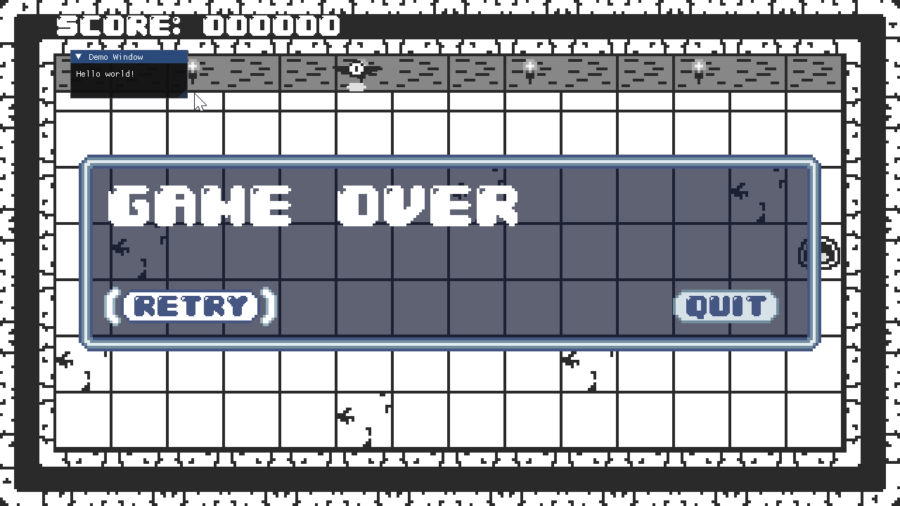
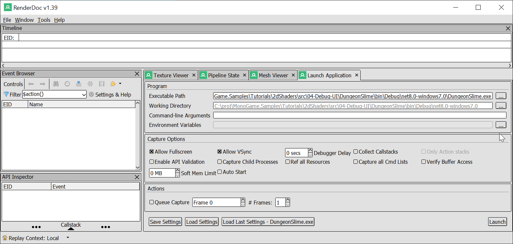
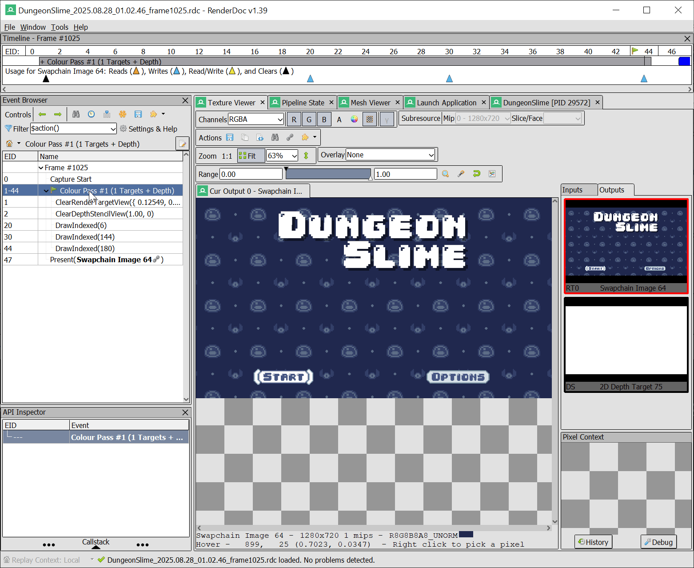

So far, any time we need to adjust a shader's parameter values, we need to edit C# code and recompile. It would be much faster to have a debug UI in the game itself that expose all of the shader parameters as editable text fields and slider widgets. We can also use the sliders to change a shader's input parameter, and visualize the difference in realtime, which is a fantastic way to build intuition about our shader code. 

In this chapter, we will add a popular library called ImGui.NET to create a developer-facing debug UI for our materials. Let's get it set up. 

If you're following along with code, here is the code from the end of the [previous chapter](https://github.com/MonoGame/MonoGame.Samples/tree/3.8.4/Tutorials/2dShaders/src/03-The-Material-Class).

## Adding a Debug UI Library

A common approach to building debug UIs in games is to use an _Immediate Mode_ system. An immediate mode UI redraws the entire UI from scratch every frame. Immediate mode UIs make developing developer-facing debug tools easy. A popular library is called `DearImGui`, which has a dotnet C# port called `ImGui.NET`. 

To add `ImGUI.NET`, add the following Nuget package reference to the _MonoGameLibrary_ project,
```xml
<PackageReference Include="ImGui.NET" Version="1.91.6.1" />
```

In order to render the `ImGui.NET` UI in MonoGame, we need a few supporting classes that convert the `ImGui.NET` data into MonoGame's graphical representation. There is a [sample project](https://github.com/ImGuiNET/ImGui.NET/tree/master/src/ImGui.NET.SampleProgram.XNA) on `ImGui.NET`'s public repository that we can copy for our use cases. 

Create a new folder in the _MonoGameLibrary_ project called _ImGui_ and copy and paste the following files into the folder, 
- The [`ImGuiRenderer.cs`](https://github.com/ImGuiNET/ImGui.NET/blob/v1.91.6.1/src/ImGui.NET.SampleProgram.XNA/ImGuiRenderer.cs)
- The [`DrawVertDeclaration.cs`](https://github.com/ImGuiNET/ImGui.NET/blob/v1.91.6.1/src/ImGui.NET.SampleProgram.XNA/DrawVertDeclaration.cs)

There is `unsafe` code in the `ImGui` code, like this snippet, so you will need to enable `unsafe` code in the `MonoGameLibrary.csproj` file. Add this property.
```xml
<AllowUnsafeBlocks>true</AllowUnsafeBlocks>
```

> [!note]
> Why `unsafe`?
> The unsafe keyword in C# allows code to work directly with memory addresses (pointers). This is generally discouraged for safety reasons, but it's necessary for high-performance libraries. The `ImGuiRenderer` uses pointers to efficiently send vertex data to the GPU.

In order to play around with the new UI tool, we will set up a simple _Hello World_ UI in the main `GameScene`. As we experiment with `ImGui`, we will build towards a re-usable debug UI for future shaders. To get started, we need to have an instance of `ImGuiRenderer`. Similar to how there is a single `static SpriteBatch` , we will create a single `static ImGuiRenderer` to be re-used throughout the game. 

In the `Core.cs` file, add the following property to the `Core` class.

```csharp
/// <summary>  
/// Gets the ImGui renderer used for debug UIs.  
/// </summary>  
public static ImGuiRenderer ImGuiRenderer { get; private set; }
```

And then to initialize the instance, in the `Initialize()` method, add the following snippet,
```csharp
// Create the ImGui renderer.  
ImGuiRenderer = new ImGuiRenderer(this);  
ImGuiRenderer.RebuildFontAtlas();
```

Similar to `SpriteBatch`'s `.Begin()` and `.End()` calls, the `ImGuiRenderer` has a start and end function call. In the `GameScene` class, add these lines to end of the `.Draw()` method.
```csharp
// Draw debug UI
Core.ImGuiRenderer.BeforeLayout(gameTime);  
// draw the debug UI here  
Core.ImGuiRenderer.AfterLayout();
```

`ImGui` draws by adding draggable windows to the screen. To create a simple window that just prints out `"Hello World"`, use the following snippet,
```csharp
// Draw debug UI  
Core.ImGuiRenderer.BeforeLayout(gameTime);  
ImGui.Begin("Demo Window");  
ImGui.Text("Hello world!");  
ImGui.End();  
Core.ImGuiRenderer.AfterLayout();
```

>[!tip]
>Don't forget to add a using statement at the top of the file for `using ImGuiNET;` 



## Building a Material Debug UI

Each instance of `Material` is going to draw a custom debug window. The window will show the latest time the shader was reloaded into the game, which will help demonstrate when a new shader is being used. The window can also show the parameter values for the shader. 

Add the following function to the `Material` class, 
```csharp

[Conditional("DEBUG")]
public void DrawDebug()
{
	ImGui.Begin(Effect.Name);
	
	var currentSize = ImGui.GetWindowSize();
	ImGui.SetWindowSize(Effect.Name, new System.Numerics.Vector2(MathHelper.Max(100, currentSize.X), MathHelper.Max(100, currentSize.Y)));
	
	ImGui.AlignTextToFramePadding();
	ImGui.Text("Last Updated");
	ImGui.SameLine();
	ImGui.LabelText("##last-updated", Asset.UpdatedAt.ToString() + $" ({(DateTimeOffset.Now - Asset.UpdatedAt).ToString(@"h\:mm\:ss")} ago)");

	ImGui.NewLine();


	bool ScalarSlider(string key, ref float value)
	{
		float min = 0;
		float max = 1;
		
		return ImGui.SliderFloat($"##_prop{key}", ref value, min, max);
	}
	
	foreach (var prop in ParameterMap)
	{
		switch (prop.Value.ParameterType, prop.Value.ParameterClass)
		{
			case (EffectParameterType.Single, EffectParameterClass.Scalar):
				ImGui.AlignTextToFramePadding();
				ImGui.Text(prop.Key);
				ImGui.SameLine();
							
				var value = prop.Value.GetValueSingle();
				if (ScalarSlider(prop.Key, ref value))
				{
					prop.Value.SetValue(value);
				}
				break;
			
			case (EffectParameterType.Single, EffectParameterClass.Vector):
				ImGui.AlignTextToFramePadding();
				ImGui.Text(prop.Key);

				var vec2Value = prop.Value.GetValueVector2();
				ImGui.Indent();
				
				ImGui.Text("X");
				ImGui.SameLine();
				
				if (ScalarSlider(prop.Key + ".x", ref vec2Value.X))
				{
					prop.Value.SetValue(vec2Value);
				}
				
				ImGui.Text("Y");
				ImGui.SameLine();
				if (ScalarSlider(prop.Key + ".y", ref vec2Value.Y))
				{
					prop.Value.SetValue(vec2Value);
				}
				ImGui.Unindent();
				break;
			
			case (EffectParameterType.Texture2D, EffectParameterClass.Object):
				ImGui.AlignTextToFramePadding();
				ImGui.Text(prop.Key);
				ImGui.SameLine();

				var texture = prop.Value.GetValueTexture2D();
				if (texture != null)
				{
					var texturePtr = Core.ImGuiRenderer.BindTexture(texture);
					ImGui.Image(texturePtr, new System.Numerics.Vector2(texture.Width, texture.Height));
				}
				else
				{
					ImGui.Text("(null)");
				}
				break;
			
			default:
				ImGui.AlignTextToFramePadding();
				ImGui.Text(prop.Key);
				ImGui.SameLine();
				ImGui.Text($"(unsupported {prop.Value.ParameterType}, {prop.Value.ParameterClass})");
				break;
		}
	}
	ImGui.End();
}
```

Now, run the game observe that the `Saturation` parameter can be seen interpolating from `1` to `0` when the game over screen appears.


However, if you try to interact with the slider to manually set the `Saturation`, your inputs will always be overridden, because the `GameScene` itself keeps setting the value. In order to solve this, we can introduce a custom property in the `Material` class that causes the debug UI to override the various `SetParameter()` methods. 

First, add this new boolean to the `Material` class.

```csharp
public bool DebugOverride;
```

Then, modify all of the `SetParameter()` methods to exit early when the `DebugOverride` variable is set to `true`. 
```csharp
public void SetParameter(string name, float value)
{
	if (DebugOverride) return;

	if (TryGetParameter(name, out var parameter))
	{
		parameter.SetValue(value);
	}
	else
	{
		Console.WriteLine($"Warning: cannot set shader parameter=[{name}] because it does not exist in the compiled shader=[{Asset.AssetName}]");
	}
}
```

Then, in the `DebugDraw()` method, after the `LastUpdated` field gets drawn, add this following,

```csharp
ImGui.AlignTextToFramePadding();  
ImGui.Text("Override Values");  
ImGui.SameLine();  
ImGui.Checkbox("##override-values", ref DebugOverride);
```

Now, when you run the game, you can enable the `"Override Values"` checkbox to be able to set the `Saturation` value by hand. 


### Turning it off

As the number of shaders and `Material` instances grows throughout the rest of the tutorial series, it will become awkward to manage drawing all of the debug UIs manually like the `_grayscaleEffect`'s UI is being drawn. Rather, it would be good to have a single function that would draw all of the debug UIs at once. Naturally, it would not make sense to draw _every_ `Material`'s debug UI, so the `Material` class needs a setting to decide if the debug UI should be drawn or not. 

We will keep track of all the `Material` instances to draw as a `static` variable inside the `Material` class itself. 

```csharp
// materials that will be drawn during the standard debug UI pass.  
private static HashSet<Material> s_debugMaterials = new HashSet<Material>();
```

Now we can add a `boolean` property to the `Material` class that adds or removes the given instance to the `static` set. 
```csharp
/// <summary>
/// Enable this variable to visualize the debugUI for the material
/// </summary>
public bool IsDebugVisible
{
	get
	{
		return s_debugMaterials.Contains(this);
	}
	set
	{
		if (IsDebugVisible)
		{
			s_debugMaterials.Remove(this);
		}
		else
		{
			s_debugMaterials.Add(this);
		}
	}
}
```

To finish off the edits to the `Material` class, add a method that actually renders all of the `Material` instances in the `static` set. 
```csharp
[Conditional("DEBUG")]
public static void DrawVisibleDebugUi(GameTime gameTime)
{
	// first, cull any materials that are not visible, or disposed. 
	var toRemove = new List<Material>();
	foreach (var material in s_debugMaterials)
	{
		if (material.Effect.IsDisposed)
		{
			toRemove.Add(material);
		}
	}

	foreach (var material in toRemove)
	{
		s_debugMaterials.Remove(material);
	}
	
	Core.ImGuiRenderer.BeforeLayout(gameTime);
	foreach (var material in s_debugMaterials)
	{
		material.DrawDebug();
	}
	Core.ImGuiRenderer.AfterLayout();
}
```

Now in the `Core`'s `Draw` method, we just need to call the new method. We should also delete the old code in the `GameScene` to draw the `_grayscaleEffect`'s debugUI as a one-shot. 
```csharp
protected override void Draw(GameTime gameTime)
{
	// If there is an active scene, draw it.
	if (s_activeScene != null)
	{
		s_activeScene.Draw(gameTime);
	}

	Material.DrawVisibleDebugUi(gameTime);
	
	base.Draw(gameTime);
}
```

Finally, in order to render the debug UI for the `_grayscaleEffect`, just enable the `IsDebugVisible` property to `true`. 
```csharp
// Load the grayscale effect
_grayscaleEffect = Content.WatchMaterial("effects/grayscaleEffect");
_grayscaleEffect.IsDebugVisible = true;
```

>[!tip]
>If you don't want to see the debug UI for the `grayscaleEffect` anymore, just delete the line of code that sets `IsDebugVisible` to `true`. 


## RenderDoc

The debug UI in the game is helpful, but sometimes you may need to take a closer look at the actual graphics resources _MonoGame_ is managing. There are various tools that intercept the graphics API calls between an application and the graphics software. [_RenderDoc_](https://renderdoc.org/) is a great example of a graphics debugger tool. Unfortunately, it only works with MonoGame when the game is targeting the WindowsDX profile. It may not be possible to switch your game to WindowsDX under all circumstances. At this time, there are very few options for graphic debuggers tools for MonoGame when targeting openGL. 

### Switch to WindowsDX

To switch _DungeonSlime_ to target WindowsDX, you need to modify the `.csproj` file, and make some changes to the `.mgcb` content file. 
First, in the `.csproj` file, remove the reference to MonoGame's openGL backend,
```xml
<PackageReference Include="MonoGame.Framework.DesktopGL" Version="3.8.*" />
```

And replace it with this line, 
```xml
<PackageReference Include="MonoGame.Framework.WindowsDX" Version="3.8.*" />
```

The [`MonoGame.Framework.WindowsDX`](https://www.nuget.org/packages/MonoGame.Framework.WindowsDX) Nuget package is not available for the `net8.0` framework. Instead, it is only available specifically on the Windows variant, called `net8.0-windows7.0`. Change the `<TargetFramework>` in your `.csproj` to the new framework,
```xml
<TargetFramework>net8.0-windows7.0</TargetFramework>
```

Next, the `Content.mgcb` file, update the target platfrom from `DesktopGL` to `Windows`, 
```
/platform:Windows
```

And finally, RenderDoc only works when MonoGame is targeting the `HiDef` graphics profile. This needs to be changed in two locations. First, in the `.mgcb` file, change the `/profile` from `Reach` to `HiDef`. 
```
/profile:HiDef
```

Then, in the `Core` constructor, set the graphics profile immediately after constructing the `Graphics` instance.
```csharp
// Create a new graphics device manager.
Graphics = new GraphicsDeviceManager(this);
Graphics.GraphicsProfile = GraphicsProfile.HiDef;
```

### Using RenderDoc

Make sure you have built _DungeonSlime_. You can build it manually by running the following command from the _DungeonSlime_ directory,
```sh
dotnet build
```

Once you have downloaded [RenderDoc](https://renderdoc.org/), open it. Go to the _Launch Application_ tab, and select your built executable for the _Executable Path_. For example, the path may look similar to the following, 

```sh
C:\proj\MonoGame.Samples\Tutorials\2dShaders\src\04-Debug-UI\DungeonSlime\bin\Debug\net8.0-windows7.0\DungeonSlime.exe
```



Then, click the _Launch_ button in the lower right. _DungeonSlime_ should launch with a small warning text in the upper left of the game window that states the graphics API is being captured by RenderDoc. 

Press `F12` to capture a frame, and it will appear in RenderDoc. Double click the frame to open the captured frame, and go to the _Texture Viewer_ tab. The draw calls are split out one by one and you can view the intermediate buffers. 



RenderDoc is a powerful tool. To learn more about how to use the tool, please refer to the [RenderDoc Documentation](https://renderdoc.org/docs/index.html).

## Conclusion

What a difference a good tool makes! In this chapter, you accomplished the following:

- Integrated the `ImGui.NET` library into a MonoGame project.
- Created a reusable `ImGuiRenderer` to draw the UI.
- Built a dynamic debug window for our `Material` class.
- Learned how to use a graphics debugger like RenderDoc to inspect the frame.

With our workflow and tooling in place, it's finally time to write some new shaders. Up next, we'll dive into our first major pixel shader effect and build a classic screen wipe transition! 

You can find the complete code sample for this chapter, [here](https://github.com/MonoGame/MonoGame.Samples/tree/3.8.4/Tutorials/2dShaders/src/04-Debug-UI). 

Continue to the next chapter, [Chapter 05: Transition Effect](../05_transition_effect/index.md)