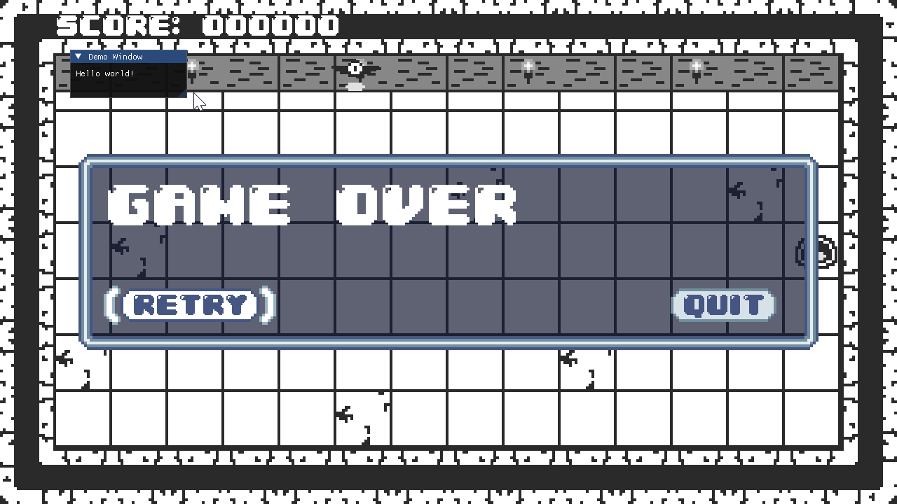
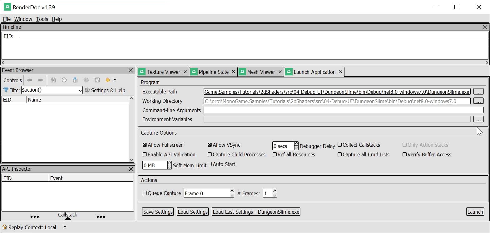
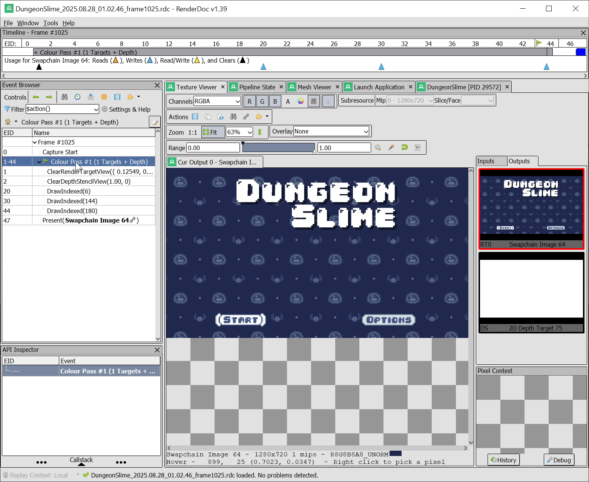

So far, any time we need to adjust a shader's parameter values, we need to edit C# code and recompile. It would be much faster to have a debug user interface (UI) in the game itself that exposes all of the shader parameters as editable text fields and slider widgets. We can also use the sliders to change a shader's input parameter and visualize the difference in realtime, which is a fantastic way to build intuition about our shader code.

In the previous tutorial series, you set up a UI using the [GUM framework](https://docs.flatredball.com/gum/code/monogame). GUM is a powerful tool that works wonderfully for player facing UI. However, for the debug UI we will develop in this chapter, we will bring in a second UI library called `ImGui.NET`. The two libraries will not interfere with one another, and each one works well for different use cases. `ImGui.NET` is great for rapid iteration speed and building _developer_ facing UI. The existing GUM based UI has buttons and sliders that look and feel like they belong in the _Dungeon Slime_ world. The `ImGui.NET` UI will look more like an admin console in your game. Despite the lack of visual customization, `ImGui.NET` is easy and _quick_ to write, which makes it perfect for our developer facing debug UI.

If you are following along with code, here is the code from the end of the [previous chapter](https://github.com/MonoGame/MonoGame.Samples/blob/3.8.5/Tutorials/2dShaders/src/03-The-Material-Class).

## Adding a Debug UI Library

A common approach to building debug UIs in games is to use an _Immediate Mode_ system. An immediate mode UI redraws the entire UI from scratch every frame. `ImGui.NET` is a popular choice for MonoGame. It is a port of a C++ library called `DearImGui`.

To add `ImGui.NET`, add the following Nuget package reference to the _MonoGameLibrary_ project:

[!code-xml[](./snippets/snippet-4-01.xml?highlight=5)]

In order to render the `ImGui.NET` UI in MonoGame, we need a few supporting classes that convert the `ImGui.NET` data into MonoGame's graphical representation.

> [!note]
> There is a [sample project](https://github.com/ImGuiNET/ImGui.NET/tree/master/src/ImGui.NET.SampleProgram.XNA) on `ImGui.NET`'s public repository that we can copy for our use cases.

Create a new folder in the _MonoGameLibrary_ project called `ImGui` and copy and paste the following files into the folder,

> [!IMPORTANT]
> These files are on a GitHub repository, so you **CANNOT** just "right-click - save as" to download them.  Follow the links and then select the **"download raw file"** button in the upper-right of the file view.

- The [`ImGuiRenderer.cs`](https://github.com/ImGuiNET/ImGui.NET/blob/v1.91.6.1/src/ImGui.NET.SampleProgram.XNA/ImGuiRenderer.cs)
- The [`DrawVertDeclaration.cs`](https://github.com/ImGuiNET/ImGui.NET/blob/v1.91.6.1/src/ImGui.NET.SampleProgram.XNA/DrawVertDeclaration.cs)

There is `unsafe` code in the `ImGui` codebase, like this snippet, so you will need to enable `unsafe` code in the `MonoGameLibrary.csproj` file. Add this property:

[!code-xml[](./snippets/snippet-4-02.xml?highlight=4)]

> [!note]
> Why `unsafe`?
> The unsafe keyword in C# allows code to work directly with memory addresses (pointers). This is generally discouraged for safety reasons, but it is necessary for high-performance libraries. The `ImGuiRenderer` uses pointers to efficiently send vertex data to the GPU.

In order to play around with the new UI tool, we will set up a simple _Hello World_ UI in the main `GameScene`. As we experiment with `ImGui`, we will build towards a re-usable debug UI for future shaders.

To get started, we need to have an instance of `ImGuiRenderer`. Similar to how there is a single `static SpriteBatch`, we will create a single `static ImGuiRenderer` to be re-used throughout the game.

1. In the `Core.cs` file of the `MonoGameLibrary` project, add the following `using` statements at the top of the `Core.cs` file to get access to ImGui:

    ```csharp
    using ImGuiNET;
    using ImGuiNET.SampleProgram.XNA;
    ```

    > [!NOTE]
    > If you see red squiggles on either using statement, remove them, build the project and try again to ensure there are no build issues with the project and the nuget package for ImGui has been cached for the project.

2. Then, add the following property to the `Core` class:

    [!code-csharp[](./snippets/snippet-4-03.cs)]

3. Then to initialize the instance, in the `Initialize()` method, add the following snippet:

    [!code-csharp[](./snippets/snippet-4-04.cs?highlight=18-20)]

4. Similar to `SpriteBatch`'s `.Begin()` and `.End()` calls, the `ImGuiRenderer` has a start and end function call. In the `GameScene` class, add these lines to end of the `.Draw()` method:

    [!code-csharp[](./snippets/snippet-4-05.cs?highlight=9-12)]

5. `ImGui` draws by adding draggable windows to the screen. To create a simple window that just prints out `"Hello World"`, use the following snippet between the `BeforeLayout` and `AfterLayout` calls:

    [!code-csharp[](./snippets/snippet-4-06.cs?highlight=8-10)]

When you run your `DungeonSlime` project, you should get a new "Debug" window as shown below:

|  |
| :----------------------------------------------------------------: |
|               **Figure 4-1: a simple ImGui window**                |

## Building a Material Debug UI

Each instance of `Material` is going to draw a custom debug window. The window will show the latest time the shader was reloaded into the game, which will help demonstrate when a new shader is being used. The window can also show the parameter values for the shader.

1. Add the following `using` statements to the top of the `Material.cs` file in the `Graphics` folder:

    ```csharp
    using ImGuiNET;
    ```

2. And then add the following function to the `Material` class:

    [!code-csharp[](./snippets/snippet-4-07.cs)]

    Currently however, the control is not fully bound to the `Saturation` parameter of the `grayscale` shader, inputs will always be overridden because the `GameScene` itself keeps setting the value. In order to solve this, we introduce a custom property in the `Material` class that causes the debug UI to override the various `SetParameter()` methods.

3. Next, add this new boolean to the `Material` class:

    [!code-csharp[](./snippets/snippet-4-08.cs)]

4. Then, modify **ALL** of the `SetParameter()` methods (float, matrix, vector2, etc) to exit early when the `DebugOverride` variable is set to `true`:

    [!code-csharp[](./snippets/snippet-4-09.cs?highlight=3)]

5. Then, in the `DrawDebug()` method, after the `LastUpdated` field gets drawn, add this following:

    [!code-csharp[](./snippets/snippet-4-10.cs?highlight=14-17)]

### Turning it off

As the number of shaders and `Material` instances grows throughout the rest of the tutorial series, it will become awkward to manage drawing all of the debug UIs manually like the `_grayscaleEffect`'s UI is being drawn. Rather, it would be better to have a single function that would draw all of the debug UIs at once. Naturally, it would not make sense to draw _every_ `Material`'s debug UI, so the `Material` class needs a setting to decide if the debug UI should be drawn or not.

We will keep track of all the `Material` instances to draw as a [`static`](https://learn.microsoft.com/en-us/dotnet/csharp/language-reference/keywords/static) variable inside the `Material` class itself.

> [!NOTE]
> [Static](https://learn.microsoft.com/en-us/dotnet/csharp/language-reference/keywords/static) classes are a useful feature to use when you need something to be accessible globally, meaning there can only ever be one.  In the case of the `Material` class, we are adding a collection which will be the same collection no matter how many different Material definitions are running in the project.  But remember, with great power comes great responsibility, Statics should be carefully considered before use as they can also be a trap if used incorrectly.

1. First, add the following at the top of the `Material.cs` class:

    [!code-csharp[](./snippets/snippet-4-11.cs)]

2. Now, add a `boolean` property to the `Material` class, which adds or removes the given instances to the `static` set:

    [!code-csharp[](./snippets/snippet-4-12.cs)]

3. To finish off the edits to the `Material` class, add a method that actually renders all of the `Material` instances in the `static` set, consuming the `DrawDebug` method we created earlier:

    [!code-csharp[](./snippets/snippet-4-13.cs)]

4. Now in the `Core` class's `Draw` method, we need to call the new method in order to render the new Debug UI. And also delete the old ImGui test code used in the `GameScene` to draw the `_grayscaleEffect`'s debugUI. Replace the "entire" `Draw` method with the following version:

    [!code-csharp[](./snippets/snippet-4-14.cs?highlight=9)]

    > [!NOTE]
    > The highlighted line is showing the new call for drawing the debug material renderers instead of the test ImGui code we had previously.

5. The `Core` class does not yet know about the `Material` class, so we will need to add an additional using to the top of the class:

    ```csharp
    using MonoGameLibrary.Graphics;
    ```

    > [!TIP]
    > To keep things clean, you can also remove the old `using ImGuiNET;` as you will see it is now greyed out because it is not used anymore since we removed the test `ImGui` drawing code.

6. Finally, in order to render the debug UI for the `_grayscaleEffect`, just enable the `IsDebugVisible` property to `true` in the `LoadContent` method of the `GameScene` class:

    [!code-csharp[](./snippets/snippet-4-15.cs?highlight=3)]

Now, when you run the game, you can see the debug window with the `Saturation` value as expected. If you enable the `"Override Values"` checkbox, you will also be able set the value by hand while the game is running (without setting it, the game has control, but still useful to see).

| <video autoplay loop muted style="max-width: 100%; height: auto;" aria-label="Figure 4-2: Shader parameters shown while game is running"><source src="./videos/debug-shader-ui.mp4" type="video/mp4"></video> |
| :-----------------------------------------------------------------------------: |
|                **Figure 4-2: Shader parameters shown while game is running**                 |

>[!tip]
>If you do not want to see the debug UI for the `grayscaleEffect` anymore, just set `IsDebugVisible` to `false`, or delete the line entirely.

### (Optional) DPI Scaling

If the Debug UI is too small on your screen, you can add the following snippet to `Core`'s `Initialize()` method. Adjust the floating point values as necessary to fit your preferences.

[!code-csharp[](./snippets/snippet-4-22.cs?highlight=9-12)]

## RenderDoc

The debug UI in the game is helpful, but sometimes you may need to take a closer look at the actual graphics resources _MonoGame_ is managing. There are various tools that intercept the graphics API calls between an application and the graphics software. [_RenderDoc_](https://renderdoc.org/) is a great example of a graphics debugger tool. Unfortunately, it only works with MonoGame when the game is targeting the WindowsDX profile. It may not be possible to switch your game to WindowsDX under all circumstances. At this time, there are very few options for graphic debuggers tools for MonoGame when targeting openGL.

### Switch to WindowsDX

To switch _DungeonSlime_ to target WindowsDX, you need to modify the `.csproj` file, and make some changes to the `.mgcb` content file.

1. First, in the `.csproj` file, remove the reference to MonoGame's openGL backend:

    [!code-xml[](./snippets/snippet-4-16.xml)]

    And replace it with this line:

    [!code-xml[](./snippets/snippet-4-17.xml)]

2. The [`MonoGame.Framework.WindowsDX`](https://www.nuget.org/packages/MonoGame.Framework.WindowsDX) Nuget package is not available for the `net9.0` framework. Instead, it is only available specifically on the Windows variant, called `net9.0-windows`. Change the `<TargetFramework>` in your `.csproj` to the new framework:

    [!code-xml[](./snippets/snippet-4-18.xml)]

3. Next, in the `Content.mgcb` file, update the target platform from `DesktopGL` to `Windows`,

    ```text
    /platform:Windows
    ```

4. RenderDoc only works when MonoGame is targeting the `HiDef` graphics profile. This needs to be changed in two locations. First, in the `.mgcb` file, change the `/profile` from `Reach` to `HiDef`.

    ```text
    /profile:HiDef
    ```

5. Finally, in the `Core` constructor, set the graphics profile immediately after constructing the `Graphics` instance:

    [!code-csharp[](./snippets/snippet-4-19.cs)]

> [!IMPORTANT]
> The rest of this tutorial series assumes you are using the _DesktopGL_ configuration. After you are done experimenting with RenderDoc using `WindowsDX`, please switch the project back to _DesktopGL_.
>
> If you want to see how a project can be built for both _DesktopGL_ and _WindowsDX_ at the same time, check out the `mgblank2dstartkit` (MonoGame Blank 2D Starter Kit) MonoGame template.
>
> The _WindowsDX_ format should work for _most_ of this tutorial, except for chapter 9 (shadows) which needs a bit of extra complexity to work due to the complexities in building cross-platform shaders.

### Using RenderDoc

Make sure you have built _DungeonSlime_. You can build it manually by running the following command from the _DungeonSlime_ directory:

[!code-sh[](./snippets/snippet-4-20.sh)]

Once you have downloaded [RenderDoc](https://renderdoc.org/), open it and Go to the _Launch Application_ tab, then select your built executable in the _Executable Path_.

For example, the path may look similar to the following:

[!code-sh[](./snippets/snippet-4-21.sh)]

|  |
| :------------------------------------------------------------------: |
|               **Figure 4-3: The setup for RenderDoc**                |

Then, click the _Launch_ button in the lower right. _DungeonSlime_ should launch with a small warning text in the upper left of the game window that states the graphics API is being captured by RenderDoc.

| <video autoplay loop muted style="max-width: 100%; height: auto;" aria-label="Figure 4-4: Renderdoc analysing and capturing frames"><source src="./videos/renderdoc-capture.mp4" type="video/mp4"></video> |
| :-----------------------------------------------------------------------------: |
|                **Figure 4-4: Renderdoc analysing and capturing frames**                 |

Press `F12` to capture a frame (as shown above), and it will appear in RenderDoc. In RenderDoc, Double click the frame to open the captured frame, and go to the _Texture Viewer_ tab. The draw calls are split out one by one and you can view the intermediate buffers.

> [!NOTE]
> You **MUST** have the game in focus to capture frames, as the target window has to be selected in order to capture frames.  If you have the RenderDoc window in focus, nothing will happen.

|  |
| :---------------------------------------------------------------------------: |
|            **Figure 4-5: RenderDoc shows the intermediate frame**             |

From here, you can better understand how rendering is working in your game, especially if you are having performance or graphical issues.  It is a bit beyond the scope of this tutorial to go into the deep details, for now you can just examine it to get used to the tool.

> [!TIP]
> RenderDoc is a powerful tool. To learn more about how to use the tool, please refer to the [RenderDoc Documentation](https://renderdoc.org/docs/index.html).

## Conclusion

What a difference a good tool makes! In this chapter, you accomplished the following:

- Integrated the `ImGui.NET` library into a MonoGame project.
- Created a reusable `ImGuiRenderer` to draw the UI.
- Built a dynamic debug window for our `Material` class.
- Learned how to use a graphics debugger like RenderDoc to inspect frames.

With our workflow and tooling in place, it is finally time to write some new shaders. Up next, we will dive into our first major pixel shader effect and build a classic screen wipe transition!

You can find the [complete code sample for this chapter - here](https://github.com/MonoGame/MonoGame.Samples/blob/3.8.5/Tutorials/2dShaders/src/04-Debug-UI/).

Continue to the next chapter, [Chapter 05: Transition Effect](../05_transition_effect/index.md).
