Our game is functional, but the jump from the title screen to the game is very sudden. We can make it feel much more polished with a smooth transition instead of an instant cut.

In this chapter, we'll dive into our first major pixel shader effect: a classic screen wipe! We'll learn how to control an effect over the whole screen, how to create soft edges, and how to use textures to drive our shader logic to create all sorts of interesting patterns. 

If you're following along with code, here is the code from the end of the [previous chapter](https://github.com/MonoGame/MonoGame.Samples/tree/3.8.4/Tutorials/2dShaders/src/04-Debug-UI).


## The Scene Transition Effect

At the moment, the scene transitions between the `TitleScene` to the `GameScene` are non-existent. The game immediately jumps from rendering one scene to rendering the other scene. Instant loading is great, but it can be jarring for the player. A common approach to blending between scenes is to use a [Screen Wipe](https://www.youtube.com/watch?v=8NAhAEQUk8M), where a pattern fades across the screen as the new scene is revealed. We will create a screen wipe effect by writing a custom shader.

### Getting Started

Start by creating a new `Sprite Effect` from the MonoGame Content Builder Editor, and name it `sceneTransitionEffect.fx`. 

Add the following variable to the `Core` class. 
```csharp
/// <summary>  
/// The material that is used when changing scenes  
/// </summary>  
public static Material SceneTransitionMaterial { get; private set; }
```


Add an override for the `LoadContent` method, and load the `sceneTransitionEffect.fx` file into a `Material`. 
```csharp
protected override void LoadContent()  
{  
    base.LoadContent();  
    SceneTransitionMaterial = Content.WatchMaterial("effects/sceneTransitionEffect.fx");  
}
```

Make sure to call the `Core`'s version of `LoadContent()` from the `Game1` class. In the previous tutorial, the method was left without calling the base method.
```csharp
protected override void LoadContent()  
{  
    // Allow the Core class to load any content.  
    base.LoadContent();  
    // Load the background theme music  
    _themeSong = Content.Load<Song>("audio/theme");  
}
```

To benefit from hot-reload, we need to update the effect in the `Core`'s `Update()` loop.
```csharp
// Check if the scene transition material needs to be reloaded.  
SceneTransitionMaterial.Update();
```

And as we develop the effect, enable the debug UI.
```csharp
SceneTransitionMaterial.IsDebugVisible = true;
```

If you run the game now, you should have a blank debug UI.
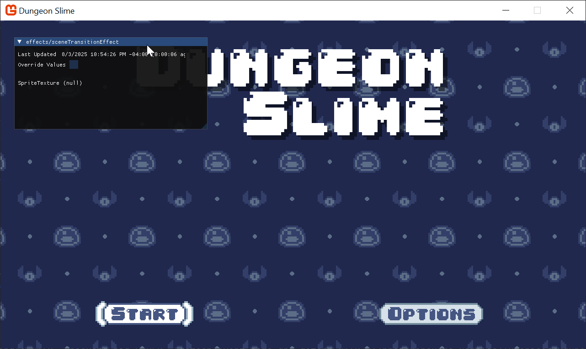

### Rendering the Effect

Currently, the shader is compiling and loading into the game, but it isn't being _used_ yet. The scene transition needs to cover the whole screen, so we need to draw a sprite over the entire screen area with the new effect. To render a sprite over the entire screen area, we need a blank texture to use for the sprite. Add the following property to the `Core` class, 
```csharp
/// <summary>  
/// Gets a runtime generated 1x1 pixel texture.  
/// </summary>  
public static Texture2D Pixel { get; private set; }
```

And initialize it in the `Initialize()` method.
```csharp
// Create a 1x1 white pixel texture for drawing quads.  
Pixel = new Texture2D(GraphicsDevice, 1, 1);  
Pixel.SetData(new Color[]{ Color.White });
```

The `Pixel` property is a texture we can re-use for many effects, and it is helpful to have for debugging purposes. 

In the `Core'`s `Draw()` method, use the `SpriteBatch` to draw a full screen sprite using the `Pixel` property. Make sure to put this code after the `s_activeScene` is drawn, because the scene transition effect should _cover_ whatever was rendered from the current scene.
```csharp
// Draw the scene transition quad  
SpriteBatch.Begin(effect: SceneTransitionMaterial.Effect);  
SpriteBatch.Draw(Pixel, GraphicsDevice.Viewport.Bounds, Color.White);  
SpriteBatch.End();
```

If you run the game now, you will see a white background, because the `Pixel` sprite is rendering on top of the entire scene.
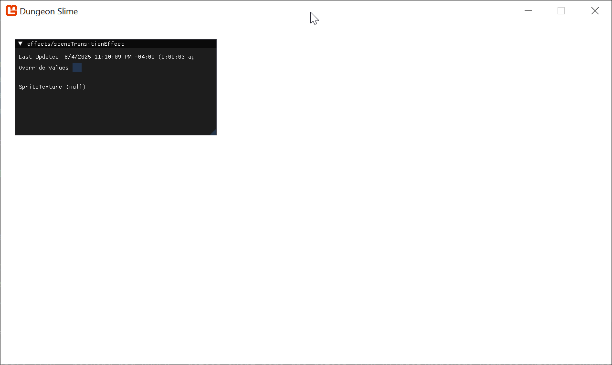

### The Input 

We need to be able to control the progress of the screen transition effect. Add the following parameter to the shader, 
```hlsl
float Progress;
```

And recall that unless the `Progress` parameter is actually _used_ somehow in the calculation of the output of the shader, it will be optimized out of the final compilation. So, for now, lets make the shader return the `Progress` value in the red value of the color. 
```hlsl
#if OPENGL  
    #define SV_POSITION POSITION  
    #define VS_SHADERMODEL vs_3_0  
    #define PS_SHADERMODEL ps_3_0  
#else  
    #define VS_SHADERMODEL vs_4_0_level_9_1  
    #define PS_SHADERMODEL ps_4_0_level_9_1  
#endif  
  
Texture2D SpriteTexture;  
  
float Progress;  
  
sampler2D SpriteTextureSampler = sampler_state  
{  
    Texture = <SpriteTexture>;  
};  
  
struct VertexShaderOutput  
{  
    float4 Position : SV_POSITION;  
    float4 Color : COLOR0;  
    float2 TextureCoordinates : TEXCOORD0;  
};  
  
float4 MainPS(VertexShaderOutput input) : COLOR  
{  
    return float4(Progress, 0, 0, 1);  
}  
  
  
technique SpriteDrawing  
{  
    pass P0  
    {  
        PixelShader = compile PS_SHADERMODEL MainPS();  
    }  
};
```

Now you can use the slider in the debug UI to visualize the `Progress` parameter as the red channel. 
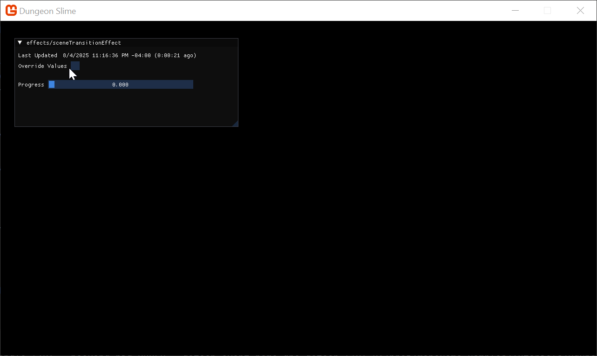

### Coordinate Space

If we are making a screen wipe, then parts of the screen will be transitioning before other parts of the screen. The shader will affect the screen based on the coordinate of the pixel on the screen. For example, if we wanted to make a horizontal screen wipe, we would need to know the x-coordinate of each pixel. With the x-coordinate of a pixel, the shader could decide if that pixel should be shown or hidden based on the transition's progress parameter. 

The shader actually provides the x-coordinate of each pixel in the `input.TextureCoordinates` structure. 

>[!TIP] 
> `input.TextureCoordinates` are not _actually_ the pixel coordinates
> 
> In this example, the `input.TextureCoordinates` represents pixel coordinates _because_ the sprite is being drawn as a full screen quad. However, if the sprite was not taking up the entire screen, the texture coordinates would behave differently. This topic will be discussed more later on.

The following shader helps visualize the x-coordinate of each pixel. 
```hlsl
float2 uv = input.TextureCoordinates;  
return float4(uv.x, 0, 0, 1);
```

That results in this image, where the left edge has an x-coordinate of `0`, it has no red value, and where the right edge has an x-coordinate of `1`, the image is fully red. In the middle of the image, the red value interpolates between `0` and `1`. 
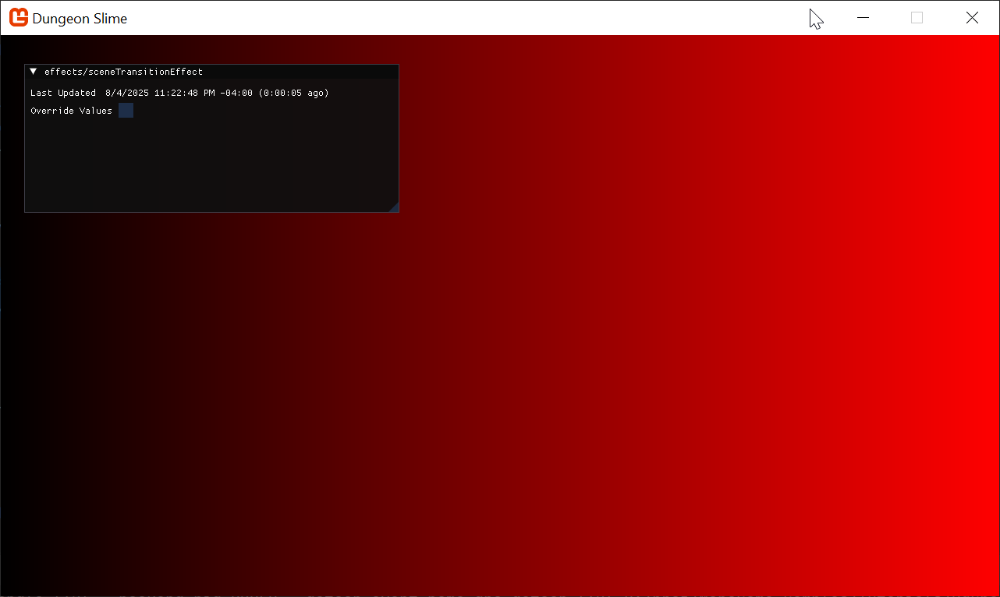

The same pattern holds true for the y-coordinate. Observe the following shader code putting the y-coordinate of each pixel in the green channel.

```hlsl
float2 uv = input.TextureCoordinates;  
return float4(0, uv.y, 0, 1);
```

As you can see, the top of the screen has a `0` value for the y-coordinate, and the bottom of the screen has a `1`. 


When these shaders are combined, the resulting image is the classic UV texture coordinate space.

```hlsl
float2 uv = input.TextureCoordinates;  
return float4(uv.x, uv.y, 0, 1);
```

>[!TIP] 
> Remember that MonoGame uses the top of the image for y=0. 
> 
> Other game engines treat the _bottom_ of the image as y=0, but MonoGame uses the top of the image for where y is 0. 

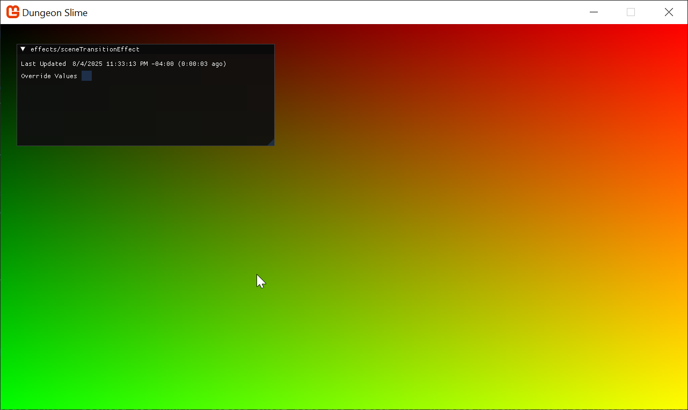

### Simple Horizontal Screen Wipe

Now that you have a visualization of the coordinate space, we can build some intuition for a screen wipe. To start, imagine creating a horizontal screen wipe, where the image turns to black from left to right. Remember that the x-coordinate goes from `0` on the left edge to `1` on the right edge. We can re-introduce the `Progress` parameter and compare the values. If the `Progress` parameter is greater than the x-coordinate, then that part of the image should transition. 

In the following shader code, the blue channel of the final image represents in that coordinate should be in the transitioned state.

```hlsl
float2 uv = input.TextureCoordinates;  
float transitioned = Progress > uv.x;  
return float4(0, 0, transitioned, 1);
```

Use the slider to control the `Progress` parameter to see how the image changes. 
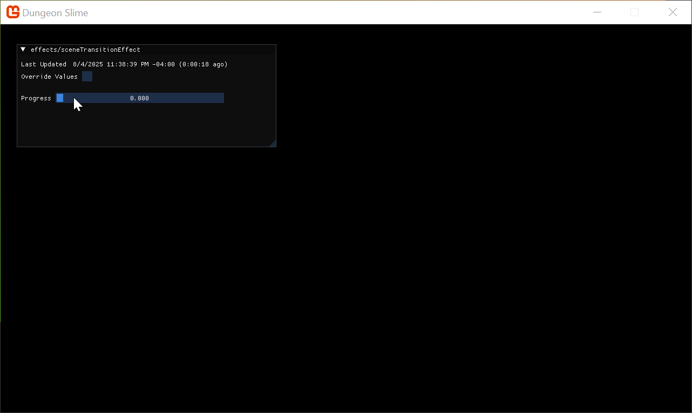

That looks pretty close to a screen wipe,  already! Instead of using blue and black, the effect should be using black and a transparent color. The following snippet of shader code puts the `transitioned` value in the alpha channel of the final color. When the alpha value is zero, the pixel fragment is drawn as invisible. 

```hlsl
float2 uv = input.TextureCoordinates;  
float transitioned = Progress > uv.x;  
return float4(0, 0, 0, transitioned);
```

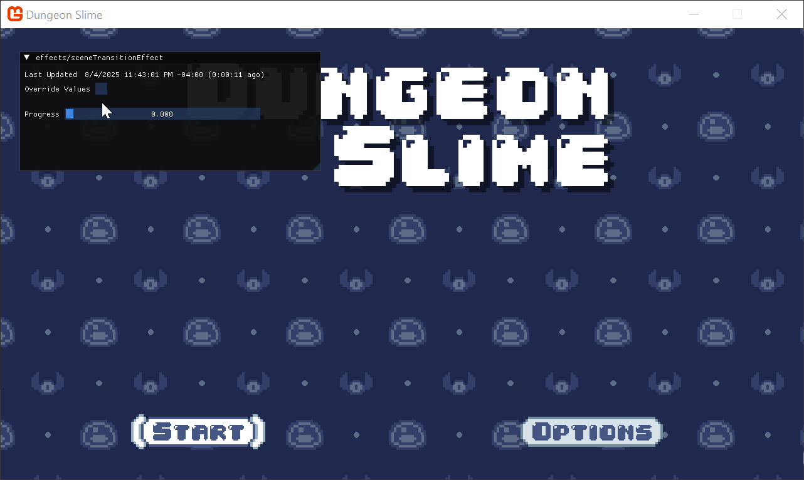

The transition works, but the edge between black and transparent is hard. Often in screen wipes, the transition has a smooth edge. The reason the current shader has a hard edge is because the `transitioned` variable is either `0` or `1` depending on the outcome of the `Progress > uv.x;` expression. 
Ideally, it would be nice to set the `transitioned` variable to `0` when the `Progress` is some small number like `.05`, to `1` when the `Progress` is `.1`, and smoothly interpolate from `0` to `1` between the range. That way, the hard cut-off would replaced by a smoother edge. 

We could write this by hand, but shader languages have a built in function called `smoothstep` which does essentially what we want. The `smoothstep` function takes 3 parameters, a `min`, a `max`, and an input variable often called `x` (or `t` depending on who you ask). 
The function returns `0` when the given `x` parameter is at or below the `min` value, and `1` when `x` is at or above the `max` value. However, instead of interpolating linearly between `min` and `max`, it uses a smooth function to blend between the two bounds. You can learn more about the `smoothstep` function in [The Book Of Shaders](https://thebookofshaders.com/glossary/?search=smoothstep)

This would be the most basic way to adjust the code to use `smoothstep`, but right away, the `.05` should jump out as alarming. 
```hlsl
float transitioned = smoothstep(Progress, Progress + .05, uv.x);
```

Using "magic numbers" in shader code is a dangerous pattern, because it is unclear if `.05` is there for a mathematical reason, or just an aesthetic choice. At minimum, we should extract the value into a named variable, so that the reader of the code can attribute _some_ sort of meaning to `.05`. 

```hlsl
float EdgeWidth
float transitioned = smoothstep(Progress, Progress + EdgeWidth, uv.x);
```

However, at this point, it would be nice to extract the `edgeWidth` as a second shader parameter next to `Progress`. 
```hlsl
float Progress;  
float EdgeWidth;
```

Now you can control the edge width slider to see the smooth edge between transitioned and not. 
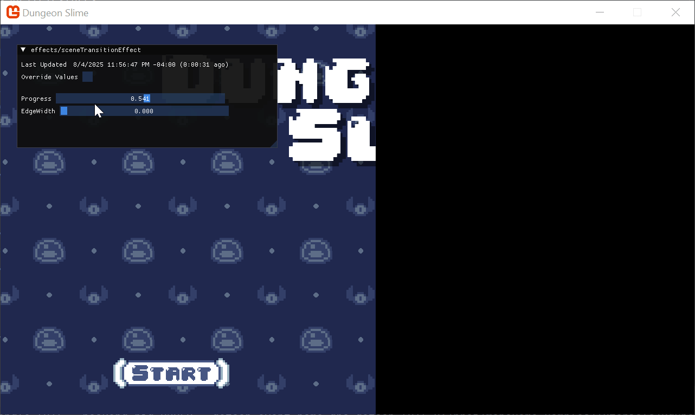

After we find an `EdgeWidth` value that looks good, we can set it in C# after the `SceneTransitionMaterial` is loaded.
```csharp
SceneTransitionMaterial.SetParameter("EdgeWidth", .05f);
```

>[!warning] 
> Shader parameters do not use initializer expressions.
>
> If you set a default expression for a shader parameter, like setting `EdgeWidth=.05`, MonoGame's shader compiler ignores the `=.05` part. You will always need to set this value from C#.  

### More Interesting Wipes

So far the shader has been using `uv.x` to create a horizontal screen wipe. It would be easy to use `uv.y` to create a vertical screen wipe. 

```hlsl
float transitioned = smoothstep(Progress, Progress + EdgeWidth, uv.y);
```

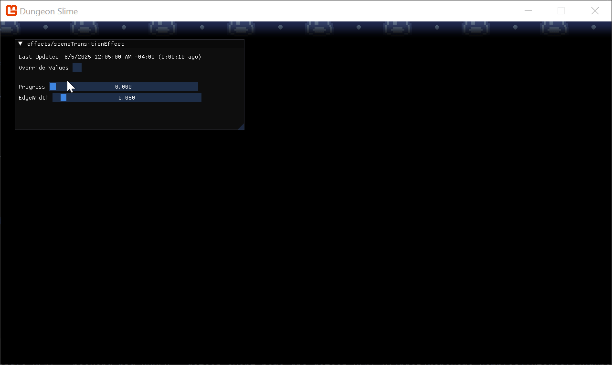

But what if we wanted to create more complicated wipes that didn't simply go in one direction? So far, we have passed `uv.x` and `uv.y` along as the argument to compare against the `Progress` shader parameter, but we could use any value we wanted. 

Pull out the expression into a separate variable, `value`, and experiment with some different mathematical functions. For example, here is a wipe that comes in from the left and right towards the center.
```hlsl
float value = 1 - abs(.5 - uv.x) * 2;  
float transitioned = smoothstep(Progress, Progress + EdgeWidth, value);
```
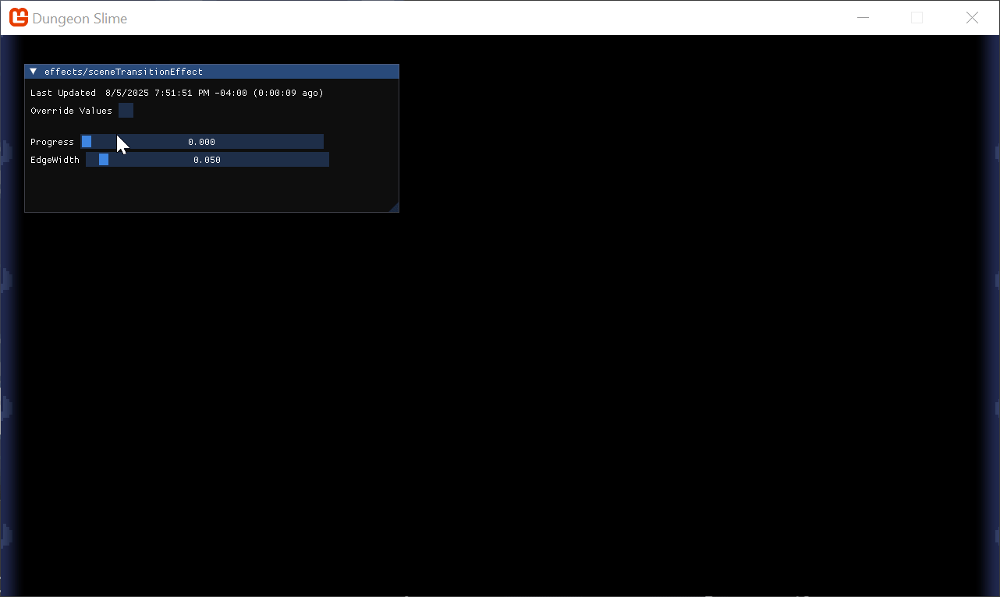

That is cool, but if we wanted an even more interesting wipe, the math would start to become challenging. In the final effect, it would also be nice to change the _type_ of wipe dynamically from the game, and having to change entire shader functions would be cumbersome. We can build a more generalized approach instead of writing mathematical functions to encode the wipe's progress. 

To build intuition, we can visualize _just_ the `value` that is compared against the `Progress` parameter. 

```hlsl
float value = 1 - abs(.5 - uv.x) * 2;  
return float4(value, value, value, 1);
```

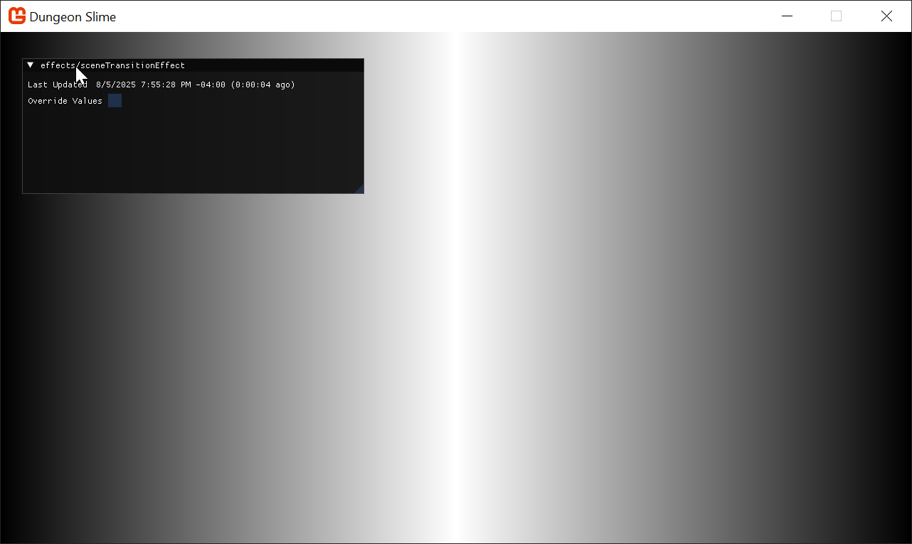

That image is not very interesting in of itself, but it does convey meaning about the transition effect _will_ render later. The darker areas of the image are going to transition sooner than the brighter areas, and the brightest areas will be the _last_ areas to transition when the `Progress` parameter is set all the way to `1`. At the end of the day, the image is just a grayscale gradient.

You could imagine _other_ grayscale gradient images. In fact, there is a fantastic pack of _free_ gradient images made by _Screaming Brain Studios_ on [opengameart.org](https://opengameart.org/content/300-gradient-textures). Here are few samples, 

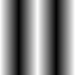


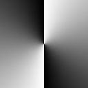

Theoretically, it is possible to derive mathematical expressions that would result in those exact grayscale gradient images, but given that we have the images already, we could just change the transition shader to _read_ from the texture given the pixel's coordinate. 

Download those files and add them to your MonoGame content.

We will store these texture references in the `Core` class as a `static` property, similar to how the `SceneTransitionMaterial` is already being kept,
```csharp
/// <summary>  
/// A set of grayscale gradient textures to use as transition guides  
/// </summary>  
public static List<Texture2D> SceneTransitionTextures { get; private set; }
```

And in the `Core`'s `LoadContent()` method, load the new images,
```csharp
SceneTransitionTextures = new List<Texture2D>();  
SceneTransitionTextures.Add(Content.Load<Texture2D>("images/angled"));  
SceneTransitionTextures.Add(Content.Load<Texture2D>("images/concave"));  
SceneTransitionTextures.Add(Content.Load<Texture2D>("images/radial"));  
SceneTransitionTextures.Add(Content.Load<Texture2D>("images/ripple"));
```

Instead of using the `Pixel` debug image to draw the `SceneTransitionMaterial`, use one of these new textures, 
```csharp
SpriteBatch.Draw(SceneTransitionTextures[1], GraphicsDevice.Viewport.Bounds, Color.White);
```

In the shader, you can read the texture data at the given `uv` coordinate by using the `tex2D` function. Modify the shader so that the `value` is just the red-channel of the given texture.
```hlsl
float2 uv = input.TextureCoordinates;  
float value = tex2D(SpriteTextureSampler, uv).r;  
return float4(value, value, value, 1);
```

Since the code above is referencing the `concave` image, the result looks like this,


And now, modify the shader to use the `Progress` parameter instead of just returning the `value`. 
```hlsl
float2 uv = input.TextureCoordinates;  
float value = tex2D(SpriteTextureSampler, uv).r;  
float transitioned = smoothstep(Progress, Progress + EdgeWidth, value);  
return float4(0, 0, 0, transitioned);
```

As you play with the `Progress` parameter slide, you can see the more interesting wipe pattern. 
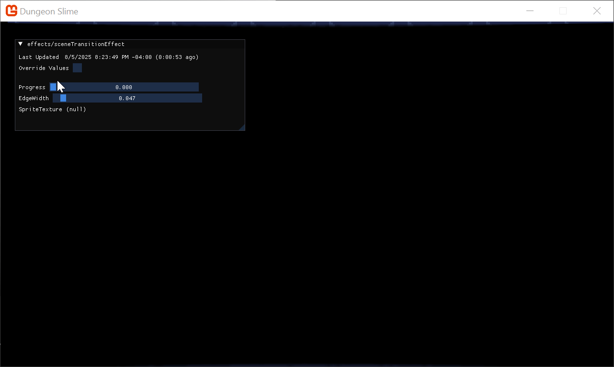

Now it is as easy as changing the texture being used to draw the scene transition to completely change the wipe pattern. Try playing around with the other textures, or make one of your own. 


### Controlling the Effect 

So far we have a transition effect that wipes a black-out across the screen, but nothing triggers the effect automatically when the scene actually changes. In this section, we will create some C# code to control the shader parameter programmatically. 

We will create a new class called `SceneTransition` that holds all the data for an active scene transition. Add this class to your `MonoGameLibrary/Scenes` folder. 
```csharp
using System;
using Microsoft.Xna.Framework;

namespace MonoGameLibrary.Scenes;

public class SceneTransition
{
    public DateTimeOffset StartTime;
    public TimeSpan Duration;
    
    /// <summary>
    /// true when the transition is progressing from 0 to 1.
    /// false when the transition is progressing from 1 to 0.
    /// </summary>
    public bool IsForwards;
    
    /// <summary>
    /// The index into the <see cref="Core.SceneTransitionTextures"/>
    /// </summary>
    public int TextureIndex;
    
    /// <summary>
    /// The 0 to 1 value representing the progress of the transition. 
    /// </summary>
    public float ProgressRatio => MathHelper.Clamp((float)(EndTime - DateTimeOffset.Now).TotalMilliseconds / (float)Duration.TotalMilliseconds, 0, 1);
    
    public float DirectionalRatio => IsForwards ? 1 - ProgressRatio : ProgressRatio;
    
    public DateTimeOffset EndTime => StartTime + Duration;
    public bool IsComplete => DateTimeOffset.Now >= EndTime;
}
```

Add the following `static` methods to the new `SceneTransition` class,
```csharp
/// <summary>  
/// Create a new transition  
/// </summary>  
/// <param name="durationMs">  
///     how long will the transition last in milliseconds?  
/// </param>  
/// <param name="isForwards">  
///     should the transition be animating the Progress parameter from 0 to 1, or 1 to 0?  
/// </param>  
/// <returns></returns>  
public static SceneTransition Create(int durationMs, bool isForwards)  
{  
    return new SceneTransition  
    {  
        Duration = TimeSpan.FromMilliseconds(durationMs),  
        StartTime = DateTimeOffset.Now,  
        TextureIndex = Random.Shared.Next(),  
        IsForwards = isForwards  
    };
}  
  
public static SceneTransition Open(int durationMs) => Create(durationMs, true);  
public static SceneTransition Close(int durationMs) => Create(durationMs, false);
```


Then, add a `static` property to the `Core` class. 
```csharp
/// <summary>  
/// The current transition between scenes  
/// </summary>  
public static SceneTransition SceneTransition { get; protected set; } = SceneTransition.Open(1000);
```

Anytime the `Core` class changes scene, it should create a new _closing_ transition.
```csharp
    public static void ChangeScene(Scene next)
    {
        // Only set the next scene value if it is not the same
        // instance as the currently active scene.
        if (s_activeScene != next)
        {
            s_nextScene = next;
            SceneTransition = SceneTransition.Close(250);
        }
    }
```

At the start of the `TransitionScene()` method, create an _open_ transition.
```csharp
private static void TransitionScene()  
{  
    SceneTransition = SceneTransition.Open(500);
    // ...
```

Now we need to actually _set_ the `Progress` shader parameter given the current scene transition value. In the `Update()` method, 
```csharp
// Check if the scene transition material needs to be reloaded.  
SceneTransitionMaterial.SetParameter("Progress", SceneTransition.DirectionalRatio);  
SceneTransitionMaterial.Update();
```

And finally, the scene material needs to be drawn with the right texture,
```csharp
// Draw the scene transition quad  
SpriteBatch.Begin(effect: SceneTransitionMaterial.Effect);  
SpriteBatch.Draw(SceneTransitionTextures[SceneTransition.TextureIndex % SceneTransitionTextures.Count], GraphicsDevice.Viewport.Bounds, Color.White);  
SpriteBatch.End();
```

When you run the game and change between scenes, you'll see a random arrangement of screen wipes!
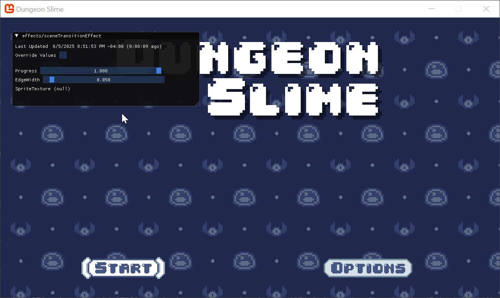

## Shared Content

The shader looks great! But organizationally, it feels odd that the `Material` loads a shader effect that isn't part of the _MonoGameLibrary_ project. If the code is ever used in another project, it would be clunky to need to copy individual pieces of shader content out from the _DungeonSlime_ game just so that the _MonoGameLibrary_ project can work in a new project. 

To solve this problem, we will introduce a second `.mgcb` file in the _MonoGameLibrary_ project. Create a new folder called `SharedContent` in the _MonoGameLibrary_ project. Create a new blank `.mgcb` file in that directory called `SharedContent.mgcb`. 

Move the `sceneTransitionEffect.fx` file from the _DungeonSlime/Content/effects_ folder into the _MonoGameLibrary/SharedContent/effects_ folder. In the old `Content.mgcb` file, make sure to remove the `sceneTransitionEffect.fx`. Add the `sceneTransitionEffect.fx` to the new `SharedContent.mgcb` file. Do the same for the transition images.

In order for the _DungeonSlime_ project to load the content, we need to make a few changes. 

In the `DungeonSlime.csproj` file, add the following changes to include files from both projects. 
```xml
<ItemGroup>  
    <MonoGameContentReference Include="**/*.mgcb;../MonoGameLibrary/**/*.mgcb" />  
</ItemGroup>
```

Also, in order for the shader hot-reload to work with the shared content, modify the `Watch` element to look like this,
```xml
<Watch Include="../**/*.fx;"/>
```

Next, the existing `ContentManager` instance in the `Core` class will only load content from the _/Content_ folder, which won't include the `sceneTransitionEffect.fx` file, because it is stored in the _/SharedContent_ folder. For this tutorial, we will create a second `ContentManager` in the `Core` class called `SharedContent` which will be configured to only load content from the _/SharedContent_ folder.  Add the following property next to the existing `Content` property in the `Core.cs` file. 

```csharp
/// <summary>  
/// Gets the content manager that can load global assets from the SharedContent folder.  
/// </summary>  
public static ContentManager SharedContent { get; private set; }
```

And then you will need to set the new `SharedContent` in the `Core` constructor, next to where the existing `Content` property is being set.
```csharp
// Set the core's shared content manager, pointing to the SharedContent folder.  
SharedContent = new ContentManager(Services, "SharedContent");
```

Finally, use the `SharedContent` instead of `Content` load load all the content, from the `LoadContent()` method.
```csharp
protected override void LoadContent()
{
    base.LoadContent();
    SceneTransitionMaterial = SharedContent.WatchMaterial("effects/sceneTransitionEffect");
    SceneTransitionMaterial.SetParameter("EdgeWidth", .05f);

    SceneTransitionTextures = new List<Texture2D>();
    SceneTransitionTextures.Add(SharedContent.Load<Texture2D>("images/angled"));
    SceneTransitionTextures.Add(SharedContent.Load<Texture2D>("images/concave"));
    SceneTransitionTextures.Add(SharedContent.Load<Texture2D>("images/radial"));
    SceneTransitionTextures.Add(SharedContent.Load<Texture2D>("images/ripple"));
}
```


## Conclusion

Our game is already starting to feel more polished with this new transition effect. In this chapter, you accomplished the following:

- Drew a full-screen quad to act as a canvas for a post-processing effect.
- Used UV coordinates and the `smoothstep` function to create a soft-edged wipe.
- Switched to a texture-based approach to drive the wipe logic with complex patterns.
- Created a `SceneTransition` class to control the effect programmatically.
- Refactored shared content into its own content project.

This was our first deep dive into pixel shaders, and we've created a very flexible system. In the next chapter, we'll keep the momentum going by tackling another popular and powerful shader: a color-swapping effect.

You can find the complete code sample for this chapter, [here](https://github.com/MonoGame/MonoGame.Samples/tree/3.8.4/Tutorials/2dShaders/src/05-Transition-Effect). 

Continue to the next chapter, [Chapter 06: Color Swap Effect](../06_color_swap_effect/index.md)