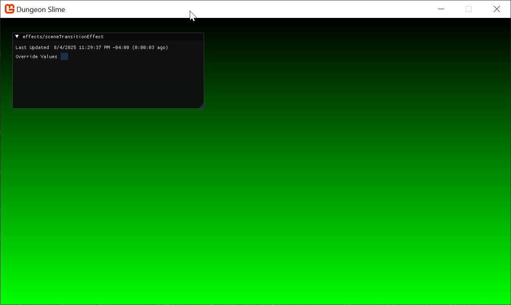
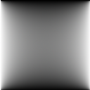
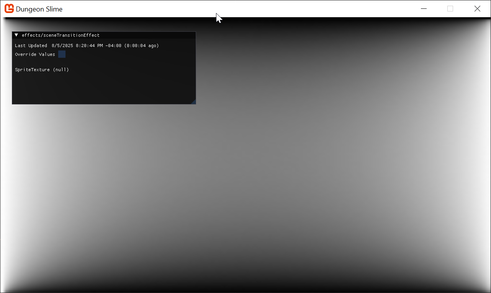

Our game is functional, but the jump from the title screen to the game is very sudden. We can make it feel much more polished with a smooth transition instead of an instant cut.

> [!NOTE]
>
> In the previous chapters, we focused on the shader development workflow.
>
> 1. We set up a hot-reload system in [Chapter 02](./../02_hot_reload/index.md),
> 2. We set up a `Material` class in [Chapter 03](./../03_the_material_class/index.md),
> 3. We set up a debug UI using `ImGui.NET` in [Chapter 04](./../04_debug_ui/index.md).

> All of this prior work is going to finally going to pay off! In this chapter, you will be able to leverage the hot-reload and debug UI to experiment with shader code in realtime without ever needing to restart your game. You can start the game, make changes to the shader, tweak shader parameters, all without needing to recompile your project.

In this chapter, we will dive into our first major pixel shader effect: a classic [Screen Wipe](https://www.youtube.com/watch?v=8NAhAEQUk8M) we will learn how to control an effect over the whole screen, how to create soft edges, and how to use textures to drive our shader logic to create all sorts of interesting patterns.

At the end of the chapter, you will have a screen transition effect like the one below.

|  |
| :-----------------------------------------------------------------------------: |
|          **Figure 5-1: We will build this screen transition effect**            |

If you are following along with code, here is the code from the end of the [previous chapter](https://github.com/MonoGame/MonoGame.Samples/tree/3.8.4/Tutorials/2dShaders/src/04-Debug-UI).

## The Scene Transition Effect

Screen wipes are the bread and butter of transitions, you see them everywhere from Presentations, to window washers and even games (ok, I made the middle one up).  The basic principle is sound, control what you draw and use a pattern to only draw part of an image, this is a useful technique for almost anything in game development, so let us get started with what you came here for, **BUILDING SHADERS**.

### Getting Started

Start by creating a new `Sprite Effect` from the MonoGame Content Builder Editor in the folder called `effects` (organization is key for both content as well as code), and name it `sceneTransitionEffect.fx`:

|  |
| :------------------------------------------------------------: |
|          **Figure 5-2: Create a new `Sprite Effect**           |

Save and build the content project, just to be sure and switch back to your code editor, and perform the following steps:

1. As the `Core` class has not implemented Materials previously, it will need the `using` statement to the library content features in order to be able to use the `WatchContent` extension we added in ]Chapter 3](../03_the_material_class/index.md), so add a new using to the top of the class:

    ```csharp
    using MonoGameLibrary.Content;
    ```

2. Let us start by adding the following variable to the top of the `Core` class in the `MonoGameLibrary` project to keep a static reference to the transition effect:

    [!code-csharp[](./snippets/snippet-5-01.cs)]

3. Add a new `LoadContent` method (just before the `UnloadContent` method to make it easier to find), and load the `sceneTransitionEffect` effect into a `Material`:

    [!code-csharp[](./snippets/snippet-5-02.cs)]

4. While we are developing the effect, we should also enable the debug UI framework we added earlier:

    [!code-csharp[](./snippets/snippet-5-05.cs?highlight=5)]

5. To benefit from hot-reload, we need also need to update the effect in the `Core`'s `Update()` loop:

    [!code-csharp[](./snippets/snippet-5-04.cs?highlight=6)]

6. Finally, as we are providing a new "base" implementation of `LoadContent`, we need to call the `Core`'s version of `LoadContent()` from the `Game1` class in the `DungeonSlime` project. In the previous tutorial, the method was left without calling the base method (because it was not implemented and did not need to):

    [!code-csharp[](./snippets/snippet-5-03.cs?highlight=4)]

If you run the game now, you should have a blank debug UI.

|  |
| :----------------------------------------------: |
|          **Figure 5-3: A blank slate**           |

### Rendering the Effect

Currently, the shader is compiling and loading into the game, but it is not being _used_ yet. The scene transition needs to cover the whole screen, so we need to draw a sprite over the entire screen area with the new effect. To render a sprite over the entire screen area, we need a blank texture to use for the sprite. Add the following property to the `Core` class:

[!code-csharp[](./snippets/snippet-5-06.cs)]

And initialize it in the `Initialize()` method:

[!code-csharp[](./snippets/snippet-5-07.cs?highlight=7-8)]

> [!TIP]
> The `Pixel` property is a texture we can re-use for many effects, and it is helpful to have for debugging purposes.

In the `Core'`s `Draw()` method, use the `SpriteBatch` to draw a full screen sprite using the `Pixel` property. Make sure to put this code **`after`** the `s_activeScene` is drawn, because the scene transition effect should _cover_ whatever was rendered previously in the current scene:

[!code-csharp[](./snippets/snippet-5-08.cs?highlight=10-12)]

If you run the game now, you will see a white background, because the `Pixel` sprite is rendering full screen on top of the entire game scene and GUM UI.

> [!NOTE]
> We can still see the `ImGui.NET` debug UI because the debug UI is rendered _after_ the current drawing the `Pixel`.

|  |
| :--------------------------------------------------------------------------------------------: |
|          **Figure 5-4: The shader is being used to render a white full screen quad**           |

### The Input

We need to be able to control how much of the screen is affected by the transition effect, the transition progress in effect.

Open the new `sceneTransitionEffect.fx` shader and add the following parameter to the shader:

[!code-hlsl[](./snippets/snippet-5-09.hlsl?highlight=12)]

And recall from the [Material chapter](../03_the_material_class/index.md#setting-shader-parameters), that unless the `Progress` parameter is actually **_used_** somehow in the calculation of the output of the shader, it will be stripped out of the final compilation of the shader for optimization. So, for now, we will make the shader return the `Progress` value using a red value color:

[!code-hlsl[](./snippets/snippet-5-10.hlsl?highlight=5)]

Now you can use the slider in the debug UI to visualize the `Progress` parameter as the red channel.

> [!WARNING]
> But wait, how does the game know to render a `Progress` slider?
>
> Recall from [Chapter 03: The Material Class](../03_the_material_class/index.md#setting-shader-parameters)'s _Setting Shader Parameters_ section that MonoGame's `EffectParameterCollection` knows about all of the compiled shader parameters The Debug UI we created in [Chapter 04: Debug UI](./../04_debug_ui/index.md#building-a-material-debug-ui) draws a slider for each parameter in the `EffectParameterCollection`. This means that as soon as a shader parameter is included in the compiled shader code, it will appear in the Debug UI without us needing to manually add or remove it.
>
> As we add or remove shader parameters in the shader code, the hot reload system will compile the shader and reload it into the game, and the Debug UI will draw everything in the `EffectParameterCollection`.
>
> Very cool and saves you a lot of effort when playing with values for configuring shaders!

|  |
| :---------------------------------------------------------------------------------------: |
|                **Figure 5-5: See the Progress parameter in the red value**                |

> [!NOTE]
> The astute will also note that you do not even need to check the "Override Values" checkbox to affect the screen.  This is simply because the game itself is not even trying to update the value (as it did previously with the greyscale saturation).  It just works.

### Coordinate Space

If we are making a screen wipe, then parts of the screen will be transitioning before other parts of the screen. The shader will affect the screen based on the coordinate of the pixel on the screen. For example, if we wanted to make a horizontal screen wipe, we would need to know the x-coordinate of each pixel. With the x-coordinate of a pixel, the shader could decide if that pixel should be shown or hidden based on the transition's progress parameter.

The shader already provides the x-coordinate (and y-coordinate) of each pixel in the `input.TextureCoordinates` structure.

>[!TIP]
> `input.TextureCoordinates` are not _actually_ the pixel coordinates
>
> In this example, the `input.TextureCoordinates` represents pixel coordinates _because_ the sprite is being drawn as a full screen quad. However, if the sprite was not taking up the entire screen, the texture coordinates would behave differently.
>
> This topic will be discussed more later on.

The following update to the shader helps visualize the x-coordinate of each pixel:

[!code-hlsl[](./snippets/snippet-5-11.hlsl)]

That results in this image, where the left edge has an x-coordinate of `0`, it has no red value, and where the right edge has an x-coordinate of `1`, the image is fully red. In the middle of the image, the red value interpolates between `0` and `1`.

> [!WARNING]
> Where did the `Progress` slider go?
>
> When the shader is compiled, the `Progress` parameter is being optimized out of the final compiled code because it was not being used in the final output of the shader in any way. The MonoGame shader compiler is good at optimizing away unused parameters, which is good because it helps the performance of your game. However, it can be confusing, because the `Progress` parameter appears to _vanish_ from the shader.
>
> It no longer appears in the `EffectParameterCollection`, so the debug UI has no way of knowing it exists to render it.  You need to watch out for these things when building shaders and understand when something goes wrong, it is most certainly your own fault.

|  |
| :----------------------------------------------------------------------------------------------: |
|          **Figure 5-6: the x coordinate of each pixel represented in the red channel**           |

The same pattern holds true for the y-coordinate. Observe the following shader code putting the y-coordinate of each pixel in the green channel:

[!code-hlsl[](./snippets/snippet-5-12.hlsl)]

As you can see, the top of the screen has a `0` value for the y-coordinate, and the bottom of the screen has a `1`.

|  |
| :------------------------------------------------------------------------------------------------: |
|          **Figure 5-7: The y-coordinate of each pixel represented in the green channel**           |

When these shaders are combined, the resulting image is the classic UV texture coordinate space:

[!code-hlsl[](./snippets/snippet-5-13.hlsl)]

>[!TIP]
> Remember that MonoGame uses the **top** of the image for "y = 0".
>
> Other game engines treat the _bottom_ of the image as "y = 0", but MonoGame (like XNA before it) uses the top of the image for where y is 0.  There is a long winded reason for this, which we shall not go into here, except to simply state "Everyone has their own way of doing screen space coordinates", so you should always check.

|  |
| :-----------------------------------------------------------------------------------: |
|           **Figure 5-8: x and y coordinates in the red and green channels**           |

> [!TIP]
> Did you remember that we have a hot reload system running?  This means you do not need to keep closing the game for every shader change!  If you have been closing the game, stop doing that (although you might want to mute the audio to save your sanity)

### Simple Horizontal Screen Wipe

Now that you have a visualization of the coordinate space, we can build some intuition for a screen wipe. To start, imagine creating a horizontal screen wipe, where the image turns to black from left to right. Remember that the x-coordinate goes from `0` on the left edge to `1` on the right edge. We can re-introduce the `Progress` parameter and compare the values. If the `Progress` parameter is greater than the x-coordinate, then that part of the image should transition.

In the following shader code, the blue channel of the final image represents in that coordinate should be in the transitioned state:

[!code-hlsl[](./snippets/snippet-5-14.hlsl)]

Use the slider to control the `Progress` parameter to see how the image changes.

|  |
| :-----------------------------------------------------------------: |
|           **Figure 5-9: a simple horizontal screen wipe**           |

That looks pretty close to a screen wipe already! However, instead of using blue and black the effect should be using black and a transparent color. The following snippet of shader code puts the `transitioned` value in the alpha channel of the final color. When the alpha value is zero, the pixel fragment is drawn as invisible:

[!code-hlsl[](./snippets/snippet-5-15.hlsl)]

|  |
| :----------------------------------------------------------------: |
|             **Figure 5-10: A transparent screen wipe**              |

The transition works, but the edge between black and transparent is very hard, often in screen wipes the transition has a smooth or blurry edge. The reason the current shader has a hard edge is because the `transitioned` variable is either `0` or `1` depending on the outcome of the `Progress > uv.x;` expression.

Ideally, it would be nice to smooth the `transitioned` variable:

- Setting it to `0` when the `Progress` is some small number like `.05`.
- Setting it to `1` when it is finished and the `Progress` is `.1`.
- Then smoothly interpolate between `0` to `1` in-between.

That way, it replaces the hard cut-off with a much smoother falloff/edge.  We could write this by hand, but shader languages have a built in function called `smoothstep` which does essentially what we want.

#### Smoothstep

The `smoothstep` function takes 3 parameters:

- A `min` value
- A `max` value
- And an input variable often called `x` (or `t` (time) depending on who you ask).

The function returns `0` when the given `x` parameter is at or below the `min` value, and `1` when `x` is at or above the `max` value. Between these ranges it uses a smooth function to blend between the two bounds, `min` and `max`.

> [!TIP]
> You can learn more about the `smoothstep` function in [The Book Of Shaders](https://thebookofshaders.com/glossary/?search=smoothstep)

This would be the most basic way to adjust the code to use `smoothstep`, but right away, using a fixed `.05` value should jump out as alarming:

[!code-hlsl[](./snippets/snippet-5-16.hlsl)]

Using **"magic numbers"** in shader code is a dangerous pattern, because it is unclear if the value `.05` is there for a mathematical reason, or just an aesthetic choice. At minimum, we should extract the value into a named variable, so that the reader of the code can attribute _some_ sort of meaning to what `.05` represents:

[!code-hlsl[](./snippets/snippet-5-17.hlsl?highlight=6)]

However, at this point, it would be nice to extract the `edgeWidth` as a second shader parameter next to `Progress`:

[!code-hlsl[](./snippets/snippet-5-18.hlsl?highlight=4)]

Now you can control the edge width slider to see the smooth edge between transitioned and not.

|  |
| :-------------------------------------------------: |
|            **Figure 5-11: A smooth edge**            |

After we find an `EdgeWidth` value that looks good, we can set it in C# after the `SceneTransitionMaterial` is loaded in the `Core` class:

[!code-csharp[](./snippets/snippet-5-19.cs?highlight=5)]

>[!warning]
> Shader parameters do not use initializer expressions.
>
> If you set a default expression for a shader parameter, like setting `EdgeWidth=.05`, MonoGame's shader compiler ignores the `=.05` part.
>
> **You will always need to set this value from C#.**

### More Interesting Wipes

So far the shader has been using `uv.x` to create a horizontal screen wipe. It would be easy to use `uv.y` to create a vertical screen wipe:

[!code-hlsl[](./snippets/snippet-5-20.hlsl)]

|  |
| :---------------------------------------------------------: |
|           **Figure 5-12: A vertical screen wipe**           |

But what if we wanted to create more complicated wipes that did not simply go in one direction?

So far, we have passed `uv.x` and `uv.y` along as the argument to compare against the `Progress` shader parameter, but we could use any value we wanted. If you pull out the expression into a separate variable, `value`, and experiment with some different mathematical functions.

For example, here is a wipe that comes in from the left and right towards the center:

[!code-hlsl[](./snippets/snippet-5-21.hlsl)]

|  |
| :-------------------------------------------------------------: |
|            **Figure 5-13: A more interesting wipe**             |

That is cool, but if we wanted an even more interesting wipe, the math would start to become challenging. In the final effect, it would also be nice to change the _type_ of wipe dynamically from the game, and changing entire shader functions, or writing completely separate shader effects would be very cumbersome, instead, we can build a more generalized approach without the need to write ever increasing complex mathematical functions to encode the wipe's progress.

To build intuition, we start by visualizing _just_ the `value` that is compared against the `Progress` parameter:

[!code-hlsl[](./snippets/snippet-5-22.hlsl?highlight=6-7)]

|  |
| :--------------------------------------------------------------------------------: |
|                **Figure 5-14: Just the value for the center wipe**                 |

> [!NOTE]
> Yes, we have lost the `progress` parameter for the moment, it will return later.

The display is not very interesting in of itself, but it does convey meaning of the transition effect _will_ render later. The darker areas of the image are going to transition sooner than the brighter areas, and the brightest areas will be the _last_ areas to transition when the `Progress` parameter is set all the way to `1`. At the end of the day, the image is just a grayscale gradient.

You could imagine _other_ grayscale gradient images. In fact, there is a fantastic pack of _free_ gradient images made by _Screaming Brain Studios_ on [opengameart.org](https://opengameart.org/content/300-gradient-textures). Here are few samples,

|  |  |  |  |
| :-------------------------------------------------------------------: | :-------------------------------------------------------------------: |  :-------------------------------------------------------------------: | :-------------------------------------------------------------------: |
|              **Figure 5-15: A ripple gradient**               |             **Figure 5-16: An angled gradient**                |              **Figure 5-17: A concave gradient**                |             **Figure 5-18: A radial gradient**                |

Theoretically, it is possible to derive mathematical expressions that would result in those exact grayscale gradient images, but given that we have the images already, we could just change the transition shader to _read_ from the texture given the pixel's coordinate.

Right-click and download (save as) those files and add them to your MonoGame content into the `Content/images` folder (named as per the `Content.Load` methods shown below, by default they should already be named appropriately).

1. We will store these texture references in the `Core` class as a `static` property, similar to how the `SceneTransitionMaterial` is already being kept:

    [!code-csharp[](./snippets/snippet-5-23.cs)]

2. Adding the required collections using statement we need for using the `List` type:

    ```csharp
    using System.Collections.Generic;
    ```

3. In the `Core`'s `LoadContent()` method, load the new images:

    [!code-csharp[](./snippets/snippet-5-24.cs?highlight=8-12)]

4. Instead of using the `Pixel` debug image to draw the `SceneTransitionMaterial`, we will use one of these new textures:

    [!code-csharp[](./snippets/snippet-5-25.cs?highlight=11)]

5. In the shader, we read the texture data at the given `uv` coordinate by using the `tex2D` function. Modify the shader so that the `value` is only using the red-channel of the given texture:

    [!code-hlsl[](./snippets/snippet-5-26.hlsl)]

    > [!NOTE]
    > Note we did not need to add a "Texture" parameter because the default MonoGame shader effect already comes with a default "main" texture.  But if you wanted more textures, you would need to add them yourselves and `Set` the parameters in C#.

6. Since the code above is referencing the `concave` image, the result looks like this,

    |  |
    | :---------------------------------------------------------------------------: |
    |                 **Figure 5-19: The concave value for a wipe**                 |

    > [!NOTE]
    > If you do not see any change, it is likely you have not added the downloaded images to the MGCB content project.  By doing so you will also have to restart the project as we are ONLY watching the shader files and ignoring other changes.
    >
    > Watch out you do not leave any old terminal windows running the watch in the background...

7. Now, modify the shader to use the `Progress` parameter instead of just returning the `value`:

    [!code-hlsl[](./snippets/snippet-5-27.hlsl?highlight=7-8)]

8. As you play with the `Progress` parameter slide, you can see the more interesting wipe pattern.

    |  |
    | :-----------------------------------------------------------------: |
    |             **Figure 5-20: The concave wipe in action**             |

    > [!TIP]
    > Make sure not to make the "edge" value too large or it will never fully transition, because your "buffer" is too large.

9. Now it is as easy as changing the texture being used to draw the scene transition to completely change the wipe pattern.

Try playing around with the other textures, or make one of your own.

### Controlling the Effect

So far we have implemented a transition effect that wipes a black-out across the screen, but nothing triggers the effect automatically when the scene actually changes. In this section, we will create some C# code to control the shader parameter programmatically.

We will create a new class called `SceneTransition` that holds all the data for an active scene transition.

1. Add this class to your `MonoGameLibrary/Scenes` folder:

    [!code-csharp[](./snippets/snippet-5-28.cs)]

2. Then add the following `static` methods to the new `SceneTransition` class:

    [!code-csharp[](./snippets/snippet-5-29.cs)]

3. Switching back over to the `Core` class, we need to add a new `static` property to hold all the possible transitions for the game:

    [!code-csharp[](./snippets/snippet-5-30.cs)]

4. We need to ensure that anytime the `Core` class changes scene it should also create a new _closing_ transition:

    [!code-csharp[](./snippets/snippet-5-31.cs?highlight=8)]

5. And when the effect starts the `TransitionScene()` method, it should create an _open_ transition:

    [!code-csharp[](./snippets/snippet-5-32.cs?highlight=3)]

6. Then we need to actually _set_ the `Progress` shader parameter given the current scene transition value. In the `Update()` method:

    [!code-csharp[](./snippets/snippet-5-33.cs?highlight=6)]

7. Finally, the scene material needs to be drawn with the right texture:

[!code-csharp[](./snippets/snippet-5-34.cs?highlight=11)]

When you run the game and change between scenes and you will see a random arrangement of screen wipes!

|  |
| :---------------------------------------------------: |
|         **Figure 5-21: the shader is done!**          |
|                                                       |

## Shared Content

The shader looks great! But organizationally, it feels odd that the `Material` loads a shader effect that is not part of the _MonoGameLibrary_ project. If the code is ever used in another project, it would be clunky to need to copy individual pieces of shader content out from the _DungeonSlime_ game just so that the _MonoGameLibrary_ project can work in a new project.

> [!IMPORTANT]
> As we need to work with dotnet tools, specifically the MGCB editor, the `dotnet-tools.json` (located in a `.config` folder) needs to be more accessible to the project as it is currently located in the `DungeonSlime` project folder, for the `MonoGameLibrary` to be able to consume it for the MGCB editor, it needs moving to the ROOT of the project folder.
>
> **Move the `.config` folder from the `DungeonSlime` folder up to the solution root.** (where both the DungeonSlime and MonoGameLibrary live)
>
> As a rule, the dotnet tools `.config` folder should **ALWAYS** be in your project root, especially if you are working with multi-project/platform projects.

To solve this problem, we will introduce a second `.mgcb` file in the _MonoGameLibrary_ project.

1. Create a new folder called `SharedContent` in the _MonoGameLibrary_ project.
1. Open the "MGCB Editor" and create a new blank `.mgcb` file `file -> New..` in that directory called `SharedContent.mgcb`.
1. Add new folders called "effects" and "images" in the editor.
1. Right-Click on the "effects" folder and use "Add -> Existing Item..", then select the `sceneTransitionEffect.fx` from the original _DungeonSlime/Content/effects_ folder. Select "Copy" when asked.
1. Right-Click on the "images" folder and use "Add -> Existing Item..", then select the transition images from the original _DungeonSlime/Content/images_ folder. Select "Copy" when asked.

> [!NOTE]
> Make sure you **SAVE** before exiting the MGCB editor, otherwise your content configuration may be lost.  It is just good practice.

This gives you a new dedicated Content project for just the MonoGameLibrary project.

> [!IMPORTANT]
> Remember to remove the old files from the original DungeonSlime Content project and folder, to avoid duplication as these will no longer be used. (delete files and then "exclude" them in the MGCB editor for the original mgcb content)

In order for the _DungeonSlime_ project to load the new Content Project, we need to make a few changes.

1. In the `DungeonSlime.csproj` file, add the following `MonoGameContentReference`, this enables it to include `mgcb` files from both projects:

    [!code-xml[](./snippets/snippet-5-35.xml)]

2. Also, in order for the shader hot-reload to work with the shared content, modify the `Watch` element to look like this:

    [!code-xml[](./snippets/snippet-5-36.xml?highlight=3)]

    Next, the existing `ContentManager` instance in the `Core` class will only load content from the _/Content_ folder, which will not include the `sceneTransitionEffect.fx` file, because it is stored in the _/SharedContent_ folder. For this tutorial, we will create a second `ContentManager` in the `Core` class called `SharedContent` which will be configured to only load content from the _/SharedContent_ folder.

3. Add the following property next to the existing `Content` property in the `Core.cs` file:

    [!code-csharp[](./snippets/snippet-5-37.cs)]

4. Then you will need to set the new `SharedContent` in the `Core` constructor, next to where the existing `Content` property is being set:

    [!code-csharp[](./snippets/snippet-5-38.cs?highlight=13)]

5. Finally, use the `SharedContent` instead of `Content` to load all the content, replacing the `LoadContent()` method with the following:

    [!code-csharp[](./snippets/snippet-5-39.cs)]

## Conclusion

Our game is already starting to feel more polished with this new transition effect. In this chapter, you accomplished the following:

- Drew a full-screen quad to act as a canvas for a post-processing effect.
- Used UV coordinates and the `smoothstep` function to create a soft-edged wipe.
- Switched to a texture-based approach to drive the wipe logic with complex patterns.
- Created a `SceneTransition` class to control the effect programmatically.
- Refactored shared content into its own content project.

This was our first deep dive into pixel shaders, and we have created a very flexible system. In the next chapter, we will keep the momentum going by tackling another popular and powerful shader: a color-swapping effect.

You can find the complete code sample for this chapter, [here](https://github.com/MonoGame/MonoGame.Samples/tree/3.8.4/Tutorials/2dShaders/src/05-Transition-Effect).

Continue to the next chapter, [Chapter 06: Color Swap Effect](../06_color_swap_effect/index.md)
