The art in our game looks good, but what if we wanted to change the color palette on the fly? Or make the player flash a different color when they pick something up? Re-drawing all the art for every possible color combination would be a lot of work. Thankfully, we can use a shader to do this dynamically!

In this chapter, we'll create a powerful color-swapping effect. We'll learn about a common and flexible technique that uses a texture as a Look-Up Table (LUT) to map original colors to new ones. This will give us precise control over the look and feel of our game's sprites.

If you're following along with code, here is the code from the end of the [previous chapter](https://github.com/MonoGame/MonoGame.Samples/tree/3.8.4/Tutorials/2dShaders/src/05-Transition-Effect).

## The Basic Color Swap Effect

At the moment, the game uses a lot of blue and gray textures. A common feature in retro-style games is to be able to change the color palette of the game. Another common feature of a game is to change the character's color during certain in-game events. For example, maybe the character flashes red or white when taking damage, or sparkles a gold color when picking up a combo. There are 2 broad categories for implementing these styles of features, 
1. re-draw all of the game assets using each color palette,
2. use some sort of _color swap_ shader effect to dynamically control the colors of sprites at runtime. 

For some simple use cases, sometimes it makes sense to simply re-draw the assets with different colors. However, the second option is more flexible and will enable more features, and since this is a shader tutorial, we will explore option 2. 

### Getting Started

Start by creating a new `Sprite Effect` in the _SharedContent_ MonoGame Content Builder file, and name it `colorSwapEffect.fx`. 

In the `GameScene`, we need to do the following steps to start working with the new `colorSwapEffect.fx`, 
1. Add a class variable for the new `Material` instance,
```csharp
// The color swap shader material.  
private Material _colorSwapMaterial;
```

2. Load the shader in the `LoadContent()` method,
```csharp
// Load the colorSwap material  
_colorSwapMaterial = Core.SharedContent.WatchMaterial("effects/colorSwapEffect");
_colorSwapMaterial.IsDebugVisible = true;
```

3. Update the `Material` in the `Update()` method to enable hot-reload support,
```csharp
_colorSwapMaterial.Update();
```

4. And finally, _use_ the `colorSwapMaterial` when drawing the sprites for the `GameScene`. For now, as we explore the color swapping effect, we are going to disable the `grayscaleEffect` functionality. In the `Draw()` method, start the `SpriteBatch` like this,
```csharp
if (_state != GameState.Playing)  
{  
    // We are in a game over state, so apply the saturation parameter.  
    _grayscaleEffect.SetParameter("Saturation", _saturation);  
  
    // And begin the sprite batch using the grayscale effect.  
    Core.SpriteBatch.Begin(samplerState: SamplerState.PointClamp, effect: _colorSwapMaterial.Effect);  
}  
else  
{  
    // Otherwise, just begin the sprite batch as normal.  
    Core.SpriteBatch.Begin(samplerState: SamplerState.PointClamp, effect: _colorSwapMaterial.Effect);  
}
```

Now when you run the game, it will look the same, but the new shader is being used to draw all the sprites in the `GameScene`. To verify, you can try changing the shader function to force the red channel to be `1`, just to see some visually striking confirmation the new shader is being used. 

```hlsl
float4 MainPS(VertexShaderOutput input) : COLOR  
{  
   float4 originalColor = tex2D(SpriteTextureSampler,input.TextureCoordinates) * input.Color;  
   originalColor.r = 1; // force the red-channel  
   return originalColor;  
}
```

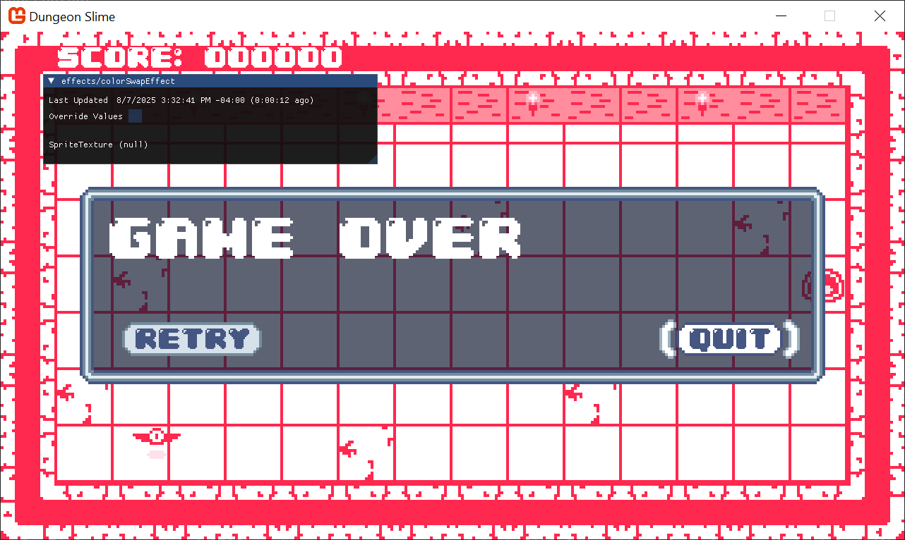

> [!warning] 
> The menu won't use the color swapper.
> 
> The game's menu is being drawn with GUM, and we aren't configuring any shaders on the GUM menu yet. For now, it will continue to draw with its old colors. 

For debugging purposes, we will disable the game's update logic so the player and bat aren't moving. This will let us focus on developing the look of the shader without getting distracted by the movement and game logic of game-over menus and score. 

The easiest way to disable all of the game logic is to `return` early from the `GameScene`'s `Update()` method, thus short circuiting all of the game logic.
```csharp
public override void Update(GameTime gameTime)  
{  
    // Ensure the UI is always updated  
    _ui.Update(gameTime);  
  
    // Update the grayscale effect if it was changed  
    _grayscaleEffect.Update();  
    _colorSwapMaterial.Update();  

    // Prevent the game from actually updating. TODO: remove this when we are done playing with shaders!
    return;

    // ...
```


### Hard Coding Color Swaps

The goal is to be able to change the color of the sprites drawn with the `_colorSwapMaterial`. To build some intuition, one of the most straightforward ways to change the color is to hard-code a table of colors in the `colorSwapEffect.fx` file. The texture atlas used to draw the slime character uses a color value of `rgb(32, 40, 78)` for the body of the slime. 

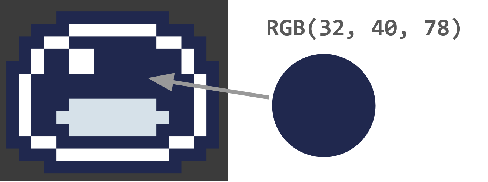

The shader code _could_ just do an `if` check for this color, and when any of the pixels are that color, return a hot-pink color instead. 

```hlsl
float4 MainPS(VertexShaderOutput input) : COLOR
{
    float4 originalColor = tex2D(SpriteTextureSampler,input.TextureCoordinates) * input.Color;
    
    // the color values are stored between 0 and 1, 
    //  this converts the 0 to 1 range to 0 to 255, and casts to an int.
    int red = originalColor.r * 255;
    int green = originalColor.g * 255;
    int blue = originalColor.b * 255;

    // check for the hard-coded blue color
    if (red == 32 && green == 40 && blue == 78)
    {
        float4 hotPink = float4(.9, 0, .7, 1);
        return hotPink;
    }

    return originalColor;
}
```

That would produce an image like this,
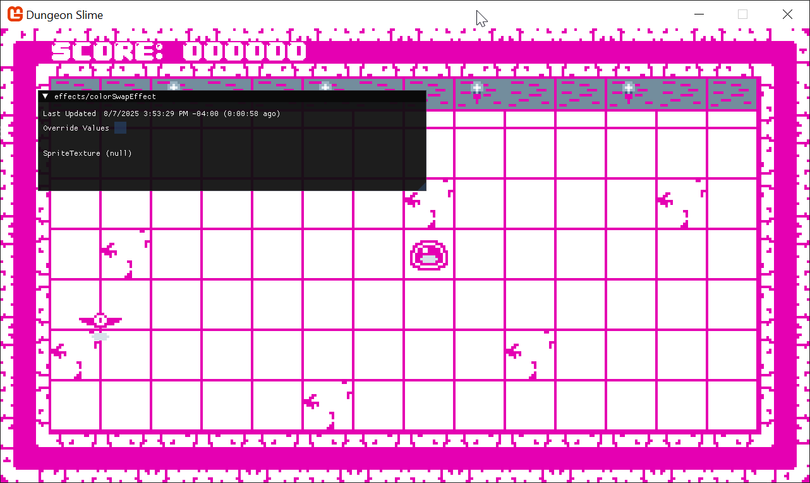

### Using a Color Map

The problem with this approach is that we would need to have an `if` check for _each_ color that should be swapped. Depending on your work ethic, there are already too many colors in the _Dungeon Slime_ assets to hardcode them all in a shader. Instead of hard coding the color swaps as `if` statements, we can create a _table_ of colors that maps asset color to final color. 

Conceptually, a _table_ structure is a series of `key` -> `value` pairs. We could represent each asset color as a `key`, and store the swap color as a `value`. To build up a good example, let's find a few more colors from the _Dungeon Slime_ assets. 

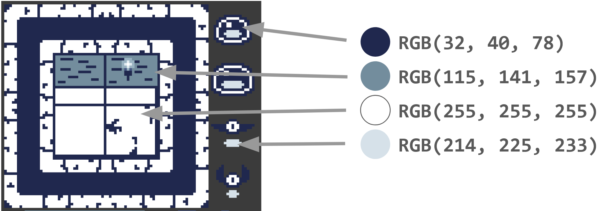

And here they are written out,
1. dark-blue - `rgb(32, 40, 78)`
2. gray-blue - `rgb(115, 141, 157)`
3. white - `rgb(255, 255, 255)`
4. light gray-blue - `rgb(214, 225, 233)`

Our goal is to treat those colors as `keys` into a table that results in a final color `value`. Fortunately, all of the `red` channels are unique across all 4 input colors. The `red` channels are `32`, `115`, `255`, and `214`. 

As a demonstration, if we were using C# to create a table, it might look like this,

```csharp
var map = new Dictionary<int, Color>  
{  
    // picked some random colors for the values
    [32] = Color.MonoGameOrange,  
    [115] = Color.CornflowerBlue,  
    [255] = Color.Firebrick,  
    [214] = Color.Salmon  
};
```

Unfortunately, shaders do not support the `Dictionary<>` type, so we need to find another way to represent the table in a shader friendly format. Shaders are good at reading data from textures, so we will encode the table information inside a custom texture. Imagine a custom texture that was 256 pixels wide, but only 1 pixel _tall_. We could treat the `key` values from above (`32`, `115`, `255`, and `214`) as _locations_ along the x-axis of the image, and the color of each pixel as the `value`. 

These images are not to scale, because a 256x1 pixel image would not show well on a web browser. Here are the original colors laid out in a 256x1 pixel image, with the color's red channel value written below the pixel.
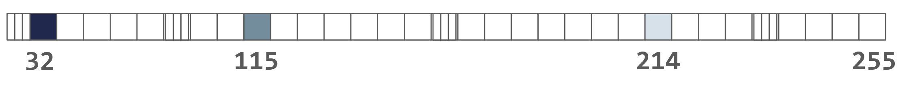

We could produce a second texture that puts different color values in the same key positions.
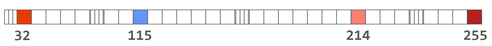


Here is the actual texture with the swapped colors. Download [this image](./images/color-map-1.png) and add it to your MonoGame Content file.


We need to load and pass the the texture to the `colorSwapEffect` shader.
Add this code after loading the `_colorSwapMaterial` in the `LoadContent()` method
```csharp
var colorMap = Content.Load<Texture2D>("images/color-map-1");
_colorSwapMaterial.SetParameter("ColorMap", colorMap);
```

And the `colorSwapEffect.fx` shader needs to be updated to accept the color map,
```hlsl
// the main Sprite texture passed to SpriteBatch.Draw()
Texture2D SpriteTexture;
sampler2D SpriteTextureSampler = sampler_state
{
    Texture = <SpriteTexture>;
};

// the custom color map passed to the Material.SetParameter()
Texture2D ColorMap;
sampler2D ColorMapSampler = sampler_state
{
    Texture = <ColorMap>;
    MinFilter = Point;
    MagFilter = Point;
    MipFilter = Point;
    AddressU = Clamp;
    AddressV = Clamp;
};
```

The `Texture2D` and `sampler2D` declarations are required to read from textures in a MonoGame shader. A `Texture2D` represents the pixel data of the image. A `sampler2D` defines _how_ the shader is allowed to read data from the `Texture2D`. 

The `ColorMapSampler` has a lot of extra properties (`MinFilter`, `MagFilter`, `MipFilter`, `AddressU`, and `AddressV`) that control exactly how the texture data is read from the `ColorMap`. 

By default, when a sampler reads data from a texture in a shader, it will subtly blend nearby pixel values to increase the visual quality. However, when a texture is being used as a lookup table, this blending is problematic because it will distort the data stored in the texture. The `Point` value given to the `Filter` properties tells the sampler to only read _one_ pixel value. 

When a sampler is reading a texture, there is always some _location_ being used to read pixel data from. The texture coordinate space is from 0 to 1, in both the `u` and `v` axes. By default, if a value greater than 1, or less than 0 is given, the sampler will _wrap_ the value around to be within the range 0 to 1. For example, `1.15` would become `0.15`.  The `Clamp` value prevents the wrapping and cuts the input off at the min and max values. For example, `1.15` becomes `1.0`. 

> [!tip] 
> More information on Samplers.
> 
> The [MonoGame Docs](https://docs.monogame.net/articles/getting_to_know/whatis/graphics/WhatIs_Sampler.html) have more details on samplers. 

The shader function can now do 2 steps to perform the color swap,
1. read the original color value of the pixel,
2. use the original color's red value as the `key` in the lookup texture to extract the swap color `value`. 

To help visualize the effect, it will be helpful to visualize the original color _and_ the swap color. Add a control parameter that can be used to select between the two colors.
```hlsl
// a control variable to lerp between original color and swapped color  
float OriginalAmount;
```

Change the shader function to the following,
```hlsl
float4 MainPS(VertexShaderOutput input) : COLOR
{
    // read the original color value
    float4 originalColor = tex2D(SpriteTextureSampler,input.TextureCoordinates);
    
    // produce the key location
    //  note the x-offset by half a texel solves rounding errors.
    float2 keyUv = float2(originalColor.r;
    
    // read the swap color value
    float4 swappedColor = tex2D(ColorMapSampler, keyUv) * originalColor.a;
    
    // return the result color
    return lerp(swappedColor, originalColor, OriginalAmount);
}
```

Now in the game, we can visualize the color swap by adjusting the control parameter. Perhaps the colors we picked don't look very nice.
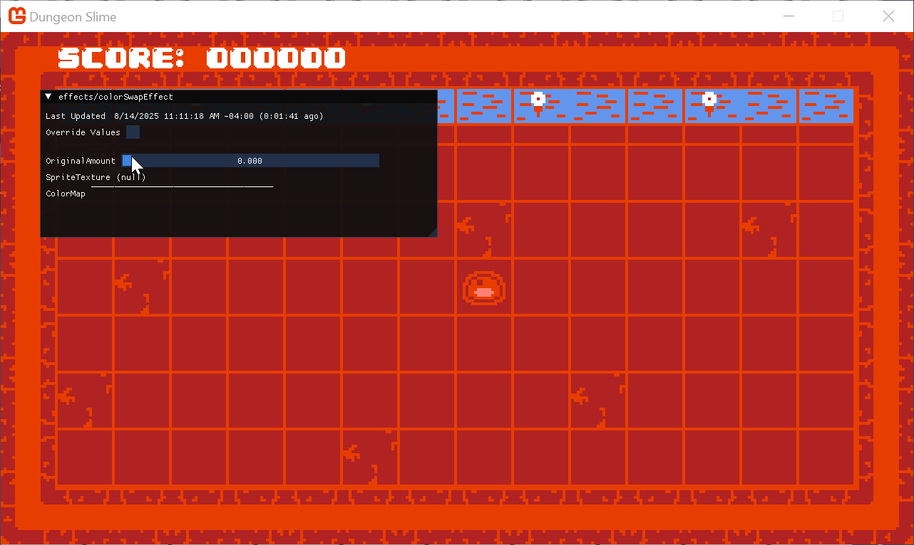

That looks pretty good, but changing between original and swap colors reveals a visual glitch. The color table didn't account for _some_ of the original colors. All of the colors get mapped, and our default color in the map was _white_, so some of the game's art is just turning white. For example, look at the torches on the top-wall. 

To fix this, we can adjust the color lookup map to use transparent values by default. Use [this texture](./images/color-map-2.png) instead.


Now, anytime the swapped color value has an `alpha` value of zero, the implication is that the color was not part of the table. In that case, the shader should default to the original color instead of the non-existent mapped value.

In the shader, before the final `return` line, add this snippet,
```hlsl
// ignore the swap if the map does not have a value  
bool hasSwapColor = swappedColor.a > 0;  
if (!hasSwapColor)  
{  
    return originalColor;  
}
```

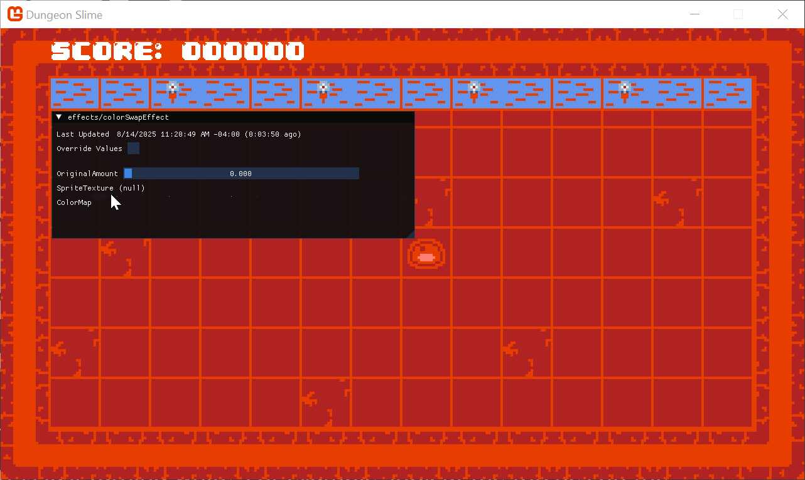

One final glitch becomes apparent if you stare at that long enough, which is that the center pixel in the torch is changing color from its original _white_, to our mapped orange color. In a way, that is _by design_, because the white values are being mapped. Fixing this would require a modification to the original assets to change the color the torch center, but that is left as an exercise for the reader. 

### Nicer Colors

The colors used above aren't the nicest. They were used for demonstration purposes. Here are some nicer textures to use that produce better results. 

Dark Purple - Here is the color map for a [dark-purple](./images/color-map-dark-purple.png) color scheme.
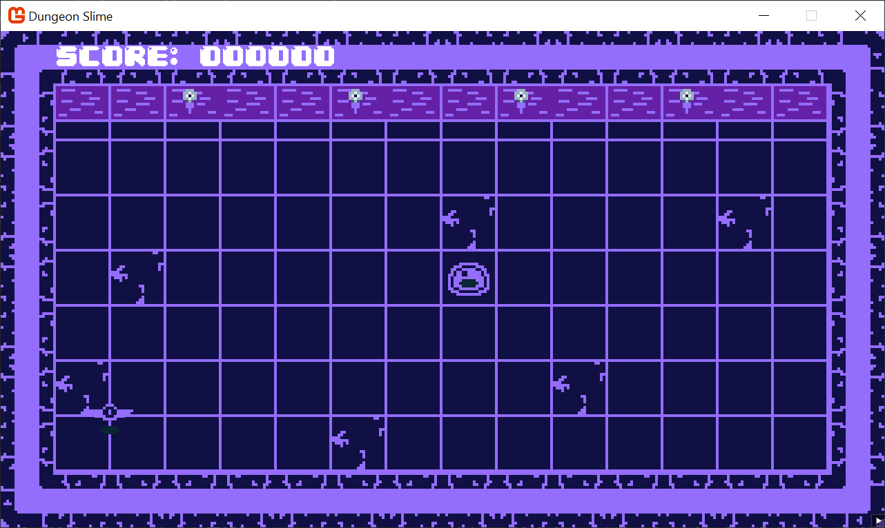

Green - Here is the color map for a [green](./images/color-map-green.png) color scheme.
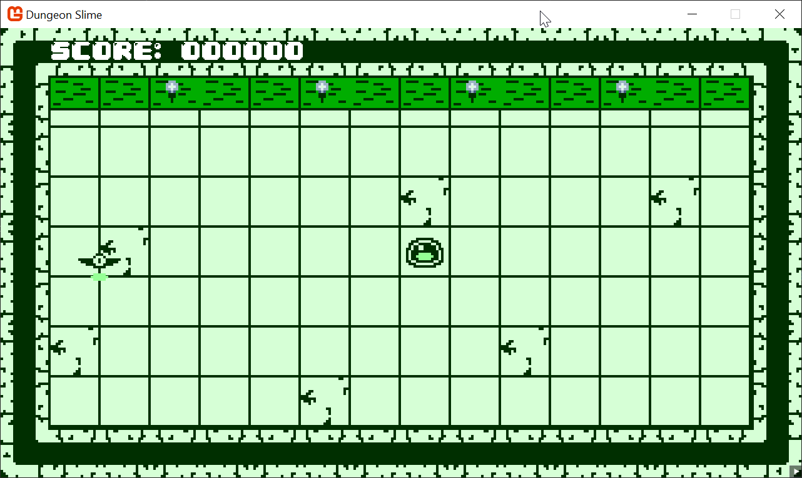

Pink - Here is the color map for a [pink](./images/color-map-pink.png) color scheme.
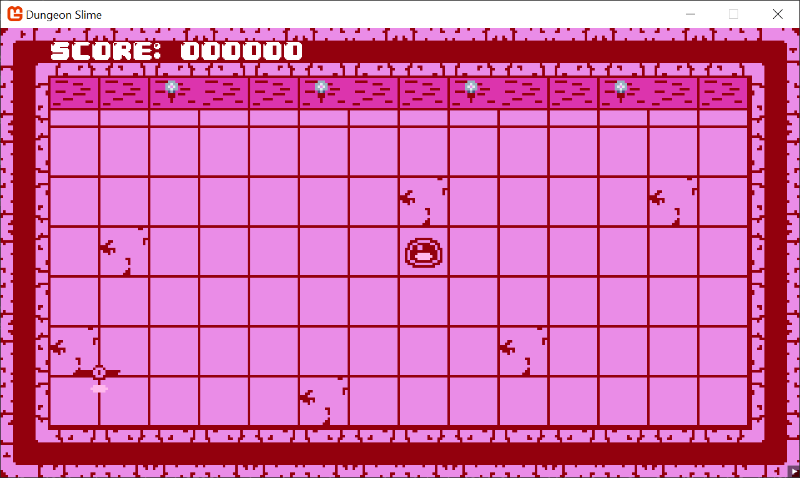


## Creating Dynamic Color Maps

So far, we have created color maps and brought them into the game as content. However, it would be cool to create these color maps dynamically with a C# script based on gameplay values and provide that texture to the shader in realtime. Our goal will be to modify the snake's color piece by piece when a the player eats a bat. 

To get started, we first need to devise a way to create a custom color map and pass it to the shader. 

Create a new class under the _MonoGameLibrary/Graphics_ folder called `RedColorMap`, 
```csharp
using System.Collections.Generic;
using Microsoft.Xna.Framework;
using Microsoft.Xna.Framework.Graphics;

namespace MonoGameLibrary.Graphics;

public class RedColorMap
{
    public Texture2D ColorMap { get; set; }

    public RedColorMap()
    {
        ColorMap = new Texture2D(Core.GraphicsDevice, 256, 1, false, SurfaceFormat.Color);
    }

    /// <summary>
    /// Given a dictionary of red-color values (0 to 255) to swapColors,
    /// Set the values of the <see cref="ColorMap"/> so that it can be used
    /// As the ColorMap parameter in the colorSwapEffect.
    /// </summary>
    public void SetColorsByRedValue(Dictionary<int, Color> map, bool overWrite = true)
    {
        var pixelData = new Color[ColorMap.Width];
        ColorMap.GetData(pixelData);

        for (var i = 0; i < pixelData.Length; i++)
        {
            // if the given color dictionary contains a color value for this red index, use it.
            if (map.TryGetValue(i, out var swapColor))
            {
                pixelData[i] = swapColor;
            }
            else if (overWrite)
            {
                // otherwise, default the pixel to transparent
                pixelData[i] = Color.Transparent;
            }
        }
        
        ColorMap.SetData(pixelData);
    }
}
```

And now to check if its working, create a temporary variable at the end of the `LoadContent()` in the `GameScene`
```csharp
_slimeColorMap = new RedColorMap();  
_slimeColorMap.SetColorsByRedValue(new Dictionary<int, Color>  
{  
    // main color  
    [32] = Color.Khaki,  
    // wall color  
    [115] = Color.Coral,  
    // shadow color  
    [214] = Color.MonoGameOrange,  
    // floor  
    [255] = Color.Tomato  
});  
  
_colorSwapMaterial.SetParameter("ColorMap", temp.ColorMap);
```
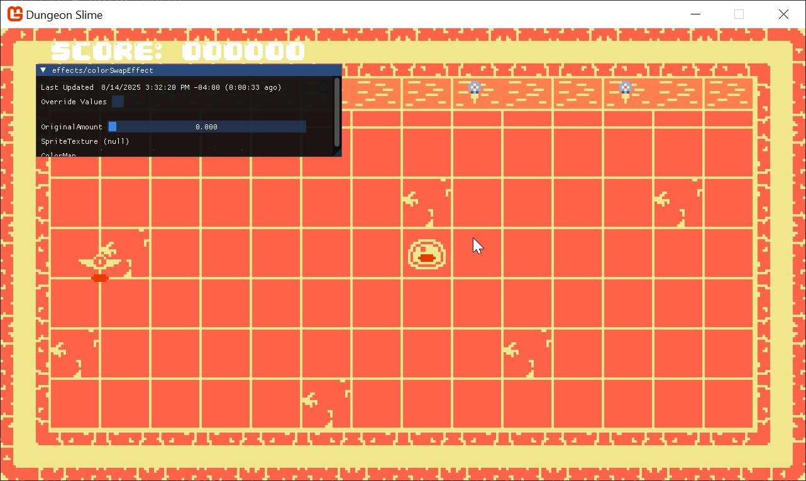

### Changing Slime Color

The goal is to change the color of the slime independently from the rest of the game. The `SpriteBatch` will try to make as few draw calls as possible and because all of the game assets are in a sprite-atlas, any shader parameters will be applied for _all_ sprites. However, you can change the `sortMode` to `Immediate` to change the `SpriteBatch`'s optimization to make it draw sprites immediately with whatever _current_ shader parameters exist. 

Change the `SpriteBatch.Begin()` call to look like this,
```csharp
Core.SpriteBatch.Begin(
    samplerState: SamplerState.PointClamp,
    sortMode: SpriteSortMode.Immediate,
    effect: _colorSwapMaterial.Effect);
```

And then update the draw code itself to update the shader parameter between drawing the slime and the rest of the game.
```csharp
// Update the colorMap  
_colorSwapMaterial.SetParameter("ColorMap", _colorMap);  
  
// Draw the tilemap  
_tilemap.Draw(Core.SpriteBatch);  
  
// Draw the bat.  
_bat.Draw();  
  
// Update the colorMap for the slime  
_colorSwapMaterial.SetParameter("ColorMap", _slimeColorMap.ColorMap);  
  
// Draw the slime.  
_slime.Draw();
```

Now the slime appears with one color swap configuration and the rest of the scene uses the color swap configured via the content.


We want to swap the color of the slime between two color maps, so first, we need a way to clone an existing color map into the dynamic color table. Add this method to the `RedColorMap` class,
```csharp
public void SetColorsByExistingColorMap(Texture2D existingColorMap)
{
    var existingPixels = new Color[256];
    existingColorMap.GetData(existingPixels);

    var map = new Dictionary<int, Color>();
    for (var i = 0; i < existingPixels.Length; i++)
    {
        map[i] = existingPixels[i];
    }
    
    SetColorsByRedValue(map);
}
```

Then modify the instance in the `GameScene` to start the color map based off whatever color map texture was loaded,
```csharp
_slimeColorMap = new RedColorMap();
_slimeColorMap.SetColorsByExistingColorMap(_colorMap);
_slimeColorMap.SetColorsByRedValue(new Dictionary<int, Color>
{
    // main color
    [32] = Color.Yellow,
}, false);
```


Now in the `Draw()` method, we can _optionally_ change the color map based on some condition. In this example, the color map only being set on every other second.
```csharp
// Update the colorMap for the slime
if ((int)gameTime.TotalGameTime.TotalSeconds % 2 == 0)
{
    _colorSwapMaterial.SetParameter("ColorMap", _slimeColorMap.ColorMap);
}

// Draw the slime.
_slime.Draw();
```
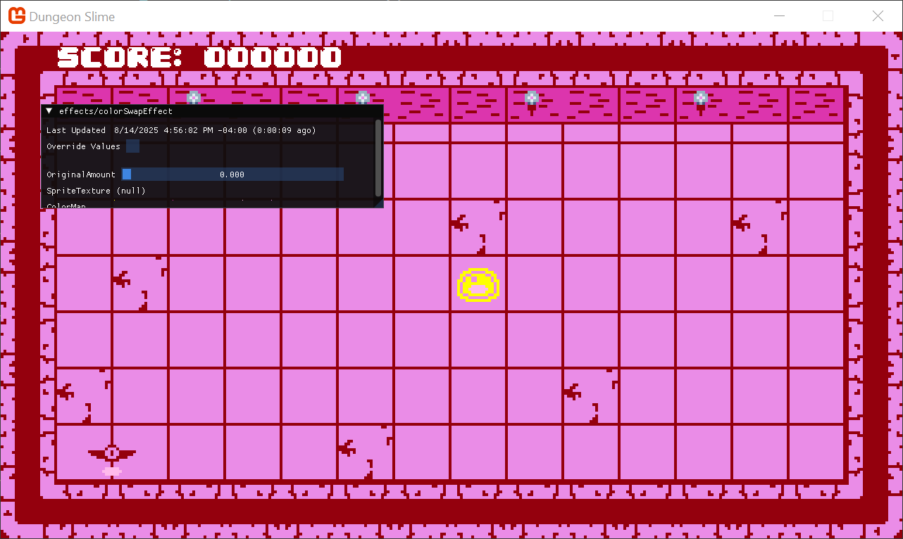

Ultimately, it would be nice to control the color value _per_ slime segment, not the entire slime. When the player eats a bat, the slime segments should change color in an animated way so that it looks like the color is "moving" down the slime segments. To do this, modify the `Slime.Draw()` method to look like this,
```csharp
/// <summary>
/// Draws the slime.
/// </summary>
public void Draw(Action<int> configureSpriteBatch)
{
    // Iterate through each segment and draw it
    for (var i = 0 ; i < _segments.Count; i ++)
    {
        var segment = _segments[i];
        // Calculate the visual position of the segment at the moment by
        // lerping between its "at" and "to" position by the movement
        // offset lerp amount
        Vector2 pos = Vector2.Lerp(segment.At, segment.To, _movementProgress);

        // Allow the sprite batch to be configured before each call.
        configureSpriteBatch(i);

        // Draw the slime sprite at the calculated visual position of this
        // segment
        _sprite.Draw(Core.SpriteBatch, pos);
    }
}
```

Then, in the `GameScene`'s logic, we need to add a local field to remember when the last time the slime's `Grow()` method was called. Add a class field,
```csharp
private TimeSpan _lastGrowTime;
```


In the `CollisionCheck()` method, add this line after the `Grow()` method is invoked,
```csharp
// Remember when the last time the slime grew  
_lastGrowTime = gameTime.TotalGameTime;
```

Now, in the `Draw()` method, modify the _slime_'s draw invocation to use the new `configureSpriteBatch` callback. 
```csharp
// Draw the slime.
_slime.Draw(segmentIndex =>
{
    const int flashTimeMs = 125;
    var map = _colorMap;
    var elapsedMs = (gameTime.TotalGameTime.TotalMilliseconds - _lastGrowTime.TotalMilliseconds);
    var intervalsAgo = (int)(elapsedMs / flashTimeMs);

    if (intervalsAgo < _slime.Size && (intervalsAgo - segmentIndex) % _slime.Size == 0)
    {
        map = _slimeColorMap.ColorMap;
    }
    
    _colorSwapMaterial.SetParameter("ColorMap", map);
});
```

Play around with the colors until you find something you like.
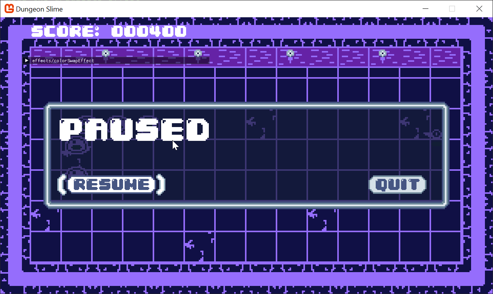

## Fixing the Gray Scale

The color swap shader is working well, but to experiment with it, we had previously _removed_ the pause screen's grayscale effect. Both effects are trying to modify the color of the game, so they naturally conflict with each other. To solve the problem, the shaders can be merged together into a single effect.

Extract the logic of the grayscale effect into a separate function and copy it into the `colorSwapEffect.fx` file.
```hlsl
float4 Grayscale(float4 color)
{
    // Calculate the grayscale value based on human perception of colors
    float grayscale = dot(color.rgb, float3(0.3, 0.59, 0.11));

    // create a grayscale color vector (same value for R, G, and B)
    float3 grayscaleColor = float3(grayscale, grayscale, grayscale);

    // Linear interpolation between he grayscale color and the original color's
    // rgb values based on the saturation parameter.
    float3 finalColor = lerp(grayscale, color.rgb, Saturation);

    // Return the final color with the original alpha value
    return float4(finalColor, color.a);
}
```

In order for this to work, don't forget to add the `Saturation` shader parameter to the `colorSwapEffect.fx` file.
```hlsl
float Saturation;
```

For readability, extract the logic of the color swap effect into a new function as well.
```hlsl
float4 SwapColors(float4 color)
{
    // produce the key location
    //  note the x-offset by half a texel solves rounding errors.
    float2 keyUv = float2(color.r , 0);
    
    // read the swap color value
    float4 swappedColor = tex2D(ColorMapSampler, keyUv) * color.a;
    
    // ignore the swap if the map does not have a value
    bool hasSwapColor = swappedColor.a > 0;
    if (!hasSwapColor)
    {
        return color;
    }
    
    // return the result color
    return lerp(swappedColor, color, OriginalAmount);
}
```

And now the main shader function can chain these methods together.
```hlsl
float4 MainPS(VertexShaderOutput input) : COLOR
{
    // read the original color value
    float4 originalColor = tex2D(SpriteTextureSampler,input.TextureCoordinates);

    float4 swapped = SwapColors(originalColor);
    float4 saturated = Grayscale(swapped);
    
    return saturated;
}
```

> [!warning] 
> Function Order Matters!
> 
> Make sure that the `Grayscale` and `SwapColors` functions appear _before_ the `MainPS` function in the shader, otherwise the compiler won't be able to resolve the functions.

Now you can control the saturation manually with the debug slider,


The last thing to do is remove the old `grayscaleEffect` and re-write the game logic to set the `Saturation` parameter on the new effect. 
In the `Draw()` method, instead of having an `if` case to start the `SpriteBatch` with different settings, it can always be configured to start with the `_colorSwapMaterial`, 

```csharp
_colorSwapMaterial.SetParameter("Saturation", _saturation);
Core.SpriteBatch.Begin(
    samplerState: SamplerState.PointClamp,
    sortMode: SpriteSortMode.Immediate,
    effect: _colorSwapMaterial.Effect);
```

In the `Update()` method, we just need to set the `_saturation` back to `1` if the game is being played.
```csharp
if (_state != GameState.Playing)
{
    // The game is in either a paused or game over state, so
    // gradually decrease the saturation to create the fading grayscale.
    _saturation = Math.Max(0.0f, _saturation - FADE_SPEED);

    // If its just a game over state, return back
    if (_state == GameState.GameOver)
    {
        return;
    }
}
else
{
    _saturation = 1;
}
```
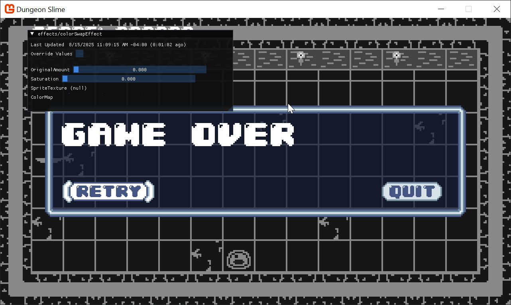


## Color Look Up Textures (LUTs)

The approach we used above is a simplified version of a broader technique called _Color Look Up Tables_, or Color LUTs. In the version we wrote above, there is a large limitation about which colors can be used in the table. The `key` in the color table was the `red` channel value of the input colors. If you had two different input colors that shared the same `red` channel value, the technique wouldn't work. 

The limitation is _often_ acceptable in game assets because you own the assets themselves and can author the textures to avoid the case where colors overlap on key values. However, when it is unavoidable, the `key` must be more complex than only the `red` value. For example, it could be unavoidable if your game needed more than 256 _unique_ colors. 

The next logical step is to make the `key` _2_ color channels like `red` _and_ `green`. In that case, the color texture wouldn't be a 256x1 texture, it would be a 256x256 texture. The `x` axis would still represent the `red` channel, and now the `y` axis would represent the `green` channel. Now the game could have `256 * 256` unique colors, or `65,536`. 

Finally, if you need _more_ colors, the final color channel can be included in the `key`, making the `key` be the combination of `red`, `green`, and `blue` channels. In the first case, the look up texture was 256x1 pixels. In the second case, it was 256x256 pixels. The final case is a texture of size 2048x2048 pixels. Imagine a texture made up of smaller 256x256 textures, stored in an 8x8 grid. 

Color LUTs are used in post-processing to adjust the final look and feel of games across the industry. The technique is called _Tone-Mapping_. 

## Conclusion

That was a really powerful technique! In this chapter, you accomplished the following:

- Implemented a color-swapping system using a 1D texture as a Look-Up Table (LUT).
- Created a `RedColorMap` class to dynamically generate these LUTs from C# code.
- Used `SpriteSortMode.Immediate` to apply different materials to different sprites in the same frame.
- Combined the color swap and grayscale effects into a single, more versatile shader.

So far, all of our work has been in the pixel shader, which is all about changing the color of pixels. In the next chapter, we'll switch gears and explore the vertex shader to manipulate the geometry of our sprites and add some surprising 3D flair to our 2D game.

You can find the complete code sample for this chapter, [here](https://github.com/MonoGame/MonoGame.Samples/tree/3.8.4/Tutorials/2dShaders/src/06-Color-Swap-Effect). 

Continue to the next chapter, [Chapter 07: Sprite Vertex Effect](../07_sprite_vertex_effect/index.md)