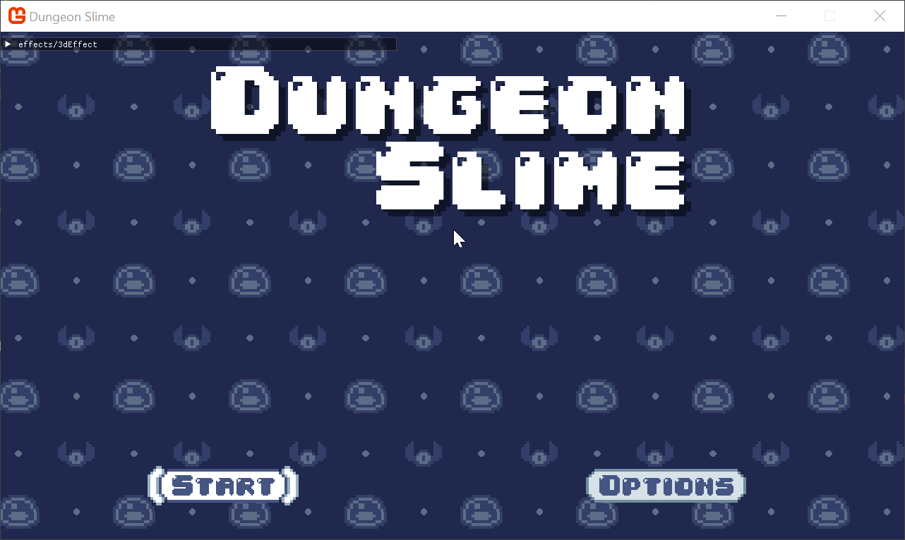
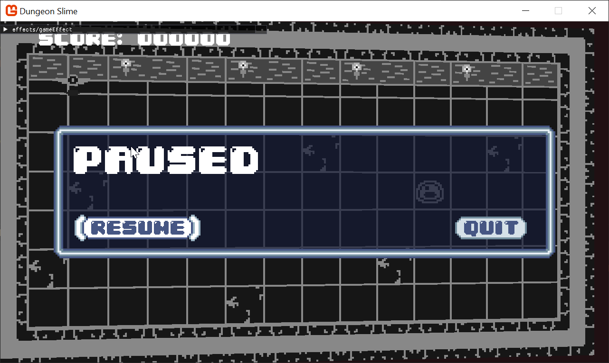

Every shader has two main parts: the pixel shader, which we've been using to change the colors of our sprites, and the vertex shader. The vertex shader runs first, and its job is to determine the final shape and position of our geometry. Up until now, we've been using MonoGame's default vertex shader, which just draws our sprites as flat 2D rectangles.

In this chapter, we're going to unlock the power of the vertex shader. we will write our own custom vertex shader from scratch, which will allow us to break out of the 2D plane. we will learn how to use a perspective projection to give our flat world a cool, dynamic 3D feel. 

At the end of this chapter, we will be able to make our sprites appear with 3d perspective.

|  |  |
| :-----------------------------------------------------------------------------: | :------------------------------------------------------------------------: |
|          **Figure 7-1: The main menu will have a 3d-esque title**               |           **Figure 7-2: The game will have a 3d-esque world**              |

If you are following along with code, here is the code from the end of the [previous chapter](https://github.com/MonoGame/MonoGame.Samples/tree/3.8.4/Tutorials/2dShaders/src/06-Color-Swap-Effect).

## Default Vertex Shader

So far in this series, we have only dealt with pixel shaders. To recap, the job of a pixel shader is to convert some input `(u,v)` coordinate into an output color `(r,g,b,a)` value. There has been a second shader function running all along behind the scenes, called the vertex shader. The vertex shader runs _before_ the pixel shader. The job of the vertex shader is to convert world-space vertex data into clip-space vertex data. Technically every call in MonoGame that draws data to the screen must provide a vertex shader function and a pixel shader function. However, the `SpriteBatch` class has a default implementation of the vertex shader that runs automatically.

The default `SpriteBatch` vertex shader takes the vertices that make up the sprites' corners, and applies an _orthographic projection_ to the vertices. The orthographic projection creates a 2d effect where shapes have no perspective, even when they are closer or further away from the origin. 

The vertex shader that is being used can be found [here](https://github.com/MonoGame/MonoGame/blob/develop/MonoGame.Framework/Platform/Graphics/Effect/Resources/SpriteEffect.fx#L29), and is rewritten below:

[!code-hlsl[](./snippets/snippet-7-01.hlsl)]

The `SpriteVertexShader` looks different from our pixel shaders in a few important ways, 
1. The inputs and outputs are different.
	1. The return type is not just a `float4`, its an entire struct, `VSOutput`,
	2. The inputs are not the same as the pixel shader. The pixel shader got a `Color` and `TextureCoordinates`, but this vertex shader has a `position`, a `color`, and a `texCoord`. 
2. There is a `MatrixTransform` shader parameter available to this shader. 

### Input Semantics

The inputs to the vertex shader mirror the information that the [`SpriteBatchItem`](https://github.com/MonoGame/MonoGame/blob/develop/MonoGame.Framework/Graphics/SpriteBatchItem.cs) class bundles up for each vertex. If you look at the `SpriteBatchItem`, you will see that each sprite is made up of 4 `VertexPositionColorTexture` instances:

[!code-csharp[](./snippets/snippet-7-02.cs)]

> [!note]
> The `SpriteBatchItem` is part of the implementation of `SpriteBatch`, but `SpriteBatchItem` is not part of the public MonoGame API. 

The [`VertexPositionColorTexture`](xhref:Microsoft.Xna.Framework.Graphics.VertexPositionColorTexture) class is a standard MonoGame implementation of the `IVertexType`, and it defines a `Position`, a `Color`, and a `TextureCoordinate` for each vertex. Those should look familiar, because they align with the inputs to the vertex shader function. The alignment is not happenstance, it is enforced by "semantics" that are applied to each field in the vertex. 

This snippet from the `VertexPositionColorTexture` class defines the semantics for each field in the vertex by specifying the `VertexElementUsage`:

[!code-csharp[](./snippets/snippet-7-03.cs)]

> [!tip]
> MonoGame is free and open source, so you can always go read the full source-code for the [`VertexPositionColorTexture`](https://github.com/MonoGame/MonoGame/blob/develop/MonoGame.Framework/Graphics/Vertices/VertexPositionColorTexture.cs))

The vertex shader declares a semantic for each input using the `:` syntax:

[!code-hlsl[](./snippets/snippet-7-04.hlsl)]

>[!warning] 
> You cannot change the `SpriteBatch` vertex shader. 
> 
> The `SpriteBatch` class does not offer any way to change the vertex semantics that are passed to the shader function.   

### Output Semantics

The same concept of semantics applies to the output of the shader. Here is the output type of the vertex shader function. Notice that the fields also have the `:` semantic syntax. These semantics instruct the graphics pipeline how to use the data:

[!code-hlsl[](./snippets/snippet-7-05.hlsl)]

This is the _input_ struct for the standard pixel shaders from previous chapters. Notice how the fields are named slightly differently, but the _semantics_ are identical:

[!code-hlsl[](./snippets/snippet-7-06.hlsl)]

> [!tip]
> What is the difference between `SV_Position` and `POSITION0` ? 
> 
> In various places in the shader code, you may notice semantics using `SV_Position` and `POSITION` interchangeably. The `SV_Position` semantic is actually specific to [Direct3D 10's System-Value Semantics](https://learn.microsoft.com/en-us/windows/win32/direct3dhlsl/dx-graphics-hlsl-semantics?redirectedfrom=MSDN#system-value-semantics). In fact, `SV_Position` is _not_ a valid semantic in DesktopGL targets, so _how_ can it be used interchangeably with `POSITION`? 
>
> MonoGame's default shader has a trick to re-map `SV_Position` to `POSITION` only when the target is `OPENGL`:
> [!code-hlsl[](./snippets/snippet-7-sv.hlsl?highlight=2)]
>
> The `#define` line tells the shader parser to replace any instance of `SV_POSITION` with `POSITION`. 
> This implies that `SV_POSITION` is converted to `POSITION` when you are targetting `OPENGL` platforms, and left "as is" when targeting DirectX.


### Matrix Transform

The default sprite vertex shader uses this line:

[!code-hlsl[](./snippets/snippet-7-07.hlsl)]

The reason this line exists is to convert the vertices from world-space to clip-space. A vertex is a 3d coordinate in "world-space". But a monitor is a 2d display. Often, the screen's 2d coordinate system is called "clip-space". The vertex shader is converting the 3d world-space coordinate into a 2d clip-space coordinate. That conversion is a vector and matrix multiplication, using the `MatrixTransform`. 

The `MatrixTransform` is computed by the [`SpriteEffect`](xref:Microsoft.Xna.Framework.Graphics.SpriteEffect) class. The full source is available, [`here`](https://github.com/MonoGame/MonoGame/blob/develop/MonoGame.Framework/Graphics/Effect/SpriteEffect.cs#L63). The relevant lines are copied below:

[!code-csharp[](./snippets/snippet-7-08.cs)]

There are two common types of project matrices, 
1. Orthographic,
2. Perspective

The orthographic projection matrix produces the classic 2d sprite effect, where sprites have no perspective when they are on the sides of the screen. 


## Custom Vertex Shader

Now that you understand the default vertex shader being used by `SpriteBatch`, we can replace the shader with a custom shader. The new shader must accomplish the basic requirements, 
1. convert the vertices from world-space to clip-space
2. provide the input semantics required for the pixel shader.

To experiment with this, create a new Sprite Effect called `3dEffect` in the _MonoGameLibrary_'s shared content effects folder. We need to add a vertex shader function. To do that, we need a new `struct` that holds all the input semantics passed from `SpriteBatch`: 

> [!tip] 
> Use a struct for inputs and outputs.
> 
> The default vertex shader accepts all 3 inputs (`position`, `color`, and `texCoord`) as direct parameters. However, when you have more than 1 semantic, it is helpful to organize all of the inputs in a `struct`. 

[!code-hlsl[](./snippets/snippet-7-09.hlsl)]

Now add the stub for the vertex shader function:

[!code-hlsl[](./snippets/snippet-7-10.hlsl)]

And finally modify the `technique` to _include_ the vertex shader function. Until now, the `MainVS()` function is just considered as any average function in your shader, and since it wasn't used from the `MainPS` pixel shader, it would be compiled out of the shader. When you specify the `MainVS()` function as the vertex shader function, you are overriding the default `SpriteBatch` vertex shader function:

[!code-hlsl[](./snippets/snippet-7-11.hlsl)]

The shader will not compile yet, because the `VertexShaderOutput` has not been completely initialized. We need to replicate the `MatrixTransform` step to convert the vertices from world-space to clip-space. 

Add the `MatrixTransform` shader parameter:

[!code-hlsl[](./snippets/snippet-7-12.hlsl)]

And then assign all of the output semantics in the vertex shader:

[!code-hlsl[](./snippets/snippet-7-13.hlsl)]

To validate this is working, we should try to use the new effect. For now, we will experiment in the `TitleScene`. Create a class member for the new `Material`:

[!code-csharp[](./snippets/snippet-7-14.cs)]

Load the shader using the hot reload system:

[!code-csharp[](./snippets/snippet-7-15.cs)]

And then use the effect when drawing the title text:

[!code-csharp[](./snippets/snippet-7-16.cs)]

When the game runs, the text will be missing. This is because we never created a projection matrix to assign to the `MatrixTransform` shader parameter. Add this code when loading the material:

[!code-csharp[](./snippets/snippet-7-17.cs)]

And now you should see the text normally again.

|  |
| :----------------------------------------------------------------------------------------: |
|          **Figure 7-3: The main menu, but rendered with a custom vertex shader**           |

### Making it Move

As a quick experiment, we can show that the vertex shader can indeed modify the vertex positions further if we want to. For now, add a temporary shader parameter called `DebugOffset`:

[!code-hlsl[](./snippets/snippet-7-18.hlsl)]

And change the vertex shader to add the `DebugOffset` to the `output.Position` after the clip-space conversion:

[!code-hlsl[](./snippets/snippet-7-19.hlsl)]

The sprites now move around as we adjust the shader parameter values. 

|  |
| :------------------------------------------------------------------: |
|         **Figure 7-4: We can control the vertex positions**          |

It is important to build intuition for the different coordinate systems involved. Instead of adding the `DebugOffset` _after_ the clip-space conversion, if you try to add it _before_, like in the code below:

[!code-hlsl[](./snippets/snippet-7-20.hlsl)]

Then you will not see much movement at all. This is because the `DebugOffset` values only go from `0` to `1`, and in world space, this really only amounts to a single pixel. In fact, exactly how much an addition of _`1`_ happens to make is entirely defined _by_ the conversion to clip-space. The `projection` matrix we created treats world space coordinates with an origin around the screen's center, where 1 unit maps to 1 pixel. Sometimes this is exactly what you want, and sometimes it can be confusing. 

|  |
| :----------------------------------------------------------------------------------: |
|          **Figure 7-5: Changing coordinates before clip-space conversion**           |

### Perspective Projection

The world-space vertices can have their `x` and `y` values modified in the vertex shader, but what about the `z` component? The orthographic projection essentially _ignores_ the `z` component of a vertex and treats all vertices as though they are an equal distance away from the camera. If you change the `z` value, you may _expect_ the sprite to appear closer or further away from the camera, but the orthographic projection matrix does not do that. 

To check, try modify the shader code to adjust the `z` value based on one of the debug values:

[!code-hlsl[](./snippets/snippet-7-21.hlsl)]

> [!tip] 
> Near and Far plane clipping.
> 
> Keep in mind that if you modify the `z` value _too_ much, it will likely step outside of the near and far planes of the orthographic projection matrix. If this happens, the sprite will vanish, because it the projection matrix does not handle coordinates outside of the near and far planes. In the example above, they were defined as `0` and `-1`. 
> [!code-csharp[](./snippets/snippet-7-22.cs)]

Nothing happens! 

To fix this, we need to use a _perspective_ projection matrix instead of an orthographic projection matrix. MonoGame has a built in method called `Matrix.CreatePerspectiveFieldOfView()` that will do most of the heavy lifting for us. Once we have a perspective matrix, it would also be helpful to control _where_ the camera is looking. The math is easy, but it would be helpful to put it in a new class. 

Create a new file in the _MonoGameLibrary_'s graphics folder called `SpriteCamera3d`, and paste the following code. We are going to skip over the math internals:

[!code-csharp[](./snippets/snippet-7-23.cs)]

And now instead of creating an orthographic matrix in the `TitleScene`, we can use the new class:

[!code-csharp[](./snippets/snippet-7-24.cs)]

Moving the `z` value uniformly in the shader will not be visually stimulating. A more impressive demonstration of the _perspective_ projection would be to rotate the vertices around the center of the sprite:

[!code-hlsl[](./snippets/snippet-7-25.hlsl)]

> [!note]
> What does this do, `output.Position /= output.Position.w` ? 
> Long story short, the `w` component of the `.Position` must be _1_. Dividing any number by itself results in _1_, so the dividing `output.Position` by its own `w` component does two things, 
>  1. sets the `w` component to _1_, 
>  2. uniformly adjusts the other components to accomodate the change.
>     
> The math to fully explain why this is required is beyond the scope of this tutorial series. Read about [homogenous coordinates](https://www.tomdalling.com/blog/modern-opengl/explaining-homogenous-coordinates-and-projective-geometry/) and the [perspective divide](https://www.scratchapixel.com/lessons/3d-basic-rendering/perspective-and-orthographic-projection-matrix/projection-matrix-GPU-rendering-pipeline-clipping.html)


And now when the debug parameter is adjusted, the text spins in a way that was never possible with the default `SpriteBatch` vertex shader.

|  |
| :-----------------------------------------------: |
|          **Figure 7-6: A spinning text**          |

The text disappears for half of the rotation. That happens because as the vertices are rotated, the triangle itself started to point _away_ from the camera. By default, `SpriteBatch` will cull any faces that point away from the camera. Change the `rasterizerState` to `CullNone` when beginning the sprite batch:

[!code-csharp[](./snippets/snippet-7-26.cs)]

And voilà, the text no longer disappears on its flip side. 

|  |
| :------------------------------------------------------------------: |
|          **Figure 7-7: A spinning text with reverse sides**          |

You may find that the field of view is too high for your taste. Try lowering the field of view to 60, and you'll see something similar to this,

|  |
| :-----------------------------------------------------------------------------------: |
|          **Figure 7-8: A spinning text with reverse sides with smaller fov**          |

As a final touch, we should remove the hard-coded `screenSize` variable from the shader, and extract it as a shader parameter. While we are at it, clean up and remove the debug parameters as well:

[!code-hlsl[](./snippets/snippet-7-27.hlsl)]

Then, make sure to set the ScreenSize parameter correctly from C#:

[!code-csharp[](./snippets/snippet-7-28.cs)]

And instead of manually controlling the spin angle, we can make the title spin gentle following the mouse position. In the `Update()` function the `TitleScreen`, add the following snippet:

[!code-csharp[](./snippets/snippet-7-29.cs)]

|  |
| :------------------------------------------------------------: |
|          **Figure 7-9: Spin controlled by the mouse**          |

## Applying it to the Game

It was helpful to use the `TitleScene` to build intuition for the vertex shader, but now it is time to apply the perspective vertex shader to the game itself to add immersion and a sense of depth to the gameplay. The goal is to use the same effect in the `GameScene`. 
### The Uber Shader

A problem emerges right away. The `GameScene` is already using the color swapping effect to draw the sprites, and `SpriteBatch` can only use a single per batch. 

To solve this problem, we will collapse our shaders into a single shader that does all _both_ the color swapping _and_ the vertex manipulation. Writing code to be re-usable is a challenge for all programming languages, and shader language is no different. Sometimes when a game has lots of different effects collapsed into a single shader, the shader is called the _Uber Shader_. For _Dungeon Slime_, that term is premature, but the spirit is the same. 

MonoGame shaders can reference code from multiple files by using the `#include` syntax. MonoGame itself [uses](https://github.com/MonoGame/MonoGame/blob/develop/MonoGame.Framework/Platform/Graphics/Effect/Resources/SpriteEffect.fx#L8) this technique itself in the default vertex shader for `SpriteBatch`. We can move some of the code from our existing `.fx` files into a _new_ `.fxh` file, re-write the existing shaders to `#include` the new `.fxh` file, and then be able to write additional `.fx` files that `#include` multiple of our files and compose the functions into a single effect. 

> [!tip] 
> `.fxh` vs `.fx`.
> 
> `.fxh` is purely convention. Technically you can use whatever file extension you want, but `.fxh` implies the usage of the file is for shared code, and does not contain a standalone effect itself. The `h` references `header`. 

Before we get started, we are going to be editing `.fxh` files, so it would be nice if the hot-reload system also listened to these `.fxh` file changes. Update the `Watch` configuration in the `DungeonSlime.csproj` file to include the `.fxh` file type:

[!code-xml[](./snippets/snippet-7-30.xml)]

Let's start by factoring out some shared components a few different `.fxh` files. 

Create a file in the _MonoGameLibrary_'s shared effect content folder called `common.fxh`. This file will contain utilities that can be shared for all effects, such as the `struct` types that define the inputs and outputs of the vertex and pixel shaders:

[!code-hlsl[](./snippets/snippet-7-31.hlsl)]

>[!tip] 
> Include Guards.
> 
> The `#include` syntax is taking the referenced file and inserting it into the code. If the same file was included twice, then the contents that file would be written out as code _twice_. Defining a `struct` or function this way would cause the compiler to fail, because the `struct` would be declared twice, which is illegal. To work around this, _a_ solution is to use a practice called "include guards", where the file itself defines a symbol (in the case above, the symbol is `COMMON`). The file only compiles to anything if the symbol has not yet been defined. The `#ifndef` stands for "if not yet defined". Once the `COMMON` symbol is defined once, any future inclusions of the file will not match the `#ifndef` clause. 

Then, in the `3dEffect.fx` file, remove the `VertexShaderInput` and `VertexShaderOutput` structs and replace them with this line:

[!code-hlsl[](./snippets/snippet-7-32.hlsl)]

If you run the game, nothing should change, except that the shader code is more modular. To continue, create another file next to `3dEffect.fx` called `3dEffect.fxh`. Paste the contents:

[!code-hlsl[](./snippets/snippet-7-33.hlsl)]

And now in the `3dEffect.fx`, instead of `#include` referencing the `common.fxh`, we can directly reference `3dEffect.fxh`. We should also remove the code that was just pasted into the new common header file. Here is the entire contents of the slimmed down `3dEffect.fx` file:

[!code-hlsl[](./snippets/snippet-7-34.hlsl)]

It is time to do the same thing for the `colorSwapEffect.fx` file. The goal is to split the file apart into a header file that defines the components of the effect, and leave the `fx` file itself without much _implementation_. Create a new file called `colors.fxh`, and paste the following:

[!code-hlsl[](./snippets/snippet-7-35.hlsl)]

Then, then `colorSwapEffect.fx` file can be re-written as this code:

[!code-hlsl[](./snippets/snippet-7-36.hlsl)]


Now most of the components we'd like to combine into a single effect have been split into various `.fxh` header files. Create a new sprite effect in the _DungeonSlime_'s content effect folder called `gameEffect.fx`. To start, if you try to `#include "common.fxh"` , you will see an error like this, 
```
error PREPROCESS01: File not found: common.fxh in .(MonoGame.Effect.Preprocessor+MGFile)
```

This happens because the `gameEffect.fx` file is in a different folder than the `common.fxh` file, and the `"common.fxh"`  is treated as a relative _file path_ lookup. Instead, in the `gameEffect.fx` file, use this line:

[!code-hlsl[](./snippets/snippet-7-37.hlsl)]

Then, the `gameEffect.fx` file could also reference the other two `.fxh` files we created:

[!code-hlsl[](./snippets/snippet-7-38.hlsl)]

And the only thing the `gameEffect.fx` file needs to specify is which functions to use for the vertex shader and pixel shader functions:

[!code-hlsl[](./snippets/snippet-7-39.hlsl)]

The entire contents of the `gameEffect.fx` are written below:

[!code-hlsl[](./snippets/snippet-7-40.hlsl)]

To load it into the `GameScene`, we need to _delete_ the old class member for `_colorSwapMaterial`, and add a new one:

[!code-csharp[](./snippets/snippet-7-41.cs)]

And then apply all of the parameters to the single material:

[!code-csharp[](./snippets/snippet-7-42.cs)]

Any place where the old `_colorSwapMaterial` is being referenced should be changed to use the `_gameMaterial` instead. Now, if you run the game, the color swap controls are still visible, but we can also manually control the tilt of the map.

|  |
| :-------------------------------------------------------: |
|         **Figure 7-10: All of the effects in one**         |

### Adjusting the Game

Now that the 3d effect can be applied to the game objects, it would be good to make the world tilt slightly towards the player character to give the movement more weight. Instead of spinning the entire map, an easier approach will be to modify the `MatrixTransform` that is being passed to the shader. 

Add this snippet to the top of the `GameScene`'s `Update()` method:

[!code-csharp[](./snippets/snippet-7-43.cs)]

|  |
| :------------------------------------------------------------: |
|            **Figure 7-11: Camera follows the slime**            |

The clear color of the scene can be seen in the corners (the `CornflowerBlue`). Pick whatever clear color you think looks good for the color swapping:

[!code-csharp[](./snippets/snippet-7-44.cs)]

And to finish this chapter, the game looks like this,

|  |
| :---------------------------------------------------------: |
|         **Figure 7-12: vertex shaders make it pop**          |

## Conclusion

Our game has a whole new dimension! In this chapter, you accomplished the following:

- Learned the difference between a vertex shader and a pixel shader.
- Wrote a custom vertex shader to override the `SpriteBatch` default.
- Replaced the default orthographic projection with a perspective projection to create a 3D effect.
- Refactored shader logic into modular `.fxh` header files for better organization.
- Combined vertex and pixel shader effects into a single "uber shader".

The world feels much more alive now that it tilts and moves with the player. In the next chapter, we will build on this sense of depth by tackling a 2D dynamic lighting system.

You can find the complete code sample for this chapter, [here](https://github.com/MonoGame/MonoGame.Samples/tree/3.8.4/Tutorials/2dShaders/src/07-Sprite-Vertex-Effect). 

Continue to the next chapter, [Chapter 08: Light Effect](../08_light_effect/index.md)