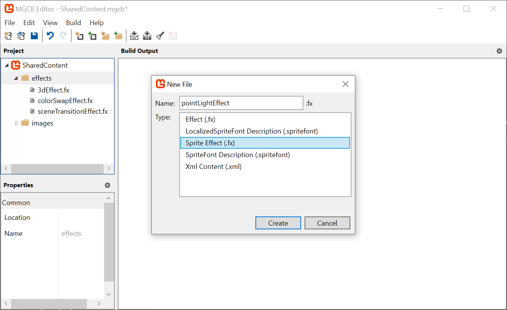
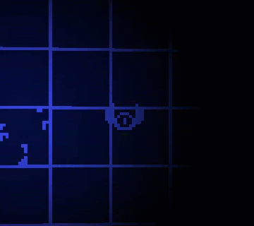
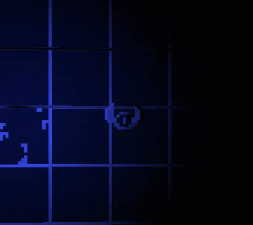

In this chapter, we are going to add a dynamic 2D lighting system to _Dungeon Slime_. At the end of this chapter, the game will look something like this:

|  |
| :-------------------------------------------------: |
|         **Figure 8-1: The game will have lighting**          |

So far, the game's rendering has been fairly straightforward. The game consists of a bunch of sprites, and all those sprites are drawn straight to the screen using a custom shader effect. Adding lights is going to complicate the rendering, because now each sprite must consider "_N_" number of lights before being drawn to the screen.

There are two broad categories of strategies for rendering lights in a game,

1. [_Forward_](https://en.wikipedia.org/wiki/Shading) rendering, and
2. [_Deferred_](https://en.wikipedia.org/wiki/Deferred_shading) rendering.

In the earlier days of computer graphics, forward rendering was ubiquitous. Imagine a simple 2D scene where there is a single sprite with 3 lights nearby. The sprite would be rendered 3 times, once for each light. Each individual pass would layer any existing passes with the next light. This technique is forward rendering, and there are many optimizations that make it fast and efficient. However, in a scene with lots of objects and lots of lights, each object needs to be rendered for each light, and the amount of rendering can scale poorly. The amount of work the renderer needs to do is roughly proportional to the number of sprites (`S`) multiplied by the number of lights (`L`), or `S * L`.

In the 2000's, the deferred rendering strategy was [introduced](https://sites.google.com/site/richgel99/the-early-history-of-deferred-shading-and-lighting) and popularized by games like [S.T.A.L.K.E.R](https://developer.nvidia.com/gpugems/gpugems2/part-ii-shading-lighting-and-shadows/chapter-9-deferred-shading-stalker). In deferred rendering, each object is drawn _once_ without _any_ lights to an off-screen texture. Then, each light is drawn on top of the off-screen texture. To make that possible, the initial rendering pass draws extra data about the scene into additional off-screen textures. Theoretically, a deferred renderer can handle more lights and objects because the work is roughly approximate to the sprites (`S`) _added_ to the lights (`L`), or `S + L`.

Deferred rendering was popular for several years. MonoGame is an adaptation of XNA, which came out in the era of deferred rendering. However, deferred renderers are not a silver bullet for performance and graphics programming. The crux of a deferred renderer is to bake data into off-screen textures, and as monitor resolutions have gotten larger and larger, the 4k resolutions makimakeng off-screen texture more expensive than before. Also, deferred renderers cannot handle transparent materials. Many big game projects use deferred rendering for _most_ of the scene, and a forward renderer for the final transparent components of the scene. As with all things, which type of rendering to use is a nuanced decision. There are new types of forward rendering strategies (see, [clustered rendering](https://github.com/DaveH355/clustered-shading), or [forward++](https://www.gdcvault.com/play/1017627/Advanced-Visual-Effects-with-DirectX) rendering) that can out perform deferred renderers. However, for our use cases, the deferred rendering technique is sufficient.

If you are following along with code, here is the code from the end of the [previous chapter](https://github.com/MonoGame/MonoGame.Samples/tree/3.8.4/Tutorials/2dShaders/src/07-Sprite-Vertex-Effect).

## Adding Deferred Rendering

Writing a simple deferred renderer can be worked out in a few steps,

1. take the scene as we are drawing it currently, and store it in an off-screen texture. This texture is often called the diffuse texture, or color texture.
2. render the scene again, but instead of drawing the sprites normally, draw their _Normal_ maps to an off-screen texture, called the normal texture.
3. create yet another off-screen texture, called the light texture, where lights are layered on top of each other using the normal texture,
4. finally, create a rendering to the screen based on the lighting texture and the color texture.

The second stage references a new term, called the _Normal_ texture. We will come back to this later in the chapter. For now, we will focus on the other steps.

> [!TIP]
> _Texture_ vs _Map_ vs _Buffer_
> 
> It is very common for people to refer to textures as _maps_ or _buffers_ in computer graphics, so if you see the terms "color map", "color texture", or "color buffer"; they very likely refer to the same thing. The terms are synonmous. 

### Drawing to an off-screen texture

1. To get started, we need to draw the main game sprites to an off-screen texture instead of directly to the screen.

   Create a new file in the shared _MonoGameLibrary_ `graphics` folder called `DeferredRenderer.cs` and populate it with the following code:

    [!code-csharp[](./snippets/snippet-8-01.cs)]

2. The `ColorBuffer` property is a [`RenderTarget2D`](xref:Microsoft.Xna.Framework.Graphics.RenderTarget2D), which is a special type of [`Texture2D`](xref:Microsoft.Xna.Framework.Graphics.Texture2D) that MonoGame can draw into. In order for MonoGame to draw anything into the `ColorBuffer`, it needs to be bound as the current render target. Add the following function to the `DeferredRenderer` class.

   The `SetRenderTarget()` function instructs all future MonoGame draw operations to render into the `ColorBuffer`. Add this function to the `DeferredRenderer` class:

    [!code-csharp[](./snippets/snippet-8-02.cs)]

3. Once all of the rendering is complete, we need to switch the primary render target back to the _screen_ so that we can actually see anything.

    > [!NOTE]
    > Set the render target to `null` to draw to the screen.
    >
    > `RenderTarget`s are off-screen buffers that MonoGame can draw graphics into. If the render target is `null`, then there is no off-screen buffer to use, and as such, the only place to render the graphics in this case is directly to the screen.

   Add the following method to the `DeferredRenderer` class.

    [!code-csharp[](./snippets/snippet-8-03.cs)]

4. Now we can use this new off-screen texture in the `GameScene`. Add a new class member in the `GameScene` of the `DungeonSlime` project:

    [!code-csharp[](./snippets/snippet-8-04.cs)]

5. And initialize it in the `Initialize()` method:

    [!code-csharp[](./snippets/snippet-8-05.cs)]

6. Then, to actually _use_ the new off-screen texture, we need to invoke the `StartColorPhase()` and `Finish()` methods in the `Draw()` method of the `GameScene`.

   Right before the `SpriteBatch.Begin()` class, invoke the `StartColorPhase()` method. Here is the `Draw()` method with most of the code left out, but it demonstrates where the `StartColorPhase()` and `Finish()` methods belong:

    [!code-csharp[](./snippets/snippet-8-06.cs?highlight=6,17)]

7. If you run the game now, once you have started a new game from the title screen, the screen will appear blank except for the UI (and you will get the game over prompt rather quickly as the game logic itself is still actually running). That is because the game is rendering to an off-screen texture, but nothing is rendering the off-screen texture _back_ to the screen. For now, we will add some diagnostic visualization of the off-screen texture.

   Add the following function to the `DeferredRenderer` class.

   This function starts a new sprite batch and draws the `ColorBuffer` to the top-left corner of the screen, with an orange border around it to indicate it is a debug visualization:

    [!code-csharp[](./snippets/snippet-8-07.cs)]

8. And call this new method from the end of the `Draw()` method, after the GUM UI draws:

    [!code-csharp[](./snippets/snippet-8-08.cs?highlight=8-9)]

Now when you run the game, you should see the diffuse texture of the game that was generated in this first pass, appearing in the upper-left corner of the screen.

|  |
| :-------------------------------------------------------------------: |
|              **Figure 8-2: The color buffer debug view**              |

### Setting up the Light Buffer

The next step is to create some lights and render them to a second off-screen texture.

1. To start, add a second `RenderTarget2D` property to the `DeferredRenderer` class:

    [!code-csharp[](./snippets/snippet-8-09.cs)]

2. And initialize it in the constructor exactly the same as the `ColorBuffer` was initialized:

    [!code-csharp[](./snippets/snippet-8-10.cs)]

3. We need to add another method to switch MonoGame into drawing sprites onto the new off-screen texture:

    [!code-csharp[](./snippets/snippet-8-11.cs)]

4. Then, we need to call the new method in the `GameScene`'s `Draw()` method between the current `SpriteBatch.End()` call and the `deferredRenderer.Finish()` call:

    [!code-csharp[](./snippets/snippet-8-12.cs?highlight=8-11)]

5. To finish off with the light implementation changes for now, add the `LightBuffer` to the `DebugDraw()` view of `DeferredRenderer` as well:

    [!code-csharp[](./snippets/snippet-8-13.cs?highlight=17-26,35-39)]

Now when you run the game, you will see a blank texture in the top-right. It is blank because there are no lights yet.

|  |
| :--------------------------------------------------------------: |
|               **Figure 8-3: A blank light buffer**               |

### Point Light Shader

Each light will be drawn using a shader so that the fall-off and intensity can be adjusted in real time.

1. Use the `mgcb-editor` to create a new Sprite Effect called `pointLightEffect` in the _SharedContent_ `effects` folder of the `MonoGameLibrary` project. For now, leave it as the default shader.  Remember, save before exiting the MGCB editor.

    |  |
    | :-----------------------------------------------------------------: |
    |              **Figure 8-4: Adding a point light effect shader**              |

2. We need to load the new `pointLightEffect` in the `Core` class. First, create a new class member in the `Core` class of the `MonoGameLibrary` project:

    [!code-csharp[](./snippets/snippet-8-14.cs)]

3. And then load the `Material` in the `LoadContent()` method:

    [!code-csharp[](./snippets/snippet-8-15.cs?highlight=7)]

4. And do not forget to enable the hot-reload by adding the `Update()` line in the `Update()` method:

    [!code-csharp[](./snippets/snippet-8-16.cs?highlight=5)]

5. In order to handle multiple lights, it will also be helpful to have a class that represents each light. Create a new file in the _MonoGameLibrary_'s graphics folder called `PointLight.cs` and populate it with the following:

    [!code-csharp[](./snippets/snippet-8-17.cs)]

6. Back to the `GameScene` class in the `DungeonSlime` project, create a `List<PointLight>` as a new property:

    [!code-csharp[](./snippets/snippet-8-18.cs)]

7. In order to start building intuition for the point light shader, we will need a debug light to experiment with. Add this snippet to the `Initialize()` method:

    [!code-csharp[](./snippets/snippet-8-19.cs)]

8. Next, we need to draw the `PointLight` list using the new `PointLightMaterial`. Add the following function to the `PointLight` class:

    [!code-csharp[](./snippets/snippet-8-20.cs)]

9. And back in `GameScene`, call it from the `Draw()` method, after the `StartLightPhase()` invocation:

    [!code-csharp[](./snippets/snippet-8-21.cs?highlight=7)]

Now when you run the game, you will see a blank white square where the point light is located (at 300,300).

> [!NOTE]
> Sorry for all the jumping back and to between classes in this chapter, but it was critical to help you understand the flow of the lighting, which is critical with any deferred rendering pattern.

|  |
| :------------------------------------------------------------------------: |
|               **Figure 8-5: The light buffer with a square**               |

> [!NOTE]
> If you want to clear up all the other Debug windows for the previous effects, feel free to go through the `LoadContent` methods in each of the classes and either set `Material.IsDebugVisible = false;` or just remove those lines.

The next task is to write the `pointLightEffect.fx` shader file so that the white square looks more like a point light. There are several ways to create the effect, some more realistic than others. For _DungeonSlime_, a realistic light falloff is not going to look great, so we will develop something custom.

1. To start, open the `pointLightEffect.fx` shader in the `MonoGameLibrary` _SharedContent/effects_ folder and replace the `MainPS` function with the following, which calculates the distance from the center of the image and renders it to the red-channel:

    [!code-hlsl[](./snippets/snippet-8-22.hlsl)]

    > [!NOTE]
    > For the sake of clarity, these screenshots show only the `LightBuffer` as full screen, that way we can focus on the distance based return value.
    > 
    > If you want to do that too, change the `DebugDraw()` method to use the entire viewport for the `lightBorderRect`, like this:
    >
    > [!code-hlsl[](./snippets/snippet-8-22-2.cs)]
    > 
    > Just do not forget to revert this change later!


    > [!TIP]
    > Add a pause mechanic!
    > 
    > It can be really hard to debug the graphics stuff while the game is being played. Earlier in the series, we just added an early-return in the `GameScene`'s `Update()` method. We could do that again, or we could add a debug key to pause the game.
    > Add a class variable called ``:
    >
    > ```csharp
    > private bool _debugPause = false;
    > ```
    > 
    > And then add this snippet to the top of the `Update()` method:
    >
    > ```csharp
    >   if (Core.Input.Keyboard.WasKeyJustPressed(Keys.P))
    >   {
    >        _debugPause = !_debugPause;
    >   }
    >   if (_debugPause) return;
    > ```
    > 
    > And do not forget to add the `using` statement:
    > 
    > ```csharp
    > using Microsoft.Xna.Framework.Input;
    > ```
    >
    > Now you will be able to hit the `p` key to pause the game without showing the menu. Remember to take this out before shipping your game!


    |  |
    | :----------------------------------------------------------------------------------------------------------------: |
    |                **Figure 8-6: Showing the distance from the center of the light in the red channel**                |

    > [!NOTE]
    > Remember, you can leave the project running now, while we implement these effect changes to see it in realtime.

2. This is starting to look like a light, but in reverse. Create a new variable, `falloff` which inverts the distance. The [`saturate`](https://learn.microsoft.com/en-us/windows/win32/direct3dhlsl/dx-graphics-hlsl-saturate) function is shorthand for clamping the value between `0` and `1`:

    [!code-hlsl[](./snippets/snippet-8-23.hlsl?highlight=5,7)]

    |  |
    | :--------------------------------------------------------------------: |
    |                  **Figure 8-7: Invert the distance**                   |

3. That looks more light-like. Now it is time to add some artistic control parameters to the shader. First, it would be good to be able to increase the brightness of the light. Multiplying the `falloff` by some number larger than 1 would increase the brightness, but leave the unlit sections completely unlit:

    [!code-hlsl[](./snippets/snippet-8-24.hlsl?highlight=1,7)]

    |  |
    | :---------------------------------------------------------------------------: |
    |                  **Figure 8-8: A LightBrightness parameter**                  |

4. It would also be good to control the sharpness of the falloff. The `pow()` function raises the `falloff` to some exponent value:

    [!code-hlsl[](./snippets/snippet-8-25.hlsl?highlight=2,9)]

    |  |
    | :-------------------------------------------------------------------------: |
    |                 **Figure 8-9: A LightSharpness parameter**                  |

5. Finally, the shader parameters currently range from `0` to `1`, but it would be nice to push the brightness and sharpness beyond `1`. Add an additional `range` multiplier in the shader code:

    [!code-hlsl[](./snippets/snippet-8-26.hlsl?highlight=8, 10-11)]

    |  |
    | :----------------------------------------------------------------------------------------: |
    |               **Figure 8-10: Increase the range of the artistic parameters**                |

6. The final touch is to return the `Color` of the light, instead of just the red debug value. The `input.Color` carries the `Color` passed through the `SpriteBatch`, so we can use that. We can also multiply the alpha channel of the color by the `falloff` to _fade_ the light out without changing the light color itself:

    [!code-hlsl[](./snippets/snippet-8-27.hlsl?highlight=13-15)]

    > [!WARNING]
    > Wait, the light broke! If you run the project at this state, the light seems to revert back to a fully opaque square! That is because of the `blendState` of the `SpriteBatch`. Even though the `a` (or alpha) channel of the color in the shader is being set to a nice `falloff`, the default `blendState` sees any positive alpha as "fully opaque". We are going to fix this right away!

7. And change the `blendState` of the light's `SpriteBatch` draw call in the `PointLight` class to additive for effect:

    [!code-csharp[](./snippets/snippet-8-29.cs)]

8. In the `GameScene` we can replace the initialization of the light to change its color in C# to `CornflowerBlue` in the `Initialize` method:

    [!code-csharp[](./snippets/snippet-8-28.cs)]

9. Finally, in the `Core` class `LoadContent` method, set the default shader parameter values for brightness and sharpness to something you like:

    [!code-csharp[](./snippets/snippet-8-30.cs?highlight=7,8)]

|  |
| :-------------------------------------------------------------------------------: |
|                **Figure 8-11: The point light in the light buffer**                |

The light looks good! When we revert the full-screen `LightBuffer` and render the `LightBuffer` next to the `ColorBuffer`, a graphical bug will become clear. The world in the `ColorBuffer` is rotating with the vertex shader from the previous chapter, but the `LightBuffer` does not have the same effect, so the light appears broken. We will fix this later on in the chapter. But for now, we are going to accept this visual glitch for the next few sections. 

### Combining Light and Color

Now that the light and color buffers are being drawn to separate off screen textures, we need to _composite_ them to create the final screen render.

1. Create a new Sprite Effect in the `SharedContent` folder of the `MonoGameLibrary` project called `deferredCompositeEffect` in the MGCB editor.

    |  |
    | :------------------------------------------------------------------------: |
    |               **Figure 8-12: Adding the `deferredCompositeEffect`**               |

2. Open the `Core.cs` class so we can add the new shader to the pipeline, add a new property to hold the material:

    [!code-csharp[](./snippets/snippet-8-31.cs)]

3. Then load the effect in the `LoadContent()` method:

    [!code-csharp[](./snippets/snippet-8-32.cs)]

4. To enable hot-reload support, also add the `Update()` method:

    [!code-csharp[](./snippets/snippet-8-33.cs)]

5. Next, create a new method in the `DeferredRenderer` class that will draw the composited image:

    [!code-csharp[](./snippets/snippet-8-34.cs)]

6. And instead of calling the `DebugDraw()` from the `GameScene`, call the new method before the GUM UI is drawn:

    [!code-csharp[](./snippets/snippet-8-35.cs?highlight=6)]

    If you run the game now, it will appear as it did when we started the chapter! Now it is time to factor in the `LightBuffer`. The `deferredCompositeEffect` shader needs to get the `LightBuffer` and multiply it with the `ColorBuffer`. The `ColorBuffer` is being passed in as the main sprite from `SpriteBatch`, so we will need to add a second texture and sampler to the shader to get the `LightBuffer`.

7. Open the new `deferredCompositeEffect.fx` shader and add the following property:

    [!code-hlsl[](./snippets/snippet-8-36.hlsl)]

8. The main pixel function for the shader reads both the color and light values and returns their product, replace the `MainPS` function with the following:

    [!code-hlsl[](./snippets/snippet-8-38.hlsl)]

9. Back in the `DeferredRenderer` class, in the `DrawComposite` function before the sprite batch starts, make sure to pass the `LightBuffer` to the material:

    [!code-csharp[](./snippets/snippet-8-37.cs?highlight=3)]

    The light is working! However, the whole scene is too dark to see what is going on or play the game.

    |  |
    | :----------------------------------------------------------------------: |
    |             **Figure 8-13: The light and color composited**              |

10. To solve this, we can add a small amount of ambient light to the `deferredCompositeEffect` shader:

    [!code-hlsl[](./snippets/snippet-8-39.hlsl)]

    |  |
    | :----------------------------------------------------------------: |
    |               **Figure 8-14: Adding ambient light**                |

11. Find a value of ambient that you like and then set the parameter from code in the `DrawComposite` method of the `DeferredRenderer`:

    [!code-csharp[](./snippets/snippet-8-40.cs)]

    |  |
    | :--------------------------------------------------------------------------: |
    |                  **Figure 8-15: A constant ambient value**                   |

### Normal Textures

The lighting is working, but it still feels a bit flat. Ultimately, the light is being applied to our flat 2D sprites uniformly, so there the sprites do not feel like they have any depth. Normal mapping is a technique designed to help make flat surfaces appear 3D by changing how much the lighting affects each pixel depending on the "Normal" of the surface at the given pixel.

Normal textures encode the _direction_ (also called the _normal_) of the surface at each pixel. The direction of the surface is a 3D vector where the `x` component lives in the `red` channel, the `y` component lives in the `green` channel, and the `z` component lives in the `blue` channel. The directions are encoded as colors, so each component can only range from `0` to `1`. The _direction_ vector components need to range from `-1` to `1`, so a color channel value of `.5` results in a `0` value for the direction vector.

> [!NOTE]
>
> If you want to learn more about the foundations of normal mapping, check out this article on [Normal Mapping](https://learnopengl.com/Advanced-Lighting/Normal-Mapping) from [LearnOpenGL.com](https://learnopengl.com/)

Generating normal maps is an art form. Generally, you find a _normal map picker_, similar to a color wheel, and paint the directions on top of your existing artwork. This page on [open game art](https://opengameart.org/content/pixelart-normal-map-handpainting-helper) has a free normal map wheel that shows the colors for various directions along a low-resolution sphere.

|  |
| :-------------------------------------------------------------------------------------------------------------------------: |
|                                           **Figure 8-16: A normal picker wheel**                                            |

For this effect to work, we need an extra texture for every frame of every sprite we are drawing in the game. Given that the textures are currently coming from an atlas, the easiest thing to do will be to create a _second_ texture that shares the same layout as the first, but uses normal data instead.

For reference, the existing texture atlas is on the left, and a version of the atlas with normal maps is on the right.

|  |  |
| :------------------------------------------------------------: | :-----------------------------------------------------------------: |
|          **Figure 8-17: The existing texture atlas**           |                **Figure 8-18: The normal texture atlas**            |

> [!WARNING]
> This is not the most efficient way to integrate normal maps into your game, because now there are _two_ texture atlases. Another approach would be to add the normal maps to existing sprite atlas, and modify the `Sprite` code to have two regions. That is an exercise for the reader. 

Download the [atlas-normal.png](./images/atlas-normal.png) texture, add it to the _DungeonSlime_'s `Content/Images` folder and include it in the mgcb content file.

Now that we have the art assets, it is time to work the normal maps into the code.

1. Every time one of the game sprites is being drawn, we need to draw the corresponding normal texture information to yet another off-screen texture, called the `NormalBuffer`.

   Start by adding a new `RenderTarget2D` to the `DeferredRenderer` class:

    [!code-csharp[](./snippets/snippet-8-41.cs)]

2. And initialize it in the `DeferredRenderer`'s constructor:

    [!code-csharp[](./snippets/snippet-8-42.cs)]

3. So far in the series, all of the pixel shaders have returned a _single_ `float4` with the `COLOR` semantic. MonoGame supports _Multiple Render Targets_ by having a shader return a `struct` with _multiple_ fields each with a unique `COLOR` semantic.

   Add the following `struct` to the `gameEffect.fx` file:

    [!code-hlsl[](./snippets/snippet-8-43.hlsl)]

4. At the moment, the `gameEffect.fx` is just registering the `ColorSwapPS` function as the pixel function, but we will need to extend the logic to support the normal values.

   Create a new function in the file that will act as the new pixel shader function:

    [!code-hlsl[](./snippets/snippet-8-44.hlsl)]

5. And do not forget to update the `technique` to reference the new `MainPS` function:

    [!code-hlsl[](./snippets/snippet-8-45.hlsl?highlight=6)]

6. In C#, when the `GraphicsDevice.SetRenderTarget()` function is called, it sets the texture that the `COLOR0` semantic will be sent to. However, there is an overload called `SetRenderTargets()` that accepts _multiple_ `RenderTarget2D`s, and each additional texture will be assigned to the next `COLOR` semantic.

   Replace the `StartColorPhase()` function in the `DeferredRenderer` with the following:

    [!code-csharp[](./snippets/snippet-8-46.cs)]

    > [!NOTE]
    > [The _GBuffer_](https://learnopengl.com/advanced-lighting/deferred-shading)
    >
    > The `ColorBuffer` and `NormalBuffer` are grouped together and often called the _Geometry-Buffer_ (G-Buffer). In other deferred renderers, there is even more information stored in the G-Buffer as additional textures, such as depth information, material information, or game specific data.

7. To visualize the `NormalBuffer`, we will update the `DebugDraw()` method.

   The `NormalBuffer` will be rendered in the lower-left corner of the screen:

    [!code-csharp[](./snippets/snippet-8-47.cs)]

8. Do not forget to restore the call to the `DebugDraw()` method at the end of the `GameScene`'s `Draw()` method (`_deferredRenderer.DebugDraw();`). You will see a completely `red` `NormalBuffer`, because the shader is hard coding the value to `float4(1,0,0,1)`.

|  |
| :-------------------------------------------------------------------: |
|                **Figure 8-17: A blank normal buffer**                 |

To start rendering the normal values themselves, we need to load the normal texture into the `GameScene` and pass it along to the `gameEffect.fx` effect.

1. First, in the `GameScene` class, create a new `Texture2D` property:

    [!code-csharp[](./snippets/snippet-8-48.cs)]

2. Then load the texture in the `LoadContent()` method and pass it to the `_gameEffect` material as a parameter:

    [!code-csharp[](./snippets/snippet-8-49.cs?highlight=5-6,14)]

3. The `GameEffect` shader needs to expose a `Texture2D` and `Sampler` state for the new normal texture, so add the following property to the shader:

    [!code-hlsl[](./snippets/snippet-8-51.hlsl)]

4. And then finally the `MainPS` shader function needs to be updated to read the `NormalMap` data for the current pixel:

    [!code-hlsl[](./snippets/snippet-8-52.hlsl)]

5. Now the `NormalBuffer` is being populated with the normal data for each sprite.

    |  |
    | :--------------------------------------------------------: |
    |              **Figure 8-18: The normal map**               |

### Combining Normals with Lights

When each individual light is drawn into the `LightBuffer`, it needs to use the `NormalBuffer` information to modify the amount of light being drawn at each pixel. To set up, the `PointLightMaterial` is going to need access to the `NormalBuffer`.

1. Starting with the `PointLight` class in the `MonoGameLibrary` project, update the `Draw()` method to take in the `NormalMap` as a `Texture2D`, and set it as a parameter on the `PointLightMaterial`:

    [!code-csharp[](./snippets/snippet-8-53.cs?highlight=1,3)]

2. And then to pass the `NormalBuffer`, modify the `GameScene`'s `Draw()` method to pass the buffer:

    [!code-csharp[](./snippets/snippet-8-54.cs)]

3. The `pointLightEffect.fx` shader also needs to accept the `NormalBuffer` as a new `Texture2D` and `Sampler`:

    [!code-hlsl[](./snippets/snippet-8-55.hlsl)]

    The challenge here is to find the normal value of the pixel that the light is currently shading in the pixel shader. However, the shader's `uv` coordinate space is relative to the light itself. The `NormalBuffer` is relative to the entire screen, not the light.

    We need to be able to convert the light's `uv` coordinate space into screen space, which can be done in a custom vertex shader. The vertex shader's job is to convert the world space into clip space, which in a 2D game like _Dungeon Slime_, essentially _is_ screen space. The screen coordinates can be calculated in the vertex function and then passed along to the pixel shader by extending the outputs of the vertex shader struct.

   In order to override the vertex shader function, we will need to repeat the `MatrixTransform` work from the previous chapter. However, it would be better to _re-use_ the work from the previous chapter so that the lights also tilt and respond to the `MatrixTransform` that the rest of the game world uses.

4. Add a reference to the `3dEffect.fxh` file in the `pointLightEffect.fx` shader:

    [!code-hlsl[](./snippets/snippet-8-56.hlsl)]

5. We need to _extend_ the vertex function and add the extra field.

   Create a new struct in the `pointLightEffect.fx` file, replacing the old `VertexShaderOutput` struct:

    [!code-hlsl[](./snippets/snippet-8-57.hlsl?highlight=6)]

6. Next, create a new vertex function that uses the new `LightVertexShaderOutput`. This function will call to the existing `MainVS` function that does the 3D effect, and add the screen coordinates afterwards:

    [!code-hlsl[](./snippets/snippet-8-58.hlsl)]

    > [!NOTE]
    > What does `float4 normalized = output.Position / output.Position.w;` do?
    >
    > Long story short, the `w` component of the `.Position` must be `_1_`. Dividing any number by itself results in _1_, so the dividing `output.Position` by its own `w` component does two things,
    >
    > 1. sets the `w` component to _1_,
    > 2. uniformly adjusts the other components to accomodate the change.
    >
    > Remember that the purpose of the matrix projection is to convert the coordinates into clip space. The graphics card silently normalizes the coordinates using this math, but since we are not actually passing the data through the rest of the graphics pipeline, we need to do the normalization ourselves. 
    >
    > The math to fully explain why this is required is beyond the scope of this tutorial series. Read about [homogenous coordinates](https://www.tomdalling.com/blog/modern-opengl/explaining-homogenous-coordinates-and-projective-geometry/) and the [perspective divide](https://www.scratchapixel.com/lessons/3d-basic-rendering/perspective-and-orthographic-projection-matrix/projection-matrix-GPU-rendering-pipeline-clipping.html)

7. Make sure to update the `technique` to use the new vertex function:

    [!code-hlsl[](./snippets/snippet-8-59.hlsl?highlight=5)]

8. In the pixel function, to visualize the screen coordinates, we will short-circuit the existing light code and just render out the screen coordinates by replacing the `MainPS` function with one that accepts the new `LightVertexShaderOutput` struct and make the function immediately return the screen coordinates in the red and green channel:

    [!code-hlsl[](./snippets/snippet-8-61.hlsl)]

9. Be careful, if you run the game now, it will not look right as we need to make sure to send the `MatrixTransform` parameter from C# as well.

    The `ScreenSize` parameter needs to be set for the effect in the `Update` method of the `GameScene` class to pass the `MatrixTransform` to _both_ the `_gameMaterial` _and_ the `Core.PointLightMaterial`:

    [!code-csharp[](./snippets/snippet-8-62.cs)]

    |  |
    | :--------------------------------------------------------------------------------: |
    |              **Figure 8-19: The point light can access screen space**              |

    > [!NOTE]
    > The `LightBuffer` is showing that red/greenish color gradient because we forced the shader to return the `input.ScreenCoordinates.xy`. This is only to verify that the `ScreenCoordinates` are working as expected.

10. Now, the `pointLightEffect` can use the screen space coordinates to sample the `NormalBuffer` values. To build intuition, start by just returning the values from the `NormalBuffer`.

    Start by updating the `MainPS` in the `pointLightEffect` shader to read the values from the `NormalBuffer` texture, and then return immediately:

    [!code-hlsl[](./snippets/snippet-8-63.hlsl)]

11. Strangely, this will return a `white` box, instead of the normal data as expected, this happening because of a misunderstanding between the shader compiler and `SpriteBatch`.

    |  |
    | :--------------------------------------------------------------------------------: |
    |              **Figure 8-20: A white box instead of the normal data?**              |

     _Most_ of the time when `SpriteBatch` is being used, there is a single `Texture` and `Sampler` being used to draw a sprite to the screen. The `SpriteBatch`'s draw function passes the given `Texture2D` to the shader by setting it in the `GraphicsDevice.Textures` array [directly](https://github.com/MonoGame/MonoGame/blob/develop/MonoGame.Framework/Graphics/SpriteBatcher.cs#L212). The texture is not being passed _by name_, it is being passed by _index_. In the lighting case, the `SpriteBatch` is being drawn with the `Core.Pixel` texture (a white 1x1 image we generated in the earlier chapters).

    However, the shader compiler will aggressively optimize away data that is not being used in the shader, the current `pointLightEffect.fx` does not _use_ the default texture or sampler that `SpriteBatch` expects by default. The default texture is _removed_ from the shader during compilation, because it is not used anywhere and has no effect. The only texture that is left is the `NormalBuffer`, which now becomes the first indexable texture.

    Despite passing the `NormalBuffer` texture to the named `NormalTexture` `Texture2D` parameter in the shader before calling `SpriteBatch.Draw()`, the `SpriteBatch` code itself then overwrites whatever is in texture slot `0` with the texture passed to the `Draw()` call, the white pixel.

    There are two workarounds:

    1. Modify the shader code to read data from the main `SpriteTextureSampler` and use the resulting color "_somehow_" in the computation for the final result of the shader.
        > [!NOTE]
        > For example, You could multiple the color by a very small constant, like `.00001`, and then add the product to the final color. It would have no perceivable effect, but the shader compiler would not be optimize the sampler away. However, this is useless and silly work. Worse, it will likely confuse anyone who looks at the shader in the future.
    2. The better approach is to pass the `NormalBuffer` to the `Draw()` function directly, and not bother sending it as a shader parameter at all.

12. Change the `Draw()` method in the `PointLight` class to pass the `normalBuffer` to the `SpriteBatch.Draw()` method _instead_ of passing it in as a parameter to the `PointLightMaterial`.

    Here is the updated `Draw()` method:

    [!code-csharp[](./snippets/snippet-8-64.cs)]

    And now the normal map is being rendered where the light exists.

    |  |
    | :--------------------------------------------------------------------------------: |
    |              **Figure 8-21: The light shows the normal map entirely**              |

    Now it is time to _use_ the normal data in conjunction with the light direction to decide how much light each pixel should receive.

13. Replace the `MainPS` function in the `pointLightEffect` shader code with the following:

    [!code-hlsl[](./snippets/snippet-8-65.hlsl)]

    > [!NOTE]
    > The `normalDir`, `lightDir`, and [`dot`](https://learn.microsoft.com/en-us/windows/win32/direct3dhlsl/dx-graphics-hlsl-dot) product are a simplified version of the [Blinn-Phong shading model](https://en.wikipedia.org/wiki/Blinn%E2%80%93Phong_reflection_model).

    |  |
    | :-----------------------------------------------------------------------: |
    |                **Figure 8-22: The light with the normal**                 |

To drive the effect for a moment, this gif shows the normal effect being blended in. Notice how the wings on the bat shade differently based on their position towards the light as the normal effect is brought in. (I added a test property to alter the normal strength just for observation to demonstrate)

|  |
| :----------------------------------------------------------------------: |
|          **Figure 8-23: The lighting on the bat with normals**           |

The effect can be very subtle. To help illustrate it, here is a side by side comparison of the bat with the light moving around it in a circle. The ambient background light has been completely disabled. On the left, there is no normal mapping so the bat feels "flat". On the right, normal mapping is enabled, and the bat feels "lit" by the light.

|  |  |
| :--------------------------------------------------------------: | :-----------------------------------------------------------------: |
|                **Figure 8-24: No normals enabled**               |                 **Figure 8-25:  Normals _enabled_**                 |

### Gameplay

Now that we have lights rendering in the game, it is time to hook a few more up in the game. There should be a light positioned next to each torch along the upper wall, and maybe a few lights that wonder around the level.

1. Create a function in the `GameScene` that will initialize all of the lights. Feel free to add more:

    [!code-csharp[](./snippets/snippet-8-67.cs)]

2. Then replace the original code that created a single light with a call to the new `InitializeLights` method:

    [!code-csharp[](./snippets/snippet-8-67-initialize.cs)]

3. Given that the lights have a dynamic nature to them with the normal maps, it would be good to move some of them around.

   Add this function to the `GameScene`:

    [!code-csharp[](./snippets/snippet-8-68.cs)]

4. And call it from the `Update()` method:

    [!code-csharp[](./snippets/snippet-8-69.cs)]

And now when the game runs, it looks like this (provided you also turned off the `_deferredRenderer.DebugDraw` call in the `Draw` method in `GameScene`, and the `IsDebugVisible` for the materials).

|  |
| :-------------------------------------------------: |
|         **Figure 8-26: The final results**          |

## Conclusion

In this chapter, you accomplished the following:

- Learned the theory behind deferred rendering.
- Set up a rendering pipeline with multiple render targets (G-buffers) for color and normals.
- Created a point light shader.
- Used normal maps to allow 2D sprites to react to light as if they had 3D depth.
- Wrote a final composite shader to combine all the buffers into the final lit scene.

Our world is so much more atmospheric now, but there is one key ingredient missing... shadows! In our next and final effects chapter, we will bring our lights to life by making them cast dynamic shadows.

You can find the complete code sample for this chapter, [here](https://github.com/MonoGame/MonoGame.Samples/tree/3.8.4/Tutorials/2dShaders/src/08-Light-Effect).

Continue to the next chapter, [Chapter 09: Shadows Effect](../09_shadows_effect/index.md)
