Our game is looking more dynamic, but the visuals are still a bit flat. Good lighting is one of the best ways to add atmosphere, depth, and drama to a scene. In this chapter, we're going to tackle a very advanced and powerful topic: a 2D dynamic lighting system.

To do this, we'll learn about a rendering technique called *deferred rendering*. This approach will allow us to draw many lights onto the screen in an efficient way. Let's get started!

If you're following along with code, here is the code from the end of the [previous chapter](https://github.com/MonoGame/MonoGame.Samples/tree/3.8.4/Tutorials/2dShaders/src/07-Sprite-Vertex-Effect).


## Deferred Rendering

So far, the game's rendering has been fairly straightforward. The game consists of a bunch of sprites, and all those sprites are drawn straight to the screen using a custom shader effect. Adding lights is going to complicate the rendering, because now each sprite must consider _N_ number of lights before being drawn to the screen. 

There are two broad categories of strategies for rendering lights in a game, 
1. _Forward_ rendering, and
2. _Deferred_ rendering. 

In the earlier days of computer graphics, forward renderers were ubiquitous. Imagine a simple 2d where there is a single sprite with 3 lights nearby. The sprite would be rendered 3 times, once for each light. Each individual pass would layer any existing passes with the next light. This technique is forward rendering, and there are many optimizations that make it fast and efficient. However, in a scene with lots of objects and lots of lights, each object needs to be rendered for each light, and the amount of rendering can scale poorly. The amount of work the renderer needs to do is roughly proportional to the number of sprites (`S`) multiplied by the number of lights (`L`), or `S * L`. 

In the 2000's, the deferred rendering strategy was [introduced](https://sites.google.com/site/richgel99/the-early-history-of-deferred-shading-and-lighting) and popularized by games like [S.T.A.L.K.E.R](https://developer.nvidia.com/gpugems/gpugems2/part-ii-shading-lighting-and-shadows/chapter-9-deferred-shading-stalker). In deferred rendering, each object is drawn _once_ without _any_ lights to an off-screen texture. Then, each light is drawn on top of the off-screen texture. To make that possible, the initial rendering pass draws extra data about the scene into additional off-screen textures. Theoretically, a deferred renderer can handle more lights and objects because the work is roughly approximate to the sprites (`S`) _added_ to the lights (`L`), or `S + L`. 

Deferred rendering was popular for several years. MonoGame is an adaptation of XNA, which came out in the era of deferred rendering. However, deferred renderers are not a silver bullet for performance and graphics programming. The crux of a deferred renderer is to bake data into off-screen textures, and as monitor resolutions have gotten larger and larger, the 4k resolutions are starting to add too much overhead. Also, deferred renderers cannot handle transparent materials. Many big game projects use deferred rendering for _most_ of the scene, and a forward renderer for the final transparent components of the scene. As with all things, which type of rendering to use is a nuanced decision. There are new types of forward rendering strategies (see, [clustered rendering](https://github.com/DaveH355/clustered-shading)) that can out perform deferred renderers. However, for our use cases, the deferred rendering technique is sufficient. 

## Modifying the Game

Writing a simple deferred renderer can be worked out in a few steps, 
1. take the scene as we are drawing it currently, and store it in an off-screen texture. This texture is often called the diffuse texture, or color texture.
2. render the scene again, but instead of drawing the sprites normally, draw their _Normal_ maps to an off-screen texture, called the normal texture.
3. create a new off-screen texture, called the light texture, where each light is layered on-top of each other,
4. finally, create a rendering to the screen based on the lighting texture and the color texture.

The second stage references a new term, called the _Normal_ Map. We will come back to this later in the chapter. For now, we will focus on the other steps. 

### Drawing to an off-screen texture

To get started, we need to draw the main game sprites to an off-screen texture instead of directly to the screen. Create a new file in the shared _MonoGameLibrary_ graphics folder called `DeferredRenderer.cs`. 

```csharp
using Microsoft.Xna.Framework;
using Microsoft.Xna.Framework.Graphics;

namespace MonoGameLibrary.Graphics;

public class DeferredRenderer
{
    /// <summary>
    /// A texture that holds the unlit sprite drawings
    /// </summary>
    public RenderTarget2D ColorBuffer { get; set; }

    public DeferredRenderer()
    {
        var viewport = Core.GraphicsDevice.Viewport;
        
        ColorBuffer = new RenderTarget2D(
            graphicsDevice: Core.GraphicsDevice, 
            width: viewport.Width,
            height: viewport.Height,
            mipMap: false,
            preferredFormat: SurfaceFormat.Color, 
            preferredDepthFormat: DepthFormat.None);

    }
}
```

The `ColorBuffer` property is a `RenderTarget2D`, which is a special type of `Texture2D` that MonoGame can draw into. In order for MonoGame to draw anything into the `ColorBuffer`, it needs to be bound as the current render target. Add the following function to the `DeferredRenderer` class. The `SetRenderTarget()` function instructs all future MonoGame draw operations to render into the `ColorBuffer`. 

```csharp
public void StartColorPhase()  
{  
    // all future draw calls will be drawn to the color buffer  
    Core.GraphicsDevice.SetRenderTarget(ColorBuffer);  
    Core.GraphicsDevice.Clear(Color.Transparent);  
}
```

Once all of the rendering is complete, we need to switch the primary render target back to the _screen_ so that we can actually see anything. Add the following method to the `DeferredRenderer` class. Note that `null` is a special value when it comes to `RenderTarget2D`s. `null` translates to "the screen". 
```csharp
public void Finish()
{
	// all future draw calls will be drawn to the screen
	//  note: 'null' means "the screen" in MonoGame
	Core.GraphicsDevice.SetRenderTarget(null);
}
```

Now we can use this new off-screen texture in the `GameScene`. Add a new class member in the `GameScene` ,
```csharp
// The deferred rendering resources  
private DeferredRenderer _deferredRenderer;
```

And initialize it in the `Initialize()` method,
```csharp
// Create the deferred rendering resources  
_deferredRenderer = new DeferredRenderer();
```

Then, to actually _use_ the new off-screen texture, we need to invoke the `StartColorPhase()` and `Finish()` methods in the `Draw()` method of the `GameScene`. Right before the `SpriteBatch.Begin()` class, invoke the `StartColorPhase()` method. Here is the `Draw()` method with most of the code left out, but it demonstrates where the `StartColorPhase()` and `Finish()` methods belong,

```csharp

    public override void Draw(GameTime gameTime)
    {
        // ... configure the sprite batch 
        
        // Start rendering to the deferred renderer
        _deferredRenderer.StartColorPhase();
        Core.SpriteBatch.Begin(
            samplerState: SamplerState.PointClamp,
            sortMode: SpriteSortMode.Immediate,
            rasterizerState: RasterizerState.CullNone,
            effect: _gameMaterial.Effect);

		// ... all of the actual draw code.
		
        // Always end the sprite batch when finished.
        Core.SpriteBatch.End();
        _deferredRenderer.Finish();

        // Draw the UI
        _ui.Draw();
    }
```

If you run the game now, the game will appear blank except for the UI. That is because the game is rendering to an off-screen texture, but nothing is rendering the off-screen texture _back_ to the screen. For now, we will add some diagnostic visualization of the off-screen texture. Add the following function to the `DeferredRenderer` class. This function starts a new sprite batch and draws the `ColorBuffer` to the top-left corner of the screen, with an orange border around it to indicate it is a debug visualization.
```csharp
public void DebugDraw()
{
	var viewportBounds = Core.GraphicsDevice.Viewport.Bounds;
	
	// the debug view for the color buffer lives in the top-left.
	var colorBorderRect = new Rectangle(
		x: viewportBounds.X, 
		y: viewportBounds.Y, 
		width: viewportBounds.Width / 2,
		height: viewportBounds.Height / 2);
	
	// shrink the color rect by 8 pixels
	var colorRect = colorBorderRect;
	colorRect.Inflate(-8, -8);
	
	Core.SpriteBatch.Begin();
	
	// draw a debug border
	Core.SpriteBatch.Draw(Core.Pixel, colorBorderRect, Color.MonoGameOrange);
	
	// draw the color buffer
	Core.SpriteBatch.Draw(ColorBuffer, colorRect, Color.White);
	
	Core.SpriteBatch.End();
}
```

And call this method from end the `Draw()` method, after the GUM UI draws.
```csharp
// Render the debug view for the game  
_deferredRenderer.DebugDraw();
```

Now when you run the game, you should see the game appearing in the upper-left corner of the screen.
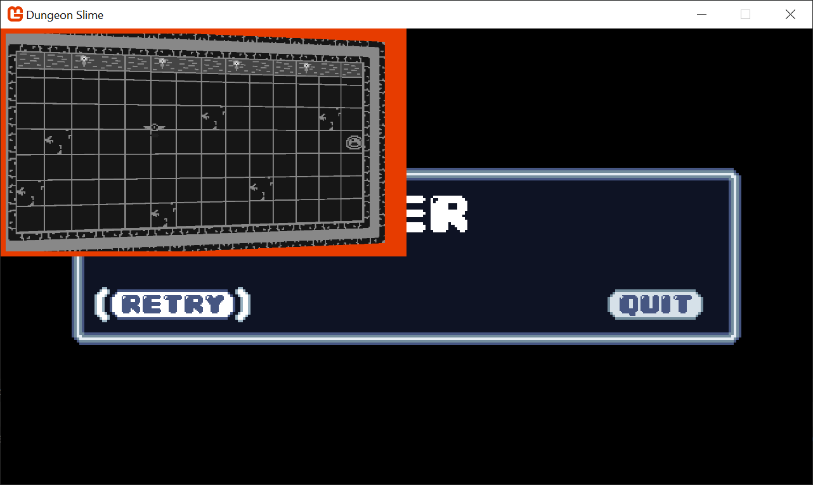

### Setting up the Light Buffer

The next step is to create some lights and render them to a second off-screen texture. To start, add a second `RenderTarget2D` property to the `DeferredRenderer` class.
```csharp
/// <summary>  
/// A texture that holds the drawn lights  
/// </summary>  
public RenderTarget2D LightBuffer { get; set; }
```

And initialize it in the constructor exactly the same as the `ColorBuffer` was initialized,
```csharp
LightBuffer = new RenderTarget2D(
	graphicsDevice: Core.GraphicsDevice, 
	width: viewport.Width,
	height: viewport.Height,
	mipMap: false,
	preferredFormat: SurfaceFormat.Color, 
	preferredDepthFormat: DepthFormat.None);
```

We need another method to switch MonoGame into drawing sprites onto the new off-screen texture,
```csharp
public void StartLightPhase()  
{  
    // all future draw calls will be drawn to the light buffer  
    Core.GraphicsDevice.SetRenderTarget(LightBuffer);  
    Core.GraphicsDevice.Clear(Color.Black);  
}
```

Then, we need to call the new method in the `GameScene`'s `Draw()` method between the current `SpriteBatch.End()` call and the `deferredRenderer.Finish()` call. 
```csharp
// Always end the sprite batch when finished.  
Core.SpriteBatch.End();  
  
// start rendering the lights  
_deferredRenderer.StartLightPhase();  
  
// TODO: draw lights  
  
// finish the deferred rendering  
_deferredRenderer.Finish();
```

To finish off with the `DeferredRenderer` changes for now, add the `LightBuffer` to the `DebugDraw()` view as well, 
```csharp
public void DebugDraw()
{
	var viewportBounds = Core.GraphicsDevice.Viewport.Bounds;
	
	// the debug view for the color buffer lives in the top-left.
	var colorBorderRect = new Rectangle(
		x: viewportBounds.X, 
		y: viewportBounds.Y, 
		width: viewportBounds.Width / 2,
		height: viewportBounds.Height / 2);
	
	// shrink the color rect by 8 pixels
	var colorRect = colorBorderRect;
	colorRect.Inflate(-8, -8);
	
	
	// the debug view for the light buffer lives in the top-right.
	var lightBorderRect = new Rectangle(
		x: viewportBounds.Width / 2, 
		y: viewportBounds.Y, 
		width: viewportBounds.Width / 2,
		height: viewportBounds.Height / 2);
	
	// shrink the light rect by 8 pixels
	var lightRect = lightBorderRect;
	lightRect.Inflate(-8, -8);

	
	Core.SpriteBatch.Begin();
	
	// draw a debug border
	Core.SpriteBatch.Draw(Core.Pixel, colorBorderRect, Color.MonoGameOrange);
	
	// draw the color buffer
	Core.SpriteBatch.Draw(ColorBuffer, colorRect, Color.White);
	
	//draw a debug border
	Core.SpriteBatch.Draw(Core.Pixel, lightBorderRect, Color.CornflowerBlue);
	
	// draw the light buffer
	Core.SpriteBatch.Draw(LightBuffer, lightRect, Color.White);
	
	Core.SpriteBatch.End();
}
```

Now when you run the game, you'll see a blank texture in the top-right. It is blank because there are no lights yet.
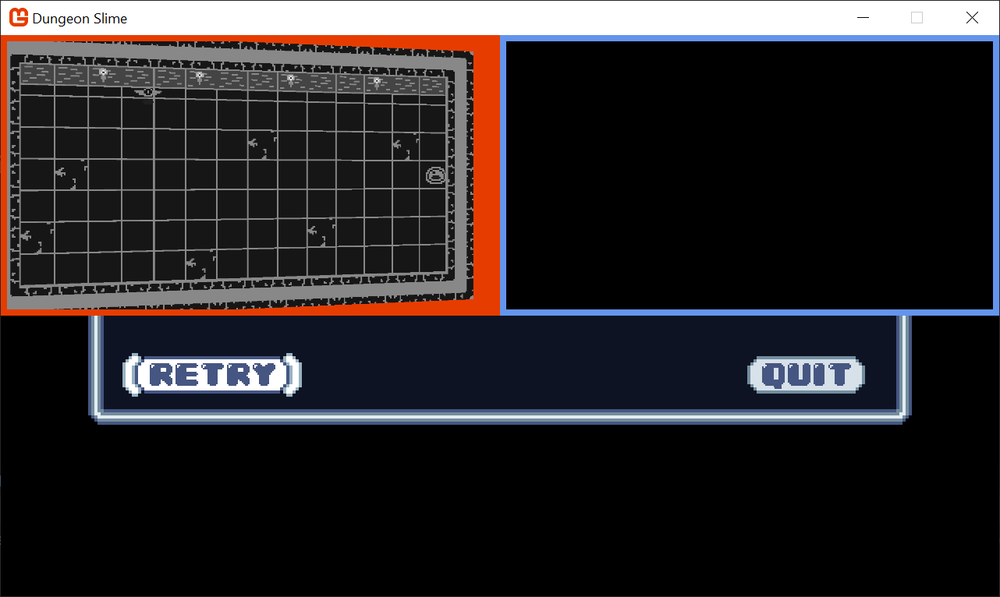

### Point Light Shader

Each light will be drawn using a shader so that the fall-off and intensity can be adjusted in real time. Use the `mgcb-editor` to create a new Sprite Effect in the _SharedContent_ folder. For now, leave it as the default shader. We need to load it in the `Core` class. First, create a new class member in the `Core` class, 

```csharp
/// <summary>  
/// The material that draws point lights  
/// </summary>  
public static Material PointLightMaterial { get; private set; }
```

And then load the `Material` in the `LoadContent()` method.
```csharp
PointLightMaterial = SharedContent.WatchMaterial("effects/pointLightEffect");
```

And don't forget to enable the hot-reload by adding the `Update()` line in the `Update()` method.
```csharp
PointLightMaterial.Update();
```


In order to handle multiple lights, it will be helpful to have a class to represent each light. Create a new file in the _MonoGameLibrary_'s graphics folder called `PointLight.cs`. 

```csharp
using System.Collections.Generic;
using Microsoft.Xna.Framework;
using Microsoft.Xna.Framework.Graphics;

namespace MonoGameLibrary.Graphics;

public class PointLight
{
    /// <summary>
    /// The position of the light in world space
    /// </summary>
    public Vector2 Position { get; set; }

    /// <summary>
    /// The color tint of the light
    /// </summary>
    public Color Color { get; set; } = Color.White;

    /// <summary>
    /// The radius of the light in pixels
    /// </summary>
    public int Radius { get; set; } = 250;
}
```

Now, create a `List<PointLight>` as a new class member in the `GameScene`. 
```csharp
// A list of point lights to be rendered  
private List<PointLight> _lights = new List<PointLight>();
```

In order to start building intuition for the point light shader, we need a debug light to experiment with. Add this snippet to the `GameScene`'s `Initialize()` method,
```csharp
_lights.Add(new PointLight  
{  
    Position = new Vector2(300,300)  
});
```

We need to draw the `PointLight` list using the new `PointLightMaterial`. Add the following function the `PointLight` class.
```csharp
public static void Draw(SpriteBatch spriteBatch, List<PointLight> pointLights)
{
	spriteBatch.Begin(
		effect: Core.PointLightMaterial.Effect
		);
	
	foreach (var light in pointLights)
	{
		var diameter = light.Radius * 2;
		var rect = new Rectangle((int)(light.Position.X - light.Radius), (int)(light.Position.Y - light.Radius), diameter, diameter);
		spriteBatch.Draw(Core.Pixel, rect, light.Color);
	}
	
	spriteBatch.End();
}
```

And call it from the `GameScene`'s `Draw()` method after the `StartLightPhase()` invocation.
```csharp
PointLight.Draw(Core.SpriteBatch, _lights);
```

Now when you run the game, you will see a blank white square where the point light is located (at 300,300). 

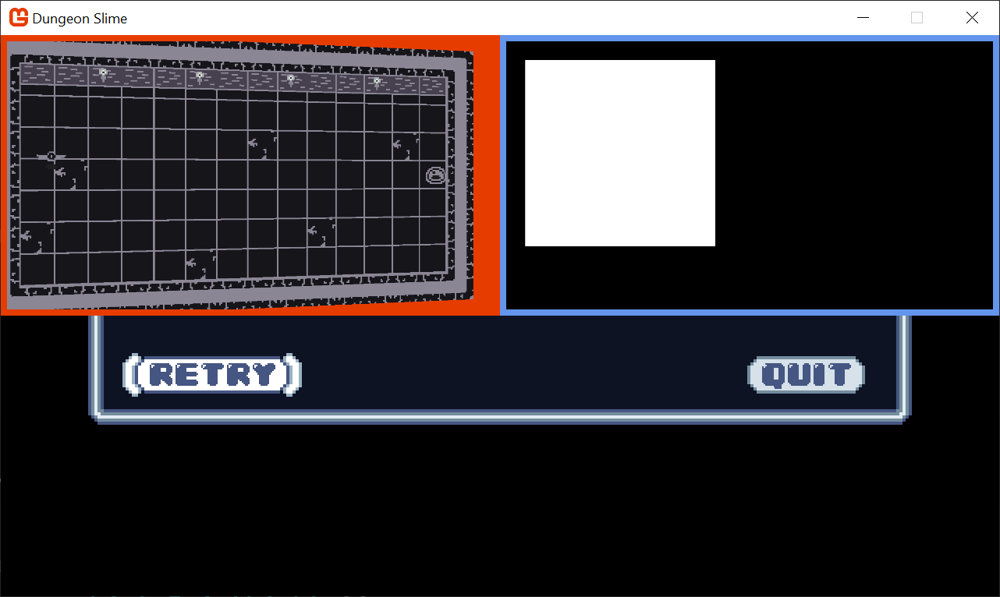

The next task is to write the `pointLightEffect.fx` shader file so that the white square looks more like a point light. There are several ways to create the effect, some more realistic than others. For _DungeonSlime_, a realistic light fall off isn't going to look great, so we will develop something custom. 

To start, calculate the distance from the center of the image, and render the distance as the red-channel.
```hlsl
float4 MainPS(VertexShaderOutput input) : COLOR  
{  
    float dist = length(input.TextureCoordinates - .5);     
    return float4(dist, 0, 0, 1);  
}
```

For the sake of clarity, these screenshots show only the `LightBuffer` as full screen. Here, we can see the distance based return value.
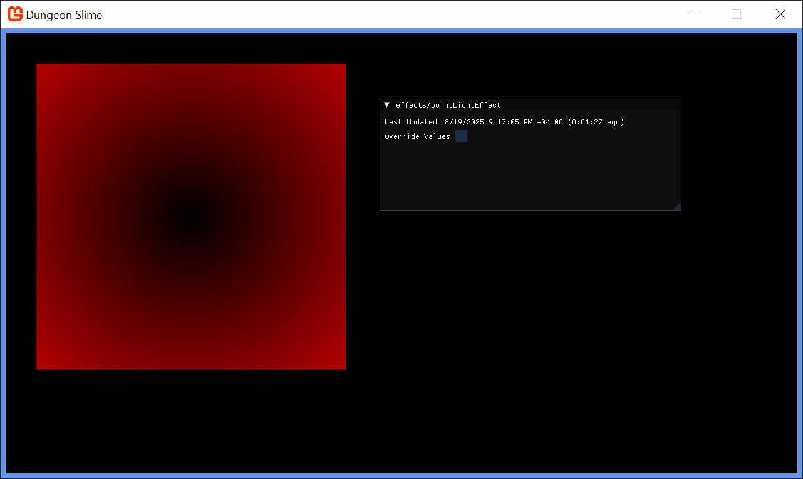

That starts to look like a light, but in reverse. Create a new variable, `falloff` which inverts the distance. The `saturate` function is shorthand for clamping the value between `0` and `1`. 

```hlsl
float4 MainPS(VertexShaderOutput input) : COLOR  
{  
    float dist = length(input.TextureCoordinates - .5);     
    
    float falloff = saturate(.5 - dist);  

    return float4(falloff, 0, 0, 1);  
      
}
```

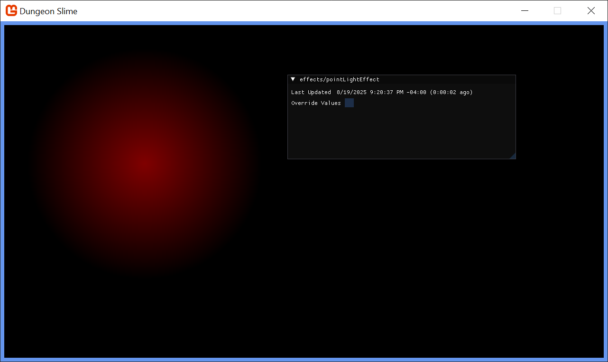

That looks more light-like. Now it is time to add some artistic control parameters to the shader. First, it would be good to be able to increase the brightness of the light. Multiplying the `falloff` by some number larger than 1 would increase the brightness, but leave the unlit sections completely unlit. 

```hlsl
float LightBrightness;  
  
float4 MainPS(VertexShaderOutput input) : COLOR  
{  
    float dist = length(input.TextureCoordinates - .5);     
    
    float falloff = saturate(.5 - dist) * (LightBrightness + 1);  
     
    return float4(falloff, 0, 0, 1);  
      
}
```

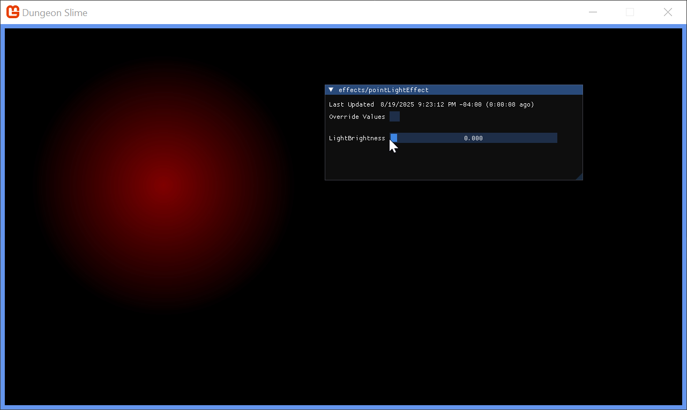

It would also be good to control the sharpness of the fall off. The `pow()` function raises the `falloff` to some exponent value.
```hlsl
float LightBrightness;  
float LightSharpness;  
  
float4 MainPS(VertexShaderOutput input) : COLOR  
{  
    float dist = length(input.TextureCoordinates - .5);     
    
    float falloff = saturate(.5 - dist) * (LightBrightness + 1);  
    falloff = pow(falloff, LightSharpness + 1);  
     
    return float4(falloff, 0, 0, 1);  
    
}
```

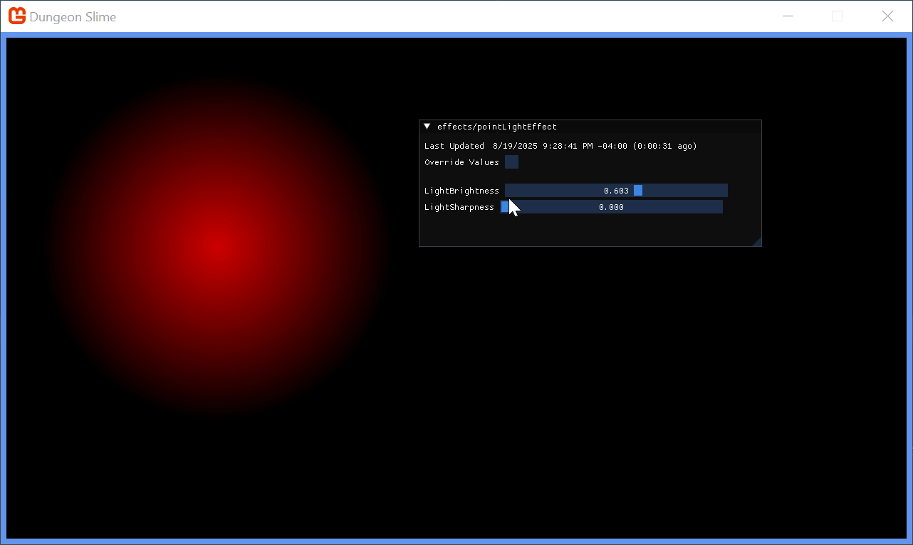

Finally, the shader parameters from `0` to `1`, but it would be nice to push the brightness and sharpness beyond `1`. Add a `range` multiplier in the shader code.

```hlsl
float LightBrightness;  
float LightSharpness;  
  
float4 MainPS(VertexShaderOutput input) : COLOR  
{  
    float dist = length(input.TextureCoordinates - .5);     
    
    float range = 5; // arbitrary maximum.   
    
    float falloff = saturate(.5 - dist) * (LightBrightness * range + 1);  
    falloff = pow(falloff, LightSharpness * range + 1);  
     
    return float4(falloff, 0, 0, 1);  
}
```


The final touch is to return the `Color` of the light, instead of the red debug value. The `input.Color` carries the `Color` passed through the `SpriteBatch`, so we can use that. Multiply the alpha channel of the color by the `falloff` to _fade_ the light out without changing the light color itself.

```hlsl
float LightBrightness;  
float LightSharpness;  
  
float4 MainPS(VertexShaderOutput input) : COLOR  
{  
    float dist = length(input.TextureCoordinates - .5);     
    
    float range = 5; // arbitrary maximum.   
    
    float falloff = saturate(.5 - dist) * (LightBrightness * range + 1);  
    falloff = pow(falloff, LightSharpness * range + 1);  
     
    float4 color = input.Color;  
    color.a = falloff;  
    return color;  
}
```

Change the light color in C# to `CornflowerBlue`. 
```csharp
_lights.Add(new PointLight  
{  
    Position = new Vector2(300,300),  
    Color = Color.CornflowerBlue  
});
```

And change the `blendState` of the light's `SpriteBatch` draw call to additive,
```csharp
spriteBatch.Begin(  
    effect: Core.PointLightMaterial.Effect,  
    blendState: BlendState.Additive  
    );
```

Set the shader parameter values for brightness and sharpness to something you like,
```csharp
PointLightMaterial = SharedContent.WatchMaterial("effects/pointLightEffect");  
PointLightMaterial.IsDebugVisible = true;  
PointLightMaterial.SetParameter("LightBrightness", .25f);  
PointLightMaterial.SetParameter("LightSharpness", .1f);
```

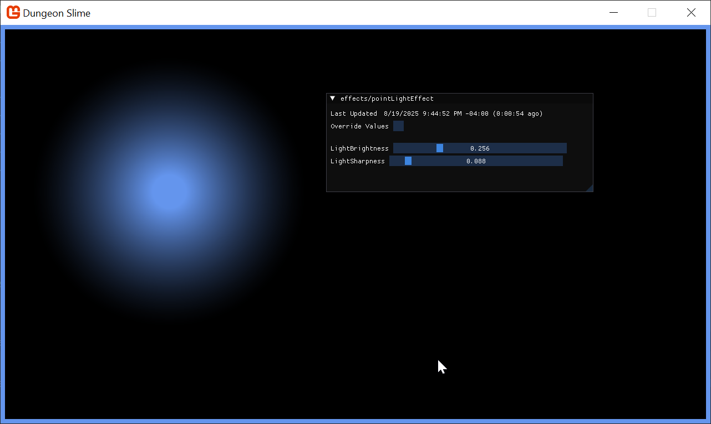

The light looks good! When we revert the full-screen `LightBuffer` and render the `LightBuffer` next to the `ColorBuffer`, a graphical bug will become clear. The world in the `ColorBuffer` is rotating with the vertex shader from the previous chapter, but the `LightBuffer` doesn't have the same effect, so the light appears broken. 


### Combining Light and Color 

Now that the light and color buffers are being drawn to separate off screen textures, we need to _composite_ them to create the final screen render. Create a new Sprite Effect in the shared content folder called `deferredCompositeEffect.fx`. 

Create a new class member in the `Core` class to hold the material,
```csharp
/// <summary>  
/// The material that combines the various off screen textures  
/// </summary>  
public static Material DeferredCompositeMaterial { get; private set; }
```

And load the effect in the `LoadContent()` method of the `Core` class. 
```csharp
DeferredCompositeMaterial = SharedContent.WatchMaterial("effects/deferredCompositeEffect");  
DeferredCompositeMaterial.IsDebugVisible = true;
```

To enable hot-reload support, add the `Update()` method,
```csharp
DeferredCompositeMaterial.Update();
```

Create a new method in the `DeferredRenderer` class that will draw the composited image.
```csharp
public void DrawComposite()
{
	var viewportBounds = Core.GraphicsDevice.Viewport.Bounds;
	Core.SpriteBatch.Begin(
		effect: Core.DeferredCompositeMaterial.Effect
		);
	Core.SpriteBatch.Draw(ColorBuffer, viewportBounds, Color.White);
	Core.SpriteBatch.End();   
}
```

And instead of calling the `DebugDraw()` from the `GameScene`, call the new method before the GUM UI is drawn.
```csharp
_deferredRenderer.Finish();  
_deferredRenderer.DrawComposite();
```

If you run the game now, it will appear as it did when we started the chapter! Now it is time to factor in the `LightBuffer`. The `deferredCompositeEffect` shader needs to get the `LightBuffer` and multiply it with the `ColorBuffer`. The `ColorBuffer` is being passed in as the main sprite from `SpriteBatch`, so we will need to add a second texture and sampler to the shader to get the `LightBuffer`. 

```hlsl
Texture2D LightBuffer;  
sampler2D LightBufferSampler = sampler_state  
{  
   Texture = <LightBuffer>;  
};
```

In the `DeferredRenderer` class, in the `DrawComposite` function before the sprite batch starts, make sure to pass the `LightBuffer` to the material.
```csharp
Core.DeferredCompositeMaterial.SetParameter("LightBuffer", LightBuffer);
```

The main pixel function for the shader reads both the color and light values and returns their product. 
```hlsl
float4 MainPS(VertexShaderOutput input) : COLOR
{
	float4 color = tex2D(SpriteTextureSampler,input.TextureCoordinates) * input.Color;
	float4 light = tex2D(LightBufferSampler,input.TextureCoordinates) * input.Color;

    return color * light;
}
```

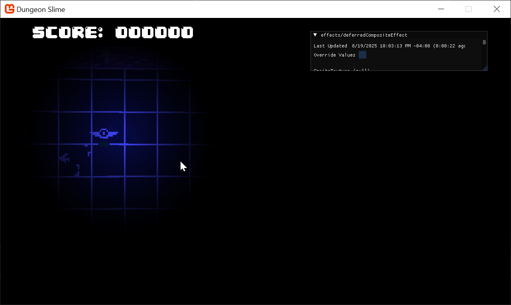

The light is working! However, the whole scene is too dark to see what is going on or play the game. To solve this, we can add a small amount of ambient light. 
```hlsl
float AmbientLight;

float4 MainPS(VertexShaderOutput input) : COLOR
{
	float4 color = tex2D(SpriteTextureSampler,input.TextureCoordinates) * input.Color;
	float4 light = tex2D(LightBufferSampler,input.TextureCoordinates) * input.Color;

    light = saturate(light + AmbientLight);
    return color * light;
}
```

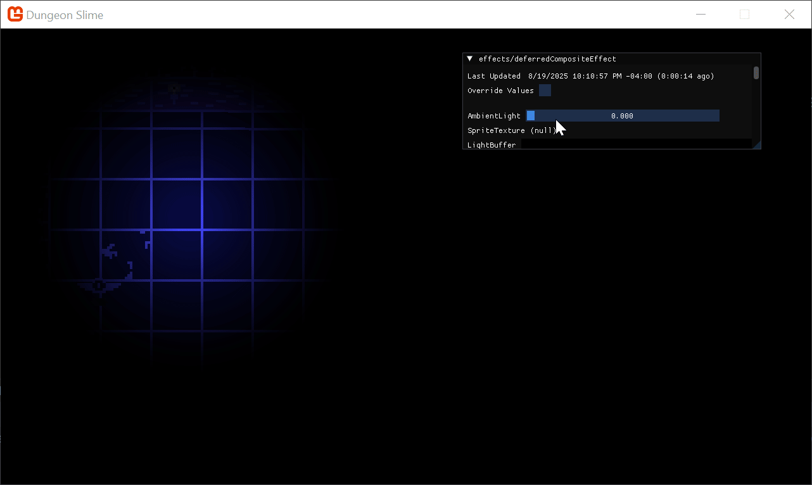

Find a value of ambient that you like and set the parameter from code.
```csharp
public void DrawComposite(float ambient=.4f)  
{  
    Core.DeferredCompositeMaterial.SetParameter("AmbientLight", ambient);
    // ... 
```

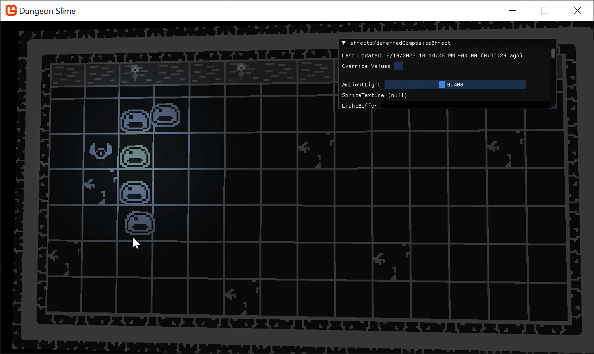

### Normal Textures

The lighting is working, but it still feels a bit flat. Ultimately, the light is being applied to our flat 2d sprites uniformly, so there the sprites don't feel like they have any depth. Normal mapping is a technique designed to help make flat surfaces appear 3d by changing how much the lighting affects each pixel depending on the "Normal" of the surface at the given pixel. 

Normal textures encode the _direction_ (also called the _normal_) of the surface at each pixel. The direction of the surface is a 3d vector where the `x` component lives in the `red` channel, the `y` component lives in the `green` channel, and the `z` component lives in the `blue` channel. The directions are encoded as colors, so each component can only range from `0` to `1`. The _direction_ vector components need to range from `-1` to `1`, so a color channel value of `.5` results in a `0` value for the direction vector. 

Generating normal maps is an artform. Generally, you find a _normal map picker_, similar to a color wheel, and paint the directions on-top of your existing artwork. This page on [open game art](https://opengameart.org/content/pixelart-normal-map-handpainting-helper) has a free normal map wheel that shows the colors for various directions along a low-resolution sphere. 


For this effect to work, we need an extra texture for every frame of every sprite we are drawing in the game. Given that the textures are currently coming from an atlas, the easiest thing to do will be to create a _second_ texture that shares the same layout as the first, but uses normal data instead. 

For reference, here is the existing atlas texture.

And here is the atlast, but with normal data where the game sprites are instead. Download the [atlas-normal.png](./images/atlas-normal.png) texture and add it to the _DungeonSlime_'s content folder. Include it in the mgcb content file. 

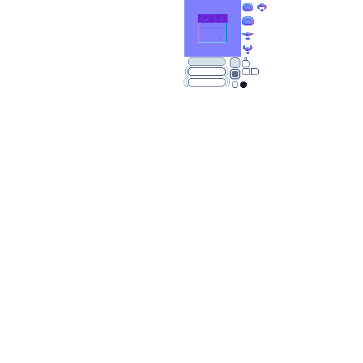
Everytime one of the game sprites is being drawn, we need to draw the corresponding normal texture information to yet another off-screen texture, called the `NormalBuffer`. Start by adding a new `RenderTarget2D` to the `DeferredRenderer` class.
```csharp
/// <summary>  
/// A texture that holds the normal sprite drawins  
/// </summary>  
public RenderTarget2D NormalBuffer { get; set; }
```

And initialize it in the `DeferredRenderer`'s constructor,
```csharp
NormalBuffer = new RenderTarget2D(  
    graphicsDevice: Core.GraphicsDevice,   
    width: viewport.Width,  
    height: viewport.Height,  
    mipMap: false,  
    preferredFormat: SurfaceFormat.Color,   
    preferredDepthFormat: DepthFormat.None);
```

So far in the series, all of the pixel shaders have returned a _single_ `float4` with the `COLOR` semantic. MonoGame supports _Multiple Render Targets_ by having a shader return a `struct` with _multiple_ fields each with a unique `COLOR` semantic. Add the following `struct` to the `gameEffect.fx` file,
```hlsl
struct PixelShaderOutput {  
    float4 color: COLOR0;  
    float4 normal: COLOR1;  
};
```

At the moment, the `gameEffect.fx` is just registering the `ColorSwapPS` function as the pixel function, but we will need to extend the logic to support the normal values. Create a new function in the file that will act as the new pixel shader function.
```hlsl
PixelShaderOutput MainPS(VertexShaderOutput input)  
{  
    PixelShaderOutput output;  
    output.color = ColorSwapPS(input);  
    output.normal = float4(1, 0, 0, 1); // for now, hard-code the normal to be red.
    return output;  
}
```

And don't forget to update the `technique` to reference the new `MainPS` function,
```hlsl
technique SpriteDrawing  
{  
   pass P0  
   {  
      VertexShader = compile VS_SHADERMODEL MainVS();  
      PixelShader = compile PS_SHADERMODEL MainPS();  
   }  
};
```

In C#, when the `GraphcisDevice.SetRenderTarget()` function is called, it sets the texture that the `COLOR0` semantic will be sent to. However, there is an overload called `SetRenderTargets()` that accepts _multiple_ `RenderTarget2D`s, and each additional texture will be assigned to the next `COLOR` semantic. Rewrite the `StartColorPhase()` function in the `DeferredRenderer` as follows,
```csharp
public void StartColorPhase()
{
	// all future draw calls will be drawn to the color buffer and normal buffer
	Core.GraphicsDevice.SetRenderTargets(new RenderTargetBinding[]
	{
		// gets the results from shader semantic COLOR0
		new RenderTargetBinding(ColorBuffer),
		
		// gets the results from shader semantic COLOR1
		new RenderTargetBinding(NormalBuffer)
	});
	Core.GraphicsDevice.Clear(Color.Transparent);
}
```

> [!note]
> The _G0Buffer_
> The `ColorBuffer` and `NormalBuffer` are grouped together and often called the _Geometry-Buffer_ (G-Buffer). In other deferred renderers, there is even more information stored in the G-Buffer as additional textures, such as depth information, material information, or game specific data. 

To visualize the `NormalBuffer`, we will switch back to the `DebugDraw()` method. The `NormalBuffer` will be rendered in the lower-left corner of the screen. 
```csharp
// the debug view for the normal buffer lives in the top-right.  
var normalBorderRect = new Rectangle(  
    x: viewportBounds.X,   
    y: viewportBounds.Height / 2,   
    width: viewportBounds.Width / 2,  
    height: viewportBounds.Height / 2);  
  
// shrink the normal rect by 8 pixels  
var normalRect = normalBorderRect;  
normalRect.Inflate(-8, -8);

// ...

  
// draw a debug border  
Core.SpriteBatch.Draw(Core.Pixel, normalBorderRect, Color.MintCream);  
  
// draw the light buffer  
Core.SpriteBatch.Draw(NormalBuffer, normalRect, Color.White);
```

And don't forget to call the `DebugDraw()` method from the `GameScene`'s `Draw()` method. Then you will see a totally `red` `NormalBuffer`, because the shader is hard coding the value to `float4(1,0,0,1)`. 


To start rendering the normal values themselves, we need to load the normal texture into the `GameScene` and pass it along to the `gameEffect.fx` effect. First, create a class member for the new `Texture2D`.
```csharp
// The normal texture atlas  
private Texture2D _normalAtlas;
```

Then load the texture in the `LoadContent()` method,
```csharp
// Load the normal maps  
_normalAtlas = Content.Load<Texture2D>("images/atlas-normal");
```

And finally, pass it to the `_gameEffect` material as a parameter, 
```csharp
_gameMaterial.SetParameter("NormalMap", _normalAtlas);
```

The shader itself needs to expose a `Texture2D` and `Sampler` state for the new normal texture.
```hlsl
Texture2D NormalMap;  
sampler2D NormalMapSampler = sampler_state  
{  
   Texture = <NormalMap>;  
};
```

And then finally the `MainPS` shader function needs to read the `NormalMap` data for the current pixel.
```hlsl
PixelShaderOutput MainPS(VertexShaderOutput input)  
{  
    PixelShaderOutput output;  
    output.color = ColorSwapPS(input);  
      
    // read the normal data from the NormalMap  
    float4 normal = tex2D(NormalMapSampler,input.TextureCoordinates);  
    output.normal = normal;  
      
    return output;  
}
```

Now the `NormalBuffer` is being populated with the normal data for each sprite.
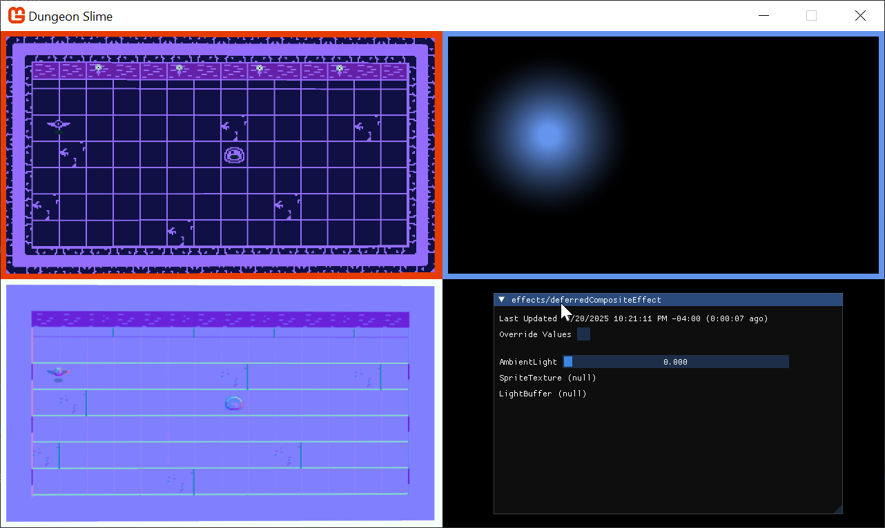

### Combing Normals with Lights

When each individual light is drawn into the `LightBuffer`, it needs to use the `NormalBuffer` information to modify the amount of light being drawn at each pixel. To set up, the `PointLightMaterial` is going to need access to the `NormalBuffer`. Start by modifying the `PointLight.Draw()` function to take in the `NormalMap` as a `Texture2D`, and set it as a parameter on the `PointLightMaterial`. 
```csharp
public static void Draw(SpriteBatch spriteBatch, List<PointLight> pointLights, Texture2D normalBuffer)  
{  
    Core.PointLightMaterial.SetParameter("NormalBuffer", normalBuffer);
    // ...
```

And then to pass the `NormalBuffer`, modify the `GameScene`'s `Draw()` method to pass the buffer.
```csharp
// start rendering the lights  
_deferredRenderer.StartLightPhase();  
PointLight.Draw(Core.SpriteBatch, _lights, _deferredRenderer.NormalBuffer);
```

The `pointLightEffect.fx` shader needs to accept the `NormalBuffer` as a new `Texture2D` and `Sampler`. 
```hlsl
Texture2D NormalBuffer;  
sampler2D NormalBufferSampler = sampler_state  
{  
   Texture = <NormalBuffer>;  
};
```

The challenge is to find the normal value of the pixel that the light is currently shading in the pixel shader. However, the shader's `uv` coordinate space is relative to the light itself, not the screen. The `NormalBuffer` is relative to the entire screen, not the light. We need to be able to convert the light's `uv` coordinate space into screen space. This can be done in a custom vertex shader. The vertex shader's job is to convert the world space into clip space, which in a 2d game like _Dungeon Slime_, essentially _is_ screen space. The screen coordinates can be calculated in the vertex function, and then passed along to the pixel shader by extending the outputs of the vertex shader struct. 

In order to override the vertex shader function, we will need to repeat the `MatrixTransform` work from the previous chapter. However, it would better to _re-use_ the work from the previous chapter so that the lights also tilt and respond to the `MatrixTransform` that the rest of the game world uses. 

Add a reference in the `3dEffect.fxh` file in the `pointLightEffect.fx` shader.
```hlsl
#include "3dEffect.fxh"
```

However, we need to _extend_ the vertex function and add the extra field. 
Create a new struct in the `pointLightEffect.fx` file,
```hlsl
struct LightVertexShaderOutput  
{  
   float4 Position : SV_POSITION;  
   float4 Color : COLOR0;  
   float2 TextureCoordinates : TEXCOORD0;  
   float2 ScreenCoordinates : TEXCOORD1;  
};
```

Then, create a new vertex function that uses the new `LightVertexShaderOutput`. This function will call to the existing `MainVS` function that does the 3d effect, and add the screen coordinates afterwards. 
```hlsl
LightVertexShaderOutput LightVS(VertexShaderInput input)
{
	LightVertexShaderOutput output;

	VertexShaderOutput mainVsOutput = MainVS(input);

	// forward along the existing values from the MainVS's output
	output.Position = mainVsOutput.Position;
	output.Color = mainVsOutput.Color;
	output.TextureCoordinates = mainVsOutput.TextureCoordinates;
	
	// normalize from -1,1 to 0,1
	output.ScreenCoordinates = .5 * (float2(output.Position.xy) + 1);
	
	// invert the y coordinate, because MonoGame flips it. 
	output.ScreenCoordinates.y = 1 - output.ScreenCoordinates.y;
    
	return output;
}
```

Make sure to update the `technique` to use the new vertex function.
```hlsl
technique SpriteDrawing  
{  
   pass P0  
   {  
      VertexShader = compile VS_SHADERMODEL LightVS();  
      PixelShader = compile PS_SHADERMODEL MainPS();  
   }  
};
```

In the pixel function, to visualize the screen coordinates, we will short-circuit the existing light code and just render out the screen coordinates. First, modify the input of the pixel function to be the `LightVertexShaderOutput` struct that was returned from the `LightVS` vertex function.
```hlsl
float4 MainPS(LightVertexShaderOutput input) : COLOR
```

And make the function immediately return the screen coordinates in the red and green channel.
```hlsl
return float4(input.ScreenCoordinates.xy, 0, 1);
```

Be careful, if you run the game now, it won't look right. We need to make sure to send the `MatrixTransform` parameter from C# as well.
In the `GameScene`'s `Update()` method, make sure to pass the `MatrixTransform` to _both_ the `_gameMaterial` _and_ the `Core.PointLightMaterial`. The `ScreenSize` parameter also needs to be sent.
```csharp
var matrixTransform = _camera.CalculateMatrixTransform();  
_gameMaterial.SetParameter("MatrixTransform", matrixTransform);  
Core.PointLightMaterial.SetParameter("MatrixTransform", matrixTransform);
Core.PointLightMaterial.SetParameter("ScreenSize", new Vector2(Core.GraphicsDevice.Viewport.Width, Core.GraphicsDevice.Viewport.Height));
```

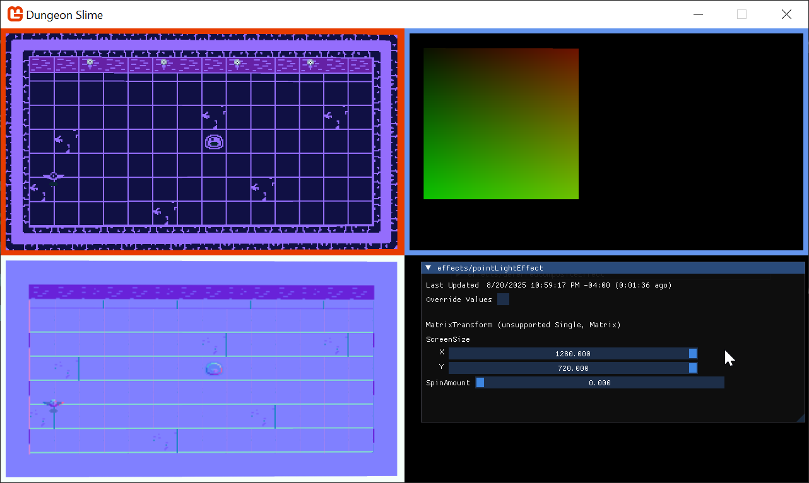

Now, the `pointLightEffect` can use the screen space coordinates to sample the `NormalBuffer` values.
To build intuition, start by just returning the values from the `NormalBuffer`. Start by reading those values, and then return immediately.
```hlsl
float4 MainPS(LightVertexShaderOutput input) : COLOR  
{  
    float4 normal = tex2D(NormalBufferSampler,input.ScreenCoordinates);  
    return normal;
}
```

Strangely, this will return a `white` box, instead of the normal data as expected.
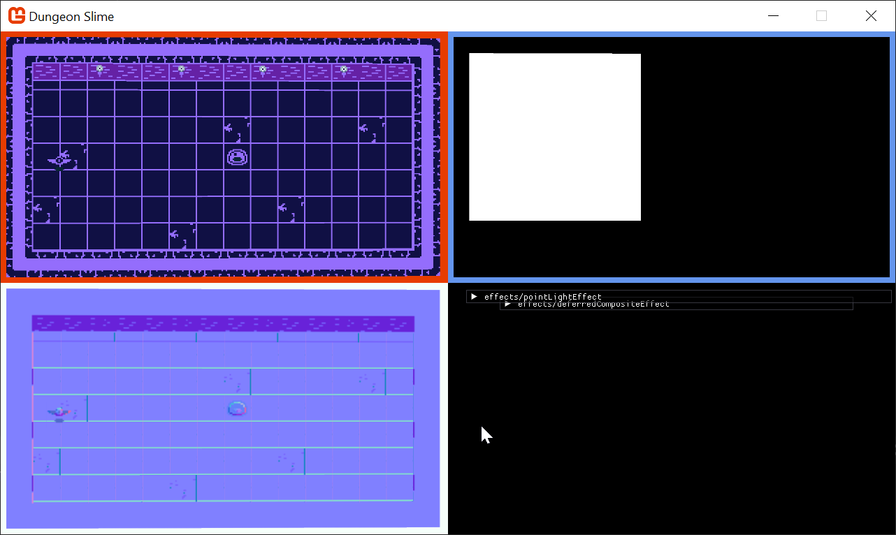

This happens because of a misunderstanding between the shader compiler and `SpriteBatch`. _Most_ of the time when `SpriteBatch` is being used, there is a single `Texture` and `Sampler` being used to draw a sprite to the screen. The `SpriteBatch`'s draw function passes the given `Texture2D` to the shader by setting it in the `GraphicsDevice.Textures` array [directly](https://github.com/MonoGame/MonoGame/blob/develop/MonoGame.Framework/Graphics/SpriteBatcher.cs#L212). The texture is not being passed _by name_, it is being passed by _index_. In the lighting case, the `SpriteBatch` is being drawn with the `Core.Pixel` texture (a white 1x1 image we generated in the earlier chapters). 

However, the shader compiler will aggressively optimize away data that isn't being used in the shader. The current `pointLightEffect.fx` doesn't _use_ the default texture or sampler that `SpriteBatch` expects by default. The default texture is _removed_ from the shader during compilation, because it isn't used anywhere and has no effect. The only texture that is left is the `NormalBuffer`, which now becomes the first indexable texture. 

Despite passing the `NormalBuffer` texture to the named `NormalTexture` `Texture2D` parameter in the shader before calling `SpriteBatch.Draw()`, the `SpriteBatch` code itself then overwrites whatever is in texture slot `0` with the texture passed to the `Draw()` call, the white pixel. 

There are two workarounds. If performance is not _critical_, you could add back in a throw-away read from the main `SpriteTextureSampler` , and use the resulting color _somehow_ in the computation for the final result of the shader. However, this is useless work, and will likely confuse anyone who looks at the shader in the future. The other workaround is to pass the `NormalBuffer` to the `Draw()` function directly, and not bother sending it as a shader parameter at all. 

Change the `PointLight.Draw()` method to pass the `normalBuffer` to the `SpriteBatch.Draw()` method _instead_ of passing it in as a parameter to the `PointLightMaterial`. Here is the new `PointLight.Draw()` method,
```csharp
public static void Draw(SpriteBatch spriteBatch, List<PointLight> pointLights, Texture2D normalBuffer)
{
	spriteBatch.Begin(
		effect: Core.PointLightMaterial.Effect,
		blendState: BlendState.Additive
		);
	
	foreach (var light in pointLights)
	{
		var diameter = light.Radius * 2;
		var rect = new Rectangle((int)(light.Position.X - light.Radius), (int)(light.Position.Y - light.Radius), diameter, diameter);
		spriteBatch.Draw(normalBuffer, rect, light.Color);
	}
	
	spriteBatch.End();
}
```

And now the normal map is being rendered where the light exists.
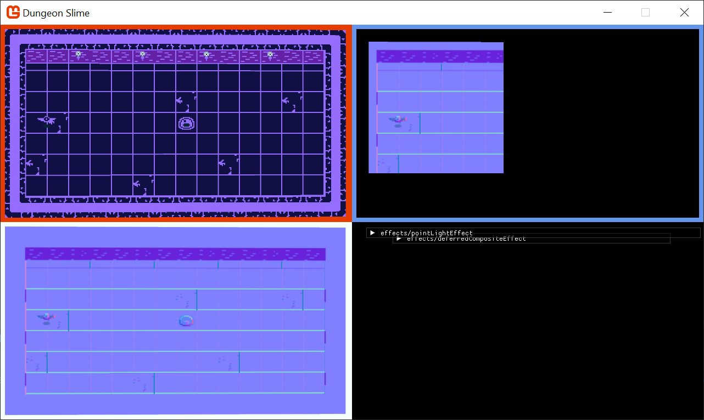

Now it is time to _use_ the normal data in conjunction with the light direction to decide how much light each pixel should receive. Add this shader code to the pixel function.
```hlsl
float4 normal = tex2D(NormalBufferSampler,input.ScreenCoordinates);  
  
// convert from [0,1] to [-1,1]  
float3 normalDir = (normal.xyz-.5)*2;  
  
// find the direction the light is travelling at the current pixel  
float3 lightDir = float3( normalize(input.TextureCoordinates - .5), 1);  
  
// how much is the normal direction pointing towards the light direction?  
float lightAmount = saturate(dot(normalDir, lightDir));
```

And then make the final color use the `lightAmount`.
```hlsl
color.a *= falloff * lightAmount;
```

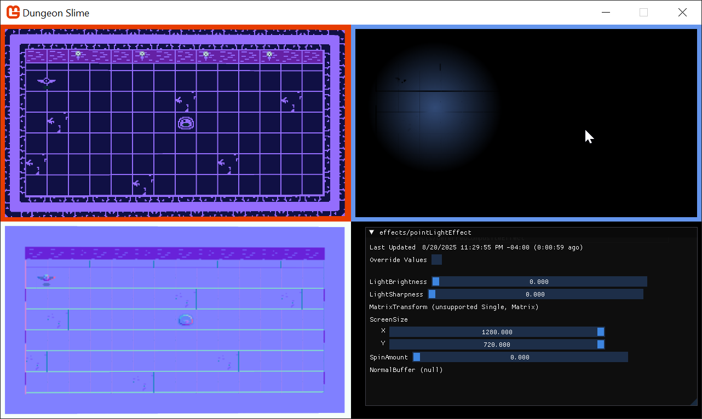

To drive the effect for a moment, this gif shows the normal effect being blended in. Notice how the wings on the bat shade differently based on their position towards the light as the normal effect is brought in. 
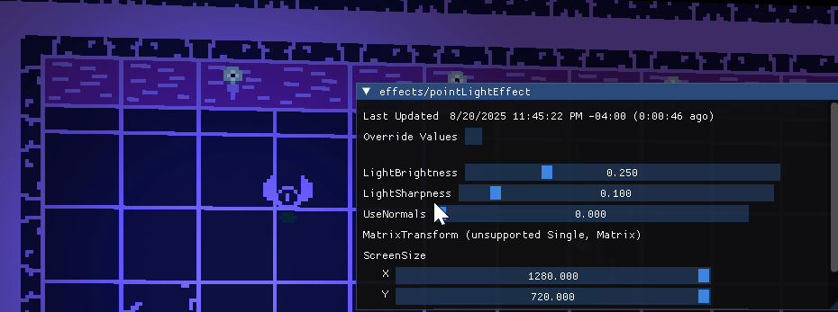

### Gameplay

Now that we have lights rendering in the game, it is time to hook a few more up in the game. There should be a light positioned next to each torch along the upper wall, and maybe a few lights that wonder around the level. 

Create a function in the `GameScene` that will initialize all of the lights. Feel free to add more.
```csharp
private void InitializeLights()
{
	// torch 1
	_lights.Add(new PointLight
	{
		Position = new Vector2(260, 100),
		Color = Color.CornflowerBlue,
		Radius = 500
	});
	// torch 2
	_lights.Add(new PointLight
	{
		Position = new Vector2(520, 100),
		Color = Color.CornflowerBlue,
		Radius = 500
	});
	// torch 3
	_lights.Add(new PointLight
	{
		Position = new Vector2(740, 100),
		Color = Color.CornflowerBlue,
		Radius = 500
	});
	// torch 4
	_lights.Add(new PointLight
	{
		Position = new Vector2(1000, 100),
		Color = Color.CornflowerBlue,
		Radius = 500
	});
	
	// random lights
	_lights.Add(new PointLight
	{
		Position = new Vector2(Random.Shared.Next(50, 400),400),
		Color = Color.MonoGameOrange,
		Radius = 500
	});
	_lights.Add(new PointLight
	{
		Position = new Vector2(Random.Shared.Next(650, 1200),300),
		Color = Color.MonoGameOrange,
		Radius = 500
	});
}

```

Given that the lights have a dynamic nature to them with the normal maps, it would be good to move some of them around. 

Add this function to the `GameScene`, 
```csharp
private void MoveLightsAround(GameTime gameTime)
{
	var t = (float)gameTime.TotalGameTime.TotalSeconds * .25f;
	var bounds = Core.GraphicsDevice.Viewport.Bounds;
	bounds.Inflate(-100, -100);

	var halfWidth = bounds.Width / 2;
	var halfHeight = bounds.Height / 2;
	var center = new Vector2(halfWidth, halfHeight);
	_lights[^1].Position = center + new Vector2(halfWidth * MathF.Cos(t), .7f * halfHeight * MathF.Sin(t * 1.1f));
	_lights[^2].Position = center + new Vector2(halfWidth * MathF.Cos(t + MathHelper.Pi), halfHeight * MathF.Sin(t - MathHelper.Pi));
}
```

And call it from the `Update()` method,
```csharp
// Move some lights around for artistic effect  
MoveLightsAround(gameTime);
```

And now when the game runs, it looks like this.


## Conclusion

In this chapter, you accomplished the following:

- Learned the theory behind deferred rendering.
- Set up a rendering pipeline with multiple render targets (G-buffers) for color and normals.
- Created a point light shader.
- Used normal maps to allow 2D sprites to react to light as if they had 3D depth.
- Wrote a final composite shader to combine all the buffers into the final lit scene.

Our world is so much more atmospheric now, but there's one key ingredient missing... shadows! In our next and final effects chapter, we'll bring our lights to life by making them cast dynamic shadows.

You can find the complete code sample for this chapter, [here](https://github.com/MonoGame/MonoGame.Samples/tree/3.8.4/Tutorials/2dShaders/src/08-Light-Effect). 

Continue to the next chapter, [Chapter 09: Shadows Effect](../09_shadows_effect/index.md)