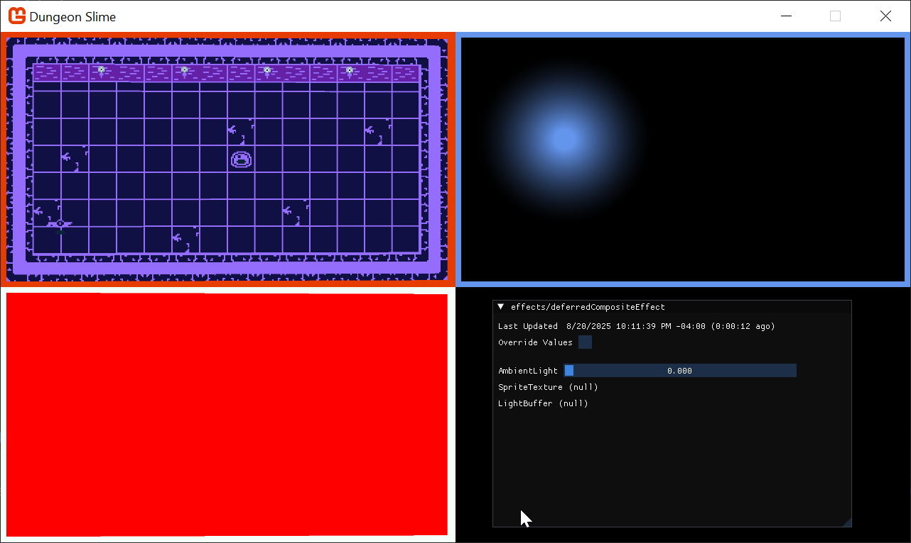

In this chapter, we are going to add a dynamic 2d lighting system to _Dungeon Slime_. At the end of this chapter, the game will look something like this: 

|  |
| :-------------------------------------------------: |
|         **Figure 8-1: The game will have lighting**          |

So far, the game's rendering has been fairly straightforward. The game consists of a bunch of sprites, and all those sprites are drawn straight to the screen using a custom shader effect. Adding lights is going to complicate the rendering, because now each sprite must consider _N_ number of lights before being drawn to the screen. 

There are two broad categories of strategies for rendering lights in a game, 
1. _Forward_ rendering, and
2. _Deferred_ rendering. 

In the earlier days of computer graphics, forward renderers were ubiquitous. Imagine a simple 2d where there is a single sprite with 3 lights nearby. The sprite would be rendered 3 times, once for each light. Each individual pass would layer any existing passes with the next light. This technique is forward rendering, and there are many optimizations that make it fast and efficient. However, in a scene with lots of objects and lots of lights, each object needs to be rendered for each light, and the amount of rendering can scale poorly. The amount of work the renderer needs to do is roughly proportional to the number of sprites (`S`) multiplied by the number of lights (`L`), or `S * L`. 

In the 2000's, the deferred rendering strategy was [introduced](https://sites.google.com/site/richgel99/the-early-history-of-deferred-shading-and-lighting) and popularized by games like [S.T.A.L.K.E.R](https://developer.nvidia.com/gpugems/gpugems2/part-ii-shading-lighting-and-shadows/chapter-9-deferred-shading-stalker). In deferred rendering, each object is drawn _once_ without _any_ lights to an off-screen texture. Then, each light is drawn on top of the off-screen texture. To make that possible, the initial rendering pass draws extra data about the scene into additional off-screen textures. Theoretically, a deferred renderer can handle more lights and objects because the work is roughly approximate to the sprites (`S`) _added_ to the lights (`L`), or `S + L`. 

Deferred rendering was popular for several years. MonoGame is an adaptation of XNA, which came out in the era of deferred rendering. However, deferred renderers are not a silver bullet for performance and graphics programming. The crux of a deferred renderer is to bake data into off-screen textures, and as monitor resolutions have gotten larger and larger, the 4k resolutions are starting to add too much overhead. Also, deferred renderers cannot handle transparent materials. Many big game projects use deferred rendering for _most_ of the scene, and a forward renderer for the final transparent components of the scene. As with all things, which type of rendering to use is a nuanced decision. There are new types of forward rendering strategies (see, [clustered rendering](https://github.com/DaveH355/clustered-shading)) that can out perform deferred renderers. However, for our use cases, the deferred rendering technique is sufficient. 

If you are following along with code, here is the code from the end of the [previous chapter](https://github.com/MonoGame/MonoGame.Samples/tree/3.8.4/Tutorials/2dShaders/src/07-Sprite-Vertex-Effect).

## Adding Deferred Rendering

Writing a simple deferred renderer can be worked out in a few steps, 
1. take the scene as we are drawing it currently, and store it in an off-screen texture. This texture is often called the diffuse texture, or color texture.
2. render the scene again, but instead of drawing the sprites normally, draw their _Normal_ maps to an off-screen texture, called the normal texture.
3. create a new off-screen texture, called the light texture, where each light is layered on-top of each other,
4. finally, create a rendering to the screen based on the lighting texture and the color texture.

The second stage references a new term, called the _Normal_ Map. We will come back to this later in the chapter. For now, we will focus on the other steps. 

### Drawing to an off-screen texture

To get started, we need to draw the main game sprites to an off-screen texture instead of directly to the screen. Create a new file in the shared _MonoGameLibrary_ graphics folder called `DeferredRenderer.cs`:

[!code-csharp]

The `ColorBuffer` property is a [`RenderTarget2D`](xref:Microsoft.Xna.Framework.Graphics.RenderTarget2D), which is a special type of [`Texture2D`](xref:Microsoft.Xna.Framework.Graphics.Texture2D) that MonoGame can draw into. In order for MonoGame to draw anything into the `ColorBuffer`, it needs to be bound as the current render target. Add the following function to the `DeferredRenderer` class. The `SetRenderTarget()` function instructs all future MonoGame draw operations to render into the `ColorBuffer`:

[!code-csharp]

Once all of the rendering is complete, we need to switch the primary render target back to the _screen_ so that we can actually see anything. Add the following method to the `DeferredRenderer` class. Note that `null` is a special value when it comes to `RenderTarget2D`s. `null` translates to "the screen":

[!code-csharp]

Now we can use this new off-screen texture in the `GameScene`. Add a new class member in the `GameScene` :

[!code-csharp]

And initialize it in the `Initialize()` method:

[!code-csharp]

Then, to actually _use_ the new off-screen texture, we need to invoke the `StartColorPhase()` and `Finish()` methods in the `Draw()` method of the `GameScene`. Right before the `SpriteBatch.Begin()` class, invoke the `StartColorPhase()` method. Here is the `Draw()` method with most of the code left out, but it demonstrates where the `StartColorPhase()` and `Finish()` methods belong:

[!code-csharp]

If you run the game now, the game will appear blank except for the UI. That is because the game is rendering to an off-screen texture, but nothing is rendering the off-screen texture _back_ to the screen. For now, we will add some diagnostic visualization of the off-screen texture. Add the following function to the `DeferredRenderer` class. This function starts a new sprite batch and draws the `ColorBuffer` to the top-left corner of the screen, with an orange border around it to indicate it is a debug visualization:

[!code-csharp]

And call this method from end the `Draw()` method, after the GUM UI draws:

[!code-csharp]

Now when you run the game, you should see the game appearing in the upper-left corner of the screen.

|  |
| :-------------------------------------------------------------------: |
|              **Figure 8-2: The color buffer debug view**              |

### Setting up the Light Buffer

The next step is to create some lights and render them to a second off-screen texture. To start, add a second `RenderTarget2D` property to the `DeferredRenderer` class:

[!code-csharp]

And initialize it in the constructor exactly the same as the `ColorBuffer` was initialized:

[!code-csharp]

We need another method to switch MonoGame into drawing sprites onto the new off-screen texture:

[!code-csharp]

Then, we need to call the new method in the `GameScene`'s `Draw()` method between the current `SpriteBatch.End()` call and the `deferredRenderer.Finish()` call:

[!code-csharp]

To finish off with the `DeferredRenderer` changes for now, add the `LightBuffer` to the `DebugDraw()` view as well:

[!code-csharp]

Now when you run the game, you'll see a blank texture in the top-right. It is blank because there are no lights yet.

|  |
| :--------------------------------------------------------------: |
|               **Figure 8-3: A blank light buffer**               |

### Point Light Shader

Each light will be drawn using a shader so that the fall-off and intensity can be adjusted in real time. Use the `mgcb-editor` to create a new Sprite Effect in the _SharedContent_ folder. For now, leave it as the default shader. We need to load it in the `Core` class. First, create a new class member in the `Core` class:

[!code-csharp]

And then load the `Material` in the `LoadContent()` method:

[!code-csharp]

And do not forget to enable the hot-reload by adding the `Update()` line in the `Update()` method:

[!code-csharp]

In order to handle multiple lights, it will be helpful to have a class to represent each light. Create a new file in the _MonoGameLibrary_'s graphics folder called `PointLight.cs`:

[!code-csharp]

Now, create a `List<PointLight>` as a new class member in the `GameScene`:

[!code-csharp]

In order to start building intuition for the point light shader, we need a debug light to experiment with. Add this snippet to the `GameScene`'s `Initialize()` method:

[!code-csharp]

We need to draw the `PointLight` list using the new `PointLightMaterial`. Add the following function the `PointLight` class:

[!code-csharp]

And call it from the `GameScene`'s `Draw()` method after the `StartLightPhase()` invocation:

[!code-csharp]

Now when you run the game, you will see a blank white square where the point light is located (at 300,300). 

|  |
| :------------------------------------------------------------------------: |
|               **Figure 8-4: The light buffer with a square**               |

The next task is to write the `pointLightEffect.fx` shader file so that the white square looks more like a point light. There are several ways to create the effect, some more realistic than others. For _DungeonSlime_, a realistic light fall off isn't going to look great, so we will develop something custom. 

To start, calculate the distance from the center of the image, and render the distance as the red-channel:

[!code-hlsl]

For the sake of clarity, these screenshots show only the `LightBuffer` as full screen. Here, we can see the distance based return value.

|  |
| :----------------------------------------------------------------------------------------------------------------: |
|                **Figure 8-5: Showing the distance from the center of the light in the red channel**                |

That starts to look like a light, but in reverse. Create a new variable, `falloff` which inverts the distance. The `saturate` function is shorthand for clamping the value between `0` and `1`:

[!code-hlsl]

|  |
| :--------------------------------------------------------------------: |
|                  **Figure 8-6: Invert the distance**                   |

That looks more light-like. Now it is time to add some artistic control parameters to the shader. First, it would be good to be able to increase the brightness of the light. Multiplying the `falloff` by some number larger than 1 would increase the brightness, but leave the unlit sections completely unlit:

[!code-hlsl]

|  |
| :---------------------------------------------------------------------------: |
|                  **Figure 8-7: A LightBrightness parameter**                  |

It would also be good to control the sharpness of the fall off. The `pow()` function raises the `falloff` to some exponent value:

[!code-hlsl]

|  |
| :-------------------------------------------------------------------------: |
|                 **Figure 8-8: A LightSharpness parameter**                  |

Finally, the shader parameters from `0` to `1`, but it would be nice to push the brightness and sharpness beyond `1`. Add a `range` multiplier in the shader code:

[!code-hlsl]

|  |
| :----------------------------------------------------------------------------------------: |
|               **Figure 8-9: Increase the range of the artistic parameters**                |

The final touch is to return the `Color` of the light, instead of the red debug value. The `input.Color` carries the `Color` passed through the `SpriteBatch`, so we can use that. Multiply the alpha channel of the color by the `falloff` to _fade_ the light out without changing the light color itself:

[!code-hlsl]

Change the light color in C# to `CornflowerBlue`:

[!code-csharp]

And change the `blendState` of the light's `SpriteBatch` draw call to additive:

[!code-csharp]

Set the shader parameter values for brightness and sharpness to something you like:

[!code-csharp]

|  |
| :-------------------------------------------------------------------------------: |
|                **Figure 8-10: The point light in the light buffer**                |

The light looks good! When we revert the full-screen `LightBuffer` and render the `LightBuffer` next to the `ColorBuffer`, a graphical bug will become clear. The world in the `ColorBuffer` is rotating with the vertex shader from the previous chapter, but the `LightBuffer` does not have the same effect, so the light appears broken. 

### Combining Light and Color 

Now that the light and color buffers are being drawn to separate off screen textures, we need to _composite_ them to create the final screen render. Create a new Sprite Effect in the shared content folder called `deferredCompositeEffect.fx`. 

Create a new class member in the `Core` class to hold the material:

[!code-csharp]

And load the effect in the `LoadContent()` method of the `Core` class:

[!code-csharp]

To enable hot-reload support, add the `Update()` method:

[!code-csharp]

Create a new method in the `DeferredRenderer` class that will draw the composited image:

[!code-csharp]

And instead of calling the `DebugDraw()` from the `GameScene`, call the new method before the GUM UI is drawn:

[!code-csharp]

If you run the game now, it will appear as it did when we started the chapter! Now it is time to factor in the `LightBuffer`. The `deferredCompositeEffect` shader needs to get the `LightBuffer` and multiply it with the `ColorBuffer`. The `ColorBuffer` is being passed in as the main sprite from `SpriteBatch`, so we will need to add a second texture and sampler to the shader to get the `LightBuffer`:

[!code-hlsl]

In the `DeferredRenderer` class, in the `DrawComposite` function before the sprite batch starts, make sure to pass the `LightBuffer` to the material:

[!code-csharp]

The main pixel function for the shader reads both the color and light values and returns their product:

[!code-hlsl]

|  |
| :----------------------------------------------------------------------: |
|             **Figure 8-11: The light and color composited**              |

The light is working! However, the whole scene is too dark to see what is going on or play the game. To solve this, we can add a small amount of ambient light:

[!code-hlsl]

|  |
| :----------------------------------------------------------------: |
|               **Figure 8-12: Adding ambient light**                |

Find a value of ambient that you like and set the parameter from code:

[!code-csharp]

|  |
| :--------------------------------------------------------------------------: |
|                  **Figure 8-13: A constant ambient value**                   |

### Normal Textures

The lighting is working, but it still feels a bit flat. Ultimately, the light is being applied to our flat 2d sprites uniformly, so there the sprites do not feel like they have any depth. Normal mapping is a technique designed to help make flat surfaces appear 3d by changing how much the lighting affects each pixel depending on the "Normal" of the surface at the given pixel. 

Normal textures encode the _direction_ (also called the _normal_) of the surface at each pixel. The direction of the surface is a 3d vector where the `x` component lives in the `red` channel, the `y` component lives in the `green` channel, and the `z` component lives in the `blue` channel. The directions are encoded as colors, so each component can only range from `0` to `1`. The _direction_ vector components need to range from `-1` to `1`, so a color channel value of `.5` results in a `0` value for the direction vector. 

Generating normal maps is an artform. Generally, you find a _normal map picker_, similar to a color wheel, and paint the directions on-top of your existing artwork. This page on [open game art](https://opengameart.org/content/pixelart-normal-map-handpainting-helper) has a free normal map wheel that shows the colors for various directions along a low-resolution sphere. 

|  |
| :-------------------------------------------------------------------------------------------------------------------------: |
|                                           **Figure 8-14: A normal picker wheel**                                            |

For this effect to work, we need an extra texture for every frame of every sprite we are drawing in the game. Given that the textures are currently coming from an atlas, the easiest thing to do will be to create a _second_ texture that shares the same layout as the first, but uses normal data instead. 

For reference, here is the existing atlas texture.

|  |
| :------------------------------------------------------------: |
|          **Figure 8-15: The existing texture atlas**           |

And here is the atlast, but with normal data where the game sprites are instead. Download the [atlas-normal.png](./images/atlas-normal.png) texture and add it to the _DungeonSlime_'s content folder. Include it in the mgcb content file. 

|  |
| :-----------------------------------------------------------------: |
|              **Figure 8-16: The normal texture atlas**              |

Everytime one of the game sprites is being drawn, we need to draw the corresponding normal texture information to yet another off-screen texture, called the `NormalBuffer`. Start by adding a new `RenderTarget2D` to the `DeferredRenderer` class:

[!code-csharp]

And initialize it in the `DeferredRenderer`'s constructor:

[!code-csharp]

So far in the series, all of the pixel shaders have returned a _single_ `float4` with the `COLOR` semantic. MonoGame supports _Multiple Render Targets_ by having a shader return a `struct` with _multiple_ fields each with a unique `COLOR` semantic. Add the following `struct` to the `gameEffect.fx` file:

[!code-hlsl]

At the moment, the `gameEffect.fx` is just registering the `ColorSwapPS` function as the pixel function, but we will need to extend the logic to support the normal values. Create a new function in the file that will act as the new pixel shader function:

[!code-hlsl]

And do not forget to update the `technique` to reference the new `MainPS` function:

[!code-hlsl]

In C#, when the `GraphcisDevice.SetRenderTarget()` function is called, it sets the texture that the `COLOR0` semantic will be sent to. However, there is an overload called `SetRenderTargets()` that accepts _multiple_ `RenderTarget2D`s, and each additional texture will be assigned to the next `COLOR` semantic. Rewrite the `StartColorPhase()` function in the `DeferredRenderer` as follows:

[!code-csharp]

> [!note]
> The _G0Buffer_
> The `ColorBuffer` and `NormalBuffer` are grouped together and often called the _Geometry-Buffer_ (G-Buffer). In other deferred renderers, there is even more information stored in the G-Buffer as additional textures, such as depth information, material information, or game specific data. 

To visualize the `NormalBuffer`, we will switch back to the `DebugDraw()` method. The `NormalBuffer` will be rendered in the lower-left corner of the screen:

[!code-csharp]

And do not forget to call the `DebugDraw()` method from the `GameScene`'s `Draw()` method. Then you will see a totally `red` `NormalBuffer`, because the shader is hard coding the value to `float4(1,0,0,1)`. 

|  |
| :-------------------------------------------------------------------: |
|                **Figure 8-17: A blank normal buffer**                 |

To start rendering the normal values themselves, we need to load the normal texture into the `GameScene` and pass it along to the `gameEffect.fx` effect. First, create a class member for the new `Texture2D`:

[!code-csharp]

Then load the texture in the `LoadContent()` method:

[!code-csharp]

And finally, pass it to the `_gameEffect` material as a parameter:

[!code-csharp]

The shader itself needs to expose a `Texture2D` and `Sampler` state for the new normal texture:

[!code-hlsl]

And then finally the `MainPS` shader function needs to read the `NormalMap` data for the current pixel:

[!code-hlsl]

Now the `NormalBuffer` is being populated with the normal data for each sprite.

|  |
| :--------------------------------------------------------: |
|              **Figure 8-18: The normal map**               |

### Combing Normals with Lights

When each individual light is drawn into the `LightBuffer`, it needs to use the `NormalBuffer` information to modify the amount of light being drawn at each pixel. To set up, the `PointLightMaterial` is going to need access to the `NormalBuffer`. Start by modifying the `PointLight.Draw()` function to take in the `NormalMap` as a `Texture2D`, and set it as a parameter on the `PointLightMaterial`:

[!code-csharp]

And then to pass the `NormalBuffer`, modify the `GameScene`'s `Draw()` method to pass the buffer:

[!code-csharp]

The `pointLightEffect.fx` shader needs to accept the `NormalBuffer` as a new `Texture2D` and `Sampler`:

[!code-hlsl]

The challenge is to find the normal value of the pixel that the light is currently shading in the pixel shader. However, the shader's `uv` coordinate space is relative to the light itself, not the screen. The `NormalBuffer` is relative to the entire screen, not the light. We need to be able to convert the light's `uv` coordinate space into screen space. This can be done in a custom vertex shader. The vertex shader's job is to convert the world space into clip space, which in a 2d game like _Dungeon Slime_, essentially _is_ screen space. The screen coordinates can be calculated in the vertex function, and then passed along to the pixel shader by extending the outputs of the vertex shader struct. 

In order to override the vertex shader function, we will need to repeat the `MatrixTransform` work from the previous chapter. However, it would better to _re-use_ the work from the previous chapter so that the lights also tilt and respond to the `MatrixTransform` that the rest of the game world uses. 

Add a reference in the `3dEffect.fxh` file in the `pointLightEffect.fx` shader:

[!code-hlsl]

However, we need to _extend_ the vertex function and add the extra field. 
Create a new struct in the `pointLightEffect.fx` file:

[!code-hlsl]

Then, create a new vertex function that uses the new `LightVertexShaderOutput`. This function will call to the existing `MainVS` function that does the 3d effect, and add the screen coordinates afterwards:

[!code-hlsl]

Make sure to update the `technique` to use the new vertex function:

[!code-hlsl]

In the pixel function, to visualize the screen coordinates, we will short-circuit the existing light code and just render out the screen coordinates. First, modify the input of the pixel function to be the `LightVertexShaderOutput` struct that was returned from the `LightVS` vertex function:

[!code-hlsl]

And make the function immediately return the screen coordinates in the red and green channel:

[!code-hlsl]

Be careful, if you run the game now, it will not look right. We need to make sure to send the `MatrixTransform` parameter from C# as well.
In the `GameScene`'s `Update()` method, make sure to pass the `MatrixTransform` to _both_ the `_gameMaterial` _and_ the `Core.PointLightMaterial`. The `ScreenSize` parameter also needs to be sent:

[!code-csharp]

Now, the `pointLightEffect` can use the screen space coordinates to sample the `NormalBuffer` values.
To build intuition, start by just returning the values from the `NormalBuffer`. Start by reading those values, and then return immediately:

[!code-hlsl]

Strangely, this will return a `white` box, instead of the normal data as expected.

|  |
| :--------------------------------------------------------------------------------: |
|              **Figure 8-19: A white box instead of the normal data?**              |

This happens because of a misunderstanding between the shader compiler and `SpriteBatch`. _Most_ of the time when `SpriteBatch` is being used, there is a single `Texture` and `Sampler` being used to draw a sprite to the screen. The `SpriteBatch`'s draw function passes the given `Texture2D` to the shader by setting it in the `GraphicsDevice.Textures` array [directly](https://github.com/MonoGame/MonoGame/blob/develop/MonoGame.Framework/Graphics/SpriteBatcher.cs#L212). The texture is not being passed _by name_, it is being passed by _index_. In the lighting case, the `SpriteBatch` is being drawn with the `Core.Pixel` texture (a white 1x1 image we generated in the earlier chapters). 

However, the shader compiler will aggressively optimize away data that isn't being used in the shader. The current `pointLightEffect.fx` does not _use_ the default texture or sampler that `SpriteBatch` expects by default. The default texture is _removed_ from the shader during compilation, because it isn't used anywhere and has no effect. The only texture that is left is the `NormalBuffer`, which now becomes the first indexable texture. 

Despite passing the `NormalBuffer` texture to the named `NormalTexture` `Texture2D` parameter in the shader before calling `SpriteBatch.Draw()`, the `SpriteBatch` code itself then overwrites whatever is in texture slot `0` with the texture passed to the `Draw()` call, the white pixel. 

There are two workarounds. If performance is not _critical_, you could add back in a throw-away read from the main `SpriteTextureSampler` , and use the resulting color _somehow_ in the computation for the final result of the shader. However, this is useless work, and will likely confuse anyone who looks at the shader in the future. The other workaround is to pass the `NormalBuffer` to the `Draw()` function directly, and not bother sending it as a shader parameter at all. 

Change the `PointLight.Draw()` method to pass the `normalBuffer` to the `SpriteBatch.Draw()` method _instead_ of passing it in as a parameter to the `PointLightMaterial`. Here is the new `PointLight.Draw()` method:

[!code-csharp]

And now the normal map is being rendered where the light exists.

|  |
| :--------------------------------------------------------------------------------: |
|              **Figure 8-20: The light shows the normal map entirely**              |

Now it is time to _use_ the normal data in conjunction with the light direction to decide how much light each pixel should receive. Add this shader code to the pixel function:

[!code-hlsl]

And then make the final color use the `lightAmount`:

[!code-hlsl]

|  |
| :-----------------------------------------------------------------------: |
|                **Figure 8-21: The light with the normal**                 |

To drive the effect for a moment, this gif shows the normal effect being blended in. Notice how the wings on the bat shade differently based on their position towards the light as the normal effect is brought in. 

|  |
| :----------------------------------------------------------------------: |
|          **Figure 8-22: The lighting on the bat with normals**           |

### Gameplay

Now that we have lights rendering in the game, it is time to hook a few more up in the game. There should be a light positioned next to each torch along the upper wall, and maybe a few lights that wonder around the level. 

Create a function in the `GameScene` that will initialize all of the lights. Feel free to add more:

[!code-csharp]

Given that the lights have a dynamic nature to them with the normal maps, it would be good to move some of them around. 

Add this function to the `GameScene`:

[!code-csharp]

And call it from the `Update()` method:

[!code-csharp]

And now when the game runs, it looks like this.

|  |
| :-------------------------------------------------: |
|         **Figure 8-23: The final results**          |

## Conclusion

In this chapter, you accomplished the following:

- Learned the theory behind deferred rendering.
- Set up a rendering pipeline with multiple render targets (G-buffers) for color and normals.
- Created a point light shader.
- Used normal maps to allow 2D sprites to react to light as if they had 3D depth.
- Wrote a final composite shader to combine all the buffers into the final lit scene.

Our world is so much more atmospheric now, but there's one key ingredient missing... shadows! In our next and final effects chapter, we will bring our lights to life by making them cast dynamic shadows.

You can find the complete code sample for this chapter, [here](https://github.com/MonoGame/MonoGame.Samples/tree/3.8.4/Tutorials/2dShaders/src/08-Light-Effect). 

Continue to the next chapter, [Chapter 09: Shadows Effect](../09_shadows_effect/index.md)