Our lighting system is looking great, but the lights don't feel fully grounded in the world. They shine right through the walls, the bat, and even our slime! To truly sell the illusion of light, we need darkness. We need shadows.

In this, our final effects chapter, we're going to implement a dynamic 2D shadow system. The shadows will be drawn with a new vertex shader, and integrated into the point light shader from the previous chapter. After the effect is working, we will port the effect to use a more efficient approach. 

If you're following along with code, here is the code from the end of the [previous chapter](https://github.com/MonoGame/MonoGame.Samples/tree/3.8.4/Tutorials/2dShaders/src/08-Light-Effect).

## 2D Shadows

Take a look at the current lighting in _Dungeon Slime_. In this screenshot, there is a single light source. The bat and the slime don't cast shadows, and without these shadows, it is hard to visually identify where the light's position is. 

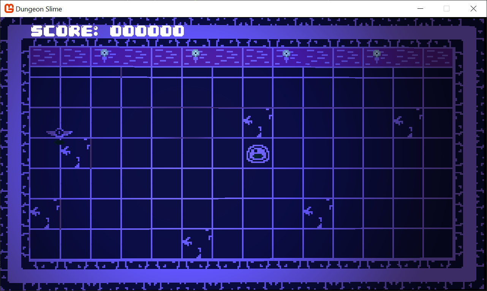

If the slime was casting a shadow, then the position of the light would be a lot easier to decipher just from looking at the image. Shadows help ground the objects in the scene. Just to visualize it, this image is a duplicate of the above, but with a pink debug shadow drawn on top to illustrate the desired effect. 

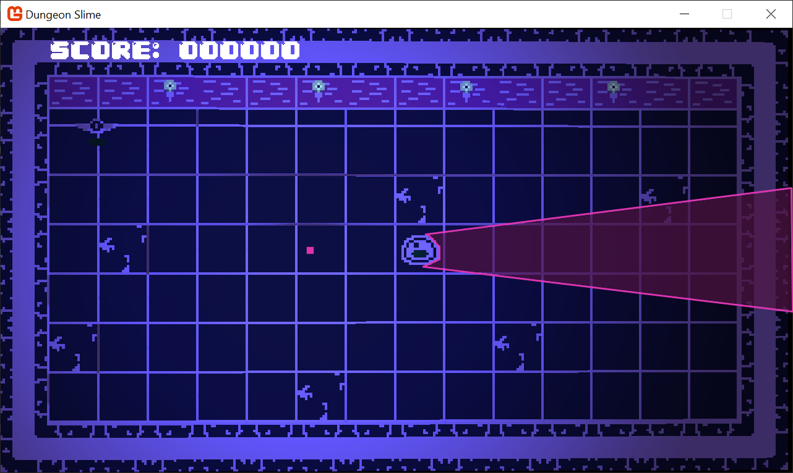

The pink section is called the _shadow hull_. We can split up the entire effect into two distinct stages. 
1. We need a way to calculate and render the shadow hulls from all objects that we want to cast shadows (such as bats and slime segments),
2. We need a way to _use_ the shadow hull to actually mask the lighting from the previous chapter. 


Step 2 is actually a lot easier to understand than step 1. Imagine that the shadow hulls were drawn to an off-screen texture, like the one in the image below. The black sections represent shadow hulls, and the white sections are places where no shadow hulls exist. This resource is called the `ShadowBuffer`. 

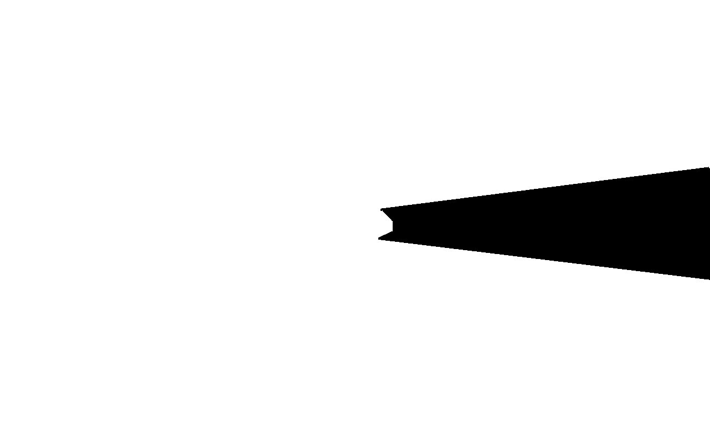

We would need to have a `ShadowBuffer` for each light source, but if we did, then when the light was being rendered, we could pass in the `ShadowBuffer` as an additional texture resource to the `_pointLightEffect.fx`, and use the pixel value of the `ShadowBuffer` to mask the light source. 

In the sequence below, the left image is the just the `LightBuffer`. The middle image is the `ShadowBuffer`, and the right image is the product of the two images. Any pixel in the `ShadowBuffer` that was `white` means the final image uses the color from the `LightBuffer`, and any `black` pixel from the `ShaodwBuffer` becomes black in the final image as well. The multiplication of the `LightBuffer` and `ShadowBuffer` complete the shadow effect.

| The `LightBuffer`                                         | The `ShadowBuffer`                                       | The multiplication of the two images                                     |
| --------------------------------------------------------- | -------------------------------------------------------- | ------------------------------------------------------------------------ |
| 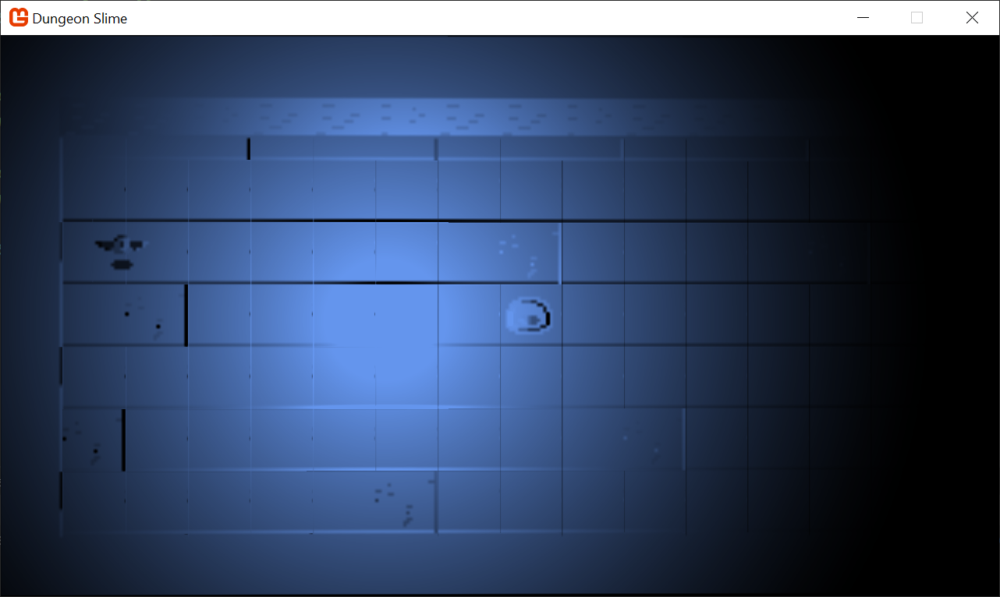 |  | 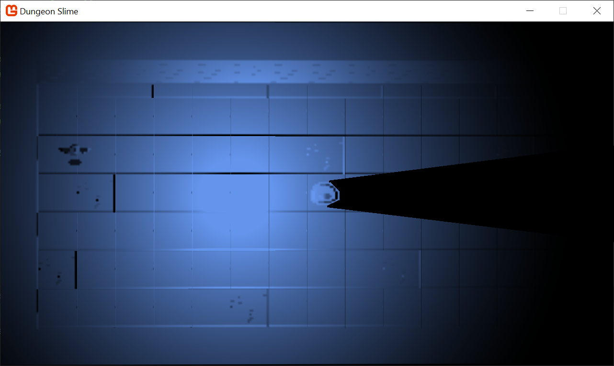 |

The mystery to unpack is step 1, how to render the `ShadowBuffer` in the first place. 

## Rendering the Shadow Buffer

To build some intuition, we will start by considering a shadow caster that is a single line segment. If we can generate a shadow for a single line segment, then we could compose multiple line segments to replicate the shape of the slime sprite. In the image blow, there is a single light source at position `L`, and a line segment between points `A`, and `B`. 

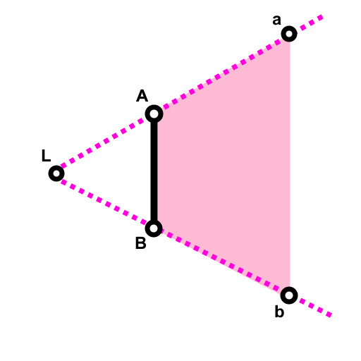

The shape we need to draw is the non-regular quadrilateral defined by `A`, `a`, `b`, and `B`. It is shaded in pink. These points are in world space. Given that we know where the line segment is, we know where `A` and `B` are, but we don't _yet_ know `a` and `b`'s location.

> [!note] 
> `A` and `a` naming convention.
> 
> The `A` and `a` points lay on the same ray from the light starting at `L`. The uppercase `A` denotes that the position is _first_ from the light's point of view. The same pattern holds for `B` and `b`. 

However, the `SpriteBatch` usually only renders rectangular shapes. Naively, it appears `SpriteBatch` cannot help us draw these sorts of shapes, but fortunately, since the shadow hull has exactly _4_ vertices, and `SpriteBatch` draws quads with exactly _4_ vertices, we can use a custom vertex function. 

This diagram shows an abstract pixel being drawn at some position `P`. The corners of the pixel may be defined as `G`, `S`, `D`, and `F`. 
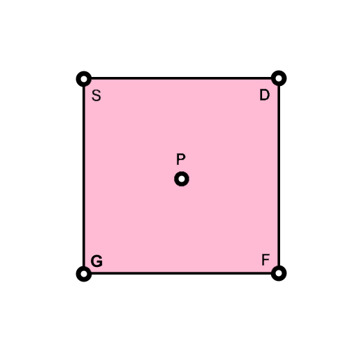

Our goal is define a function that transforms the positions `S`, `D`, `F`, and `G` _into_ the positions, `A`, `a`, `b`, and `B`. The table below shows the desired mapping.

| Pixel Point | Shadow Hull Point |
| ----------- | ----------------- |
| S           | A                 |
| D           | a                 |
| F           | b                 |
| G           | B                 |


Each vertex (`S`, `D`, `F`, and `G`) have additional metadata beyond positional data. The diagram includes `P`, but that point is the point specified to _`SpriteBatch`_, and it isn't available in the shader function. The vertex shader runs once for each vertex, but completely in isolation of the other vertices. Remember, the input for the standard vertex shader is as follows,

```hlsl
struct VertexShaderInput
{
    float4 Position	: POSITION0;
    float4 Color	: COLOR0;
    float2 TexCoord	: TEXCOORD0;
};
```

The `TexCoord` data is a two dimensional value that tells the pixel shader how to map an image onto the rectangle. The values for `TexCoord` can be set by the `SpriteBatch`'s `sourceRectangle` field in the `Draw()`, but if left unset, they default to `0` through `1` values. The default mapping is in the table below,

| Vertex | TexCoord.x | TexCoord.y |
| ------ | ---------- | ---------- |
| S      | 0          | 0          |
| D      | 1          | 0          |
| F      | 1          | 1          |
| G      | 0          | 1          |

If we use the defaults, then we could use these values to compute a unique id for each vertex in the pixel. The function, `x + y*2` will produce a unique hash of the inputs for the domain we care about. The following table shows the unique values. 

| Vertex | TexCoord.x | TexCoord.y | Unique Id |
| ------ | ---------- | ---------- | --------- |
| S      | 0          | 0          | 0         |
| D      | 1          | 0          | 1         |
| F      | 1          | 1          | 3         |
| G      | 0          | 1          | 2         |

The unique value is important, because it gives the vertex shader the ability to know _which_ vertex is being processed, rather than _any_ arbitrary vertex. For example, now the shader can know if it is processing `S`, or `D` based on if the unique id is `0` and `1`. The math for mapping `S` --> `A` may be quite different than the math for mapping `D` --> `a`. 

Additionally, the default `TexCoord` values allow the vertex shader to take any arbitrary position,  (`S`, `D`, `F`, and `G`) , and produce the point `P` where the `SpriteBatch` is drawing the sprite in world space. Recall from the previous chapter that MonoGame uses the screen size as a basis for generating world space positions, and then the default projection matrix transforms those world space positions into clip space. Given a shader parameter, `float2 ScreenSize`,  the vertex shader can convert back from the world-space positions  (`S`, `D`, `F`, and `G`)  to the `P` position by subtracting `.5 * ScreenSize * TexCoord` from the current vertex. 

The `Color` data is used to tint the resulting sprite in the pixel shader, but in our use case for a shadow hull, we don't really need a color whatsoever. Instead, we can use this `float4` field as arbitrary data. The trick is that we will need to pack whatever data we need into a `float4` and pass it via the `Color` type in MonoGame. This color comes from the `Color` value passed to the `SpriteBatch`'s `Draw()` call. 

The `Position` and `Color` both use `float4` in the standard vertex shader input, and it _may_ appear as though they should have the same amout precision. However they are not passed from MonoGame's `SpriteBatch` as the same type. When `SpriteBatch` goes to draw a sprite, it uses a `Color` for the `Color`, and a `Vector3` for the `Position`. A `Color` has 4 `bytes`, but a `Vector3` has 12 `bytes`. This can be seen in the [`VertexPositionColorTexture`](https://github.com/MonoGame/MonoGame/blob/develop/MonoGame.Framework/Graphics/Vertices/VertexPositionColorTexture.cs#L103) class. The takeaway is that we can only pack a third as much data into the `Color` semantic as the `Position` gets, and that may limit the types of values we want to pack into the `Color` value. 

Finally, the light's position must be provided as a shader parameter, `float2 LightPosition`. The light's position should be in the same world-space coordinate system that the light is being drawn at itself. 


### Vertex Shader Theory

Now that we have a good understanding of the available inputs, and the goal of the vertex function, we can begin moving towards a solution. Unlike the previous chapters, we are going to build up a fair bit of math before converting any of this is to a working shader. To begin, we draw the pixel _at_ the start of the line segment itself, `A`. The position where the pixel is drawn is definitionally `P`, so by drawing the pixel at `A`, we have set `A = P`. 

Every point (`S`, `D`, `F`, and `G`) needs to find `P`. To do that, the `TexCoord` can be treated as a direction from `P` to the current point, and the `ScreenSize` shader parameter can be used to find the right amount of distance to travel along that direction. 

```hlsl
float2 pos = input.Position.xy;
float2 P = pos - (.5 * input.TexCoord) / ScreenSize;
float2 A = P;
```

Next, we pack the `Color` value as the vector `(B - A)`. The `x` component of the vector can live in the `red` and `green` channels of the `Color`, and the `y` component will live in the `blue` and `alpha` channels. In the vertex shader, `B` can be derived by unpacking the `(B - A)` vector from the `COLOR` semantic and _adding_ it to the `A`. The reason we pack the _difference_ between `B` and `A` into the `Color`, and not `B` itself is due the lack of precision in the `Color` type. There are only 4 `bytes` to pack all the information, which means 2 `bytes` per `x` and `y`. Likely, the line segment will be small, so the values of `(B - A)` will fit easier into a 2 `byte` channel. 
```hlsl
float2 aToB = unpack(input.Color);
float2 B = A + aToB;
```

The point `a` must lay _somewhere_ on the ray cast from the `LightPosition` to the start of the line segment, `A`. Additionally, the point `a` must lay _beyond_ `A` from the light's perspective. The direction of the ray can be calculated as,
```hlsl
float2 lightRayA = normalize(A - LightPosition);
```

Then, given some `distance`,  beyond `A`, the point `a` can be produced as,
```hlsl
float2 a = A + distance * lightRayA;
```

The same can be said for `b`, 
```hlsl
float2 lightRayB = normalize(B - LightPosition);
float2 b = B + distance * lightRayB;
```

Now the vertex shader function knows all positions, `A`, `a`, `b`, and `B`. The `TexCoord` can be used to derive a unique id, and the unique id can be used to select one of the points. 

```hlsl
int id = input.TexCoord.x + input.TexCoord.y * 2;
if (id == 0) {        // S --> A
	pos = A;
} else if (id == 1) { // D --> a
	pos = a;
} else if (id == 3) { // F --> b
	pos = b;
} else if (id == 2) { // G --> B
	pos = B;
}
```

Once all of the positions are mapped, our goal is complete! We have a vertex function and strategy to convert a single pixel's 4 vertices into the 4 vertices of a shadow hull! 

### Implementation

To start implementing the effect, create a new Sprite Effect in the `MonoGameLibrary`'s common content effect folder called `shadowHullEffect.fx`. Load it into the `Core` class as before in the previous chapters. 

Add it as a class member, 
```csharp
/// <summary>  
/// The  material that draws shadow hulls  
/// </summary>  
public static Material ShadowHullMaterial { get; private set; }
```

Load it as watched content in the `LoadContent()` method,
```csharp
ShadowHullMaterial = SharedContent.WatchMaterial("effects/shadowHullEffect");
ShadowHullMaterial.IsDebugVisible = true;
```

Make sure to call `Update()` on the `Material` in the `Core`'s `Update()` method. Without this, hot-reload won't work.
```csharp
ShadowHullMaterial.Update();
```

To represent the shadow casting objects in the game, we will create a new class called `ShadowCaster` in the _MonoGameLibrary_'s graphics folder. For now, keep the `ShadowCaster` class as simple as possible while we build the basics. It will just hold the positions of the line segment from the theory section, `A`, and `B`. 
```csharp
using Microsoft.Xna.Framework;  
namespace MonoGameLibrary.Graphics;  
  
public class ShadowCaster  
{  
    public Vector2 A;  
    public Vector2 B;  
}
```

In the `GameScene`, add a class member to hold all the various `ShadowCasters` that will exist in the game. 
```csharp
// A list of shadow casters for all the lights  
private List<ShadowCaster> _shadowCasters = new List<ShadowCaster>();
```

For now, for simplicity, re-configure the `InitializeLights()` function in the `GameScene` to have a single `PointLight` and a single `ShadowCaster`. 
```csharp
private void InitializeLights()
{
	// torch 1
	_lights.Add(new PointLight
	{
		Position = new Vector2(500, 360),
		Color = Color.CornflowerBlue,
		Radius = 700
	});
	
	// simple shadow caster
	_shadowCasters.Add(new ShadowCaster
	{
		A = new Vector2(700, 320),
		B = new Vector2(700, 400)
	});
}
```


Every `PointLight` needs its own `ShadowBuffer`. Add a new `RenderTarget2D` field to the `PointLight` class,
```csharp
public RenderTarget2D ShadowBuffer { get; set; }
```

And instantiate the `ShaderBuffer` in the `PointLight`'s constructor,
```csharp
public PointLight()
{
	var viewPort = Core.GraphicsDevice.Viewport;
	ShadowBuffer = new RenderTarget2D(Core.GraphicsDevice, viewPort.Width, viewPort.Height, false, SurfaceFormat.Color,  DepthFormat.None, 0, RenderTargetUsage.PreserveContents);
}
```


Now, we need to find a place to render the `ShadowBuffer` _per_ `PointLight` before the deferred renderer draws the light itself. Copy this function into the `PointLight` class.
```csharp
public void DrawShadowBuffer(List<ShadowCaster> shadowCasters)
{
	Core.GraphicsDevice.SetRenderTarget(ShadowBuffer);
	Core.GraphicsDevice.Clear(Color.Black);
 
	Core.ShadowHullMaterial.SetParameter("LightPos", Position);
	var screenSize = new Vector2(ShadowBuffer.Width, ShadowBuffer.Height);
	Core.ShadowHullMaterial.SetParameter("ScreenSize", screenSize);
	Core.SpriteBatch.Begin(
			effect: Core.ShadowHullMaterial.Effect, 
			rasterizerState: RasterizerState.CullNone
			);
	foreach (var caster in shadowCasters)
	{
		var posA = caster.A;
		// TODO: pack the (B-A) vector into the color channel.
		Core.SpriteBatch.Draw(Core.Pixel, posA, Color.White);
	}
	Core.SpriteBatch.End();
}
```

> [!warning] 
> 
> The `(B-A)` vector isn't being packed yet into the color channel.
> We will come back to that soon!

Next, create a second method that will call the `DrawShadowBuffer` function for a list of lights and shadow casters, 
```csharp
public static void DrawShadows(
	List<PointLight> pointLights,
	List<ShadowCaster> shadowCasters)
{
	foreach (var light in pointLights)
	{
		light.DrawShadowBuffer(shadowCasters);
	}
}
```

And finally, call the `DrawShadows()` method right before the `GameScene` calls the `DeferredRenderer`'s `StartLightPass()` method.
```csharp
// render the shadow buffers
PointLight.DrawShadows(_lights, _shadowCasters);
```

For debug visualization purposes, add this snippet at the end of the `GameScene`'s `Draw()` just so you can see the `ShaderBuffer` as we debug it. 
```csharp
Core.SpriteBatch.Begin();  
Core.SpriteBatch.Draw(_lights[0].ShadowBuffer, Vector2.Zero, Color.White);  
Core.SpriteBatch.End();
```

When you run the game, you will see a totally blank white screen. This is because the shadow map is currently being cleared to `black` to start, and the debug view renders that on top of everything else.

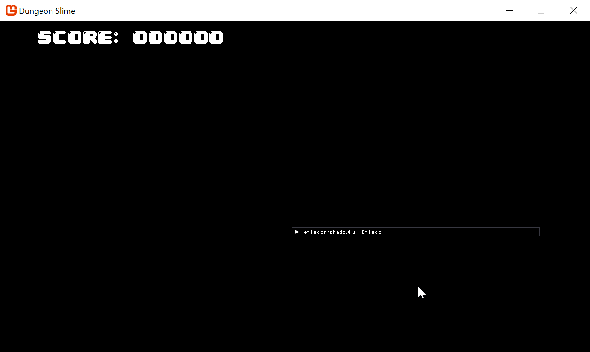

We cannot implement the vertex shader theory until we can pack the `(B-A)` vector into the `Color` argument for the `SpriteBatch`. For the sake of brevity, we will skip over the derivation of these functions. If you would like to know more, research bit-packing. Add this function to your `PointLight` class,

```csharp
public static Color PackVector2_SNorm(Vector2 vec)  
{  
    // Clamp to [-1, 1)  
    vec = Vector2.Clamp(vec, new Vector2(-1f), new Vector2(1f - 1f / 32768f));  
  
    short xInt = (short)(vec.X * 32767f); // signed 16-bit  
    short yInt = (short)(vec.Y * 32767f);  
  
    byte r = (byte)((xInt >> 8) & 0xFF);  
    byte g = (byte)(xInt & 0xFF);  
    byte b = (byte)((yInt >> 8) & 0xFF);  
    byte a = (byte)(yInt & 0xFF);  
  
    return new Color(r, g, b, a);  
}
```

And then to use the packing function, in the `DrawShadowBuffer` function, instead of passing `Color.White` like before, we need to create the `bToA` vector, pack it a `Color`, and then pass it to the `SpriteBatch`. 
```csharp
foreach (var caster in shadowCasters)  
{  
    var posA = caster.A;  
    var aToB = (caster.B - caster.A) / screenSize;  
    var packed = PackVector2_SNorm(aToB);  
    Core.SpriteBatch.Draw(Core.Pixel, posA, packed);  
}
```

On the shader side, add this function to your `shadowHullEffect.fx` file,
```hlsl
float2 UnpackVector2FromColor_SNorm(float4 color)  
{  
    // Convert [0,1] to byte range [0,255]  
    float4 bytes = color * 255.0;  
  
    // Reconstruct 16-bit unsigned ints (x and y)  
    float xInt = bytes.r * 256.0 + bytes.g;  
    float yInt = bytes.b * 256.0 + bytes.a;  
  
    // Convert from unsigned to signed short range [-32768, 32767]  
    if (xInt >= 32768.0) xInt -= 65536.0;  
    if (yInt >= 32768.0) yInt -= 65536.0;  
  
    // Convert from signed 16-bit to float in [-1, 1]  
    float x = xInt / 32767.0;  
    float y = yInt / 32767.0;  
  
    return float2(x, y);  
}
```

Now we have the tools to start implementing the vertex shader! Of course, anytime you want to override the default `SpriteBatch` vertex shader, the shader needs to fulfill the world-space to clip-space transformation. We can re-use the work done in previous chapters. Replace the `VertexShaderOutput` struct with the `#include "3dEffect.fxh"` line. Create a basic template for the vertex shader function, 
```hlsl
VertexShaderOutput ShadowHullVS(VertexShaderInput input)   
{     
    VertexShaderOutput output = MainVS(input);  
    return output;  
}
```

And don't forget to set the technique for the vertex shader function,
```hlsl
technique SpriteDrawing  
{  
   pass P0  
   {  
      PixelShader = compile PS_SHADERMODEL MainPS();  
      VertexShader = compile VS_SHADERMODEL ShadowHullVS();  
   }  
};
```

The last step to make sure the default vertex shader works is to pass the `MatrixTransform` and `ScreenSize` shader parameters in the `GameScene`'s `Update()` loop, next to where they're being configured for the existing `PointLightMaterial`. 
```csharp
Core.ShadowHullMaterial.SetParameter("MatrixTransform", matrixTransform);  
Core.ShadowHullMaterial.SetParameter("ScreenSize", new Vector2(Core.GraphicsDevice.Viewport.Width, Core.GraphicsDevice.Viewport.Height));
```

The pixel shader function for the `shadowHullEffect` needs to ignore the `input.Color` and just return a solid color.
```hlsl
float4 MainPS(VertexShaderOutput input) : COLOR  
{  
    return 1; // return white  
}
```

The vertex shader function is derived from the theory section above, but is written out in complete form below,
```hlsl
  
float2 LightPosition;  
VertexShaderOutput ShadowHullVS(VertexShaderInput input)   
{     
    VertexShaderInput modified = input;  
    float distance = ScreenSize.x + ScreenSize.y;  
    float2 pos = input.Position.xy;  
      
    float2 P = pos - (.5 * input.TexCoord) / ScreenSize;  
    float2 A = P;  
      
    float2 aToB = UnpackVector2FromColor_SNorm(input.Color) * ScreenSize;  
    float2 B = A + aToB;  
      
    float2 lightRayA = normalize(A - LightPosition);  
    float2 a = A + distance * lightRayA;  
    float2 lightRayB = normalize(B - LightPosition);  
    float2 b = B + distance * lightRayB;      
      
    int id = input.TexCoord.x + input.TexCoord.y * 2;  
    if (id == 0) {        // S --> A  
       pos = A;  
    } else if (id == 1) { // D --> a  
       pos = a;  
    } else if (id == 3) { // F --> b  
       pos = b;  
    } else if (id == 2) { // G --> B  
       pos = B;  
    }  
      
    modified.Position.xy = pos;  
    VertexShaderOutput output = MainVS(modified);  
    return output;  
}
```

Now if you run the game, you will see the white shadow hull. 
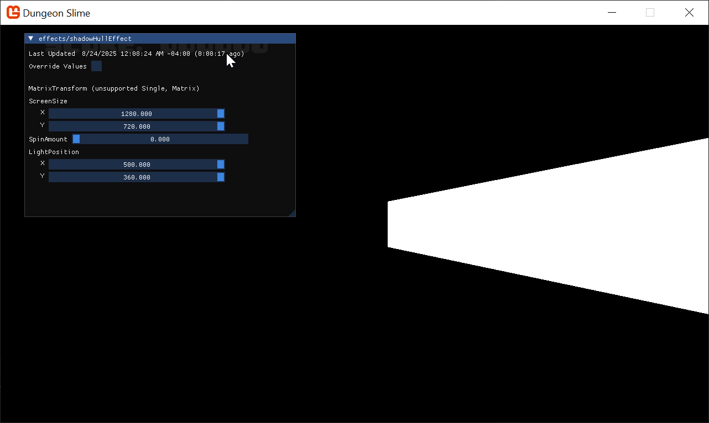

To get the basic shadow effect working with the rest of the renderer, we need to do the multiplication step between the `ShadowBuffer` and the `LightBuffer` in the `pointLightEffect.fx` shader. Add a second texture and sampler for the `pointLightEffect.fx` file,
```hlsl
Texture2D ShadowBuffer;  
sampler2D ShadowBufferSampler = sampler_state  
{  
   Texture = <ShadowBuffer>;  
};
```

Then, in the `MainPS` of the light effect, read the current value from the shadow buffer,
```hlsl
float shadow = tex2D(ShadowBufferSampler,input.ScreenCoordinates).r;
```

And use it as a multiplier at the end when calculating the final light color,
```hlsl
color.a *= falloff * lightAmount * shadow;
```

Before running the game, make sure to pass the `ShadowBuffer` to the point light's draw invocation. In the `Draw()` method in the `PointLight` class, change the `SpriteBatch` to use `Immediate` sorting, and forward the `ShadowBuffer` to the shader parameter for each light.

```csharp
public static void Draw(SpriteBatch spriteBatch, List<PointLight> pointLights, List<ShadowCaster> shadowCasters, Texture2D normalBuffer)
{
	spriteBatch.Begin(
		effect: Core.PointLightMaterial.Effect,
		blendState: BlendState.Additive,
		sortMode: SpriteSortMode.Immediate
		);
	
	foreach (var light in pointLights)
	{
		Core.PointLightMaterial.SetParameter("ShadowBuffer", light.ShadowBuffer);
		var diameter = light.Radius * 2;
		var rect = new Rectangle((int)(light.Position.X - light.Radius), (int)(light.Position.Y - light.Radius), diameter, diameter);
		spriteBatch.Draw(normalBuffer, rect, light.Color);
	}
	
	spriteBatch.End();
}
```

Disable the debug visualization to render the `ShadowMap` on top of everything else, and run the game. 

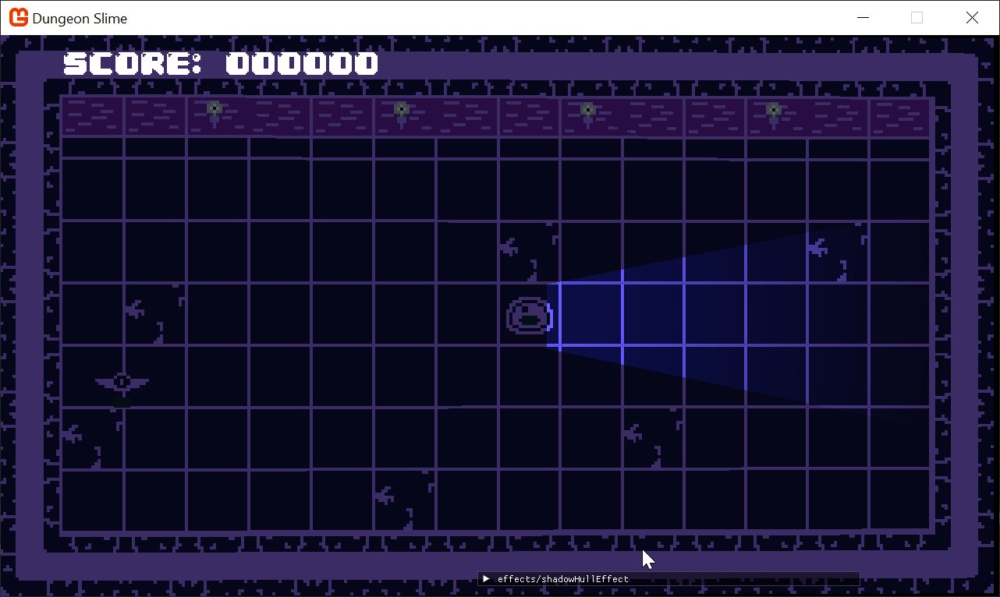

Oops, the shadows and lights are appearing opposite of where they should! That is because the `ShadowBuffer` is inverted. Change the clear color for the `ShadowBuffer` to _white_, 
```csharp
public void DrawShadowBuffer(List<ShadowCaster> shadowCasters)  
{  
    Core.GraphicsDevice.SetRenderTarget(ShadowBuffer);  
    // clear the shadow buffer to white to start  
    Core.GraphicsDevice.Clear(Color.White);
    // ...
```

And change the pixel shader to return a solid black rather than white. 
```hlsl
float4 MainPS(VertexShaderOutput input) : COLOR  
{  
    return float4(0,0,0,1); // return black  
}
```

And now the shadow appears correctly for our simple single line segment!
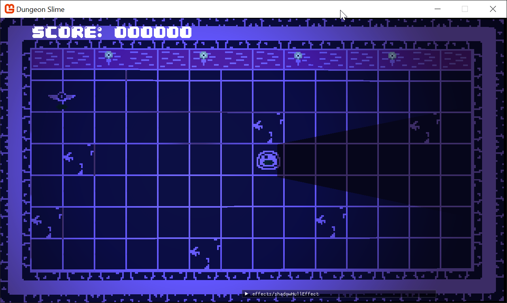

## More Segments

So far, we have built up an intuition for the shadow caster system using a single line segment. Now, we will combine many line segments to create primitive shapes. We will approximate the slime character as a hexagon. 

Instead of only having `A` and `B` in the `ShadowCaster` class, change the class body to have a `Position` and a list of points.
```csharp
public class ShadowCaster
{
    /// <summary>
    /// The position of the shadow caster
    /// </summary>
    public Vector2 Position;
    
    /// <summary>
    /// A list of at least 2 points that will be used to create a closed loop shape.
    /// The points are relative to the position.
    /// </summary>
    public List<Vector2> Points;
}
```

To create simple polygons, add this method to the `ShadowCaster` class. 
```csharp
public static ShadowCaster SimplePolygon(Point position, float radius, int sides)
{
	var anglePerSide = MathHelper.TwoPi / sides;
	var caster = new ShadowCaster
	{
		Position = position.ToVector2(),
		Points = new List<Vector2>(sides)
	};
	for (var angle = 0f; angle < MathHelper.TwoPi; angle += anglePerSide)
	{
		var pt = radius * new Vector2(MathF.Cos(angle), MathF.Sin(angle));
		caster.Points.Add(pt);
	}

	return caster;
}
```

Then, in the `InitializeLights()` function in the `GameScene`, instead of constructing a `ShadowCaster` with the `A` and `B` properties, we can use the new `SimplePolygon` method,
```csharp
// simple shadow caster  
_shadowCasters.Add(ShadowCaster.SimplePolygon(_slime.GetBounds().Location, radius: 50, sides: 6));
```

Finally, the last place we need to change is the `DrawShadowBuffer()` method. Currently it is just drawing a single pixel with the `ShadowHullMaterial`, but now we need to draw a pixel _per_ line segment. Update the `foreach` block to loop over all the points in the `ShadowCaster`, and connect the points as line segments.
```csharp
foreach (var caster in shadowCasters)
{
	for (var i = 0; i < caster.Points.Count; i++)
	{
		var a = caster.Position + caster.Points[i];
		var b = caster.Position + caster.Points[(i + 1) % caster.Points.Count];

		var aToB = (b - a) / screenSize;
		var packed = PackVector2_SNorm(aToB);
		Core.SpriteBatch.Draw(Core.Pixel, a, packed);
	}
}
```

When you run the game, you will see a larger shadow shape.
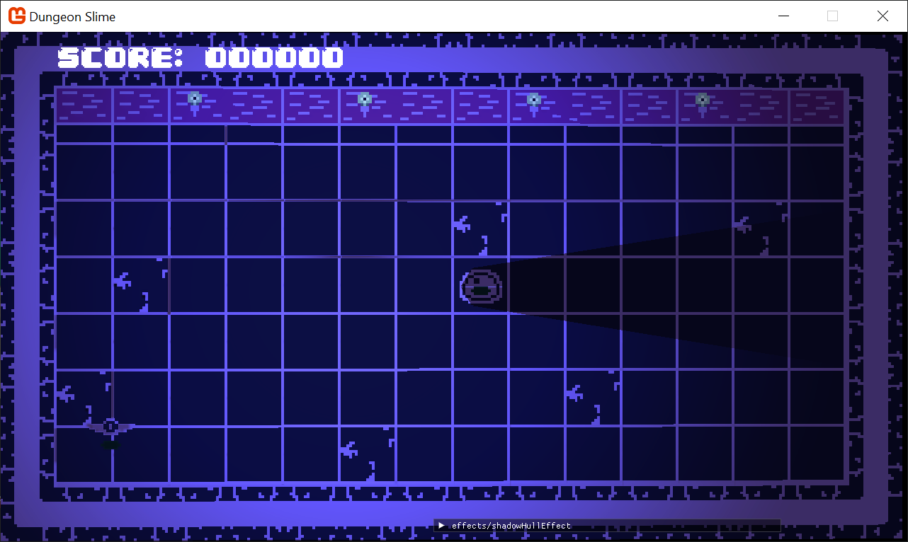

There are a few problems with the current effect. First off, there is a visual artifact going horizontally through the center of the shadow caster where it appears light is "leaking" in. This is likely due to numerical accuracy issues in the shader. A simple solution is to slightly extend the line segment in the vertex shader. After both `A` and `B` are calculated, but before `a` and `b`, add this to the shader. 
```hlsl
float2 direction = normalize(aToB);  
A -= direction; // move A back along the segment by one unit
B += direction; // move B forward along the segment by one unit
```

And now the visual artifact has gone away.
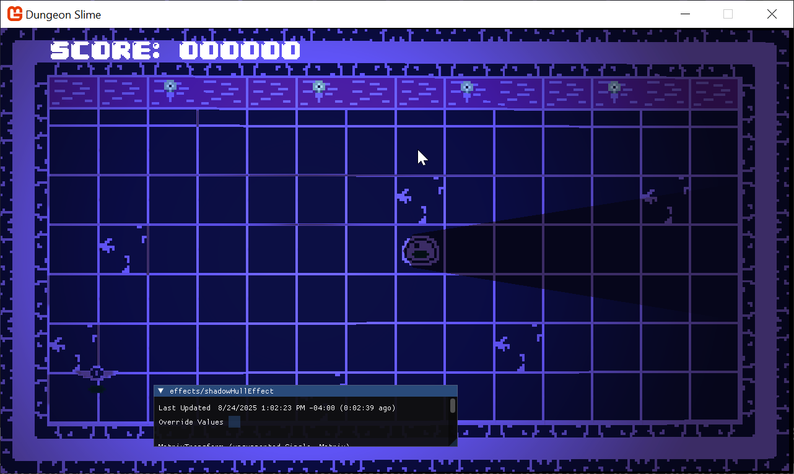

The next item to consider is that the the "inside" of the slime isn't being lit. All of the segments are casting shadows, but it would be nice if only the segments on the far side of the slime cast shadows. We can take advantage of the fact that all of the line segments making up the shadow caster are _wound_ in the same direction.
```hlsl
// cull faces  
float2 normal = float2(-direction.y, direction.x);  
float alignment = dot(normal, (LightPosition - A));  
if (alignment < 0){  
    modified.Color.a = -1;  
}
```

> [!tip]
> This technique is called [back-face culling](https://en.wikipedia.org/wiki/Back-face_culling).


And then in the pixel shader function, add this line to the top. The [`clip`](https://learn.microsoft.com/en-us/windows/win32/direct3dhlsl/dx-graphics-hlsl-clip) function will completely discard the fragment and not draw anything to the `ShadowBuffer`. 
```hlsl
clip(input.Color.a);
```

Now the slime looks well lit and shadowed! Feel free to play with the size of the shadow caster as well as the exact points themselves. 
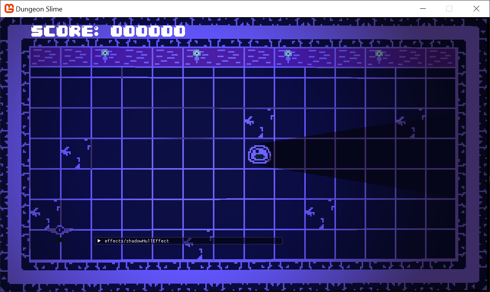

## Gameplay

Now that we can draw shadows in the lighting system, we should rig up shadows to the slime, the bat, and the walls of the dungeon. First, start by adding back the `InitializeLights()` method as it existed at the start of the chapter. Feel free to add or remove lights as you see fit. Here is a version of the function.
```csharp
private void InitializeLights()
{
	// torch 1
	_lights.Add(new PointLight
	{
		Position = new Vector2(260, 100),
		Color = Color.CornflowerBlue,
		Radius = 500
	});
	// torch 2
	_lights.Add(new PointLight
	{
		Position = new Vector2(520, 100),
		Color = Color.CornflowerBlue,
		Radius = 500
	});
	// torch 3
	_lights.Add(new PointLight
	{
		Position = new Vector2(740, 100),
		Color = Color.CornflowerBlue,
		Radius = 500
	});
	// torch 4
	_lights.Add(new PointLight
	{
		Position = new Vector2(1000, 100),
		Color = Color.CornflowerBlue,
		Radius = 500
	});
	
	// random lights
	_lights.Add(new PointLight
	{
		Position = new Vector2(Random.Shared.Next(50, 400),400),
		Color = Color.MonoGameOrange,
		Radius = 500
	});
	_lights.Add(new PointLight
	{
		Position = new Vector2(Random.Shared.Next(650, 1200),300),
		Color = Color.MonoGameOrange,
		Radius = 500
	});
}
```

Now, we will focus on the slime shadows. Add a new `List<ShadowCaster>` property to the `Slime` class. 

```csharp
/// <summary>  
/// A list of shadow casters for all of the slime segments  
/// </summary>  
public List<ShadowCaster> ShadowCasters { get; private set; } = new List<ShadowCaster>();
```

And in the `Slime`'s `Update()` method, add this snippet,
```csharp
// Update the shadow casters
if (ShadowCasters.Count != _segments.Count)
{
	ShadowCasters = new List<ShadowCaster>(_segments.Count);
	for (var i = 0; i < _segments.Count; i++)
	{
		ShadowCasters.Add(ShadowCaster.SimplePolygon(Point.Zero, radius: 30, sides: 12));
	}
}

// move the shadow casters to the current segment positions
for (var i = 0; i < _segments.Count; i++)
{
	var segment = _segments[i];
	Vector2 pos = Vector2.Lerp(segment.At, segment.To, _movementProgress);
	var size = new Vector2(_sprite.Width, _sprite.Height);
	ShadowCasters[i].Position = pos + size * .5f;
}
```

Now, modify the `GameScene`'s `Draw()` method to create a master list of all the `ShadowCasters` and pass that into the `DrawShadows()` function, 
```csharp
// render the shadow buffers  
var casters = new List<ShadowCaster>();  
casters.AddRange(_shadowCasters);  
casters.AddRange(_slime.ShadowCasters);  
PointLight.DrawShadows(_lights, casters);
```

And now the slime has shadows around the segments!


Next up, the bat needs some shadows! Add a `ShadowCaster` property to the `Bat` class,
```csharp
/// <summary>  
/// The shadow caster for this bat  
/// </summary>  
public ShadowCaster ShadowCaster { get; private set; }
```

And instantiate it in the constructor,
```csharp
ShadowCaster = ShadowCaster.SimplePolygon(Point.Zero, radius: 10, sides: 12);
```

In the `Bat`'s `Update()` method, update the position of the `ShadowCaster`, 
```csharp
// Update the position of the shadow caster. Move it up a bit due to the bat's artwork.  
var size = new Vector2(_sprite.Width, _sprite.Height);  
ShadowCaster.Position = Position - Vector2.UnitY * 10 + size * .5f;
```

And finally add the `ShadowCaster` to the master list of shadow casters during the `GameScene`'s `Draw()` method,
```csharp
// render the shadow buffers  
var casters = new List<ShadowCaster>();  
casters.AddRange(_shadowCasters);  
casters.AddRange(_slime.ShadowCasters);  
casters.Add(_bat.ShadowCaster);  
PointLight.DrawShadows(_lights, casters);
```

And now the bat is casting a shadow as well!


Lastly, the walls should cast shadows to help ground the lighting in the world. 
Add a shadow caster in the `InitializeLights()` function to represent the edge of the playable tiles, 
```csharp
var tileUnit = new Vector2(_tilemap.TileWidth, _tilemap.TileHeight);  
var size = new Vector2(_tilemap.Columns, _tilemap.Rows);  
_shadowCasters.Add(new ShadowCaster  
{  
    Points = new List<Vector2>  
    {        tileUnit * new Vector2(1, 1),  
        tileUnit * new Vector2(size.X - 1, 1),  
        tileUnit * new Vector2(size.X - 1, size.Y - 1),  
        tileUnit * new Vector2(1, size.Y - 1),  
    }  
});
```


## The Stencil Buffer

The light and shadow system is working! However, there is a non-trivial amount of memory overhead for the effect. Every light has a full screen sized `ShadowBuffer`. At the moment, each `ShadowBuffer` is a `RenderTarget2D` with `32` bits of data per pixel. At our screen resolution of `1280` x `720`, that means every light adds roughly (`1280 * 720 * 32bits`) 3.6 _MB_ of overhead to the game! Our system is not taking full advantage of those 32 bits per pixel. Instead, all we really need is a _single_ bit, for "in shadow" or "not in shadow". In fact, all the `ShadowBuffer` is doing is operating as a _mask_ for the point light. 

Image masking is a common task in computer graphics. There is a built-in feature of MonoGame called the _Stencil Buffer_ that handles image masking without the need for any custom `RenderTarget` or shader logic. In fact, we will be able to remove a lot of the existing code and leverage the stencil instead. 

The stencil buffer is a part of an existing `RenderTarget`, but we need to opt into using it. In the `DeferredRenderer` class, where the `LightBuffer` is being instantiated, change the `preferredDepthFormat` to `DepthFormat.Depth24Stencil8`.
```csharp
LightBuffer = new RenderTarget2D(  
    graphicsDevice: Core.GraphicsDevice,   
    width: viewport.Width,  
    height: viewport.Height,  
    mipMap: false,  
    preferredFormat: SurfaceFormat.Color,   
    preferredDepthFormat: DepthFormat.Depth24Stencil8);
```

The `LightBuffer` itself has `32` bits per pixel of `Color` data, _and_ an additional `32` bits of data split between the depth and stencil buffers. As the name suggests, the `Depth24Stencil8` format grants the depth buffer `24` bits of data, and the stencil buffer `8` bits of data. `8` bits are enough for a single `byte`, which means it can represent integers from `0` to `255`. 

For our use case, we will deal with the stencil buffer in two distinct steps. First, all of the shadow hulls will be drawn into the stencil buffer _instead_ of a unique `ShadowBuffer`. Anywhere a shadow hull is drawn, the stencil buffer will have a value of `1`, and anywhere without a shadow hull will have a value of `0`. Then, in the second step, when the point lights are drawn, the stencil buffer can be used as a mask where pixels are only drawn where the stencil buffer has a value of `0` (which means there was no shadow hull present in the previous step). 

The stencil buffer can be cleared and re-used between each light, so there is no need to have a buffer _per_ light. We will be able to completely remove the `ShadowBuffer` from the `PointLight` class. That also means we won't need to send the `ShadowBuffer` to the point light shader or read from it in shader code any longer. 

To get started, create a new method in the `DeferredRenderer` class called `DrawLights()`. This new method is going to completely replace some of our existing methods, but we will clean the unnecessary ones up when we are done with the new approach. 

```csharp
public void DrawLights(List<PointLight> lights, List<ShadowCaster> shadowCasters)  
{
	// 
}
```

In the `GameScene`'s `Draw()` method, call the new `DrawLights()` method instead of the `DrawShadows()`, `StartLightPhase()` _and_ `PointLight.Draw()` methods. Here is a snippet of the `Draw()` method.
```csharp
// render the shadow buffers  
var casters = new List<ShadowCaster>();  
casters.AddRange(_shadowCasters);  
casters.AddRange(_slime.ShadowCasters);  
casters.Add(_bat.ShadowCaster);  
  
// start rendering the lights  
_deferredRenderer.DrawLights(_lights, casters);  
  
// finish the deferred rendering  
_deferredRenderer.Finish();
```

Next, in the `pointLightEffect.fx` shader, we won't be using the `ShadowBuffer` anymore, so remove the `Texture2D ShadowBuffer` and `sampler2D ShadowBufferSampler`. Remove the `tex2D` read from the shadow image, and remove the final multiplication of the `shadow`. The end of the `pointLightEffect.fx` shader should read as follows,
```hlsl
float4 color = input.Color;  
color.a *= falloff * lightAmount;  
return color;
```

If you run the game now, you won't see any of the lights anymore. 
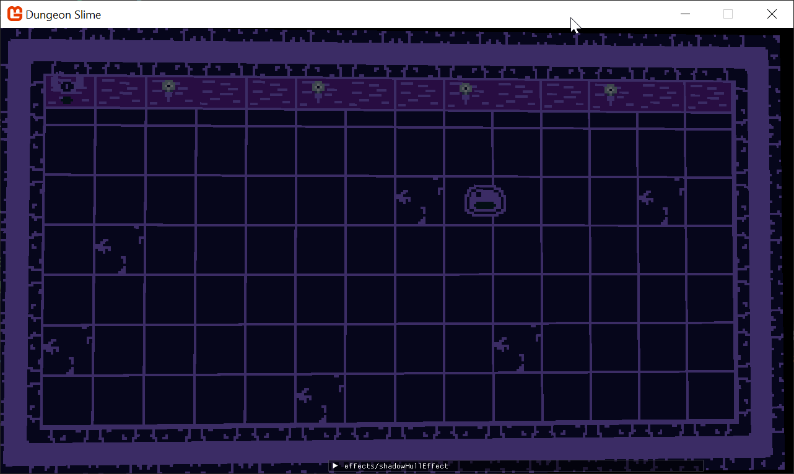

In the new `DrawLights()` method, we need to iterate over all the lights, and draw them. First, we need to set the current render target to the `LightBuffer` so it can be used in the deferred renderer composite stage. 

```csharp

    public void DrawLights(List<PointLight> lights, List<ShadowCaster> shadowCasters)
    {
        Core.GraphicsDevice.SetRenderTarget(LightBuffer);
        Core.GraphicsDevice.Clear(Color.Black);
        
        foreach (var light in lights)
        {
            Core.SpriteBatch.Begin(
                effect: Core.PointLightMaterial.Effect,
                blendState: BlendState.Additive
            );

            var diameter = light.Radius * 2;
            var rect = new Rectangle(
	            (int)(light.Position.X - light.Radius), 
	            (int)(light.Position.Y - light.Radius),
                diameter, diameter);
            Core.SpriteBatch.Draw(NormalBuffer, rect, light.Color);
            Core.SpriteBatch.End();

        }
    }
```

Now the lights are back, but of course no shadows yet. 
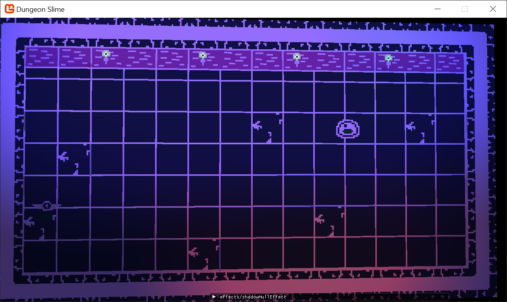

As each light is about to draw, we need to draw the shadow hulls. Add this snippet to the top of the `foreach` loop. This code is mainly copied from our previous approach. 
```csharp
Core.ShadowHullMaterial.SetParameter("LightPosition", light.Position);         
Core.SpriteBatch.Begin(
	effect: Core.ShadowHullMaterial.Effect,
	blendState: BlendState.Opaque,
	rasterizerState: RasterizerState.CullNone
);
foreach (var caster in shadowCasters)
{
	for (var i = 0; i < caster.Points.Count; i++)
	{
		var a = caster.Position + caster.Points[i];
		var b = caster.Position + caster.Points[(i + 1) % caster.Points.Count];

		var screenSize = new Vector2(LightBuffer.Width, LightBuffer.Height);
		var aToB = (b - a) / screenSize;
		var packed = PointLight.PackVector2_SNorm(aToB);
		Core.SpriteBatch.Draw(Core.Pixel, a, packed);
	}
}

Core.SpriteBatch.End();
```

This produces strange results. So far, the stencil buffer isn't being used yet, so all we are doing is rendering the shadow hulls onto the same image as the light data itself. Worse, the alternating order from rendering shadows to lights, back to shadows, and so on produces very visually decoherent results.
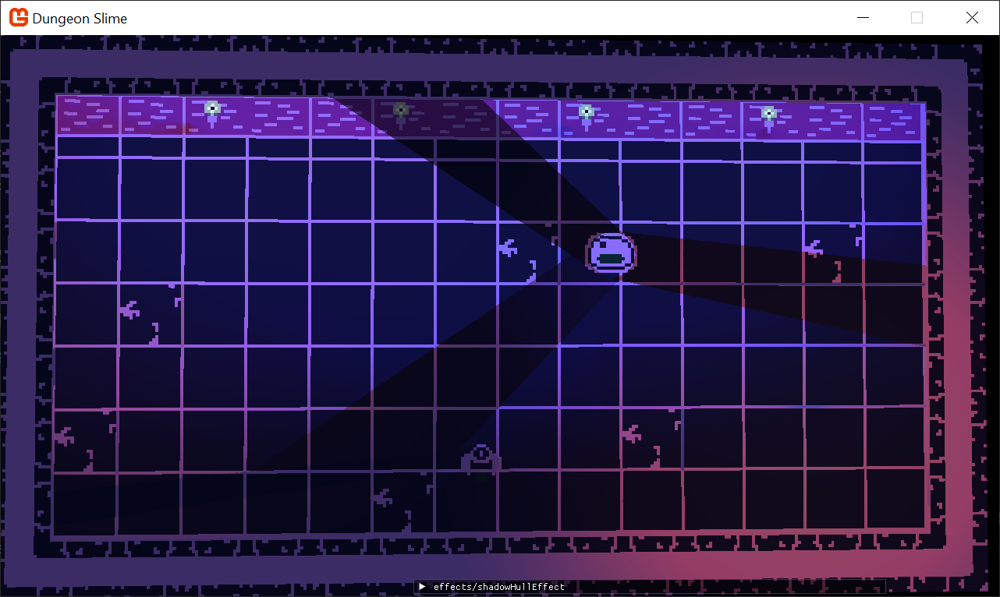

Instead of writing the shadow hulls as _color_ into the color portion of the `LightBuffer`, we only need to render the `1` or `0` to the stencil buffer portion of the `LightBuffer`. To do this, we need to create a new `DepthStencilState` variable. The `DepthStencilState` is a MonoGame primitive that describes how draw call operations should interact with the stencil buffer. Create a new class variable in the `DeferredRenderer` class
```csharp
/// <summary>  
/// The state used when writing shadow hulls  
/// </summary>  
private DepthStencilState _stencilWrite;
```

And initialize it in the constructor,
```csharp
_stencilWrite = new DepthStencilState
{
	// instruct MonoGame to use the stencil buffer
	StencilEnable = true,
	
	// instruct every fragment to interact with the stencil buffer
	StencilFunction = CompareFunction.Always,
	
	// every operation will replace the current value in the stencil buffer
	//  with whatever value is in the ReferenceStencil variable
	StencilPass = StencilOperation.Replace,
	
	// this is the value that will be written into the stencil buffer
	ReferenceStencil = 1,
	
	// ignore depth from the stencil buffer write/reads  
	DepthBufferEnable = false
};
```

The `_stencilWrite` variable is a declarative structure that tells MonoGame how the stencil buffer should be used during a `SpriteBatch` draw call. The next step is to actually pass the `_stencilWrite` declaration into the `SpriteBatch`'s `Draw()` call when the shadow hulls are being rendered.
```csharp
Core.SpriteBatch.Begin(
	depthStencilState: _stencilWrite,
	effect: Core.ShadowHullMaterial.Effect,
	blendState: BlendState.Opaque,
	rasterizerState: RasterizerState.CullNone
);
```

Unfortunately, there is not a good way to visualize the state of the stencil buffer, so if you run the game, it is hard to tell if the stencil buffer contains any data. Instead, we will try and _use_ the stencil buffer's data when the point lights are drawn. The point lights won't interact with the stencil buffer in the same way the shadow hulls did. To capture the new behavior, create a second `DepthStencilState` class variable.

```csharp
/// <summary>  
/// The state used when drawing point lights  
/// </summary>  
private DepthStencilState _stencilTest;
```

And initialize it in the constructor,
```csharp
_stencilTest = new DepthStencilState
{
	// instruct MonoGame to use the stencil buffer
	StencilEnable = true,
	
	// instruct only fragments that have a current value EQUAl to the
	//  ReferenceStencil value to interact
	StencilFunction = CompareFunction.Equal,
	
	// shadow hulls wrote `1`, so `0` means "not" shadow. 
	ReferenceStencil = 0,
	
	// don't change the value of the stencil buffer. KEEP the current value.
	StencilPass = StencilOperation.Keep,
	
	// ignore depth from the stencil buffer write/reads
	DepthBufferEnable = false
};
```

And now pass the new `_stencilTest` state to the `SpriteBatch` `Draw()` call that draws the point lights.
```csharp
Core.SpriteBatch.Begin(  
    depthStencilState: _stencilTest,  
    effect: Core.PointLightMaterial.Effect,  
    blendState: BlendState.Additive  
);
```

The shadows look _better_, but something is still broken. It looks eerily similar to the previous iteration before passing the `_stencilTest` and `_stencilWrite` declarations to `SpriteBatch`...

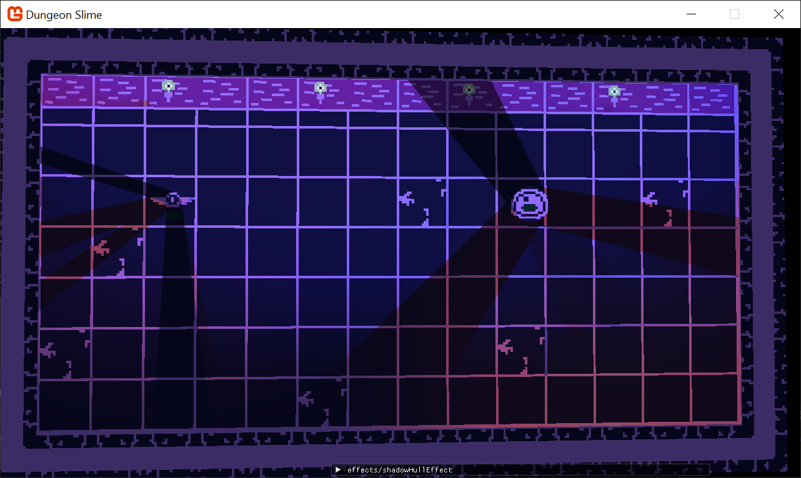
This happens because the shadow hulls are _still_ being drawn as colors into the `LightBuffer`. The shadow hull shader is rendering a black pixel, so those black pixels are drawing on top of the `LightBuffer` 's previous point lights. To solve this, we need to create a custom `BlendState` that ignores all color channel writes. Create a new class variable in the `DeferredRenderer`. 

```csharp
/// <summary>  
/// A custom blend state that wont write any color data  
/// </summary>  
private BlendState _shadowBlendState;
```

And initialize it in the constructor,
```csharp
_shadowBlendState = new BlendState  
{  
    // no color channels will be written into the render target  
    ColorWriteChannels = ColorWriteChannels.None  
};
```

> ![tip]
> 
> Setting the `ColorWriteChannels` to `.None` means that the GPU still rasterizes the geometry, but no color will be written to the `LightBuffer`.


Finally, pas it to the shadow hull `SpriteBatch` call.
```csharp
Core.SpriteBatch.Begin(  
    depthStencilState: _stencilWrite,  
    effect: Core.ShadowHullMaterial.Effect,  
    blendState: _shadowBlendState,  
    rasterizerState: RasterizerState.CullNone  
);
```

Now the shadows look closer, but there is one final issue. 


The `LightBuffer` is only being cleared at the start of the entire `DrawLights()` method. This means the `8` bits for the stencil data aren't being cleared between lights, so shadows from one light are overwriting into all subsequent lights. To fix this, we just need to clear the stencil buffer data before rendering the shadow hulls.

```csharp
Core.GraphicsDevice.Clear(ClearOptions.Stencil, Color.Black, 0, 0);
```
And now the lights are working again! The final `DrawLights()` method is written below.
```csharp

public void DrawLights(List<PointLight> lights, List<ShadowCaster> shadowCasters)
{
	Core.GraphicsDevice.SetRenderTarget(LightBuffer);
	Core.GraphicsDevice.Clear(Color.Black);
	foreach (var light in lights)
	{
		Core.GraphicsDevice.Clear(ClearOptions.Stencil, Color.Black, 0, 0);
		Core.ShadowHullMaterial.SetParameter("LightPosition", light.Position);
		
		Core.SpriteBatch.Begin(
			depthStencilState: _stencilWrite,
			effect: Core.ShadowHullMaterial.Effect,
			blendState: _shadowBlendState,
			rasterizerState: RasterizerState.CullNone
		);
		foreach (var caster in shadowCasters)
		{
			for (var i = 0; i < caster.Points.Count; i++)
			{
				var a = caster.Position + caster.Points[i];
				var b = caster.Position + caster.Points[(i + 1) % caster.Points.Count];
		
				var screenSize = new Vector2(LightBuffer.Width, LightBuffer.Height);
				var aToB = (b - a) / screenSize;
				var packed = PointLight.PackVector2_SNorm(aToB);
				Core.SpriteBatch.Draw(Core.Pixel, a, packed);
			}
		}
		
		Core.SpriteBatch.End();
	
		
		Core.SpriteBatch.Begin(
			depthStencilState: _stencilTest,
			effect: Core.PointLightMaterial.Effect,
			blendState: BlendState.Additive
		);

		var diameter = light.Radius * 2;
		var rect = new Rectangle(
			(int)(light.Position.X - light.Radius), 
			(int)(light.Position.Y - light.Radius),
			diameter, diameter);
		Core.SpriteBatch.Draw(NormalBuffer, rect, light.Color);
		Core.SpriteBatch.End();

	}
}
```


We can remove a lot of unnecessary code.
1. The `DeferredRenderer.StartLightPhase()` function is no longer called. Remove it.
2. The `PointLight.DrawShadows()` function is no longer called. Remove it.
3. The `PointLight.Draw()` function is no longer called. Remove it.
4. The `PointLight.DrawShadowBuffer()` function is no longer called. Remove it.
5. The `PointLight.ShadowBuffer` `RenderTarget` is no longer used. Remove it. Anywhere that referenced the `ShadowBuffer` can also be removed. 

## Conclusion

And with that, our lighting and shadow system is complete! In this chapter, you accomplished the following:

- Learned the theory behind generating 2D shadow geometry from a light and a line segment.
- Wrote a vertex shader to generate a "shadow hull" quad on the fly.
- Implemented a shadow system using a memory-intensive texture-based approach.
- Refactored the system to use the Stencil Buffer for masking.

In the final chapter, we'll wrap up the series and discuss some other exciting graphics programming topics you could explore from here.

You can find the complete code sample for this tutorial series, [here](https://github.com/MonoGame/MonoGame.Samples/tree/3.8.4/Tutorials/2dShaders/src/09-Shadows-Effect/). 

Continue to the next chapter, [Chapter 10: Next Steps](../10_next_steps/index.md)