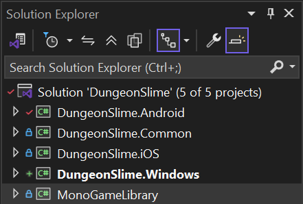

# What You Will Learn

In this chapter you will:
- Convert a Windows-only MonoGame project to support multiple platforms
- Understand the project structure for multi-platform games
- Set up shared code architecture for cross-platform development

# Prerequisites

Before starting this chapter, ensure you have:

- Read the [Building 2D Games](../../../building_2d_games/index.md) tutorial

- **For iOS Development:**
  - An App Store Developer Account
  - **Certificates** and **Provisioning Profiles** configured and installed.
  - **Mac with Xcode 16 installed** - installed through the App Store.
- **For Android Development:**
  - Android SDK and tools installed - through the Visual Studio Installer or through Jetbrains Rider.

# Converting the Dungeon Slime Project

The Dungeon Slime game from the 2D tutorial serves as our practical example for cross-platform conversion. This approach can be applied to any MonoGame project you want to deploy across multiple platforms.

The key principle is **code sharing** of the game logic - we will extract the game logic into a common library that all platform-specific projects can refer to and use.

# Cross-Platform Project Structure

When converted to support multiple platforms, your solution structure will look like this:



This architecture separates concerns cleanly:
- **Shared game logic** in a common library
- **Platform-specific shells** that handle deployment and platform requirements
- **Consistent naming** for easy project management

## DungeonSlime.Common - The Shared Library

The common project contains all your game logic and uses multi-targeting to support different platforms:

```xml
<TargetFrameworks>net8.0;net8.0-ios;net8.0-android</TargetFrameworks>
```

## Platform-Specific Package References

Each target framework pulls in the appropriate MonoGame package:

For **iOS**:
```xml
<ItemGroup Condition="'$(TargetFramework)'=='net8.0-ios'">
    <PackageReference Include="MonoGame.Framework.iOS" Version="3.8.5-develop.6" />
</ItemGroup>
```

For **Android**:

```xml
<ItemGroup Condition="'$(TargetFramework)'=='net8.0-android'">
    <PackageReference Include="MonoGame.Framework.Android" Version="3.8.5-develop.6" />
</ItemGroup>
```

For **Windows**:

```xml
<ItemGroup Condition="'$(TargetFramework)'=='net8.0'">
    <PackageReference Include="MonoGame.Framework.DesktopGL" Version="3.8.5-develop.6" />
</ItemGroup>
```

## Platform-Specific Projects

The individual platform projects become lightweight shells that:

- Reference the _common_ library
- Handle platform-specific initialization
- Manage deployment settings and assets
- Contain minimal platform-specific code

## Project Structure

- **DungeonSlime.Windows** - Windows desktop version
- **DungeonSlime.Android** - Android mobile version
- **DungeonSlime.iOS** - iOS mobile version

The platform projects no longer contain the main Game class - this has been moved to the common library for sharing.

## Third-Party Library Considerations

When using external libraries like **Gum**, ensure they support cross-platform development:

[https://github.com/vchelaru/Gum](https://github.com/vchelaru/Gum)

```xml
<PackageReference Include="Gum.MonoGame" Version="2025.6.26.1" />
```
