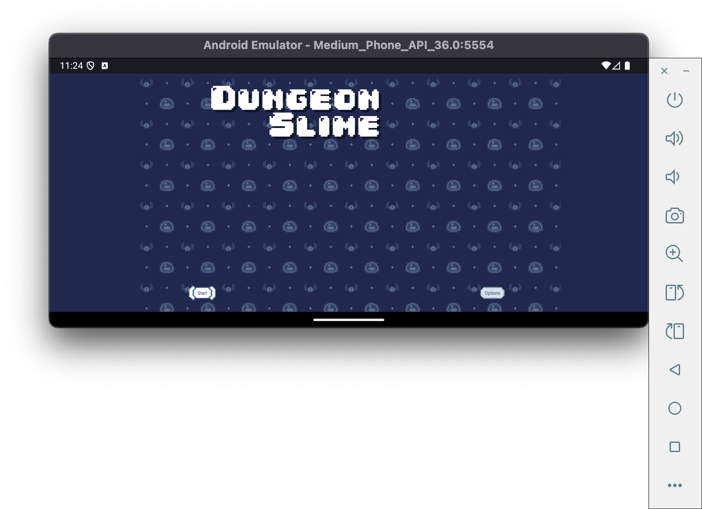
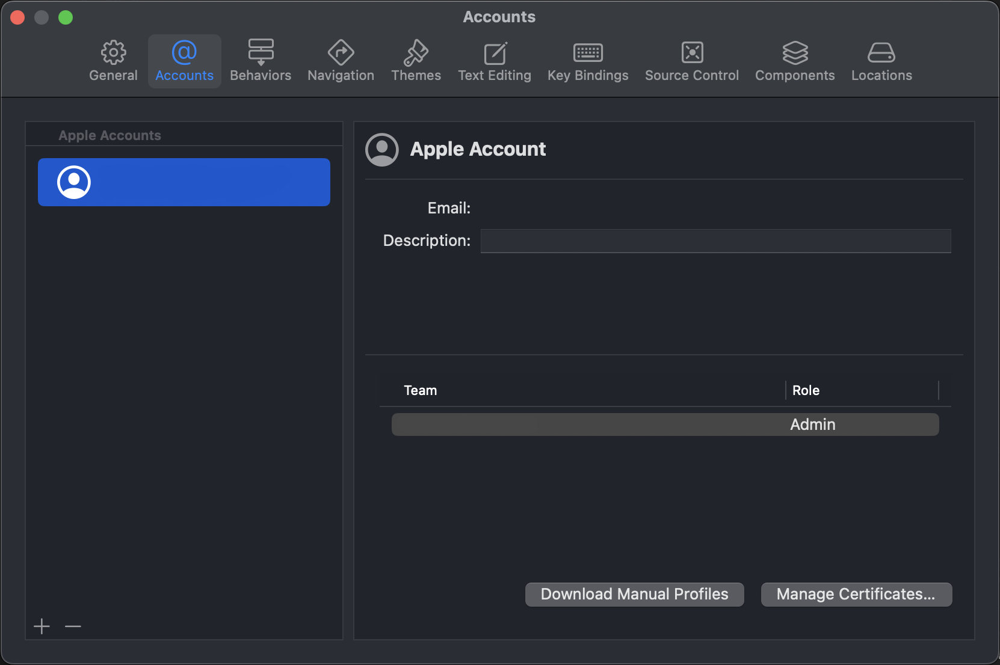
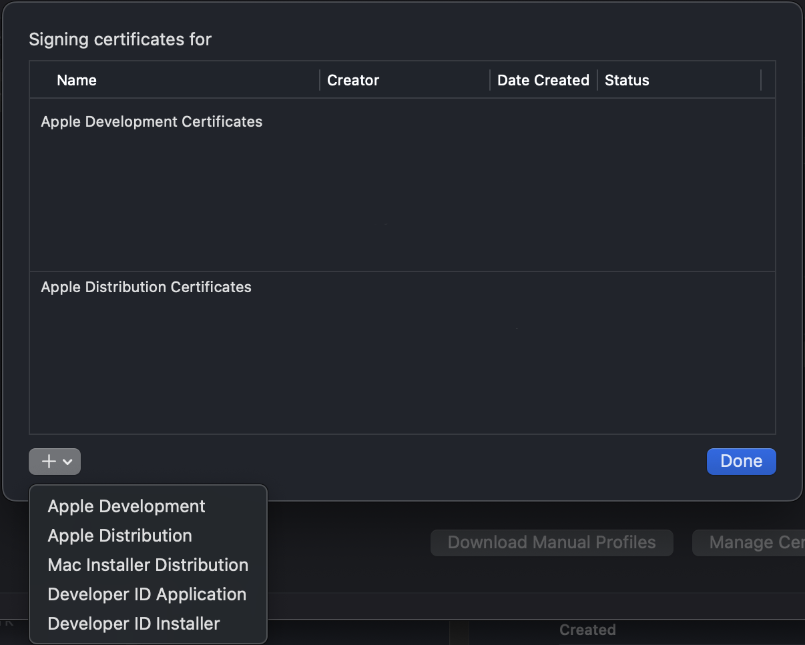

# Android


 



# iOS Signing

XCode --> Settings





```
<PropertyGroup Condition=" '$(Configuration)' == 'Release' ">
    <CodesignKey>iPhone Distribution</CodesignKey>
</PropertyGroup>

<PropertyGroup Condition=" '$(Configuration)' == 'Debug' ">
    <CodesignKey>iPhone Developer</CodesignKey>
</PropertyGroup>
```

# Debugging


