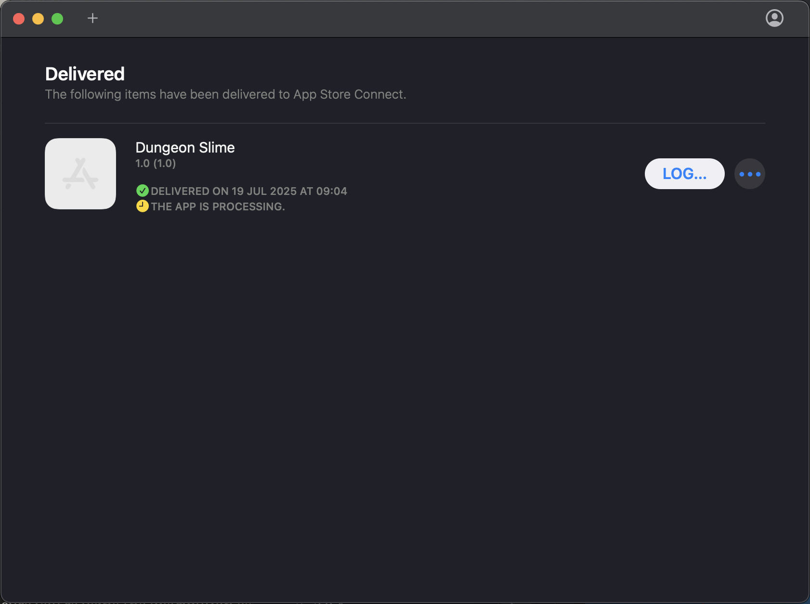
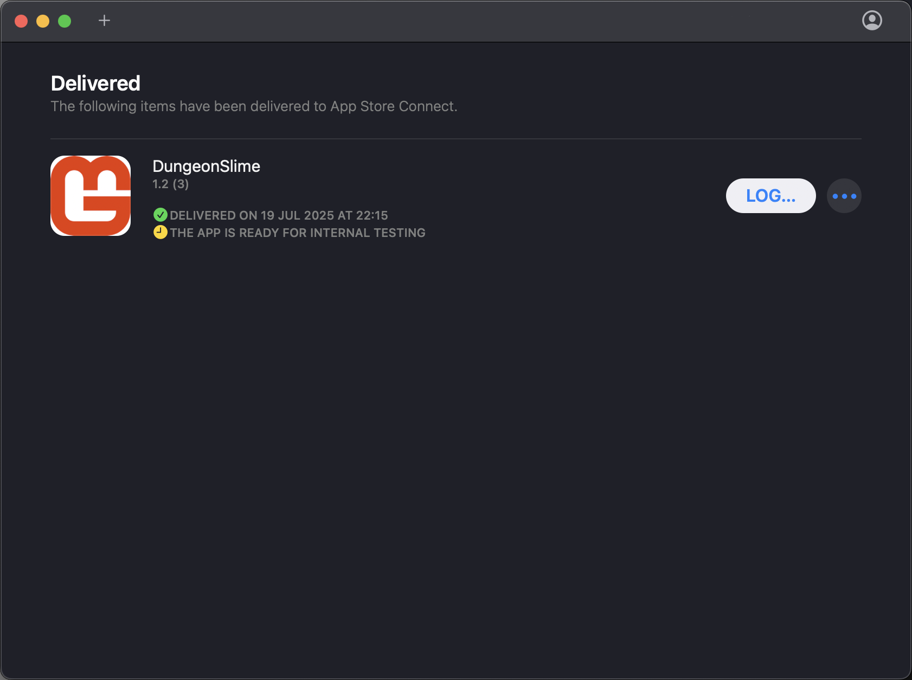
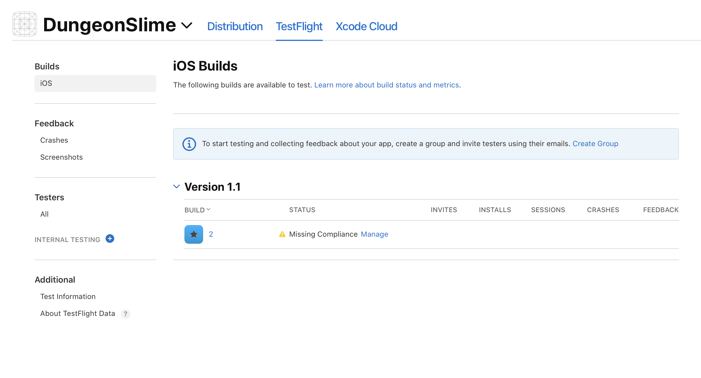
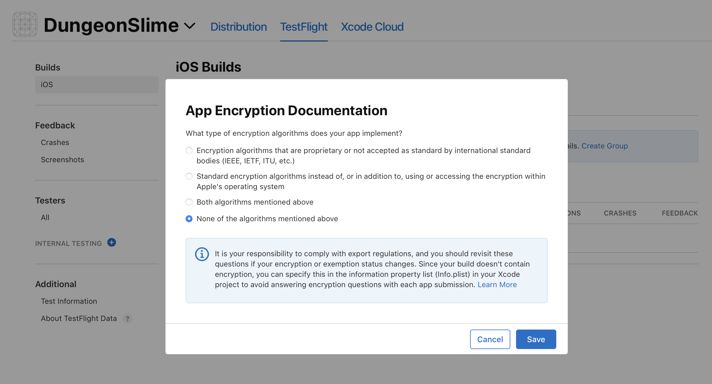
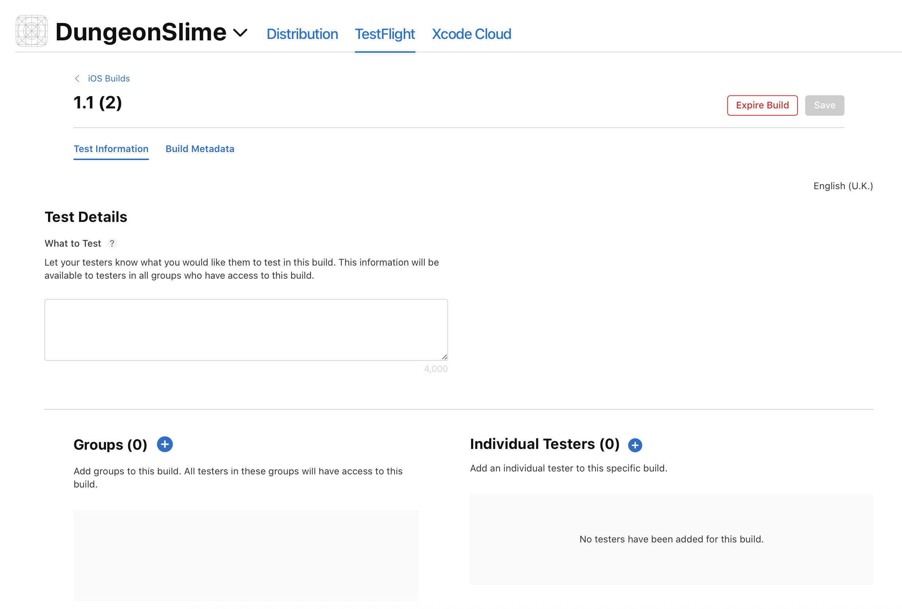
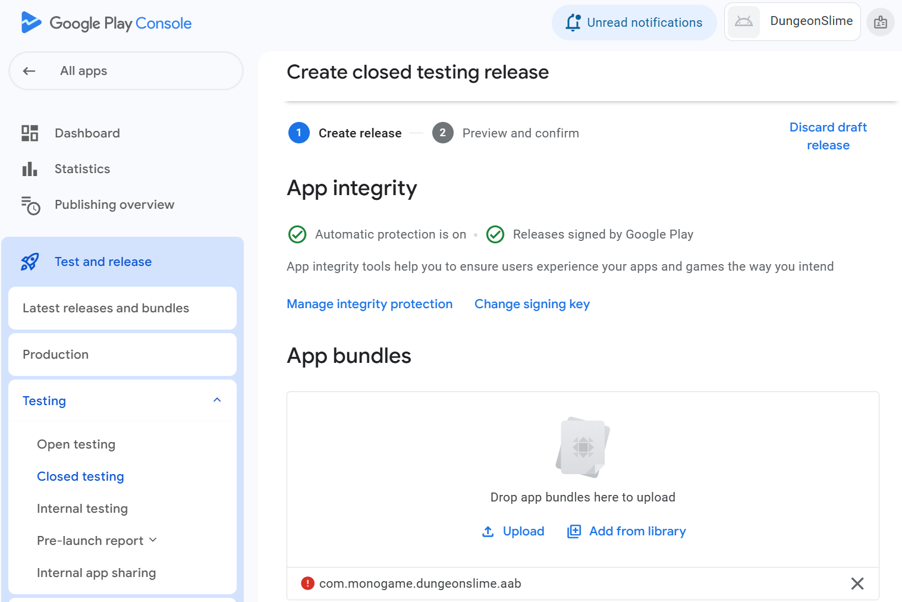

# Publishing Overview

This chapter covers the complete publishing process for both major mobile app stores. You'll learn the requirements, workflows, and common pitfalls for getting your MonoGame app successfully published on iOS and Android platforms.

## Prerequisites

Before publishing, ensure you have:
- Completed development and testing of your cross-platform MonoGame app
- **For iOS:** Active Apple Developer Program membership ($99/year)
- **For Android:** Google Play Developer account ($25 one-time fee)
- App icons, screenshots, and store assets prepared
- Final build configurations tested on physical devices

---

# iOS App Store Publishing

## Pre-Publishing Preparation

### Final iOS Build Configuration

Ensure your iOS project is properly configured for App Store submission:

#### Project Properties
```xml
<SupportedOSPlatformVersion>12.2</SupportedOSPlatformVersion>
<BundleIdentifier>com.companyname.gamename</BundleIdentifier>
<CFBundleIconName>AppIcon</CFBundleIconName>
```

#### Code Signing for Release

Two entitlements - one for debug and one for publication.

```xml
<PropertyGroup Condition=" '$(Configuration)' == 'Release' ">
    <CodesignKey>iPhone Distribution</CodesignKey>
    <CodesignEntitlements>EntitlementsProduction.plist</CodesignEntitlements>
</PropertyGroup>
```

#### Production Entitlements

Verify your `EntitlementsProduction.plist` has debugging disabled:
```xml
<key>get-task-allow</key>
<false/>
```

### Required Assets

#### App Icons

Ensure your `Assets.xcassets/AppIcon.appiconset` contains all required sizes:

- **iPhone**: 40x40, 60x60, 87x87, 120x120, 180x180
- **iPad**: 40x40, 58x58, 80x80, 152x152, 167x167  
- **App Store**: 1024x1024

|Asset|Image|
|-|-|
|40x40||
|58x58||
|60x60||
|80x80||
|87x87||
|120x120||
|120x120||
|152x152||
|83.5x83.5||
|180x180||
|Artwork 1024x1024||

#### Info.plist Configuration

Verify essential properties are set:

The bundle identifier:

From the csproj to match the one in the info.plist file too.

> [!NOTE]
> Change the bundle identifier to match what was set up during the provisioning process.

IOS CSProj:

```xml
<BundleIdentifier>com.monogame.dungeonslime</BundleIdentifier>
```

Info.Plist setting:

```xml
	<key>CFBundleIdentifier</key>
	<string>com.monogame.dungeonslime</string>
```

The game name to appear on the device:

```xml
<key>CFBundleDisplayName</key>
<string>DungeonSlime</string>
```

Versioning of game:

```xml
<key>CFBundleVersion</key>
<string>11</string>
<key>CFBundleShortVersionString</key>
<string>1.10</string>
```

Typical settings for a game:

```
<key>UIRequiresFullScreen</key>
<true/>
<key>UIStatusBarHidden</key>
<true/>
```

### Asset Compilation Target

Ensure your iOS project includes the asset compilation target:

```xml
<Target Name="CompileAssets" BeforeTargets="_CompileAppManifest" Condition="$([MSBuild]::IsOSPlatform('OSX'))">
    <MakeDir Directories="$(OutputPath)Assets" />
    <Exec Command="xcrun actool --output-format human-readable-text --notices --warnings --platform iphoneos --minimum-deployment-target 12.2 --app-icon AppIcon --output-partial-info-plist partial-info.plist --compile $(OutputPath)Assets Assets.xcassets " />
</Target>
```

## App Store Connect Setup

### Creating Your App Record

1. **Log into App Store Connect** at [appstoreconnect.apple.com](https://appstoreconnect.apple.com)
2. **Create New App:**
   - Platform: iOS
   - Name: Your app's marketing name
   - Primary Language: English (or your primary market)
   - Bundle ID: Must match your project's `BundleIdentifier`
   - SKU: Unique identifier for your records

### App Information

#### Required Information

- **App Name:** Display name in the App Store
- **Subtitle:** Brief description
- **Category:** Primary and secondary categories
- **Content Rights:** Whether you own or have licensed all content

#### App Store Listing

- **Description:** Detailed app description
- **Keywords:** Search terms (comma-separated)
- **Marketing URL:** Your app's website
- **Privacy Policy URL:** Required for most apps

### Screenshots and Media

#### Required Screenshots

You need screenshots for each device type you support:

- **iPhone 6.7"** (iPhone 14 Pro Max): 1290 x 2796 pixels
- **iPhone 6.5"** (iPhone 11 Pro Max): 1242 x 2688 pixels  
- **iPhone 5.5"** (iPhone 8 Plus): 1242 x 2208 pixels
- **iPad Pro (6th gen)**: 2048 x 2732 pixels
- **iPad Pro (2nd gen)**: 2048 x 2732 pixels

#### App Preview Videos (Optional)

- 30 seconds maximum
- Same dimensions as screenshots
- Shows actual app gameplay

## Building and Uploading

### Archive Build Process

#### Using Command Line

The creation of an IPA file can be achieved on the terminal. Currently, Rider does **not** support this process.

```sh
dotnet clean
rm -rf bin/ obj/
dotnet publish -c Release -f net8.0-ios -r ios-arm64 -p:ArchiveOnBuild=true
```

### Upload Method

#### Transporter

- Standalone upload tool from Apple


- Useful for automated workflows





- Requires pre-signed IPA file

### Build Processing

After upload:

1. **Processing Time:** 10-60 minutes typically
2. **Build Appears:** In App Store Connect under "Activity"
3. **Status Check:** Wait for "Ready to Submit" status
4. **Build Selection:** Choose the build for your app version







## App Review Submission

### Pre-Submission Checklist

- [ ] All required screenshots uploaded
- [ ] App description and metadata complete
- [ ] Privacy policy URL provided (if required)
- [ ] Content rating completed
- [ ] Pricing and availability set
- [ ] Build selected and tested
- [ ] Export compliance information provided

### Review Information

#### App Review Contact Information

- First Name, Last Name
- Phone Number
- Email Address

#### Demo Account (If Required)

If your app requires login:
- Demo Username
- Demo Password
- Additional instructions for reviewers

#### Notes for Review

Additional information to help reviewers:
- Special instructions
- Feature explanations
- Known limitations

### Submission Process

1. **Select Build:** Choose your uploaded build
2. **Review Summary:** Check all information is correct
3. **Submit for Review:** Click "Submit for Review"
4. **Status Tracking:** Monitor in App Store Connect

## Review Timeline and Common Issues

### Typical Timeline

- **Review Time:** 24-48 hours
- **Processing:** Additional time for first-time developers
- **Holiday Delays:** Longer during Apple holidays, so plan accordingly.

---

# Google Play Store Publishing

## Pre-Publishing Preparation

### Final Android Build Configuration

Ensure your Android project is properly configured for Google Play submission:

#### Project Properties

```xml
<SupportedOSPlatformVersion>23</SupportedOSPlatformVersion>
<ApplicationId>com.companyname.DungeonSlime.Android</ApplicationId>
<ApplicationVersion>1</ApplicationVersion>
<ApplicationDisplayVersion>1.0</ApplicationDisplayVersion>
```

#### Activity Configuration

Verify your main activity is properly configured:

```csharp
[Activity(
    Label = "@string/app_name",
    MainLauncher = true,
    Icon = "@drawable/icon",
    AlwaysRetainTaskState = true,
    LaunchMode = LaunchMode.SingleInstance,
    ScreenOrientation = ScreenOrientation.SensorLandscape,
    ConfigurationChanges = ConfigChanges.Orientation | ConfigChanges.Keyboard | 
                           ConfigChanges.KeyboardHidden | ConfigChanges.ScreenSize
)]
```

### Required Assets

#### App Icons

Ensure you have app icons for all density buckets:

- **mdpi:** 48x48 px
- **hdpi:** 72x72 px  
- **xhdpi:** 96x96 px
- **xxhdpi:** 144x144 px
- **xxxhdpi:** 192x192 px

#### Feature Graphic

- **Size:** 1024 x 500 px
- **Format:** PNG or JPEG
- **Purpose:** Featured in Google Play Store

#### Screenshots

Required for each supported device type:

- **Phone:** Minimum 320px, maximum 3840px
- **7-inch Tablet:** Same requirements
- **10-inch Tablet:** Same requirements
- **Android TV:** 1920 x 1080 px
- **Wear OS:** 384 x 384 px

### Release Build Configuration

#### Signing Configuration

#### Creating a Keystore
```bash
# Generate new keystore (first time only)
keytool -genkey -v -keystore your-app.keystore -alias your-key-alias -keyalg RSA -keysize 2048 -validity 10000

# Verify keystore
keytool -list -v -keystore your-app.keystore
```

**Important:** Keep your keystore file secure and backed up. Lost keystores cannot be recovered and prevent app updates.

## Google Play Console Setup

### Creating Your Developer Account

**Register at** [play.google.com/console](https://play.google.com/console)

### Creating Your App

1. **Create App** in Google Play Console
   
2. **App Details:**
   - App Name: Your app's display name
   - Default Language: Primary market language
   - App or Game: Select "Game" for MonoGame apps
   - Free or Paid: Choose pricing model

3. **Declarations:**
   - App Content: Age rating and content
   - Target Audience: Age groups
   - News App: Usually "No" for games

## Building Release APK/AAB

### Android App Bundle (Recommended)

Google Play prefers AAB format for optimized delivery:

```bash
# Build AAB using .NET CLI
dotnet publish -f net8.0-android -c Release

# Or using MSBuild
msbuild YourApp.Android.csproj /p:Configuration=Release /p:AndroidPackageFormat=aab
```

### APK Build (Alternative)

```bash
# Build APK
dotnet publish -f net8.0-android -c Release /p:AndroidPackageFormat=apk
```



### Verification Steps

Before upload, verify your build:

```bash
# Check APK contents
aapt dump badging your-app.apk

# Verify signing
jarsigner -verify -verbose -certs your-app.apk

# Test installation
adb install your-app.apk
```

# Conclusion

This completes the comprehensive guide to publishing your MonoGame application on both major mobile app stores. Following these workflows will help ensure successful publication and ongoing maintenance of your mobile game.
