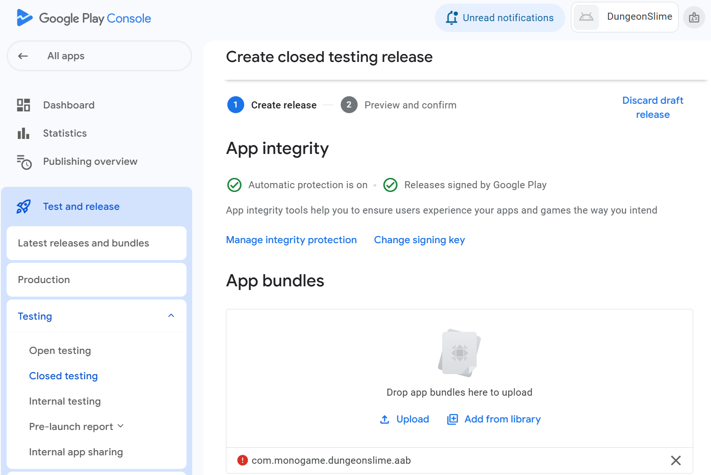

# Publishing Overview

This chapter covers the complete publishing process for both major mobile app stores. You will learn the requirements and workflows for getting your MonoGame app successfully published on Android platforms.

## Prerequisites

Before publishing, ensure you have:
- Completed development and testing of your cross-platform MonoGame app
- Google Play Developer account (a one-time fee)
- App icons, screenshots, and store assets prepared
- Final build configurations tested on physical devices

---

# Google Play Store Publishing

## Pre-Publishing Preparation

### Final Android Build Configuration

Ensure your Android project is properly configured for Google Play submission:

#### Project Properties

```xml
<SupportedOSPlatformVersion>23</SupportedOSPlatformVersion>
<ApplicationId>com.companyname.DungeonSlime.Android</ApplicationId>
<ApplicationVersion>1</ApplicationVersion>
<ApplicationDisplayVersion>1.0</ApplicationDisplayVersion>
```

#### Activity Configuration

Verify your main activity is properly configured:

```csharp
[Activity(
    Label = "@string/app_name",
    MainLauncher = true,
    Icon = "@drawable/icon",
    AlwaysRetainTaskState = true,
    LaunchMode = LaunchMode.SingleInstance,
    ScreenOrientation = ScreenOrientation.SensorLandscape,
    ConfigurationChanges = ConfigChanges.Orientation | ConfigChanges.Keyboard | 
                           ConfigChanges.KeyboardHidden | ConfigChanges.ScreenSize
)]
```

### Required Assets

#### App Icons

Ensure you have app icons for all density buckets:

- **mdpi:** 48x48 px
- **hdpi:** 72x72 px  
- **xhdpi:** 96x96 px
- **xxhdpi:** 144x144 px
- **xxxhdpi:** 192x192 px

#### Feature Graphic

- **Size:** 1024 x 500 px
- **Format:** PNG or JPEG
- **Purpose:** Featured in Google Play Store

#### Screenshots

Required for each supported device type:

- **Phone:** Minimum 320px, maximum 3840px
- **7-inch Tablet:** Same requirements
- **10-inch Tablet:** Same requirements
- **Android TV:** 1920 x 1080 px
- **Wear OS:** 384 x 384 px

### Release Build Configuration

#### Signing Configuration

#### Creating a Keystore
```bash
# Generate new keystore (first time only)
keytool -genkey -v -keystore your-app.keystore -alias your-key-alias -keyalg RSA -keysize 2048 -validity 10000

# Verify keystore
keytool -list -v -keystore your-app.keystore
```

**Important:** Keep your keystore file secure and backed up. Lost keystores cannot be recovered and prevent app updates.

## Google Play Console Setup

### Creating Your Developer Account

**Register at** [play.google.com/console](https://play.google.com/console)

### Creating Your App

1. **Create App** in Google Play Console
   
2. **App Details:**
   - App Name: Your app's display name
   - Default Language: Primary market language
   - App or Game: Select "Game" for MonoGame apps
   - Free or Paid: Choose pricing model

3. **Declarations:**
   - App Content: Age rating and content
   - Target Audience: Age groups
   - News App: Usually "No" for games

## Building Release APK/AAB

### Android App Bundle (Recommended)

Google Play prefers AAB format for optimized delivery:

```bash
# Build AAB using .NET CLI
dotnet publish -f net8.0-android -c Release

# Or using MSBuild
msbuild YourApp.Android.csproj /p:Configuration=Release /p:AndroidPackageFormat=aab
```

### APK Build (Alternative)

```bash
# Build APK
dotnet publish -f net8.0-android -c Release /p:AndroidPackageFormat=apk
```

|  |
| :----------------------------------------------------------------------------------------------------------------------------------------: |
|                       **Figure 4-7: Visual Studio Archive** |  

### Verification Steps

Before upload, verify your build:

```bash
# Check APK contents
aapt dump badging your-app.apk

# Verify signing
jarsigner -verify -verbose -certs your-app.apk

# Test installation
adb install your-app.apk
```
