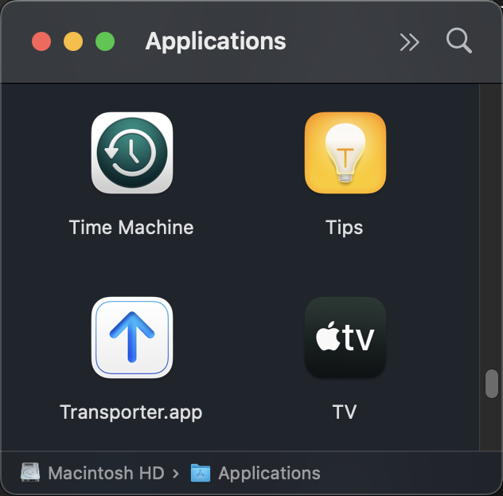
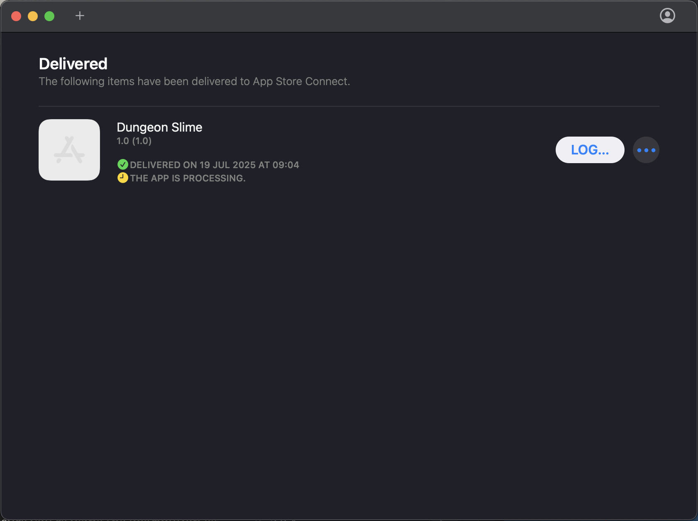
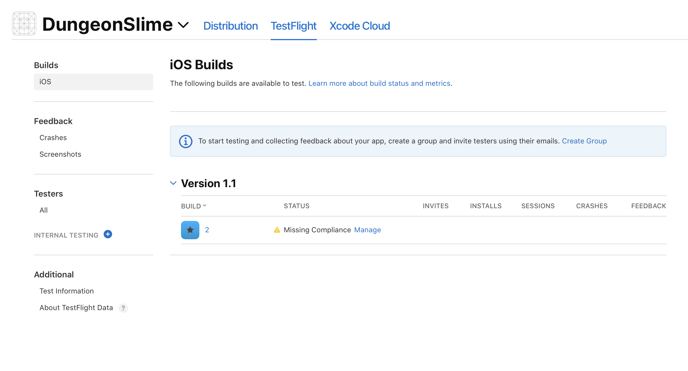
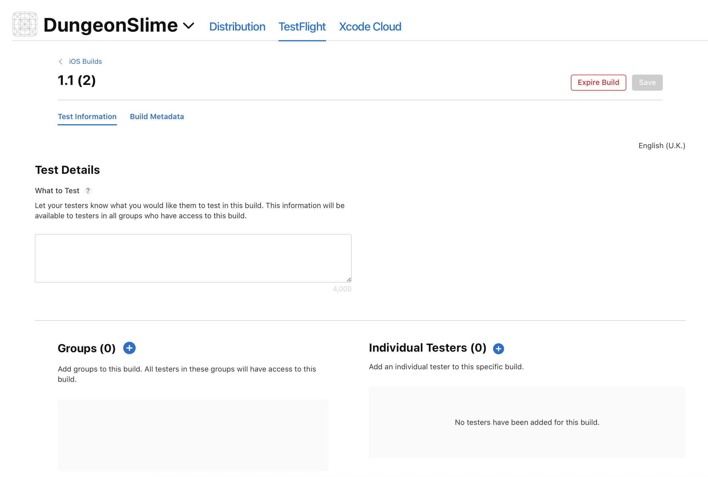

# Publishing Overview

This chapter covers the complete publishing process for both major mobile app stores. You will learn the requirements, workflow for getting your MonoGame app successfully published on iOS platforms.

# Apple Develoer Program

## Pre-Publishing Preparation

Ensure your iOS project is properly configured for App Store submission:

## Project Properties

```xml
<SupportedOSPlatformVersion>12.2</SupportedOSPlatformVersion>
<BundleIdentifier>com.companyname.gamename</BundleIdentifier>
<CFBundleIconName>AppIcon</CFBundleIconName>
```

## Code Signing for Release

Two entitlements - one for debug and one for publication.

```xml
<PropertyGroup Condition=" '$(Configuration)' == 'Release' ">
    <CodesignKey>iPhone Distribution</CodesignKey>
    <CodesignEntitlements>EntitlementsProduction.plist</CodesignEntitlements>
</PropertyGroup>
```

## Production Entitlements

Verify your `EntitlementsProduction.plist` has debugging disabled:

```xml
<key>get-task-allow</key>
<false/>
```

## Required Assets

### App Icons

You will need to create and ensure you have app icons for all density buckets. There are a few online offerings where you can create a single image and it produce the icons. For example, [App Icon Generator](https://www.applicon.com).

You can place all of your icons in the location `Assets.xcassets/AppIcon.appiconset`.

- **iPhone**: 40x40, 60x60, 87x87, 120x120, 180x180
- **iPad**: 40x40, 58x58, 80x80, 152x152, 167x167  
- **App Store**: 1024x1024

|Asset|Image|
|-|-|
|40x40||
|58x58||
|60x60||
|80x80||
|87x87||
|120x120||
|120x120||
|152x152||
|83.5x83.5||
|180x180||
|Artwork 1024x1024||

### Info.plist Configuration

Verify essential properties are set:

The bundle identifier:

From the csproj to match the one in the info.plist file too.

> [!NOTE]
> Change the bundle identifier to match what was set up during the provisioning process.

IOS CSProj:

```xml
<BundleIdentifier>com.monogame.dungeonslime</BundleIdentifier>
```

Info.Plist setting:

```xml
<key>CFBundleIdentifier</key>
<string>com.monogame.dungeonslime</string>
```

The game name to appear on the device:

```xml
<key>CFBundleDisplayName</key>
<string>DungeonSlime</string>
```

Versioning of game:

```xml
<key>CFBundleVersion</key>
<string>11</string>
<key>CFBundleShortVersionString</key>
<string>1.10</string>
```

Typical settings for a game:

```xml
<key>UIRequiresFullScreen</key>
<true/>
<key>UIStatusBarHidden</key>
<true/>
```

API descriptions:

If your game uses any additional API's or API's are pulled in from libraries, then the following descriptions need to be added to define your usage. If you're not using them, then you need to identify the library being added and determine if you need this.

```xml
<key>NSBluetoothAlwaysUsageDescription</key>
<string>This game uses bluetooth because...</string>

<key>NSLocationAlwaysAndWhenInUseUsageDescription</key>
<string>This game is location information because...</string>

<key>NSLocationWhenInUseUsageDescription</key>
<string>This game is location information because...</string>

<key>NSCalendarsUsageDescription</key>
<string>This game uses calendar information because...</string>

<key>NSSiriUsageDescription</key>
<string>This game uses Siri because...</string>

<key>NSMicrophoneUsageDescription</key>
<string>This game uses the microphone because.</string>

<key>NSContactsUsageDescription</key>
<string>This game uses contacts because...</string>

<key>NSAppleMusicUsageDescription</key>
<string>This game uses Apple Music because...</string></dict>
```

## Asset Compilation Target

Ensure your iOS project includes the asset compilation target. This is currently required for MonoGame projects to get the AppIcons and assets included in the bundle.

```xml
<Target Name="CompileAssets" BeforeTargets="_CompileAppManifest" Condition="$([MSBuild]::IsOSPlatform('OSX'))">
    <MakeDir Directories="$(OutputPath)Assets" />
    <Exec Command="xcrun actool --output-format human-readable-text --notices --warnings --platform iphoneos --minimum-deployment-target 12.2 --app-icon AppIcon --output-partial-info-plist partial-info.plist --compile $(OutputPath)Assets Assets.xcassets " />
</Target>
```

## Creating Game at App Store Connect

Once you're ready to publish your game to TestFlight or the AppStore, following these steps:

1. **Log into App Store Connect** at [appstoreconnect.apple.com](https://appstoreconnect.apple.com)

2. **Create New App:**
   - Platform: **iOS**
   - Name: _Your app's marketing name_
   - Primary Language: English (or your primary market)
   - Bundle ID: Must match the `BundleIdentifier` of your game.
   - SKU: Unique identifier if you were to create a series of games.

## Screenshots and Media

### Required Screenshots

You need screenshots for each of the following devices:

- **iPhone 6.7"** (iPhone 14 Pro Max): 1290 x 2796 pixels
- **iPhone 6.5"** (iPhone 11 Pro Max): 1242 x 2688 pixels  
- **iPhone 5.5"** (iPhone 8 Plus): 1242 x 2208 pixels
- **iPad Pro (6th gen)**: 2048 x 2732 pixels
- **iPad Pro (2nd gen)**: 2048 x 2732 pixels

### App Preview Videos (Optional)

Although optional, a video to demo your game will certainly appeal to the audience.

- Create a 30 seconds video showing features and market your game.
- Try and show actual gameplay and advertise features and any unique play.

## Building and Uploading using Terminal

The creation of an IPA file can be achieved using the **Terminal** app. Currently, Rider does __not__ support this part of the process.

If you are building on MacOS Tahoe, you'll need the following in the csproj:

```xml
<PropertyGroup>
<TargetPlatformVersion>26.0</TargetPlatformVersion>
</PropertyGroup>
```

Using terminal, navigate to the dungeonslime.iOS folder and run the following steps:

For game projects that are targeting .NET 8.0 iOS:

```sh
dotnet clean
rm -rf bin/ obj/
dotnet publish -c Release -f net8.0-ios -r ios-arm64 -p:ArchiveOnBuild=true
```

For game projects that are targeting .NET 9.0 iOS:

```sh
dotnet clean
rm -rf bin/ obj/
dotnet publish -c Release -f net9.0-ios -r ios-arm64 -p:ArchiveOnBuild=true
```

For game projects that are targeting .NET 10.0 iOS:

```sh
dotnet clean
rm -rf bin/ obj/
dotnet publish -c Release -f net10.0-ios -r ios-arm64 -p:ArchiveOnBuild=true
```

This will create an IPA file in your publish folder which you can upload to the AppStore.

Some other options for the project file that have helped make an ipa.

### **UseInterpreter** setting

If you encounter an exit code of 134 during (Ahead of Time) AOT compilation during the **dotnet publish** phase, then set this property to **true**.

e.g.

```sh
/usr/local/share/dotnet/packs/Microsoft.iOS.Sdk.net9.0_26.0/26.0.9752/targets/Xamarin.Shared.Sdk.targets(1387,3): error : Failed to AOT compile aot-instances.dll, the AOT compiler exited with code 134.
```

This setting tells the build system to disable full Ahead-Of-Time (AOT) compilation and instead rely on the Mono Interpreter for the managed C# code.

Setting the csproj file:

```xml
<PropertyGroup>
    <UseInterpreter>true</UseInterpreter>
</PropertyGroup>
```

### End of Life Target warning

Suppressing the End of Life (EoL) warning can be done with the **CheckEolTargetFramework** setting.

```sh
error NETSDK1202: The workload 'net8.0-ios' is out of support and will not receive security updates in the future.
```

Setting in the csproj file to suppress the warning:

```xml
<PropertyGroup>
    <CheckEolTargetFramework>false</CheckEolTargetFramework>
</PropertyGroup>
```

## Upload Method using Transporter

You can use the **Transporter** tool to upload your IPA file and that can be found in the **Applications** folder.

|  |
| :----------------------------------------------------------------------------------------------------------------------------------------: |
|                       **Figure 4-1: Transporter**                       |

Step through the upload process for your IPA file.

|  |
| :----------------------------------------------------------------------------------------------------------------------------------------: |
|                       **Figure 4-2: Transporter Upload Step 1**                       |

|  |
| :----------------------------------------------------------------------------------------------------------------------------------------: |
|                       **Figure 4-3: Transporter Upload Step 2**                       |

## After uploading

The process can take a few moments to happen, but switching to the AppStore to watch the progress and complete the publication of your app.

|  |
| :----------------------------------------------------------------------------------------------------------------------------------------: |
|                       **Figure 4-4: iOS Builds**                       |

|  |
| :----------------------------------------------------------------------------------------------------------------------------------------: |
|                       **Figure 4-5 Encryption Dialog**    |

**Tip:** If you want to skip the "Encryption" dialog box altogether and streamline the process and because you do not use encryption in your game, simply add this section to your **info.plist** file.

```xml
<key>ITSAppUsesNonExemptEncryption</key>
<false/>
```

Finally, add your testers and test information and they will receive your updated game (via Testflight or Store).

|  |
| :----------------------------------------------------------------------------------------------------------------------------------------: |
|                       **Figure 4-6: Assign Testers** |    
