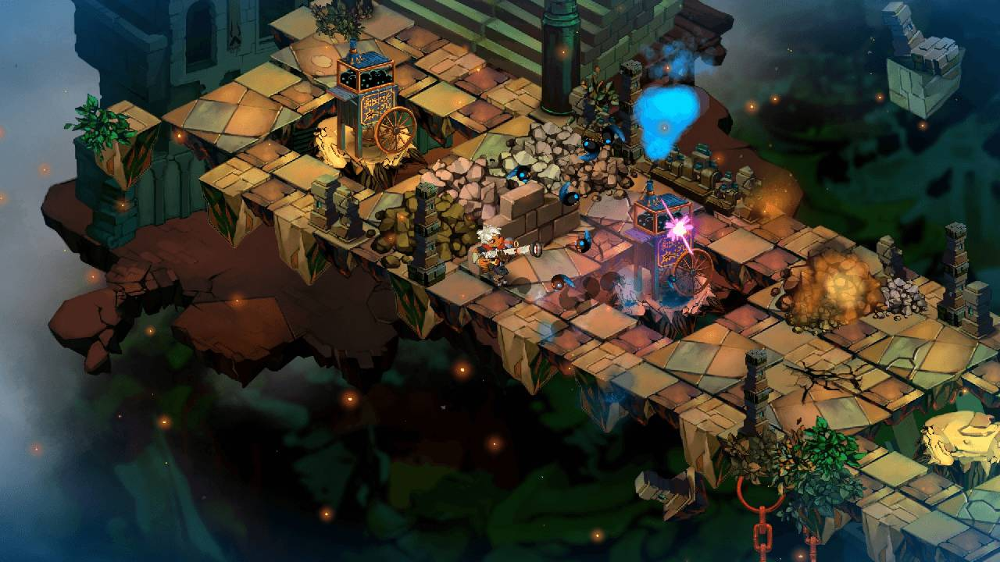

## A Brief History

In 2006, Microsoft released a game development framework named *[XNA Game Studio](https://learn.microsoft.com/en-us/previous-versions/windows/xna/bb203894(v=xnagamestudio.42))* to facilitate game development for Windows PC and the Xbox 360 console. It revolutionized game development for indie creators by bringing a simplified approach to building games and offering a set of tools that lowered the entry barrier for aspiring game developers. Out of XNA Game Studio came critically acclaimed titles such as [Bastion](https://www.supergiantgames.com/games/bastion/) and [Terraria](https://terraria.org/). In 2008, XNA was expanded to support development for both the Zune and Windows Phone.

> [!NOTE]
>
> Fun fact, provided by community member [stromkos](https://github.com/stromkos), The release of XNA 3.0 in 2008, which added the support for Windows Phone, is also the release that specified the default window resolution of 800x480 for new projects as this was the preferred resolution on Windows Phone. [It is still the default resolution used in MonoGame projects today](https://github.com/MonoGame/MonoGame/blob/8b35cf50783777507cd6b21828ed0109b3b07b50/MonoGame.Framework/GraphicsDeviceManager.cs#L44).

As XNA became more popular, the need for cross-platform development started to grow. In 2009, [José Antonio Leal de Farias](https://github.com/jalf) introduced *XNA Touch*, an open-source project that aimed to make games with XNA playable on iOS devices. This marked the beginning of what would later become MonoGame. [Dominique Louis](https://github.com/CartBlanche) came on board in 2009 and soon took over as full-time project lead, driving its initial development and expansion. The project attracted other developers, such as [Tom Spilman](https://github.com/tomspilman), who were interested in expanding the scope of the project as well as its reach.

The official first release of MonoGame occurred in 2011, as an open-source version of XNA. While it still had the same familiar API as XNA, the cross-platform support was expanded to include Windows, macOS, Linux, iOS, Android, Xbox, and PlayStation. Despite Microsoft discontinuing XNA in 2013, MonoGame continued to grow and develop. Maintenance of the project was given to [Steve Williams](https://github.com/KonajuGames) and [Tom Spilman](https://github.com/tomspilman) in 2014. In order to direct its future development and undertaking, the [MonoGame Foundation](https://monogame.net/about/) was formed on September 29th, 2023.

Today, MonoGame is a mature cross-platform framework, that is built with the spirit of preserving XNA while adopting modern game development practices. Some popular titles created using MonoGame include [Celeste](https://store.steampowered.com/app/504230/Celeste/), [Stardew Valley](https://store.steampowered.com/app/413150/Stardew\_Valley/), and [Streets of Rage 4](https://store.steampowered.com/app/985890/Streets\_of\_Rage\_4/).

|         |  |
| :-------------------------------------------------: | :--------------------------------------------------------: |
|               **Figure 1-1 Celeste.**               |               **Figure 1-2: Stardew Valley**               |
|  |                 |
|          **Figure 1-3: Streets of Rage 4**          |                   **Figure 1-4: Bastion**                  |

> [!NOTE]
>
> For more details about MonoGame's history, check the [About](https://monogame.net/about/) on the official MonoGame website.

## Features

MonoGame, following in the footsteps of XNA, is a "bring your own tools" framework. It provides developers the basic blocks to design the game, engines, and/or tools. As a code-first approach to game development, MonoGame does not include any pre-built editors or interfaces; instead, it gives developers the freedom to create their own working environment.

### API

At its core, MonoGame offers a set of libraries and APIs to handle common game development tasks. These include:

1. **Graphics Rendering**: 2D and 3D rendering are supported through the graphics API offered by MonoGame. This API provides sprite batching for 2D graphics, a flexible 3D pipeline, and shaders for custom visuals and effects.
2. **Input Handling**: Input from keyboard, mouse, gamepads, and touchscreens is supported, allowing for development of games for any platform and different styles of play.
3. **Audio**: A comprehensive audio system that can be used to create sound effects as well as play music with included support for many audio formats.
4. **Content Pipeline**: An out-of-the-box workflow for importing and processing game assets such as textures, models, and audio, and compiling them to a format that is optimal for the game's target platform.
5. **Math Library**: A math library specifically optimized for game development, providing essential mathematical functions and operations.

### Cross Platform

One of the main advantages of MonoGame is its cross-platform support. Games built with MonoGame are compatible with a variety of platforms, including:

* **Desktop**: Windows, macOS, and Linux.
* **Mobile**: iOS and Android.
* **Consoles** [(with appropriate license)](https://docs.monogame.net/articles/console\_access.html): Xbox, PlayStation, and Nintendo Switch.

By providing cross-platform support, developers can target multiple platforms from a single code base, significantly reducing development time and resources needed for porting.

### Programming Language Support

MonoGame is designed and built in C#. It is the official programming language supported in documentation, samples, and community discussion. However, MonoGame is not exclusively tied to C#. As a .NET library, MonoGame can be used with any .NET-compatible language, including Visual Basic and F#.

> [!CAUTION]
> While the alternative .NET languages can be used, community support may be limited outside the scope of C#.

Regardless of which .NET language is used, developers should have a foundational understanding of the language and programming concepts such as:

* Object-oriented programming.
* Data types and structures.
* Control flow and loops.
* Error handling and debugging.

## See Also

* [About MonoGame | MonoGame](https://monogame.net/about)

## Test Your Knowledge

1. Name one of the advantages of using the MonoGame framework to develop games.

    :::question-answer
    Any of the following are advantages of using the MonoGame framework.
    1. It provides cross-platform support, allowing developers to target multiple platforms from a single code base.
    2. It offers a set of libraries and APIs common for game development tasks, such as graphics rendering, input handling, audio, and content management.
    3. It is a "bring your own tools" framework, giving developers flexibility in their working environment.
    :::

2. What programming languages can be used when creating a game with MonoGame?

    :::question-answer
    The primary language used is C#, which is the same language that the MonoGame framework is developed in.  However, any .NET language can be used, such as F# or Visual Basic.
    :::
