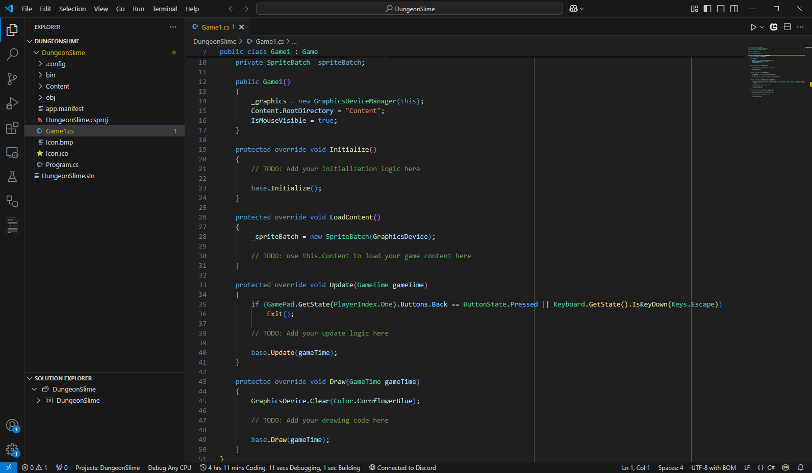

Unlike game engines (such as Unity, Unreal or Godot), MonoGame is a *framework*. This means it does not come as a standalone program that you download and install, and does not include a graphical user interface used to create games. Instead, MonoGame integrates into the standard .NET development workflow, offering a code-first approach to game development. This approach offers several advantages:

* **Flexibility**: Developers are not locked into using a specific editor or interface, allowing them to use their preferred development tools.
* **Integration**: As a .NET library itself, MonoGame can easily integrate with other .NET libraries and tools.
* **Cross-platform Development**: Since C# is cross-platform, and MonoGame is cross-platform, developers can develop MonoGame projects on Windows, macOS, or Linux, with only slight differences in the setup process for each operating system.
* **Version Control Friendly**: The code-first approach makes it easier to use version control systems like Git for your game projects.

While the environment setup process is similar to the standard setup process for C# development, there are some MonoGame specific steps. These can vary slightly depending on your operating system and the *Integrated Development Environment* (IDE).

## Installing the .NET SDK

The first thing we need to do is install the .NET *Software Development Kit* (SDK). To install it, follow the instructions based on your operating system below:

> [!IMPORTANT]
> As of MonoGame 3.8.2, the minimum supported version of the .NET SDK is .NET 8.

### [Windows](#tab/windows)

1. Open a web browser and navigate to [https://dotnet.microsoft.com/en-us/download](https://dotnet.microsoft.com/en-us/download).
2. Choose the version of the .NET SDK to install and click the **Download .NET SDK x64** button to start the download.

    > [!NOTE]
    > The minimum supported version is .NET 8

3. Once the download finishes, run the installer.

### [macOS](#tab/macos)

1. Open a web browser and navigate to [https://dotnet.microsoft.com/en-us/download](https://dotnet.microsoft.com/en-us/download).
2. Choose the version of the .NET SDK to install and click the *Download .NET SDK x64 (Intel)* button start the download of the .NET SDK Installer.

    > [!NOTE]
    > The minimum supported version is .NET 8

3. Once the download finishes, run the installer.  

> [!NOTE]  
> For the time being, MonoGame requires that you install the **Intel** version even if you are using an Apple Silicon (M1/M2) Mac. For Apple Silicon Macs, it also requires that [Rosetta](https://support.apple.com/en-us/HT211861) be enabled.

### [Linux](#tab/linux)

1. Open a new *Terminal* window
2. Enter the following command to install the .NET SDK

```sh
sudo apt-get update && sudo apt-get install -y dotnet-sdk-8.0
```

> [!NOTE]
> The minimum supported version is .NET 8

---

## Install Additional Workloads (Optional)

After installing the .NET SDK, if you intend to target mobile devices such as Android or iOS, you will also need to install the corresponding mobile workloads. To do this, open a *Command Prompt* or *Terminal* window and enter the following commands.

```sh
dotnet workload install ios
dotnet workload install android
```

## Install MonoGame Project Templates

MonoGame provides project templates that can be installed to create new projects that are pre-configured to target the current version of MonoGame as a base to begin creating games. To install the MonoGame templates, open a *Command Prompt* or *Terminal* window and enter the following command

```sh
dotnet new install MonoGame.Templates.CSharp
```

## Installing Visual Studio Code

*Visual Studio Code* (VSCode) is a free, lightweight editor. Depending on the programming language you are using, it is just a matter of installing the appropriate extension to support that particular language. VSCode is also cross-platform, meaning you can use it for development on Windows, macOS, and Linux. To ensure that all readers can follow this tutorial regardless of the operating system used, we will be using VSCode as our IDE.

To install VSCode, follow the instructions for your operating system below:

### [Windows](#tab/windows)

1. Open a browser and navigate to [https://code.visualstudio.com/](https://code.visualstudio.com/).
2. Click the *Download for Windows* button to start the download of the installer.
3. Once the download finishes, run the installer.

### [macOS](#tab/macos)

1. Open a web browser and navigate to [https://code.visualstudio.com/](https://code.visualstudio.com/).
2. Click the *Download for macOS* button to start the download of the *.zip* archive.
3. Once the download finishes, double click the *.zip* archive to extract the *Visual Studio Code.app* application package
4. Drag-and-drop the *Visual Studio Code.app* application package into your *Application* folder to make it available in the macOS *LaunchPad*.

### [Linux](#tab/linux)

1. Open a web browser and navigate to [https://code.visualstudio.com/](https://code.visualstudio.com/).
2. Click the *.deb* download button to download the package for Debian based Linux distributions, or the *.rpm* download button for Red Hat based Linux distributions.
3. Once the download finishes, open the package downloaded to install.

---

## Install the C# Dev Kit Extension

For C# development using VSCode, it is recommended to use the official *[C# Dev Kit](https://marketplace.visualstudio.com/items?itemName=ms-dotnettools.csdevkit)* extension provided by Microsoft. Installing this extension will add additional features to VSCode such as a project system and *Solution Explorer* for C# projects. It also provides code editing features such as syntax highlighting, code completion, code navigation, refactoring, NuGet package management, and debugging tools.

> [!NOTE]  
> The *Solution Explorer* panel is a hierarchical view provided by the C# Dev Kit extension that displays your solution structure similar  to Visual Studio's Solution Explorer.
>
> When you open a workspace in Visual Studio Code containing a .NET solution file (*.sln*), the *Solution Explorer* panel automatically appears and loads your solution.  From this panel, you can perform common operations like:
>
> * Adding new files.
> * Managing project references.
> * Viewing dependencies.
> * Executing build commands.
>
> For more information about the *Solution Explorer* panel in Visual Studio Code offered through the C# Dev Kit extension, you can view the official documentation in the [Project Management](https://code.visualstudio.com/docs/csharp/project-management) documentation.

To install the C# Dev Kit extension, perform the following:

1. Launch the *Visual Studio Code* application.
2. Open the *Extensions Panel* by clicking the icon in the *Activity Bar* on the left or choosing *View > Extensions* from the top menu.
3. Enter `C#` in the *Search Box*
4. Click install for the *C# Dev Kit* extension.

|  |
| :-------------------------------------------------------------------------------------------------: |
|                **Figure 2-1: The C# Dev Kit Extension listed in Visual Studio Code**                |

> [!NOTE]  
> When you search `C#` in the *Extension Panel* you may notice there is the C# Dev Kit extension and a base standard C# extension. When installing the C# Dev Kit extension, the base extension will also be installed as a requirement.

## Installing the "MonoGame for VSCode" Extension

Throughout this tutorial, we will be using the MonoGame Content Builder (MGCB) Editor to add content to the game. MonoGame offers an official extension for Visual Studio 2022 that allows you to double-click the *Content.mgcb* file to automatically open it in the MGCB Editor. While there is no official tool for VSCode, there is a an extension developed by community member r88 to provide similar functionality and is regularly used by the MonoGame developers themselves. We will be using that extension throughout this tutorial.

To install it, with VSCode open:

1. Open the *Extensions Panel* by clicking the icon in the *Activity Bar* on the left or choosing *View > Extensions* from the top menu.
2. Enter `MonoGame for VSCode` in the *Search Box*
3. Click install on the *MonoGame for VSCode* extension by r88.

## (Optional) Install the ".NET MAUI" extension to help with mobile development

This extension is provided by Microsoft and is built on top of the C# and C# Dev Kit extensions. They will be installed as dependencies if they were not already installed. While primarily designed for MAUI development, it provides essential mobile debugging capabilities that MonoGame mobile projects can utilize.

The .NET MAUI extension adds features for building mobile apps, including:

- F5 debugging support - Debug your MonoGame mobile apps on emulators, simulators, and physical devices
- Easy target switching - Change debug/deploy targets between different mobile platforms
- Enhanced C# Dev Kit integration - Leverages Solution Explorer, Test Explorer, and advanced language features

|  |
| :-------------------------------------------------------------------------------------------------: |
|                **Figure 2-2: The .NET MAUI Extension listed in Visual Studio Code**                |

> [!NOTE]
> This extension is recommended if you wish to do iOS or Android development. It is required for debugging support when working on mobile games. 

## Setup WINE for Effect Compilation (macOS and Linux Only)

*Effect* (shader) compilation requires access to DirectX. This means it will not work natively on macOS and Linux systems, but it can be used through [WINE](https://www.winehq.org/). MonoGame provides a setup script that can be executed to setup the WINE environment. Below you can find the steps based on your operating system. To do this, follow the instructions for your operating system below:

### [Windows](#tab/windows)

> [!NOTE]
> Setting up WINE for effect compilation is not required for Windows

### [macOS](#tab/macos)

Open a new *Terminal* window and execute the following commands:

```sh
brew install p7zip
brew install --cask wine-stable
xattr -dr com.apple.quarantine "/Applications/Wine Stable.app"
wget -qO- https://monogame.net/downloads/net8_mgfxc_wine_setup.sh | bash
```

> [!NOTE]
> After performing these steps, a new folder called *.winemonogame* will be created in your home folder. If you ever wish to undo the setup performed by this script, you can simply delete this folder.

### [Linux](#tab/linux)

Open a new *Terminal* window and execute the following commands:

```sh
sudo apt-get update && sudo apt-get install -y curl p7zip-full wine64
wget -qO- https://monogame.net/downloads/net8_mgfxc_wine_setup.sh | bash  
```

> [!NOTE]
> After performing these steps, a new folder called *.winemonogame* will be created in your home folder. If you ever wish to undo the setup performed by this script, you can simply delete this folder.

---

## Creating Your First MonoGame Application

With your development environment setup, it is time to create your first MonoGame application.

1. Launch the VSCode application
2. Open the *Command Palette* by clicking *View > Command Palette* or by using the keyboard shortcut `CTRL+SHIFT+P` (`CMD+SHIFT+P` on Mac).
3. Type `.NET New Project` in the *Command Palette* and choose the *.NET New Project* command
4. Next, you will be presented with a list of the available .NET project templates. Enter `MonoGame` into the prompt to filter the project templates to only show the MonoGame ones, then choose the *MonoGame Cross-Platform Desktop Application* project template.

    > [!NOTE]
    > If the MonoGame templates are not showing up, then you skipped the step to install the templates, exit the project creation and click `Terminal -> New Terminal` in VSCode and run the following command:
    >
    > ```sh
    >    dotnet new install MonoGame.Templates.CSharp
    > ```

5. After choosing the template, a dialog window will appear asking you to choose a location to save the project, this is a folder where your projects will be created by default.
6. Next, you will be prompted to enter a name for the project. Enter the name `DungeonSlime`, which will create your project in a new folder with the same name.
7. If this is your first time creating your project, you will be asked to choose a solution format, simply select the default `.sln` option and click `Next` to continue. (This does not occur with subsequent projects)
8. Finally, select the *Create Project* prompt.

After selecting *Create Project*, a new C# project will be generated based on the chosen MonoGame template and opened automatically in VSCode.

|  |
| :--------------------------------------------------------------------------------------------------: |
|           **Figure 2-3: A new MonoGame project after being created in Visual Studio Code**           |

Now that we have the project created, press the `F5` key on your keyboard, or choose *Run > Start Debugging* from the top menu. If prompted for a configuration, choose *C#*. The project will compile and run, displaying a screen similar to the following:

|  |
| :---------------------------------------------------------------------------------------: |
|             **Figure 2-4: The default MonoGame cornflower blue game window**              |

Be amazed, the default MonoGame Cornflower Blue game window. You have just created your very first MonoGame application. While there is not much happening here visually, there is a lot going on behind the scenes that the MonoGame framework is handling for you. When you ran the application, the following occurred:

1. The application started
2. The game window was created and graphics were initialized
3. A loop is entered which performs the following over and over, until the game is told to exit:
   1. The game is updated
   2. The game is rendered to the window

You can exit the game at any time by pressing the `Esc` key on your keyboard.

> [!NOTE]  
> Above, I mentioned that a loop is entered. This is commonly referred to as the *game loop*, which we will discuss in more detail in the next chapter. The reason the application enters this loop is because game applications work differently than traditional desktop applications, such as your web browser.
>
> Desktop applications are event based, meaning once loaded, they do not do much at all while waiting for input from the user. They respond to user interactions and redraw the window only when necessary.
>
> In games, things are always happening, such as objects moving around like the player or particle effects. To handle this, games implement a loop structure that runs continuously, first calling a method to **`update`** the game logic, and then a **`draw`** method to render the current frame, until it is told to exit.

## Conclusion

In this chapter, you accomplished the following:

* You setup your operating system to develop .NET applications by installing the .NET SDK
* You installed the MonoGame project templates.
* You installed VSCode and the necessary extension to develop C# applications with VSCode
* You created and ran your first MonoGame project.

Now that your development environment is setup and ready to go, you can dive in and start building your first game. In the next chapter, we will cover the contents of the `Game1.cs` file that was included in the MonoGame project you just created.

## Test Your Knowledge

1. What are two advantages of MonoGame being a framework rather than an engine?

    :::question-answer
    Any two of the following:

    * Flexibility: Developers can use their preferred development tools
    * Integration: MonoGame easily integrates with other .NET libraries
    * Cross-platform Development: Projects can be developed on Windows, macOS, or Linux
    * Version Control Friendly: The code-first approach works well with systems like Git
  
    :::

2. What is the primary reason that game applications implement a *game loop* structure instead of using an event-based approach like traditional desktop applications?

    :::question-answer
    Game applications implement a *game loop* structure because games need to continuously update and render, event when there is no user input.  In games, objects might be moving, animations playing, and physics calculating regardless of user interaction, requiring constant updating and rendering until the game is told to exit.
    :::

3. What is the color of the game window when you run a MonoGame project for the first time?

    :::question-answer
    Cornflower Blue
    :::
