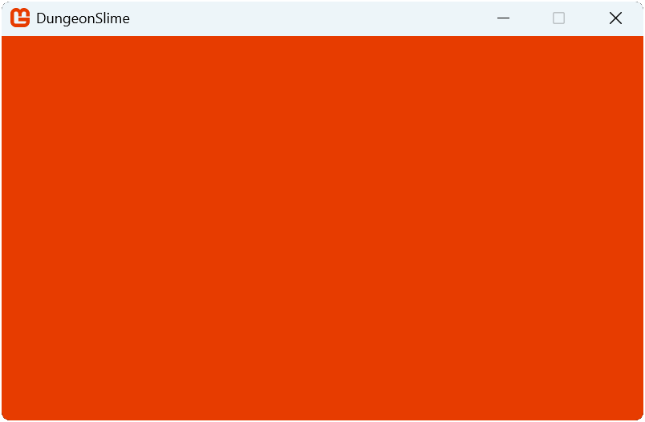

After you created a new MonoGame project using the *MonoGame Cross-Platform Desktop Application* template in [Chapter 02](../02_getting_started/index.md#creating-your-first-monogame-application), you will notice the generated files and project structure that serve as a starting point for your game application.  While MonoGame offers different templates based on target platform, all projects will contain the `Game1.cs` file.

## Exploring the Game1 Class

At the core of a MonoGame project is the [**Game**](xref:Microsoft.Xna.Framework.Game) class.  This class handles the initialization of graphics services, initialization of the game, loading content, updating, and rendering the game.  When you create a new MonoGame project, this [**Game**](xref:Microsoft.Xna.Framework.Game) class is implemented as the `Game1` class that you can customize as needed for your specific game.

> [!TIP]
> While the default template names the class `Game1`, you are free to rename it to something more appropriate for your project.  However, for consistency, the documentation will continue to refer to it as `Game1`.

Locate the `Game1.cs` file that was generated when you created the MonoGame project and open it.  The default content will be:

[!code-csharp]

This class provides the following structure:

1. **Graphics and Rendering**: The class declares two core graphics components; the [**GraphicsDeviceManager**](xref:Microsoft.Xna.Framework.GraphicsDeviceManager) for interacting with the Graphics Processing Unit (GPU) and the [**SpriteBatch**](xref:Microsoft.Xna.Framework.Graphics.SpriteBatch) for 2D rendering.
2. **Initialization**: The constructor and [**Initialize**](xref:Microsoft.Xna.Framework.Game.Initialize) method handle the game's setup sequence.
3. **Content Loading**: The [**LoadContent**](xref:Microsoft.Xna.Framework.Game.LoadContent) method manages game asset loading during startup.
4. **Game Loop**: The *game loop* consists of the [**Update**](xref:Microsoft.Xna.Framework.Game.Update(Microsoft.Xna.Framework.GameTime)) method for game logic and the [**Draw**](xref:Microsoft.Xna.Framework.Game.Draw(Microsoft.Xna.Framework.GameTime)) method for rendering, running continuously until the game is told to exit.

*Figure 3-1* below shows the lifecycle of a MonoGame game including the [**Update**](xref:Microsoft.Xna.Framework.Game.Update(Microsoft.Xna.Framework.GameTime)) and [**Draw**](xref:Microsoft.Xna.Framework.Game.Draw(Microsoft.Xna.Framework.GameTime)) methods that make up the *game loop*.

|  |
| :--------------------------------------------------------------------------: |
|                 **Figure 3-1: Lifecycle of a MonoGame game**                 |

## Graphics and Rendering

The graphics pipeline in monogame starts with two components: the [**GraphicsDeviceManager**](xref:Microsoft.Xna.Framework.GraphicsDeviceManager) and [**SpriteBatch**](xref:Microsoft.Xna.Framework.Graphics.SpriteBatch).

[!code-csharp]

The [**GraphicsDeviceManager**](xref:Microsoft.Xna.Framework.GraphicsDeviceManager) initializes and manages the connection to the graphics hardware.  It handles tasks such as setting the screen resolution, toggling between fullscreen and windowed mode, and managing the [**GraphicsDevice**](xref:Microsoft.Xna.Framework.Graphics.GraphicsDevice), which is the interface between your game and the Graphics Processing Unit (GPU) the game is running on. The [**SpriteBatch**](xref:Microsoft.Xna.Framework.Graphics.SpriteBatch) optimizes 2D rendering by batching similar draw calls together, improving draw performance when rendering multiple sprites.

## Initialization

MonoGame's initialization process for your game follows a specific sequence.  The constructor runs first, which handles basic setup like creating the [**GraphicsDeviceManager**](xref:Microsoft.Xna.Framework.GraphicsDeviceManager), setting the content directory, and the visibility of the mouse.

[!code-csharp]

After that, the [**Initialize**](xref:Microsoft.Xna.Framework.Game.Initialize) method executes, providing a dedicated place for additional configuration and initializations.

[!code-csharp]

This separation allows you to perform setup tasks in a logical order; core systems in the constructor and game-specific initializations in the [**Initialize**](xref:Microsoft.Xna.Framework.Game.Initialize) method.  The call to `base.Initialize()` should never be removed, as this is where the graphics device is initialized for the target platform.

> [!TIP]
> You may be wondering why there is an [**Initialize**](xref:Microsoft.Xna.Framework.Game.Initialize) method instead of performing all initializations in the constructor.  The [**Initialize**](xref:Microsoft.Xna.Framework.Game.Initialize) method is a `virtual` method that is overridden, and [it is advised to not call overridable methods from within a constructor](https://learn.microsoft.com/en-us/dotnet/fundamentals/code-analysis/quality-rules/ca2214), as this can lead to unexpected states in object constructor when called.  Additionally, when the constructor is called, the base constructor will instantiate properties and services based on the target platform that may be needed first before performing initializations for the game itself.

## Content Loading

The [**LoadContent**](xref:Microsoft.Xna.Framework.Game.LoadContent) method serves as the place for asset management. Here you can load textures, sound effects, music, and other game assets.  We will cover loading assets in the coming chapters as we discuss each asset type that can be loaded.  In a new project, the only task it performs is initializing a new instance of the [**SpriteBatch**](xref:Microsoft.Xna.Framework.Graphics.SpriteBatch).

[!code-csharp]

This method is only called once during the startup of the game, but *when* it is called can be a little confusing at first.  In the [**Initialize**](xref:Microsoft.Xna.Framework.Game.Initialize) method shown above, when the `base.Initialize` call is executed, the final task it performs is calling the [**LoadContent**](xref:Microsoft.Xna.Framework.Game.LoadContent) method.  This means any initializations you need to perform that have a dependency on assets being loaded should be done *after* the `base.Initialize` call and not *before* it.

## The Game Loop

MonoGame implements a *game loop* by calling [**Update**](xref:Microsoft.Xna.Framework.Game.Update(Microsoft.Xna.Framework.GameTime)) and [**Draw**](xref:Microsoft.Xna.Framework.Game.Draw(Microsoft.Xna.Framework.GameTime)) over and over until the game is told to exit. Recall at the end of [Chapter 02](../02_getting_started/index.md#creating-your-first-monogame-application) when you ran the project for the first time, I mentioned that there is a lot going on behind the scenes? This game loop is what I was referring to.

MonoGame is executing the [**Update**](xref:Microsoft.Xna.Framework.Game.Update(Microsoft.Xna.Framework.GameTime)) method and then the [**Draw**](xref:Microsoft.Xna.Framework.Game.Draw(Microsoft.Xna.Framework.GameTime)) method 60 times per second.

[!code-csharp]

The [**Update**](xref:Microsoft.Xna.Framework.Game.Update(Microsoft.Xna.Framework.GameTime)) method at the moment is not doing much, only checking for input from a controller or keyboard to determine if the game should exit. However, the [**Draw**](xref:Microsoft.Xna.Framework.Game.Draw(Microsoft.Xna.Framework.GameTime)) method is doing more than what it appears to at first glance.

The first line is executing the [**Clear**](xref:Microsoft.Xna.Framework.Graphics.GraphicsDevice.Clear(Microsoft.Xna.Framework.Color)) method of the [**GraphicsDevice**](xref:Microsoft.Xna.Framework.Graphics.GraphicsDevice) property using the color [**CornflowerBlue**](xref:Microsoft.Xna.Framework.Color.CornflowerBlue). Recall that the [**GraphicsDevice**](xref:Microsoft.Xna.Framework.Graphics.GraphicsDevice) object is your direct interface between the game and what is rendered to the screen. Every time the [**Draw**](xref:Microsoft.Xna.Framework.Game.Draw(Microsoft.Xna.Framework.GameTime)) method is called, this line of code is erasing the contents of the game window and refilling it with the color specified. Without clearing the contents of the screen first, every draw call would draw the new frame render on top of the previous render, and you'd end up with something like the old solitaire win screen.

|  |
| :---------------------------------------------------------------------: |
|             **Figure 3-2: Windows XP Solitaire Win Screen**             |

While this can make for a neat effect, it is not something you want all the time. So, the screen is cleared and refilled with a solid color.

> [!NOTE]
> You can test this yourself by modifying the code to use a different color, such as [**Color.MonoGameOrange**](xref:Microsoft.Xna.Framework.Color.MonoGameOrange). (yes, there is a MonoGame Orange color).
>
> [!code-csharp]
>
> After making this change and running the game, the screen is cleared to the MonoGame Orange color.
>
> |  |
> | :--------------------------------------------------------------------------------------------------------------: |
> |               **Figure 3-3: The game window clearing the screen using the MonoGame Orange color**                |

Each time the game loop completes and the game is drawn to the screen, we call this a *frame*. So, if MonoGame is running the game loop at 60 frames per second, that means it is performing an update and a render of a frame in 16ms. Notice that both the [**Update**](xref:Microsoft.Xna.Framework.Game.Update(Microsoft.Xna.Framework.GameTime)) and the [**Draw**](xref:Microsoft.Xna.Framework.Game.Draw(Microsoft.Xna.Framework.GameTime)) methods both receive a parameter of the type [**GameTime**](xref:Microsoft.Xna.Framework.GameTime). The [**GameTime**](xref:Microsoft.Xna.Framework.GameTime) parameter provides a snapshot of the timing values for the game, including the amount of time that it took for the previous frame to execute. This is commonly referred to as the *delta time*.

*Delta time* allows you to track time accurately for things such as animations and events based on *game time* and not the speed of the processor (CPU) on the machine running the game. While in ideal circumstances, the delta time will always be 16ms, there are any number of things that could cause a temporary slow down or hiccup in a frame, and using the delta time ensures that time-based events are always correct.

## Conclusion

In this chapter, you accomplished the following:

- You read through the default code provided in the `Game1.cs` file created by a MonoGame template.
- You learned about the lifecycle of a MonoGame game project.
- You learned what a game loop is and how it is implemented in MonoGame.

In the next chapter, you will start working with sprites and learn how to load and render them.

## Test Your Knowledge

1. Can the `Game1` class be renamed or is it required to be called `Game1`

    :::question-answer
    It is not a requirement that it be called `Game1`.  This is just the default name given to it by the templates when creating a new MonoGame game project.  However, you cannot change the name of the *BASE* class `Game`, as this is a MonoGame construct.
    :::

2. What is the [**SpriteBatch**](xref:Microsoft.Xna.Framework.Graphics.SpriteBatch) used for?

    :::question-answer
    The [**SpriteBatch**](xref:Microsoft.Xna.Framework.Graphics.SpriteBatch) provides an optimized method of rendering 2D graphics, like sprites, onto the screen.
    :::

3. When is the [**LoadContent**](xref:Microsoft.Xna.Framework.Game.LoadContent) method executed and why is it important to know this?

    :::question-answer
    [**LoadContent**](xref:Microsoft.Xna.Framework.Game.LoadContent) is executed during the `base.Initialize()` method call within the [**Initialize**](xref:Microsoft.Xna.Framework.Game.Initialize) method.  It is important to know this because anything being initialized that is dependent on content loaded should be done **after** the `base.Initialize()` call and not **before**.
    :::

4. How does MonoGame provide a *delta time* value?

    :::question-answer
    Through the [**GameTime**](xref:Microsoft.Xna.Framework.GameTime) parameter that is given to both the [**Update**](xref:Microsoft.Xna.Framework.Game.Update(Microsoft.Xna.Framework.GameTime)) and the [**Draw**](xref:Microsoft.Xna.Framework.Game.Draw(Microsoft.Xna.Framework.GameTime)) methods.
    :::
