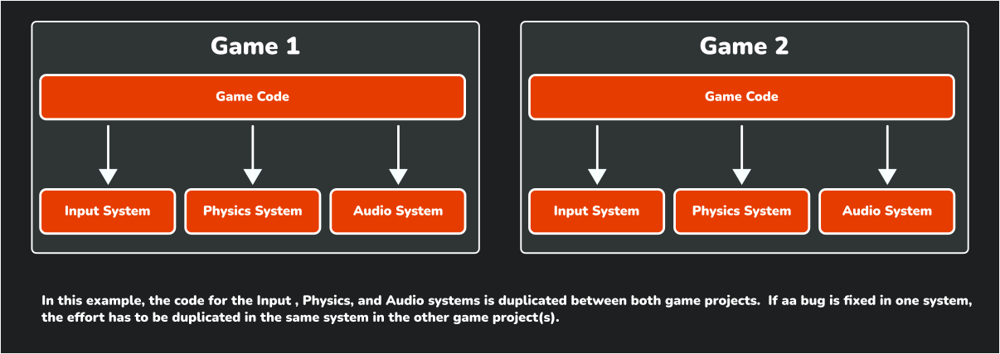
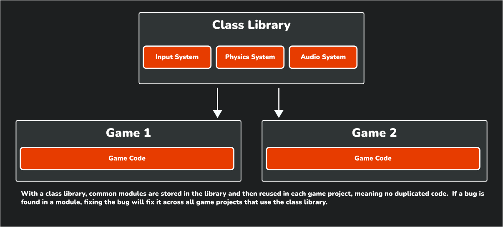

One of the goals of this tutorial is to create reusable modules that you can use to jump start your next game project after this. Rather than starting from scratch each time, we'll build a collection of game components you can take with you from project to project.

In this chapter you will:

- Learn about class libraries and their benefits for game development.
- Create a MonoGame class library project using templates.
- Add library references to your game project.
- Structure your library for reusability.
- Set up the foundation for creating shared game components.

## What Is a Class Library

Think of a class library like a toolbox for your game development. Just as a mechanic keeps their most-used tools in a toolbox they bring to every job, a class library stores code components you'll want to use in multiple game projects. Instead of recreating these tools for each new game (or copying and pasting code), you organize them in one place where they're easy to find, use, and improve over time.

The following diagrams show how this works:

|  |
| :---: |
| **Figure 4-1: Without using a class library, common modules are duplicated across projects** |

|  |
| :---: |
| **Figure 4-2: Using a class library, common modules are shared across projects** |

> [!NOTE]
> A class library is a project type that compiles into a [Dynamic Link Library](https://learn.microsoft.com/en-us/windows/win32/dlls/dynamic-link-libraries) (DLL) instead of an executable.  It contains reusable code that can be referenced by other projects, making it perfect for sharing common functionality across multiple games.

## Why Create a Class Library?

Creating a class library offers several important advantages, especially as your games grow more complex:

1. **Reusability**: Instead of rewriting the same code for each new game project, you build it once in your library and reuse it everywhere. This is like creating a multi-tool that works across all your projects.
2. **Organization**: Your game code stays focused on the unique aspects of each game, while common functionality lives in the library. This keeps your project folder neat and makes code easier to find.
3. **Maintainability**: When you improve or fix a bug in your library code, all games using that library benefit automatically. This means fixing one bug once instead of in multiple places.
4. **Testing**: You can test your library code independently from any specific game. This helps ensure your core systems are solid before you build a game on top of them.

As your library grows, you'll accumulate a personal collection of well-tested modules that make starting new projects much faster. The modules we'll create in this library will handle common game tasks like input, audio, sprites, and animations.

## Adding the Class Library

MonoGame offers the *MonoGame Game Library* project template to add a new class library project that is configured with the correct monoGame framework references.  Using this template saves time and ensures compatibility with MonoGame projects.  

To use the template to add the class library, perform the following:

### [Visual Studio Code](#tab/vscode)

To add the class library using the MonoGame Game Library project template in Visual Studio Code, perform the following:

1. In the *Solution Explorer* panel, right-click the *DungeonSlime* solution.
2. Chose *New Project* from the context menu.
3. Enter "Monogame Game Library" and select it as the template to use.
4. Name the project "MonoGameLibrary".
5. When prompted for a location, use the default option, which will put the new project in a folder next to your game project.
6. Select "Create Project".

### [Visual Studio 2022](#tab/vs2022)

To add the class library using the MonoGame Game Library project template in Visual Studio 2022, perform the following:

1. Right-click the *DungeonSlime* solution in the Solution Explorer panel.
2. Choose Add > New Project from the context menu.
3. Enter "MonoGame Game Library" in the search box, select that template, then click Next.
4. Name the project "MonoGameLibrary".
5. The location by default will put the new project in a folder next to your game project; you do not need to adjust this.
6. Click "Create".

### [dotnet CLI](#tab/dotnetcli)

To add the class library using the MonoGame Game Library project template with the dotnet CLI, perform the following:

1. Open a new Command Prompt or Terminal window in the same directory as the *DungeonSlime.sln* solution file.
2. Enter the command `dotnet new mglib -n MonoGameLibrary` to create the project, placing it in a folder next to your game project.
3. Enter the command `dotnet sln DungeonSlime.sln add ./MonoGameLibrary/MonoGameLibrary.csproj` to add the newly created class library project to the *DungeonSlime.sln* solution file.

---

## Adding a Reference To The Class Library

Now that the game library project has been created, a reference to it needs to be added in our game project.  Without adding a reference, our game project will be unaware of anything we add to the class library.  To do this:

### [Visual Studio Code](#tab/vscode)

To add the game library project as a reference to the game project in Visual Studio Code:

1. In the Solution Explorer panel, right-click the *DungeonSlime* project.
2. Choose "Add Project Reference" from the context menu.
3. Choose *MonoGameLibrary" from the available options.

> [!TIP]
> The Solution Explorer panel in VSCode is provided by the C# Dev Kit extension that was installed in [Chapter 02](../02_getting_started/index.md#install-the-c-dev-kit-extension).  If you do not see this panel, you can open it by
>
> 1. Opening the *Command Palette* (View > Command Palette).
> 2. Enter "Explorer: Focus on Solution Explorer View" and select the command.

### [Visual Studio 2022](#tab/vs2022)

To add the game library project as a reference to the game project in Visual Studio 2022:

1. In the Solution Explorer panel, right-click the *DungeonSlime* project.
2. Select Add > Project Reference from the context menu.
3. Check the box for the *MonoGameLibrary* project.
4. Click Ok.

### [dotnet CLI](#tab/dotnetcli)

To add the game library project as a reference to the game project with the dotnet CLI:

1. Open a new Command Prompt or Terminal window in the same directory as the *DungeonSlime.csproj* C# project file.
2. Enter the command `dotnet add ./DungeonSlime.csproj reference ../MonoGameLibrary/MonoGameLibrary.csproj`.  This will add the *MonoGameLibrary* reference to the *DungeonSlime* game project.

---

### Clean Up

When using the *MonoGame Game Library* project template, the generated project contains file similar to a standard MonoGame game project, including a *dotnet-tools.json* manifest file, a *Content.mgcb* file, and a *Game1.cs* file.  For the purposes of this tutorial, we will not need these.   To clean these up, locate the following in the *MonoGameLibrary* project directory and delete them:

1. The *.config/* directory.
2. The *Content/* directory
3. The *Game1.cs* file.

> [!TIP]
> These files are needed in more advanced scenarios such as creating a central code base for game logic that is referenced by other projects of which each target different platforms such as desktop, mobile, and console.  Creating a project structure of this type is out of scope for this tutorial.  
>
> If you would like more information on this, Simon Jackson has written the article [Going cross-platform with MonoGame](https://darkgenesis.zenithmoon.com/going-cross-platform-with-monogame.html) which covers this in more detail.

## Creating Our First Library Module

Let's validate our class library setup by creating a simple component that counts frames per second (FPS). This will demonstrate that we can successfully create classes in our library and use them in our game.

Create a new file called *FramesPerSecondCounter.cs* in the root of the *MonoGameLibrary* project and add the following code:

[!code-csharp]

This class:

- Tracks how many frames are rendered each second.
- Updates the FPS calculation based on elapsed time.
- Provides the current FPS through a property.

## Adding the Module To Our Game

Now that we have the `FramesPerSecondCounter` class created, let's add it to our game.  Doing this will also help ensure that the project references were setup correctly.  Open the *Game1.cs* file and make the following changes:

[!code-csharp]

The key changes made here are:

1. The `using MonoGameLibrary` using directive was added so we can use the new `FramesPerSecondCounter` class.
2. The field `_fpsCounter` was added to track the `FramesPerSecondCounter` instance.
3. In the constructor, a new instance of the `FramesPerSecondCounter` is created.
4. In [**Update**](xref:Microsoft.Xna.Framework.Game.Update(Microsoft.Xna.Framework.GameTime)), the `Update` method for the frames per second counter is called.
5. In [**Draw**](xref:Microsoft.Xna.Framework.Game.Draw(Microsoft.Xna.Framework.GameTime))
    1. The `UpdateCOunter` method for the frames per second counter is called.
    2. The game window title is updated to display the frames per second value.

When you run the game now, you'll see the current FPS displayed in the window title bar. This confirms that:

- Our class library project is correctly set up.
- The game project can reference and use library classes.
- The basic structure for creating reusable components works.

|  |
| :---: |
| **Figure 4-1: The game window showing the frames per second in the title bar of the window** |

> [!TIP]
> While this FPS counter is a simple example, it demonstrates the pattern we'll use throughout the tutorial: create reusable components in the library project, then reference and use them in games. This same approach will work for more complex components like sprite management, input handling, and collision detection.

> [!IMPORTANT]
> If you receive an error stating that the following:
>
> *The type or namespace name 'FramesPerSecondCounter' could not be found (are you missing a using directive or an assembly reference?)*
>
> This means either you forgot to add the `using MonoGameLibrary;` using directive to the top of the *Game1.cs* class file, or you did not add the project reference correctly.  Ensure that the project reference was added correctly by revisiting the [Add a Refernece to the Class Library](#adding-a-reference-to-the-class-library) section above and that you added the using directive.

## Conclusion

Let's review what you accomplished in this chapter:

- Learned about class libraries and their advantages for game development:
  - Code reusability across projects
  - Better organization and separation of concerns
  - Improved maintainability
  - Easier testing
- Created a MonoGame class library project
- Added the library as a reference to your game project
- Created your first reusable component and referenced and used it in the game project.

In the next chapter, we'll go over MonoGame's Game Component system and how we can use it with our class library.

## Test Your Knowledge

1. What are the main benefits of using a class library for game development?

    :::question-answer
    The main benefits are:
    - **Reusability**: Code can be easily shared between different game projects
    - **Organization**: Separates reusable code from game-specific code
    - **Maintainability**: Changes to shared code benefit all games using the library
    - **Testing**: Library code can be tested independently of specific games
    :::

2. Why should you use the MonoGame Game Library template instead of a standard class library template?

    :::question-anser
    The MonoGame Game Library template automatically configures the correct MonoGame framework references and ensures compatibility with MonoGame projects, saving time and preventing potential setup issues.
    :::

3. What happens if you don't add a reference to your class library in your game project?

    :::question-answer
    > Without adding a reference, your game project will be unaware of any code in the class library. You won't be able to use any of the classes or components from the library in your game.
    :::
