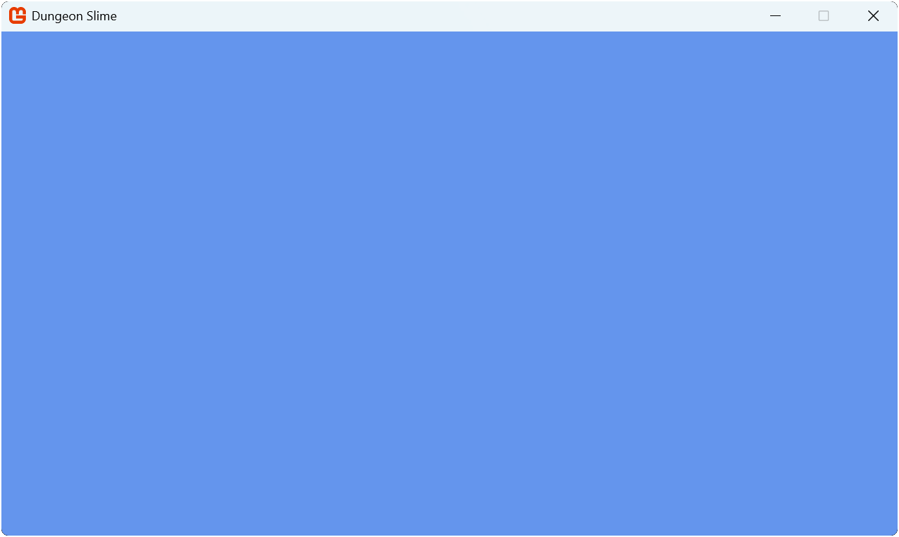

One of the goals of this tutorial is to create reusable modules that you can use to jump start your next game project after this. Rather than starting from scratch each time, we will build a collection of game components you can take with you from project to project.

In this chapter you will:

- Learn about class libraries and their benefits for game development.
- Create a MonoGame class library project using templates.
- Add library references to your game project.
- Structure your library for reusability.
- Set up the foundation for creating shared game components.

## What Is a Class Library

Think of a class library like a toolbox for your game development. Just as a mechanic keeps their most-used tools in a toolbox they bring to every job, a class library stores code components you will want to use in multiple game projects. Instead of recreating these tools for each new game (or copying and pasting code), you organize them in one place where they are easy to find, use, and improve over time.

The following diagrams show how this works:

|  |
| :------------------------------------------------------------------------------------------------------------------------------------------------------------------------------------------------------------------------------------------------------------------------------------------------------------------------------------------------------------------------------------------: |
|                       **Figure 4-1: This diagram displays the block for Game 1 on the left and Game 2 on the right.  In this example, when not using a class library, code for input, physics and audio systems is duplicated in both game projects.  If a bug is fixed in one system, the effort has to be replicated in the same system in the other game projects.**                        |

|  |
| :------------------------------------------------------------------------------------------------------------------------------------------------------------------------------------------------------------------------------------------------------------------------------------------------------------------------: |
|                     **Figure 4-2: This diagram displays a block for a class library containing common modules at the top, which are then shared between the two game projects below.  If a bug is found in a module, fixing the bug will fix it across all game projects that use the class library.**                      |

> [!NOTE]
> A class library is a project type that compiles into a [Dynamic Link Library](https://learn.microsoft.com/en-us/windows/win32/dlls/dynamic-link-libraries) (DLL) instead of an executable.  It contains reusable code that can be referenced by other projects, making it perfect for sharing common functionality across multiple games.

## Why Create a Class Library?

Creating a class library offers several important advantages, especially as your games grow in complexity:

1. **Reusability**: Instead of rewriting the same code for each new game project, you build it once in your library and reuse it everywhere. This is like creating a multi-tool that works across all your projects.
2. **Organization**: Your game code stays focused on the unique aspects of each game, while common functionality lives in the library. This keeps your project folder neat and makes code easier to find.
3. **Maintainability**: When you improve or fix a bug in your library code, all games using that library benefit automatically. This means you only fix a bug once, rather than in several places.
4. **Testing**: You can test your library code independently from any specific game. This helps ensure your core systems are solid before you build a game on top of them.

As your library grows, you will accumulate a personal collection of well-tested modules that make starting new projects much faster. The modules we will create in this library will handle common game tasks like input, audio, sprites, and animations.

## Adding the Class Library

MonoGame offers the *MonoGame Game Library* project template to add a new class library project that is configured with the correct MonoGame framework references.  Using this template saves time and ensures compatibility with MonoGame projects.  

To use the template to add the class library, perform the following based on which development environment you are using:

### [Visual Studio Code](#tab/vscode)

To add the class library using the MonoGame Game Library project template in Visual Studio Code, perform the following:

1. In the [*Solution Explorer*](../02_getting_started/index.md#install-the-c-dev-kit-extension) panel, right-click the *DungeonSlime* solution.
2. Chose *New Project* from the context menu.
3. Enter "MonoGame Game Library" and select it as the template to use.
4. Name the project "MonoGameLibrary".
5. When prompted for a location, use the default option, which will put the new project in a folder next to your game project.
6. Select "Create Project".

### [Visual Studio 2022](#tab/vs2022)

To add the class library using the MonoGame Game Library project template in Visual Studio 2022, perform the following:

1. Right-click the *DungeonSlime* solution in the Solution Explorer panel.
2. Choose Add > New Project from the context menu.
3. Enter "MonoGame Game Library" in the search box, select that template, then click Next.
4. Name the project "MonoGameLibrary".
5. The default location will place the new project in a folder next to your game project; you do not need to adjust this setting.
6. Click "Create".

### [dotnet CLI](#tab/dotnetcli)

To add the class library using the MonoGame Game Library project template with the dotnet CLI, perform the following:

1. Open a new Command Prompt or Terminal window in the same folder as the *DungeonSlime.sln* solution file.
2. Enter the command `dotnet new mglib -n MonoGameLibrary` to create the project, placing it in a folder next to your game project.
3. Enter the command `dotnet sln DungeonSlime.sln add ./MonoGameLibrary/MonoGameLibrary.csproj` to add the newly created class library project to the *DungeonSlime.sln* solution file.

---

## Adding a Reference To The Class Library

Now that the game library project has been created, a reference to it needs to be added in our game project.  Without adding a reference, our game project will be unaware of anything we add to the class library.  To do this, perform the following based on which development environment you are using:

### [Visual Studio Code](#tab/vscode)

To add the game library project as a reference to the game project in Visual Studio Code:

1. In the Solution Explorer panel, right-click the *DungeonSlime* project.
2. Choose "Add Project Reference" from the context menu.
3. Choose *MonoGameLibrary* from the available options.

> [!TIP]
> The Solution Explorer panel in VSCode is provided by the C# Dev Kit extension that was installed in [Chapter 02](../02_getting_started/index.md#install-the-c-dev-kit-extension).  If you do not see this panel, you can open it by
>
> 1. Opening the *Command Palette* (View > Command Palette).
> 2. Enter "Explorer: Focus on Solution Explorer View" and select the command.

### [Visual Studio 2022](#tab/vs2022)

To add the game library project as a reference to the game project in Visual Studio 2022:

1. In the Solution Explorer panel, right-click the *DungeonSlime* project.
2. Select Add > Project Reference from the context menu.
3. Check the box for the *MonoGameLibrary* project.
4. Click Ok.

### [dotnet CLI](#tab/dotnetcli)

To add the game library project as a reference to the game project with the dotnet CLI:

1. Open a new Command Prompt or Terminal window in the same folder as the *DungeonSlime.csproj* C# project file.
2. Enter the command `dotnet add ./DungeonSlime.csproj reference ../MonoGameLibrary/MonoGameLibrary.csproj`.  This will add the *MonoGameLibrary* reference to the *DungeonSlime* game project.

---

### Clean Up

When using the *MonoGame Game Library* project template, the generated project contains file similar to a standard MonoGame game project, including a *dotnet-tools.json* manifest file, a *Content.mgcb* file, and a `Game1.cs` file.  For the purposes of this tutorial, we will not need these.   To clean these up, locate the following in the *MonoGameLibrary* project folder and delete them:

1. The *.config/* folder.
2. The *Content/* folder
3. The `Game1.cs` file.

> [!TIP]
> These files are needed in more advanced scenarios, such as creating a central code base for game logic that is referenced by other projects, each targeting different platforms such as desktop, mobile, and console.  Creating a project structure of this type is out of scope for this tutorial.  
>
> If you would like more information on this, Simon Jackson has written the article [Going cross-platform with MonoGame](https://darkgenesis.zenithmoon.com/going-cross-platform-with-monogame.html) which covers this in more detail.
>
> Also the `2D Start Kit` and `2D Blank Start Kit` templates provide you with a richer startup project targetting all platforms, using a common Class Library to reuse code across them all.  Although we recommend completing this tutorial first before tackling that beast.

## Creating Our First Library Module

We will create a class for our library called `Core`.  This class will extend the MonoGame [**Game**](xref:Microsoft.Xna.Framework.Game) class and provide a starting point for game development with a few common built-in functionalities. Creating this will also allow us to confirm that our class library reference setup is correct.

Create a new file called `Core.cs` in the *MonoGameLibrary* project and add the following code:

[!code-csharp]

The `Core` class provides the following features:

1. It extends the MonoGame [**Game**](xref:Microsoft.Xna.Framework.Game) class, so it inherits all of the base functionality.
2. It implements a [singleton pattern](https://en.wikipedia.org/wiki/Singleton_pattern) through the `Instance` property, ensuring that only one core exists.
3. It provides static access to the graphics device manager, the graphics device, the sprite batch, and the content manager.
4. It simplifies the game window setup with a constructor that handles common initializations.

> [!NOTE]
> The `new` keyword in the property declaration `public static new GraphicsDevice GraphicsDevice` and `public static new ContentManager Content` is used to intentionally hide (or "shadow") the inherited `GraphicsDevice` and `Content` properties from the base `Game` class. This creates new properties with the same name but different accessibility (static vs. instance) in the derived class.
>
> When you access `Core.GraphicsDevice` or `Core.Content` you will be using these static properties, while `base.GraphicsDevice` or `base.Content` within instance methods of the `Core` class will access the original property. This pattern allows us to provide convenient static access to the graphics device and content manager throughout our game without having to reference the Core instance every time.

This approach provides a consistent foundation for all our games, handling common setup tasks and providing convenient access to core functionality.

> [!NOTE]
> As this tutorial progress, we will be coming back to this `Core` class to add more to it.

## Updating Our Game to Use the Core Class

Now that we have our `Core` class, we can modify our game project to use it.  Doing this will also help ensure that the project references were setup correctly.

Open the `Game1.cs` file and make the following changes:

[!code-csharp]

The key changes made here are:

1. Added `using MonoGameLibrary;` directive to reference our library.
1. Removed the [**GraphicsDeviceManager**](xref:Microsoft.Xna.Framework.GraphicsDeviceManager) and [**SpriteBatch**](xref:Microsoft.Xna.Framework.Graphics.SpriteBatch) fields; these are now supplied through the `Core` class.
1. Changed `Game1` class to inherit from `Core` instead of `Game`.
1. Updated the constructor to call the `Core` base constructor with our game configuration.

Running the game now will show the same window as before, only now it is at a 1280x720 resolution as per the configuration and it is using the `Core` class from our library.  This may not seem like a big change visually, but it demonstrates how our library can simplify and standardize game initializations.

> [!NOTE]
> If you get any additional prompts when starting the project, simply accept the defaults.  Adding the Game Library gives the compiler more projects to choose from when starting the project, however, we can only "run" the Game Project, libraries are not executables.

|  |
| :-----------------------------------------------------------------------------------------------: |
|             **Figure 4-3: The game window at 1280x720 with the title Dungeon Slime**              |

> [!IMPORTANT]
> If you receive an error stating the following:
>
> *The type or namespace name 'Core' could not be found (are you missing a using directive or an assembly reference?)*
>
> This means either you forgot to add the `using MonoGameLibrary;` using directive to the top of the `Game1.cs` class file, or you did not add the project reference correctly.  Ensure that the project reference was added correctly by revisiting the [Add a Reference to the Class Library](#adding-a-reference-to-the-class-library) section above and that you added the using directive.

## Conclusion

In this chapter, you accomplished the following:

- Learned about class libraries and their advantages for game development:
  - Code reusability across projects
  - Better organization and separation of concerns
  - Improved maintainability
  - Easier testing
- Created a MonoGame class library project
- Added the library as a reference to your game project
- Created your first reusable component, added a reference to it, and used it in the game project.

In the next chapter, we will learn about the Content Pipeline and how to load game assets.

## Test Your Knowledge

1. What are the main benefits of using a class library for game development?

    :::question-answer
    The main benefits are:
    - **Reusability**: Code can be easily shared between different game projects
    - **Organization**: Separates reusable code from game-specific code
    - **Maintainability**: Changes to shared code benefit all games using the library
    - **Testing**: Library code can be tested independently of specific games
    :::

2. Why should you use the MonoGame Game Library template instead of a standard class library template?

    :::question-answer
    The MonoGame Game Library template automatically configures the correct MonoGame framework references and ensures compatibility with MonoGame projects, saving time and preventing potential setup issues.
    :::

3. What happens if you do not add a reference to your class library in your game project?

    :::question-answer
    > Without adding a reference, your game project will be unaware of any code in the class library. You will not be able to use any of the classes or components from the library in your game.
    :::
