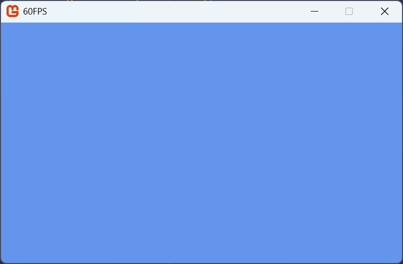

Throughout this tutorial series, we will be creating reusable classes that add extended behavior on top of what MonoGame offers natively.  Instead of adding these classes directly to our game project, we can create a separate class library project to contain them.  This approach offers several advantages, including:

1. **Reusability**: The classes can be easily reused in future game projects by simply adding a reference to the library.
2. **Organization**: Keeps game-specific code separate from reusable library code.
3. **Maintainability**: Changes to the library can benefit all games that use it.
4. **Testing**: The library code can be tested independently of any specific game.

A class library is a project type that compiles into a [Dynamic Link Library](https://learn.microsoft.com/en-us/windows/win32/dlls/dynamic-link-libraries) (DLL) instead of an executable.  It contains reusable code that can be referenced by other projects, making it perfect for sharing common functionality across multiple games.  MonoGame offers the *MonoGame Game Library* project template that can be used to create a class library.

> [!NOTE]
> By using the **MonoGame Game Library** template instead of a standard C# class library template, we get the correct MonoGame framework references and configuration automatically set up.  This saves time and ensures compatibility with MonoGame projects.

## Create the Class Library

Let's use the MonoGame Game Library project template to add a new class library project that will contain our reusable code.

### [Visual Studio Code](#tab/vscode)

To add the class library using the MonoGame Game Library project template in Visual Studio Code, perform the following:

1. In the *Solution Explorer* panel, right-click the *MonoGameSnake* solution.
2. Chose *New Project* from the context menu.
3. Enter "Monogame Game Library" and select it as the template to use.
4. Name the project "MonoGameLibrary".
5. When prompted for a location, use the default option, which will put the new project in a folder next to your game project.
6. Select "Create Project".

### [Visual Studio 2022](#tab/vs2022)

To add the class library using the MonoGame Game Library project template in Visual Studio 2022, perform the following:

1. Right-click the *MonoGameSnake* solution in the Solution Explorer panel.
2. Choose Add > New Project from the context menu.
3. Enter "MonoGame Game Library" in the search box, select that template, then click Next.
4. Name the project "MonoGameLibrary".
5. The location by default will put the new project in a folder next to your game project; you do not need to adjust this.
6. Click "Create".

### [dotnet CLI](#tab/dotnetcli)

To add the class library using the MonoGame Game Library project template with the dotnet CLI, perform the following:

1. Open a new Command Prompt or Terminal window in the same directory as the *MonoGameSnake.sln* solution file.
2. Enter the command `dotnet new mglib -n MonoGameLibrary` to create the project, placing it in a folder next to your game project.
3. Enter the command `dotnet sln MonoGameSnake.sln add ./MonoGameLibrary/MonoGameLibrary.csproj` to add the newly created class library project to the *MonoGameSnake.sln* solution file.

---

## Adding a Reference To The Class Library

Now that the game library project has been created, a reference to it needs to be added in our game project.  Without adding a reference, our game project will be unaware of anything we add to the class library.  To do this:

### [Visual Studio Code](#tab/vscode)

To add the game library project as a reference to the game project in Visual Studio Code:

1. In the Solution Explorer panel, right-click the *MonoGameSnake* project.
2. Choose "Add Project Reference" from the context menu.
3. Choose *MonoGameLibrary" from the available options.

> [!TIP]
> The Solution Explorer panel in VSCode is provided by the C# Dev Kit extension that was installed in [Chapter 02](../02_getting_started/index.md#install-the-c-dev-kit-extension).  If you do not see this panel, you can open it by
>
> 1. Opening the *Command Palette* (View > Command Palette).
> 2. Enter "Explorer: Focus on Solution Explorer View" and select the command.

### [Visual Studio 2022](#tab/vs2022)

To add the game library project as a reference to the game project in Visual Studio 2022:

1. In the Solution Explorer panel, right-click the *MonoGameSnake* project.
2. Select Add > Project Reference from the context menu.
3. Check the box for the *MonoGameLibrary* project.
4. Click Ok.

### [dotnet CLI](#tab/dotnetcli)

To add the game library project as a reference to the game project with the dotnet CLI:

1. Open a new Command Prompt or Terminal window in the same directory as the *MonoGameSnake.csproj* C# project file.
2. Enter the command `dotnet add ./MonoGameSnake.csproj reference ../MonoGameLibrary/MonoGameLibrary.csproj`.  This will add the *MonoGameLibrary* reference to the *MonoGameSnake* game project.

---

## Validating Setup
Before moving on, let's validate that the reference to our game library was setup correct and can be referenced within the game project.  We can do this by simply adding a `using` statement in our game project to ensure it resolves.  Perform the following:

1. Open the *Game1.cs* file located in the *MonoGameSnake* project.
2. At the top of the file where the `using` statements are located, located the `using Microsoft.Xna.Framework.Input` statement and adding the following on a new line below it:

    ```cs
    using MonoGameLibrary;
    ```

3. If you do not see an error, then the project reference has been setup correctly.  **You can now remove the using statement just added**.  If you receive an error that the type or namespace for `MonoGameLibrary` could not be found, this means the project reference was not setup correctly.  Revisit the [Adding a Reference to the Class Library](#adding-a-reference-to-the-class-library) section above and ensure that the reference is added properly.

## Clean Up

When using the *MonoGame Game Library* project template, the generated project contains file similar to a standard MonoGame game project, including a *dotnet-tools.json* manifest file, a *Content.mgcb* file, and a *Game1.cs* file.  For the purposes of this tutorial, we will not need these.   To clean these up, locate the following in the *MonoGameLibrary* project directory and delete them:

1. The *.config/* directory.
2. The *Content/* directory
3. The *Game1.cs* file.

> [!TIP]
> These files are needed in more advanced scenarios such as creating a central code base for game logic that is referenced by other projects of which each target different platforms such as desktop, mobile, and console.  Creating a project structure of this type is out of scope for this tutorial.  
>
> If you would like more information on this, Simon Jackson has written the article [Going cross-platform with MonoGame](https://darkgenesis.zenithmoon.com/going-cross-platform-with-monogame.html) which covers this in more detail.

## Validating Setup

Before moving on, let's validate that the reference to our game library was setup correctly and can be referenced within the game project.  To do this, we're going to add a simple class we can use to measure the frames per second (FPS) that our game is running at. First, create a new class file named *FramesPerSecondCounter.cs* in the *MonoGameLibrary* project.  Then add the following to the class file:

```cs
using System;
using Microsoft.Xna.Framework;

namespace MonoGameLibrary;

public class FramesPerSecondCounter
{
    // Represents one second of time
    private static readonly TimeSpan s_oneSecond = TimeSpan.FromSeconds(1);

    // Keeps count of the total number of frames that have elapsed.
    private int _counter;

    // Tracks the current amount of time that has elapsed.
    private TimeSpan _timer;

    /// <summary>
    /// Gets the calculated total of frames per second.
    /// </summary>
    public int FramesPerSecond { get; private set; }

    /// <summary>
    /// Creates a new FramesPerSecondCounter instance.
    /// </summary>
    public FramesPerSecondCounter()
    {
        _counter = 0;
        _timer = TimeSpan.Zero;
    }

    /// <summary>
    /// Updates this FramesPerSecondCounter.  
    /// </summary>
    /// <remarks>
    /// Should only be called once during the main game update.
    /// </remarks>
    /// <param name="gameTime">Snapshot of the timing values provided by the MonoGame framework.</param>
    public void Update(GameTime gameTime)
    {
        // Increment by the total amount of time elapsed between frames.
        _timer += gameTime.ElapsedGameTime;

        // If more than a single second has elapsed, set the frames per second
        // to the total counted, reset the counter, and decrement the timer
        // by one second
        if (_timer > s_oneSecond)
        {
            FramesPerSecond = _counter;
            _counter = 0;
            _timer -= s_oneSecond;
        }
    }

    /// <summary>
    /// Updates the FramesPerSecondCounter during the draw cycle of the game.
    /// </summary>
    /// <remarks>
    /// Should only be called once during the main game draw cycle
    /// </remarks>
    public void DrawUpdate()
    {
        // We increment the counter only during draw since each draw completes
        // a frame cycle.
        _counter++;
    }
}
```

Now that we have a class within the game library project to reference, let's ensure it can be referenced.  Perform the following

1. Open the *Game1.cs* file in the *MonoGameSnake* project.  At the top of the file where the `using` statements are located, locate the `using Microsoft.Xna.Framework.Input` statement and add the following on a new line below it:

    ```cs
    using MonoGameLibrary;
    ```

2. Locate the `private SpriteBatch _spriteBatch;` member declaration and add the following on a new line below it:

    ```cs
    private FramesPerSecondCounter _fpsCounter = new FramesPerSecondCounter();
    ```

3. Locate the `Update` method and add the following:

    ```cs
    _fpsCounter.Update(gameTime);
    ```

4. Finally, locate the `Draw` method and add the following:

    ```cs
    _fpsCounter.DrawUpdate();
    Window.Title = "{_fpsCounter.FramesPerSecond}FPS";
    ```

If you run the game now, you should see the title of the game update to show the game name and the total frames per second it is running at.

<figure><figcaption><p><em>Figure 4-1: Game window showing the FPS in the title bar.</em></p></figcaption></figure>

> [!TIP]
> If you receive an error that the type or namespace for `MonoGameLibrary` or `FramesPerSecondCounter` could not be found, this means the project reference was not setup correctly.  Revisit the [Adding a Reference to the Class Library](#adding-a-reference-to-the-class-library) section above and ensure that the reference is added properly.

## Conclusion

Here is a review of what was accomplished in this chapter:

- Learned what a class library is and the benefits of using one.
- Created a new MonoGame Game Library project.
- Added the library project as a reference to the game project.

## Test Your Knowledge

1. Name an advantage of using a class library for game development.

    <details>
    <summary>Question 1 Answer</summary>

    > Any of the following are advantages of using a class library:
    > - Reusability: The classes can be easily reused in future game projects by simply adding a reference to the library.
    > - Organization: It keeps game-specific code separate from reusable library code.
    > - Maintainability: Changes to the library can benefit all games that use it.
    > - Testing: The library code can be tested independently of any specific game.
    </details><br />

2. Why should we use the MonoGame Game Library template instead of a standard class library template?

    <details>
    <summary>Question 2 Answer</summary>

    > The MonoGame Game Library template automatically sets up the correct MonoGame framework references and configuration, saving time and ensuring compatibility.
    </details><br />

3. What happens if you don't add a reference to your class library project in your game project?

    <details>
    <summary>Question 3 Answer</summary>

    > Without adding a reference, the game project will be unaware of anything added to the class library and won't be able to use any of its code.
    </details><br />
