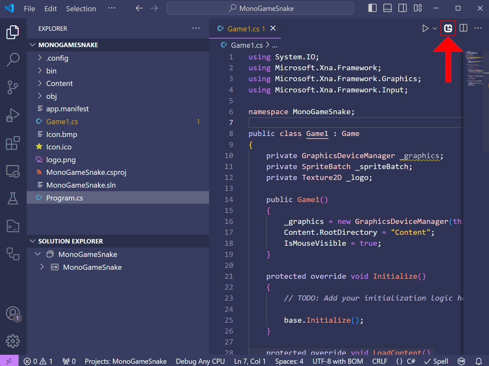
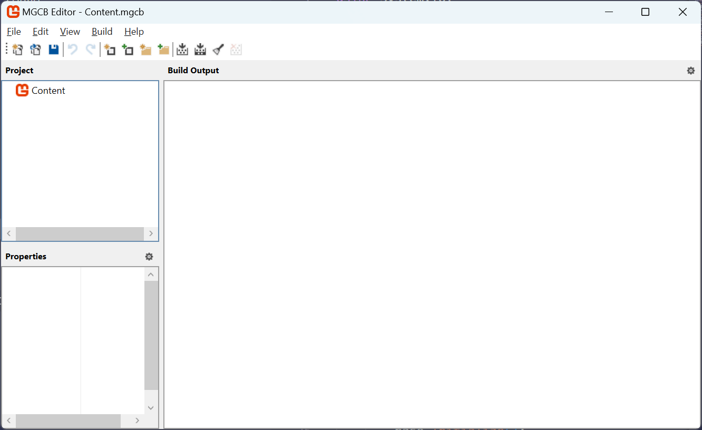
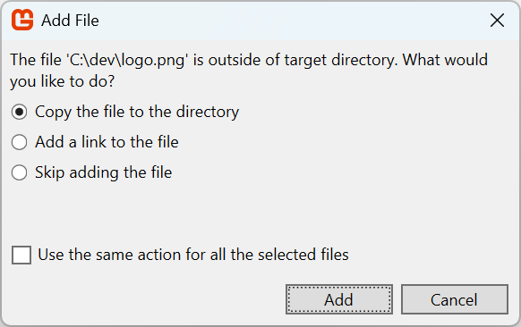
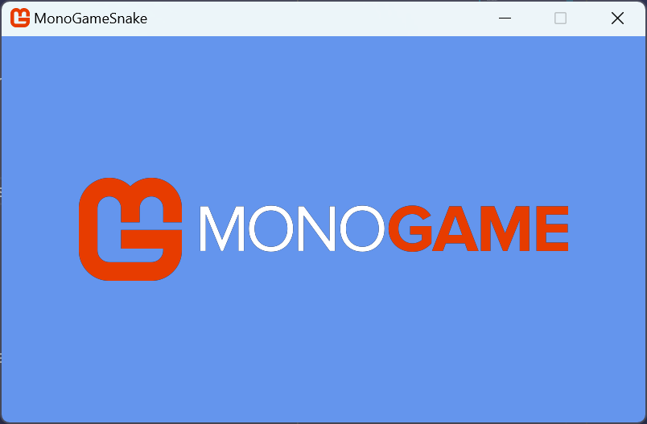
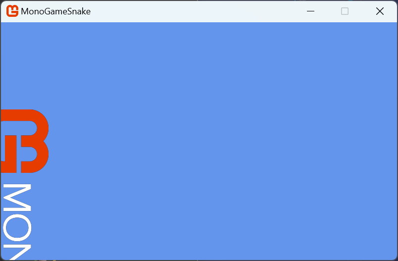
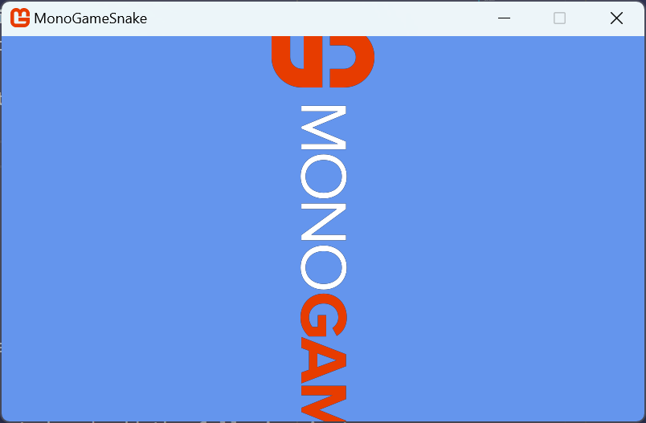
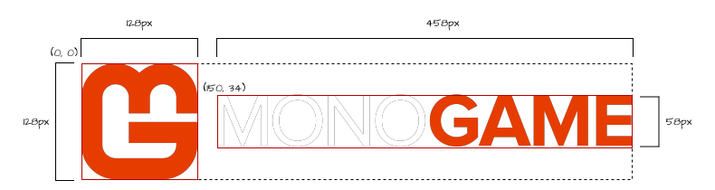
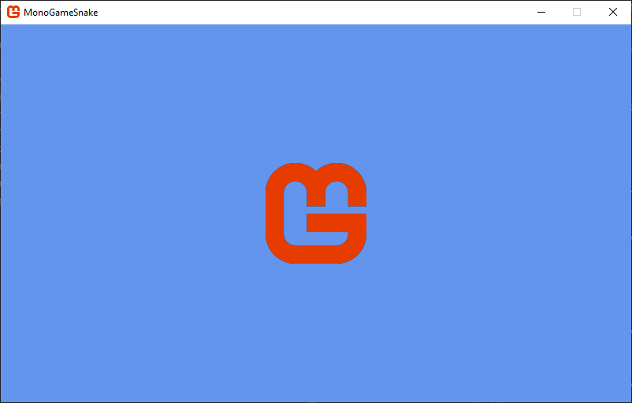

Textures are images that are used in your game to represent the visual graphics to the player, commonly referred to as *Sprites*.  Before being able to render them with the [**SpriteBatch**](xref:Microsoft.Xna.Framework.Graphics.SpriteBatch), you first need to create or load the texture.  We'll discuss creating a texture in code later in this series. For now, we're going to look at loading existing image files as textures and then rendering them with the [**SpriteBatch**](xref:Microsoft.Xna.Framework.Graphics.SpriteBatch).

## Loading a Texture

Loading textures, like any other asset in MonoGame, can be done by loading the asset file directly at runtime in game, or it can be loaded through the **Content Pipeline**.  Both of these methods are two sides of the same coin and there are trade offs to each approach.

For instance, to load an image file directly at runtime, you would need to

1. Add the image file to your project
2. Configure the project to copy the image file to the game project build directory
3. Load the image file as a texture at runtime using the [**Texture2D.FromFile**](xref:Microsoft.Xna.Framework.Graphics.Texture2D.FromFile(Microsoft.Xna.Framework.Graphics.GraphicsDevice,System.String)) method.

> [!IMPORTANT] 
> A big disadvantage to loading an image file as a texture directly, is when that when it loads it, it does so in its compressed format such as *.png* or *.jpg*.  These compression formats are not understood by a Graphics Processing Unit (GPU); they will need to be decompressed into raw bytes as a format the GPU does understand before it can store the data.  Doing this can potentially leave a larger memory footprint for your assets.  You will also need to handle how different compression formats work on the platform you are targeting such as desktops, mobile, and consoles.  
> 
> Alternatively, as we'll explore below, using the **Content Pipeline** handles this for you automatically.

On the other side of this coin, MonoGame offers the **Content Pipeline**; a workflow for managing assets, such as image files.  The workflow is made up of a set of tools and utilities that are automatically added by default when you create a new MonoGame project using the MonoGame templates.  To use this workflow, you need to:

1. Add the image file to your content project (*Content.mgcb* file) using the MGCB Editor.
2. Perform a project build. Doing this, the *MonoGame.Content.Builder.Tasks* NuGet reference will compile the assets defined in the content project for the target platform and automatically copy them to the game project build directory.
3. Load the compiled asset at runtime using the [**ContentManager**](xref:Microsoft.Xna.Framework.Content.ContentManager).

The following image illustrates this workflow:

<figure><figcaption><p><strong>Figure 4-1: MonoGame Content Pipeline Workflow</strong></p></figcaption></figure>

For the same amount of steps, you also get the benefit of the image file being pre-processed and compiled to an optimized format that can be understood by GPUs without needing to be decompressed first, reducing the memory footprint.  For instance, on desktops, image files can be compiled using [DXT compression](https://en.wikipedia.org/wiki/S3\_Texture\_Compression).

> [!NOTE]
> For more information on the benefits of compiling assets and what optimizations it can offer, see the [Content Pipeline](../../../getting_started/content_pipeline/index.md) documentation.

For this tutorial series, we're going to focus on using the content pipeline workflow to load assets, including images.  Doing this will get you as the developer accustomed to using the content pipeline tools and also give the benefits of having assets precompiled to optimized formats.

To get started, first we need an image to load.  Right-click the following image of the MonoGame logo and save it named *logo.png* somewhere on your on your computer, such as your desktop.

<figure><figcaption><p><strong>Figure 4-2: MonoGame Horizontal Logo</strong></p></figcaption></figure>

### Adding the Image To Content Project
Now that we have an image, we need to open the *MonoGame Content Builder Editor (MGCB Editor)* so we can add the image to the content project.  Since we are using VSCode for this tutorial, you should have installed the *MonoGame for VSCode* extension in [Chapter 02](../02_getting_started/index.md#installing-the-monogame-for-vscode-extension).  When this extension is installed, anytime you have a code file open, you will see the MonoGame logo in the top-right of the code window like below:

<figure><figcaption><p><strong>Figure 4-3: MonoGame for VSCode extension icon</strong></p></figcaption></figure>

Clicking this icon will open the MGCB Editor and load the *Content.mgcb* file from the current project in it.

> [!NOTE]  
> If you did not install the *MonoGame for VSCode* extension or prefer to not use it, you can use the CLI commands to open the MGCB Editor instead. To do this:
>
> 1. Open the terminal in VSCode pressing `` CTRL+` ``or choosing *View > Terminal* from the top menu
> 2. If the terminal directory is not in the project root directory (the one with the .csproj file), then use the `cd` command to navigate to that directory.
> 3. Enter the command `dotnet mgcb-editor ./Content/Content.mgcb` to open the MGCB Editor using the *Content.mgcb* file from the project.

<figure><figcaption><p><strong>Figure 4-4: MonoGame Content Builder Editor (MGCB Editor) Window</strong></p></figcaption></figure>

With the MGCB Editor now open, perform the following

1. Right-click on the *Content* node in the *Project* panel on the left.
2. Select *Add > New Folder*.
3. Name the folder `images`.
4. Right-click on the new *images* folder
5. Select *Add > Existing Item*.
6. Navigate to the *logo.png* file you downloaded and choose it

After adding an existing file, you will be prompted with a pop-up asking if you would like to *Copy the file to the directory* or *Add a link*.

<figure><figcaption><p><strong>Figure 4-5: Add Existing File Popup</strong></p></figcaption></figure>

For the purposes of this tutorial, choose the *Copy the file to the directory* option, then click the *Add* button.  When adding existing files in the future, the choice between copying the file and adding a link can make a big difference:
- **Copy the file to the directory**: Choosing this will make a literal copy of the selected file and put the copy inside the Content directory of your project.  This means any changes in teh original source file will not be reflected in the copy.
- **Add a link**: Choosing this will instead add a reference to the source file without making a copy.  This means changes made in teh source file will be reflected on each build.  However, the link is stored as a relative link, with the path being relative to the *Content.mgcb* file.  So if the source file moves, or you move the project, then you'll need to re-add the link.

After adding the *logo.png* file, you're project node should look similar to the following:

<figure><figcaption><p><strong>Figure 4-6: Logo image added to the MGCB Editor</strong></p></figcaption></figure>

Save the changes by pressing `CTRL+S`, or by clicking the *Save* icon in the top tool bar, or by choosing *File > Save* from the top menu. When you save the changes made, the MGCB Editor will write updates to the *Content.mgcb* file in your project to reflect the changes made. After saving, you can close the MGCB Editor.

### Understanding Content Paths
The folder structure you create in the MGCB Editor directly affects how you load content in your game. When you perform a build of your game project, the *MonoGame.Content.Builder.Tasks* NuGet package reference will:

1. Compile the image into an optimized format in the **content project's** output directory (typically *ProjectRoot/Content/bin/Platform/Content*) as an *.xnb* file.
2. Copy the compiled assets to your **game's** output directory (typically *ProjectRoot/bin/Debug/net8.0/Content* or *ProjectRoot/bin/Release/net8.0/Content*). 

For example, if your content project contains:
```sh
Content/
  ├── images/
  │   └── logo.png
  └── sounds/
      └── music.mp3
```

then when the tasks first compiles the assets, they will be output to:

```sh
ProjectRoot/
  └── Content/
      └── bin/
          └── DesktopGL/
              └── Content/
                  ├── images/
                  │   └── logo.xnb
                  └── sounds/
                      └── music.xnb
```

Then after compiling them and copying them to the game projects output directory, it will look like the following:

```sh
ProjectRoot/
  └── bin/
      └── Debug/
          └── net8.0/
              └── Content/
                  ├── images/
                  │   └── logo.xnb
                  └── sounds/
                      └── music.xnb
```

When the [**ContentManager**](xref:Microsoft.Xna.Framework.Content.ContentManager) is used to load these assets, it looks for them relative to its [**RootDirectory**](xref:Microsoft.Xna.Framework.Content.ContentManager.RootDirectory) property. By default, this is set to `"Content"` in the `Game1` constructor to match where the compiled assets are copied. The path used to load an asset must match its location relative to the [**RootDirectory**](xref:Microsoft.Xna.Framework.Content.ContentManager.RootDirectory), minus any extension. For example, to load the above assets, the paths would be `"images/logo"` and `"sounds/music"`.

### Loading the Image Using [**ContentManager**](xref:Microsoft.Xna.Framework.Content.ContentManager)

With the image added to the content project, we need to update our game to load the asset. First, open the *Game1.cs* file in your project and add 

```cs 
private Texture2D _logo;
```

beneath where the [**GraphicsDeviceManager**](xref:Microsoft.Xna.Framework.GraphicsDeviceManager) and [**SpriteBatch**](xref:Microsoft.Xna.Framework.Graphics.SpriteBatch) instance member variables are declared.  This adds a new [**Texture2D**](xref:Microsoft.Xna.Framework.Graphics.Texture2D) instance called `_logo`.  [**Texture2D**](xref:Microsoft.Xna.Framework.Graphics.Texture2D) is the type used to store a reference to 2D image data in MonoGame.

Next, locate the [**LoadContent**](xref:Microsoft.Xna.Framework.Game.LoadContent) method and add the following after `_spriteBatch` is instantiated:

```
_logo = Content.Load<Texture2D>("images/logo");
```

This uses the [**ContentManager**](xref:Microsoft.Xna.Framework.Content.ContentManager) objected provided by the [**Content**](xref:Microsoft.Xna.Framework.Game.Content) property of the [**Game**](xref:Microsoft.Xna.Framework.Game) class to load the compiled image file.  The [**Load&lt;T&gt;**](xref:Microsoft.Xna.Framework.Content.ContentManager.Load``1(System.String)) method takes two parts:

1. `T` Type Reference: The content type we are loading (in this case [**Texture2D**](xref:Microsoft.Xna.Framework.Graphics.Texture2D)).
2. `assetName` Parameter: A string path that matches the content path of the asset to load.  As mentioned in the [Understanding Content Paths](#understanding-content-paths) section, the content path is relative to the [**ContentManager.RootDirectory**](xref:Microsoft.Xna.Framework.Content.ContentManager.RootDirectory), minus the extension.  Since we added our image to the *images* folder in the content project, the content path will be `"images/logo"`.

If you run the game now, the image will be loaded as a texture, but all we'll see is the empty cornflower blue game window.  This is because we're only loading it and not telling the game to draw it.  

## Drawing a Texture

When rendering in MonoGame, *render states*, properties of the [**GraphicsDevice**](xref:Microsoft.Xna.Framework.Graphics.GraphicsDevice) that affect how rendering is performed, need to be set.  When rendering 2D sprites, the [**SpriteBatch**](xref:Microsoft.Xna.Framework.Graphics.SpriteBatch) class simplifies rendering by managing these render states for you.

> [!IMPORTANT]
> Although the [**SpriteBatch**](xref:Microsoft.Xna.Framework.Graphics.SpriteBatch) makes it easier to manage the render states for the [**GraphicsDevice**](xref:Microsoft.Xna.Framework.Graphics.GraphicsDevice), it can also change states that you may have set manually, such as if you are performing 3D rendering.  Keep this in mind when mixing 2D and 3D rendering.

Three methods are are used when rendering with the [**SpriteBatch**](xref:Microsoft.Xna.Framework.Graphics.SpriteBatch):

1. [**SpriteBatch.Begin**](xref:Microsoft.Xna.Framework.Graphics.SpriteBatch.Begin(Microsoft.Xna.Framework.Graphics.SpriteSortMode,Microsoft.Xna.Framework.Graphics.BlendState,Microsoft.Xna.Framework.Graphics.SamplerState,Microsoft.Xna.Framework.Graphics.DepthStencilState,Microsoft.Xna.Framework.Graphics.RasterizerState,Microsoft.Xna.Framework.Graphics.Effect,System.Nullable{Microsoft.Xna.Framework.Matrix})) prepares the graphics device for rendering, including the render states.
2. [**SpriteBatch.Draw**](xref:Microsoft.Xna.Framework.Graphics.SpriteBatch.Draw(Microsoft.Xna.Framework.Graphics.Texture2D,Microsoft.Xna.Framework.Rectangle,Microsoft.Xna.Framework.Color)) tells the [**SpriteBatch**](xref:Microsoft.Xna.Framework.Graphics.SpriteBatch) what to render. This is usually called multiple times before [**SpriteBatch.End**](xref:Microsoft.Xna.Framework.Graphics.SpriteBatch.End) and batches the draw calls for efficiency.
3. [**SpriteBatch.End**](xref:Microsoft.Xna.Framework.Graphics.SpriteBatch.End) submits the draw calls that were batched to the graphics device to be rendered.

> [!NOTE]
> The order of method calls when rendering using the [**SpriteBatch**](xref:Microsoft.Xna.Framework.Graphics.SpriteBatch) is important.  [**SpriteBatch.Begin**](xref:Microsoft.Xna.Framework.Graphics.SpriteBatch.Begin(Microsoft.Xna.Framework.Graphics.SpriteSortMode,Microsoft.Xna.Framework.Graphics.BlendState,Microsoft.Xna.Framework.Graphics.SamplerState,Microsoft.Xna.Framework.Graphics.DepthStencilState,Microsoft.Xna.Framework.Graphics.RasterizerState,Microsoft.Xna.Framework.Graphics.Effect,System.Nullable{Microsoft.Xna.Framework.Matrix})) must be called before any [**SpriteBatch.Draw**](xref:Microsoft.Xna.Framework.Graphics.SpriteBatch.Draw(Microsoft.Xna.Framework.Graphics.Texture2D,Microsoft.Xna.Framework.Rectangle,Microsoft.Xna.Framework.Color)) calls are made.  When finished, [**SpriteBatch.End**](xref:Microsoft.Xna.Framework.Graphics.SpriteBatch.End) must be called before another [**SpriteBatch.Begin**](xref:Microsoft.Xna.Framework.Graphics.SpriteBatch.Begin(Microsoft.Xna.Framework.Graphics.SpriteSortMode,Microsoft.Xna.Framework.Graphics.BlendState,Microsoft.Xna.Framework.Graphics.SamplerState,Microsoft.Xna.Framework.Graphics.DepthStencilState,Microsoft.Xna.Framework.Graphics.RasterizerState,Microsoft.Xna.Framework.Graphics.Effect,System.Nullable{Microsoft.Xna.Framework.Matrix})) can be called.  If these methods are called out of order, an exception will be thrown.

As mentioned in [Chapter 03](../03_the_game1_file/index.md#the-game-loop), all rendering should be done inside the [**Draw**](xref:Microsoft.Xna.Framework.Game.Draw(Microsoft.Xna.Framework.GameTime)) method. The [**Draw**](xref:Microsoft.Xna.Framework.Game.Draw(Microsoft.Xna.Framework.GameTime)) method's responsibility is to render the game state that was calculated in [**Update**](xref:Microsoft.Xna.Framework.Game.Update(Microsoft.Xna.Framework.GameTime)); it should not contain any game logic or complex calculations.

Locate the [**Draw**](xref:Microsoft.Xna.Framework.Game.Draw(Microsoft.Xna.Framework.GameTime)) method in the *Game1.cs* file and add the following after the [**Clear**](xref:Microsoft.Xna.Framework.Graphics.GraphicsDevice.Clear(Microsoft.Xna.Framework.Color)) method call is made:

```cs
_spriteBatch.Begin();
_spriteBatch.Draw(_logo, Vector2.Zero, Color.White);
_spriteBatch.End();
```

These lines initialize the [**SpriteBatch**](xref:Microsoft.Xna.Framework.Graphics.SpriteBatch), draw the logo at [**Vector2.Zero**](xref:Microsoft.Xna.Framework.Vector2.Zero) (0, 0), and complete the batch. Run the game to see the logo appear in the window's upper-left corner:

<figure><figcaption><p><strong>Figure 4-7: The MonoGame logo drawn to the game window.</strong></p></figcaption></figure>

The [**SpriteBatch.Draw**](xref:Microsoft.Xna.Framework.Graphics.SpriteBatch.Draw(Microsoft.Xna.Framework.Graphics.Texture2D,Microsoft.Xna.Framework.Vector2,Microsoft.Xna.Framework.Color)) method we just used can be given the following parameters:

| Parameter  | Type        | Description                                                                                                       |
| ---------- | ----------- | ----------------------------------------------------------------------------------------------------------------- |
| *texture*  | [**Texture2D**](xref:Microsoft.Xna.Framework.Graphics.Texture2D) | The [**Texture2D**](xref:Microsoft.Xna.Framework.Graphics.Texture2D) to draw                                                                                           |
| *position* | [**Vector2**](xref:Microsoft.Xna.Framework.Vector2)   | The X and Y coordinates at which the texture will be rendered, with the texture's origin being the upper-left corner of the image.
| *color*    | [**Color**](xref:Microsoft.Xna.Framework.Color)     | The color mask (tint) to apply to the image drawn. Specifying [**Color.White**](xref:Microsoft.Xna.Framework.Color.White) will render the texture with no tint. |

Try adjusting the position and color parameters to see how they can affect the image being drawn.

MonoGame uses a coordinate system where (0, 0) is at the screen's upper-left corner. X values increase moving right, and Y values increase moving down. Understanding this, let's try to center the logo on the game window.

To center content on the screen, we need to find the window's center point. We can access this using the [**Window.ClientBounds**](xref:Microsoft.Xna.Framework.GameWindow.ClientBounds) property from the [**Game**](xref:Microsoft.Xna.Framework.Game) class, which represents the rectangular bounds of the game window.  [**Window.ClientBounds**](xref:Microsoft.Xna.Framework.GameWindow.ClientBounds) exposes both  [**Width**](xref:Microsoft.Xna.Framework.Rectangle.Width) and [**Height**](xref:Microsoft.Xna.Framework.Rectangle.Height) properties for the window's dimensions in pixels.  By dividing these dimensions in half, we can can calculate the window's center coordinates.  Let's update our [**Draw**](xref:Microsoft.Xna.Framework.Graphics.SpriteBatch.Draw(Microsoft.Xna.Framework.Graphics.Texture2D,Microsoft.Xna.Framework.Rectangle,Microsoft.Xna.Framework.Color)) method to use this:

```cs
_spriteBatch.Draw(_logo, new Vector2(Window.ClientBounds.Width, Window.ClientBounds.Height) * 0.5f, Color.White);
```

> [!TIP]  
> In the example above, we multiply the [**Vector2**](xref:Microsoft.Xna.Framework.Vector2) created by `0.5f` to halve the value instead of dividing it by `2.0f`. If you're not used to seeing this, it might seem strange at first, but it's actually an optimization technique. CPUs are able to perform multiplication operations much faster than division operations and reading `* 0.5f` is easily understood to be the same thing as `/ 2.0f` when reading.

We have now set the position to half the window's dimensions, which should center the logo. Let's run the game to see the result.

<figure><figcaption><p><strong>Figure 4-8: Attempting to draw the MonoGame logo centered on the game window.</strong></p></figcaption></figure>

The logo is not centered as we expected it to be.  Even though we set the *position* parameter to the center of the game window, the texture starts drawing from its *origin*, which is the upper-left corner in this example.  So when we set the position to the screen's center, we're actually placing the logo's upper-left corner at that point, not its center.

One way to correct this is to subtract half the width and height of the texture from the game window's center position like so:

```cs
_spriteBatch.Draw(
  _logo,        // texture
  new Vector2(  // position
    (Window.ClientBounds.Width * 0.5f) - (_logo.Width * 0.5f),
    (Window.ClientBounds.Height * 0.5f) - (_logo.Height * 0.5f)),
  Color.White); // color
```

This offsets the position so that it correctly centers the image to the game window.

<figure><figcaption><p><strong>Figure 4-9: The MonoGame logo drawn centered on the game window.</strong></p></figcaption></figure>

While this works, there's a better approach.  There is an a different overload of the [**SpriteBatch.Draw**](xref:Microsoft.Xna.Framework.Graphics.SpriteBatch.Draw(Microsoft.Xna.Framework.Graphics.Texture2D,Microsoft.Xna.Framework.Vector2,Microsoft.Xna.Framework.Color)) method that provides additional parameters. Update your code to: 

```cs
_spriteBatch.Draw(
  _logo,              // texture
  new Vector2(        // position
    (Window.ClientBounds.Width * 0.5f) - (_logo.Width * 0.5f),
    (Window.ClientBounds.Height * 0.5f) - (_logo.Height * 0.5f)),
  null,               // sourceRectangle
  Color.White,        // color
  0.0f,               // rotation
  Vector2.Zero,       // origin
  1.0f,               // scale
  SpriteEffects.None, // effects
  0.0f);              // layerDepth
```

Using this overload of [**SpriteBatch.Draw**](xref:Microsoft.Xna.Framework.Graphics.SpriteBatch.Draw(Microsoft.Xna.Framework.Graphics.Texture2D,Microsoft.Xna.Framework.Vector2,Microsoft.Xna.Framework.Color)) produces the same centered result, but exposes all available parameters. Here's what each parameter does:

| Parameter         | Type            | Description                                                                                                                                                                                                                                                                                          |
| ----------------- | --------------- | ---------------------------------------------------------------------------------------------------------------------------------------------------------------------------------------------------------------------------------------------------------------------------------------------------- |
| *texture*         | [**Texture2D**](xref:Microsoft.Xna.Framework.Graphics.Texture2D)     | The [**Texture2D**](xref:Microsoft.Xna.Framework.Graphics.Texture2D) to draw                                                                                                                                                                                                                                                                              |
| *position*        | [**Vector2**](xref:Microsoft.Xna.Framework.Vector2)       | The X and Y coordinate position to draw the texture at. The origin point being the top-left corner of the image.                                                                                                                                                                                          |
| *sourceRectangle* | [**Rectangle**](xref:Microsoft.Xna.Framework.Rectangle)     | An optional region within the texture to be rendered in order to draw only a portion of the texture. Specifying `null` will render the entire texture.                                                                                                                                               |
| *color*           | [**Color**](xref:Microsoft.Xna.Framework.Color)         | The color mask (tint) to apply to the image drawn. Specifying [**Color.White**](xref:Microsoft.Xna.Framework.Color.White) will render the texture with no tint.                                                                                                                                                                                    |
| *rotation*        | `float`         | The amount of rotation, in radians, to apply to the texture when rendering. Specifying `0.0f` will render the image with no rotation.                                                                                                                                                                |
| *origin*          | [**Vector2**](xref:Microsoft.Xna.Framework.Vector2)       | The X and Y coordinate origin point of the texture when rendering. This will affect the offset of the texture when rendered as well being the origin in which the texture is rotated around and scaled from.                                                                                              |
| *scale*           | `float`         | The amount to scale the image across the x- and y-axes. Specifying `1.0f` will render the image at its default size with no scaling.                                                                                                                                                                 |
| *effects*         | [**SpriteEffects**](xref:Microsoft.Xna.Framework.Graphics.SpriteEffects) | A [**SpriteEffects**](xref:Microsoft.Xna.Framework.Graphics.SpriteEffects) enum value to that specifies if the texture should be rendered flipped across the horizontal axis, the vertical axis, or both axes.                                                                                                                                                |
| *layerDepth*      | `float`         | Specifies the depth at which the texture is rendered. Textures with a higher layer depth value are drawn on top of those with a lower layer depth value. **Note: This value will only apply when using `SpriteSortMode.FrontToBack` or \`SpriteSortMode.BackToFront. We'll cover this in a moment.** |

Let's rotate the texture 90° to make it vertical. Since rotation is measured in radians, not degrees, we can use the built-in math library in MonoGame to make the conversion for us by calling [**MathHelper.ToRadians**](xref:Microsoft.Xna.Framework.MathHelper.ToRadians(System.Single)).  Update the code to:

```cs
_spriteBatch.Draw(
  _logo,                    // texture
  new Vector2(              // position
    (Window.ClientBounds.Width * 0.5f) - (_logo.Width * 0.5f),
    (Window.ClientBounds.Height * 0.5f) - (_logo.Height * 0.5f)),
  null,                     // sourceRectangle
  Color.White,              // color
  MathHelper.ToRadians(90), // rotation
  Vector2.Zero,             // origin
  1.0f,                     // scale
  SpriteEffects.None,       // effects
  0.0f);                    // layerDepth
```

Running the code now shows the rotated image, but not in the expected position:

<figure><figcaption><p><strong>Figure 4-10: Attempting to draw the MonoGame logo rotated 90° and centered on the game window.</strong></p></figcaption></figure>

The image rotates, but not as expected. This occurs because the *origin* parameter controls both where the texture renders from and its rotation point. Using [**Vector2.Zero**](xref:Microsoft.Xna.Framework.Vector2.Zero) places this origin at the upper-left corner of the texture, so the rotation happens around that point. To correct this, set the origin to the texture's center.  Update the code to:

```cs
_spriteBatch.Draw(
  _logo,                    // texture
  new Vector2(              // position
    Window.ClientBounds.Width, 
    Window.ClientBounds.Height) * 0.5f,
  null,                     // sourceRectangle
  Color.White,              // color
  MathHelper.ToRadians(90), // rotation
  new Vector2(              // origin
    _logo.Width, 
    _logo.Height) * 0.5f,
  1.0f,                     // scale
  SpriteEffects.None,       // effects
  0.0f);                    // layerDepth
```

We have moved the texture's origin point to its center, which now serves as both the rotation point and render position. This not only corrects the point or rotation, but also eliminates the need to offset the position by half the logo's dimensions. Running the game now shows the logo properly centered and rotated 90°.

<figure><figcaption><p><strong>Figure 4-11: The MonoGame logo drawn rotated 90° and centered on the game window.</strong></p></figcaption></figure>

### Texture Regions

Above, we saw the full parameter list for drawing a texture using [**SpriteBatch.Draw**](xref:Microsoft.Xna.Framework.Graphics.SpriteBatch.Draw(Microsoft.Xna.Framework.Graphics.Texture2D,Microsoft.Xna.Framework.Vector2,Microsoft.Xna.Framework.Color)). One of those parameters was called *sourceRectangle*. So far, we've just set this parameter to `null`, which specifies that the full texture should be rendered. However, we can make use of the *sourceRectangle* parameter to specify a region within the texture itself to draw instead of drawing the full texture.

For instance, take the logo image we've been using. We can break it down into two distinct regions; the logo and the MonoGame word mark.

<figure><figcaption><p><strong>Figure 4-12: The MonoGame logo broken down into texture regions.</strong></p></figcaption></figure>

We can see from this image that the actual logo starts at position (0, 0) and is 128px wide and 128px tall. Likewise, the MonoGame word mark starts at position (150, 34) and is 458px wide and 58px tall. Knowing the starting position and the width and height of the region gives us a defined rectangle that we can use as the *sourceRectangle*.

Let's see this in action by only drawing the MonoGame logo icon part of the texture. First, after the call to the [**Clear**](xref:Microsoft.Xna.Framework.Graphics.GraphicsDevice.Clear(Microsoft.Xna.Framework.Color)) method, add the following variable:

```cs
Rectangle iconSourceRect = new Rectangle(0, 0, 128, 128);
```

Next, update the `_spriteBatch.Draw` method call to the following

```cs
_spriteBatch.Draw(
    _logo,              // texture
    new Vector2(        // position
      Window.ClientBounds.Width, 
      Window.ClientBounds.Height) * 0.5f,
    iconSourceRect,     // sourceRectangle
    Color.White,        // color
    0.0f,               // rotation
    new Vector2(        // origin
      iconSourceRect.Width, 
      iconSourceRect.Height) * 0.5f,
    1.0f,               // scale
    SpriteEffects.None, // effects
    0.0f);              // layerDepth
```

The changes you just made first added a new [**Rectangle**](xref:Microsoft.Xna.Framework.Rectangle) value called `iconSourceRect` that represents the dimensions of the MonoGame logo icon region within the texture. Then the *sourceRectangle* parameter of the `_spriteBatch.Draw` was updated to use the new `iconSourceRect` value. Notice that we are still telling it to draw the `_logo` for the *texture*, we've just supplied it with a source rectangle this time. Finally, the *origin* parameter was updated to use the width and height of the `iconSourceRect`. Since the overall dimensions of what we'll be rendering has changed due to supplying a source rectangle, the origin needs to be adjusted to those dimensions as well.

If you run the game now, you should see the following:

<figure><figcaption><p><strong>Figure 4-13: The MonoGame logo icon only, from the logo texture, centered in the game window</strong></p></figcaption></figure>

As an exercise for yourself, see if you can adjust the code to draw only the MonoGame word mark from the logo texture the same way we just did the MonoGame logo icon.

## Conclusion

Let's review what you accomplished in this chapter:

- You learned the disadvantages of loading an image file directly compared to the advantages of use the **Content Pipeline**
- You added an image file to the content project using the MGCB Editor
- You learned about the content pipeline workflow and how MonoGame automates the process for you.
- You used the [**SpriteBatch**](xref:Microsoft.Xna.Framework.Graphics.SpriteBatch) class to draw a texture.
- You learned the different parameters available when using the [**SpriteBatch.Draw**](xref:Microsoft.Xna.Framework.Graphics.SpriteBatch.Draw(Microsoft.Xna.Framework.Graphics.Texture2D,Microsoft.Xna.Framework.Vector2,Microsoft.Xna.Framework.Color)) method.
- You learned the importance of the *origin* parameter in relation to the *position*, *rotation*, and *scale* parameters when rendering a texture.
- You learned how to draw a specific sub region within a texture by using the *sourceRectangle* parameter.

In the next chapter, we'll take what we've learned here about drawing textures and apply object-oriented programming concepts to start building a game library that you will use throughout this tutorial and can take to use in future game projects after.

## See Also

The content pipeline was briefly discussed in this chapter, and only touched on adding the image asset file and loading it. As we move through the different chapters, we'll touch on more and more of the content pipeline overtime. However, if you would like to take a deep dive into before, you can view the information in [Appendix 03: The Content Pipeline](#)

## Test Your Knowledge

1. What are the two main ways of loading a texture, and what are the pros and cons of each approach?

    <details>
    <summary>Question 1 Answer</summary>

    > The two main ways to load a texture in MonoGame are:
    > 
    > 1. Directly from file using [**Texture2D.FromFile**](xref:Microsoft.Xna.Framework.Graphics.Texture2D.FromFile(Microsoft.Xna.Framework.Graphics.GraphicsDevice,System.String)).   This method requires manually setting up file copying, offers no pre-processing benefits, and can have a higher memory footprint.
    >  
    > 2. Using the content pipeline with [**Content.Load<Texture2D>**](xref:Microsoft.Xna.Framework.Content.ContentManager.Load``1(System.String)).  Using the content pipeline optimizes textures into formats for the target platform(s), automatically handles compiling and copying assets during build, and reduces memory footprint, but requires additional setup using the MGCB Editor.
    </details><br />

2. During the MonoGame content pipeline workflow, assets are compiled and then copied to the project output directory.  What is responsible for performing this task?

    <details>
    <summary>Question 2 Answer</summary>

    > The *MonoGame.Content.Builder.Tasks* NuGet reference.
    
    </details><br />

3. Define as many of the parameters for the [**SpriteBatch.Draw**](xref:Microsoft.Xna.Framework.Graphics.SpriteBatch.Draw(Microsoft.Xna.Framework.Graphics.Texture2D,Microsoft.Xna.Framework.Vector2,Microsoft.Xna.Framework.Color)) method as you can remember and what the purpose of them are.

    <details>
    <summary>Question 3 Answer</summary>

    > - `texture`: The [**Texture2D**](xref:Microsoft.Xna.Framework.Graphics.Texture2D) to draw.
    > - `position`: The position to draw the texture at.
    > - `sourceRectangle`: Optional region within the texture to render.
    > - `color`: The color mask (tint) to apply
    > - `rotation`: The rotation, in radians.
    > - `origin`: The center point for positioning, rotation, and scaling.
    > - `scale`: The amount to scale the texture.
    > - `effects` Defines if the sprite should be flipped horizontally, vertically, or both.
    > - `layerDepth`: The depth to render at.
    
    </details><br />

4. Why is the *origin* parameter important?

    <details>
    <summary>Question 4 Answer</summary>

    > The *origin* parameter is important because it determines the reference point for texture position, rotation, and scaling.
    
    </details><br />