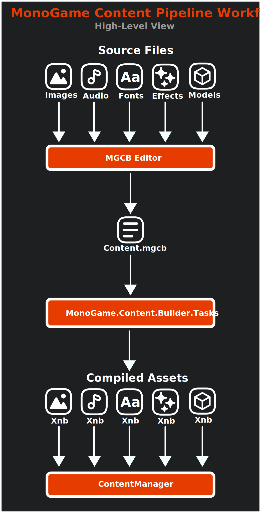
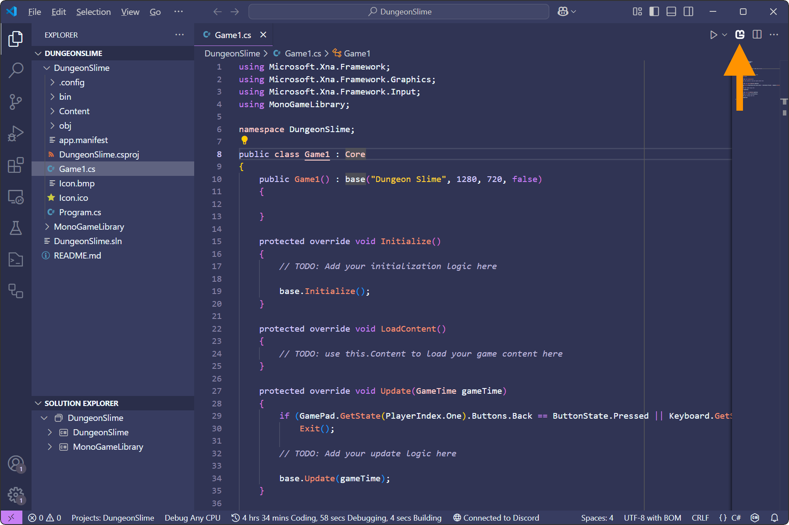
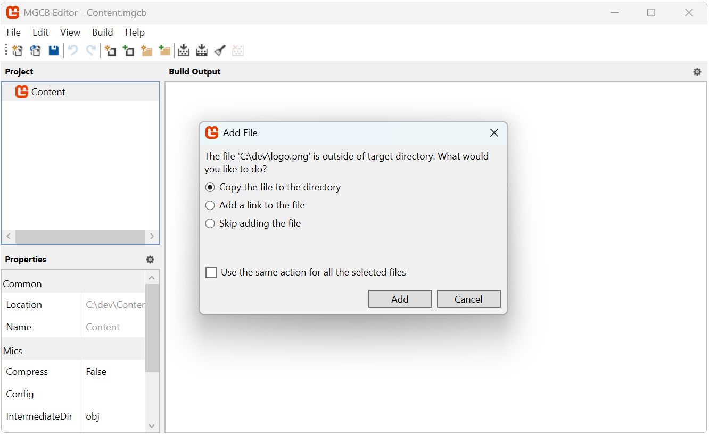

Every game has assets; images to represent the visual graphics to players, audio to provide sound effects and background music, fonts to render text with, and much more.  These assets start out as raw files (e.g. *.png* image files or *.mp3* audio files), which you'll need to load into the game to use.

## Loading Assets

Loading assets can be done during runtime directly from file, or it can be loaded through the **Content Pipeline**  Both of these methods are two sides of the same coin and there are trade offs to each approach.

For instance, to load an image file directly at runtime, you would need to:

1. Add the image file to your project.
2. Configure the project to copy the image file on build to the build output folder.
3. Load the image file as a texture at runtime using the [**Texture2D.FromFile**](xref:Microsoft.Xna.Framework.Graphics.Texture2D.FromFile(Microsoft.Xna.Framework.Graphics.GraphicsDevice,System.String)) method.

> [!IMPORTANT]
> A big disadvantage to loading an image file as a texture directly, is when that when it loads it, it does so in its compressed format such as *.png* or *.jpg*.  These compression formats are not understood by a Graphics Processing Unit (GPU); they will need to be decompressed into raw bytes as a format the GPU does understand before it can store the data.  Doing this can potentially leave a larger memory footprint for your assets.  You will also need to handle how different compression formats work on the platform you are targeting such as desktops, mobile, and consoles.  
>
> Alternatively, as we'll explore below, using the **Content Pipeline** handles this for you automatically.

On the other side of this coin, MonoGame offers the **Content Pipeline**; a workflow for managing assets. The workflow is made up of a set of tools and utilities that are automatically added by default when you create a new MonoGame project using the MonoGame project templates.  To use this workflow, you need to:

1. Add the asset file to your content project (*Content.mgcb* file) using the *MonoGame Content Builder Editor* (MGCB Editor).
2. Perform a project build. Doing this, the *MonoGame.Content.Builder.Tasks* NuGet reference will compile the assets defined in the content project, optimized for the target platform, and automatically copy them to the game project build folder.
3. Load the compiled asset at runtime using the [**ContentManager**](xref:Microsoft.Xna.Framework.Content.ContentManager).

The following image illustrates this workflow:

|  |
|:----------------------------------------------------------------------------------------------:|
|                       **Figure 5-1: MonoGame Content Pipeline Workflow**                       |

For the same amount of steps, you also get the benefit of the assets being pre-processed and compiled to an optimized format for the target platform.  For instance, image files can be compiled using [DXT compression](https://en.wikipedia.org/wiki/S3\_Texture\_Compression), which is a format that is understood by GPUs without needing to be decompressed first, reducing the memory footprint.

> [!NOTE]
> For more information on the benefits of compiling assets and what optimizations it can offer, see the [Content Pipeline](../../../getting_started/content_pipeline/index.md) documentation.

For this tutorial series, we are going to focus on using the content pipeline workflow to load assets.  Doing this will get you as the developer accustomed to using the content pipeline tools and also give the benefits of having assets precompiled to optimized formats.

## The MGCB Editor

The MGCB Editor is a GUI tool that can be used to edit your content project.  This tool is automatically added to your game project as a local [dotnet tool](https://learn.microsoft.com/en-us/dotnet/core/tools/global-tools) when you create a new MonoGame game project using one of the MonoGame project templates.  Using the editor, you can add existing assets to the content project for your game, or create a new asset using one of the built-in types in the MGCB Editor:

- **Effect (.fx)**: A shader file that creates custom visual effects by controlling how graphics are rendered on the GPU.
- **LocalizedSpriteFont Description (.spritefont)**: A configuration file for creating fonts with support for multiple languages.
- **Sprite Effect (.fx)**: A shader specifically designed for use with 2D sprites to create special visual effects.
- **SpriteFont Description (.spritefont)**: A configuration file that defines how text will be displayed in your game, including character set and font properties.
- **Xml Content (.xml)**: A structured data file for storing game information like levels, dialogues, or configuration settings.

> [!NOTE]
> The content project is the *Content.mgcb* file in your game project folder.  This file can be edited manually by hand, however it's much easier to use the MGCB Editor instead.  

### Opening the MGCB Editor

There are different methods of opening the MGCB Editor tool depending on your IDE and environment:

### [Visual Studio Code](#tab/vscode)

To open the *Content.mgcb* content project file in the MGCB Editor with Visual Studio Code, you can use the *MonoGame for VSCode* extension.  You should have installed this extension in [Chapter 02](../02_getting_started/index.md#installing-the-monogame-for-vscode-extension).  With this extension install, anytime you have a code file open, you will see the MonoGame logo in the top-right of the code window like below:

|  |
|:--------------------------------------------------------------------------------:|
|                **Figure 5-2: MonoGame for VSCode extension icon**                |

Clicking the MonoGame logo here will open the *Content.mgcb* content project file from the current project in the MGCB Editor.

### [Visual Studio 2022](#tab/vs2022)

To open the *Content.mgcb* content project file in the MGCB Editor with Visual Studio 2022, you can use the *MonoGame Framework C# project templates* extension.  Despite the name, this extension does more than just install the MonoGame project templates.  With this extension installed, simply double-click the *Content.mgcb* content project file in the Solution Explorer panel and it will open it in the MGCB Editor.

### [dotnet CLI](#tab/dotnetcli)

To open the *Content.mgcb* content project file in the MGCB Editor using the dotnet CLI commands, perform the following:

1. Open a new Command Prompt or Terminal window in the same folder as your game project's *.csproj* file.
2. Enter the command `dotnet mgcb-editor ./Content/Content.mgcb`

---

|  |
|:---------------------------------------------------------------------------------------------:|
|             **Figure 5-3: MonoGame Content Builder Editor (MGCB Editor) Window**              |

In Figure 5-3 above, you can see the user interface for the MGCB Editor:

- **Toolbar**: Contains icon buttons for common actions such as creating new items, opening files, saving changes, and building content.
- **Project Panel**: Located on the left of the MGCB Editor, displays a hierarchial tree view of all content items added to the content project.  The root node *Content* represents the root of the content project.
- **Properties Panel**: Located on the bottom left of the MGCB Editor, shows the properties of the currently selected item in the project panel.  The properties available are based on the item type selected.
- **Build Output Panel**: The large area to the right side outputs build messages, warnings, and errors when content is processed.

### Adding Existing Assets

To add an existing asset to the content project:

1. In the Project panel, select the folder where you want to add the item. If you want to add it to the root, select the main *Content* node.
2. Right-click on the selected folder and choose *Add > Existing Item...* from the context menu.
3. In the file browser that appears, navigate to the location of the file you want to add.
4. Select the file(s) you want to add and click *Open*.

When adding existing assets to the content project, a pop-up dialog will appear with the following options:

- **Copy the file to the folder**: Creates a duplicate of the file inside your project's Content folder. This creates an independent copy, meaning any later changes to the original file won't affect your project.
- **Add a link**: Creates a reference to the original file without making a copy. This maintains a connection to the source file, so any updates to the original will be included when you build. Note that the link uses a path relative to the Content.mgcb file, so if either the source file or your project moves, you'll need to reestablish the link.
- **Skip**: Cancels adding the current file while continuing with any other selected files.

|  |
|:--------------------------------------------------------------------:|
|               **Figure 5-4: Add existing file pop-up**               |

### Adding Built-In Asset Types

To create a new asset using one of the built-in types in the MGCB Editor:

1. In the Project panel, select the folder where you want to add the new asset. If you want to add it to the root, select the main *Content* node.
2. Right-click on the selected folder and choose *Add > New Item...* from the context menu.
3. In the dialog that appears, select the type of asset you want to create from the list of available built-in types:
    - **Effect (.fx)**: A shader file that creates custom visual effects by controlling how graphics are rendered on the GPU.
    - **SpriteFont Description (.spritefont)**: A configuration file that defines how text will be displayed in your game, including character set and font properties.
    - **Sprite Effect (.fx)**: A shader specifically designed for use with 2D sprites to create special visual effects.
    - **Xml Content (.xml)**: A structured data file for storing game information like levels, dialogues, or configuration settings.
    - **LocalizedSpriteFont Description (.spritefont)**: A configuration file for creating fonts with support for multiple languages.
4. Enter a name for your new asset in the *Name* field.
5. Click *Create* to add the new asset to your project.

|  |
|:-----------------------------------------------------------:|
|               **Figure 5-5: New file pop-up**               |

> [!NOTE]
> Each built-in asset type comes with a template that includes the minimum required structure and settings.

### Adding Folders to Organize Content

Organizing your game assets into folders helps keep your content project manageable as it grows. To add a new folder:

1. In the Project panel, select the location where you want to create a new folder. This can be the root *Content* node or another existing folder.
2. Right-click on the selected location and choose *Add > New Folder...* from the context menu.
3. Type a name for the new folder and click *Ok*.

|  |
|:---------------------------------------------------------------:|
|                 **Figure 5-6: New folder pop-up                 |

The new folder will appear in your content tree, and you can now add items to it by:

- Adding existing assets directly to the folder
- Creating new assets within the folder

The folder structure you create in the MGCB Editor affects how you'll access your content in code. It's good practice to establish a folder structure early in your project development to avoid having to reorganize and update content paths later.

## The ContentManager Class

To load assets in code that have been processed through the content pipeline, MonoGame provides the [**ContentManager**](xref:Microsoft.Xna.Framework.Content.ContentManager) class.

> [!NOTE]
> The [**Game**](xref:Microsoft.Xna.Framework.Game) class provides the [**Content**](xref:Microsoft.Xna.Framework.Game.Content) property which is ready to use instance of the [**ContentManager**](xref:Microsoft.Xna.Framework.Content.ContentManager).

### ContentManager Properties

The [**ContentManager**](xref:Microsoft.Xna.Framework.Content.ContentManager) offers the following properties:

| Property                                                                                   | Type               | Description                                                 |
|--------------------------------------------------------------------------------------------|--------------------|-------------------------------------------------------------|
| [**RootDirectory**](xref:Microsoft.Xna.Framework.Content.ContentManager.RootDirectory)     | `string`           | The root folder the content manager searches for assets. |
| [**ServiceProvider**](xref:Microsoft.Xna.Framework.Content.ContentManager.ServiceProvider) | `IServiceProvider` | The service provider used by the content manager.           |

### ContentManager Methods

The [**ContentManager**](xref:Microsoft.Xna.Framework.Content.ContentManager) offers the following methods:

| Method                                                                                                                                                     | Returns | Description                                                                                                                                                                                                                                                                                               |
|------------------------------------------------------------------------------------------------------------------------------------------------------------|---------|-----------------------------------------------------------------------------------------------------------------------------------------------------------------------------------------------------------------------------------------------------------------------------------------------------------|
| [**Load&lt;T&gt;(string)**](xref:Microsoft.Xna.Framework.Content.ContentManager.Load``1(System.String))                                                    | `T`     | Loads the assets of type `T` that has been processed by the content pipeline.                                                                                                                                                                                                                             |
| [**LoadLocalized&lt;T&gt;(string)**](xref:Microsoft.Xna.Framework.Content.ContentManager.LoadLocalized``1(System.String))                                  | `T`     | Loads the asset of type `T` that has been processed by the content pipeline using prepending the [**CultureInfo.CurrentCulture**](https://learn.microsoft.com/en-us/dotnet/api/system.globalization.cultureinfo.currentculture?view=net-9.0) value to the end of the asset name. (e.g. "assetname.en-US") |
| [**Unload**](xref:Microsoft.Xna.Framework.Content.ContentManager.Unload)                                                                                   | `void`  | Unloads all assets that have been loaded by that content manager instance.                                                                                                                                                                                                                                |
| [**UnloadAsset(string)**](xref:Microsoft.Xna.Framework.Content.ContentManager.UnloadAsset(System.String))                                                  | `void`  | Unloads the asset with the specified name that has been loaded by that content manager instance.                                                                                                                                                                                                          |
| [**UnloadAssets(IList&lt;string&gt;)**](xref:Microsoft.Xna.Framework.Content.ContentManager.UnloadAssets(System.Collections.Generic.IList{System.String})) | `void`  | Unloads the assets that have been loaded by that content manager with the names specified in the list provided.                                                                                                                                                                                           |
| [**Dispose**](xref:Microsoft.Xna.Framework.Content.ContentManager.Dispose(System.Boolean))                                                                 | `void`  | Unloads all assets from the content manager and disposes of the content manager instance.                                                                                                                                                                                                                 |

> [!TIP]
> When an asset is loaded for the first time, the [**ContentManager**](xref:Microsoft.Xna.Framework.Content.ContentManager) will internally cache the loaded asset.  Loading that same asset later will return the cached asset instead of having to perform another disk read to load the asset again.

> [!TIP]
> When an asset is unloaded, if the asset type implements the `IDisposable` interface, the `Dispose` method will automatically be called on the asset during the unload process.

When loading an asset, the load methods require two parts:

1. `T` Type Reference: The content type we are loading.
2. `assetName` Parameter: A string path that matches the content path of the asset to load.

## Understanding Content Paths

The folder structure you create in the MGCB Editor directly affects how you load content in your game. When you perform a build of your game project, the *MonoGame.Content.Builder.Tasks* NuGet package reference will:

1. Compile the assets into an optimized format in the **content project's** output folder (typically *ProjectRoot/Content/bin/Platform/Content*) as an *.xnb* file.
2. Copy the compiled assets to your **game's** output folder (typically *ProjectRoot/bin/Debug/net8.0/Content* or *ProjectRoot/bin/Release/net8.0/Content*).

For example, if your content project contains:

[!code-sh]

then when the tasks first compiles the assets, they will be output to:

[!code-sh]

Then after compiling them and copying them to the game projects output folder, it will look like the following:

[!code-sh]

When the [**ContentManager**](xref:Microsoft.Xna.Framework.Content.ContentManager) is used to load these assets, it looks for them relative to its [**RootDirectory**](xref:Microsoft.Xna.Framework.Content.ContentManager.RootDirectory) property. By default, this is set to `"Content"` in the `Game1` constructor to match where the compiled assets are copied. The path used to load an asset must match its location relative to the [**RootDirectory**](xref:Microsoft.Xna.Framework.Content.ContentManager.RootDirectory), minus any extension. For example, to load the above assets, the paths would be `"images/logo"` and `"sounds/music"`.

## Loading Our First Asset

Let's walk through the process of editing our content project using the MGCB Editor to add a new image asset and then load it in our game.  To get started, we'll first need an image to load.  Right-click the following image of the MonoGame logo and save it named *logo.png* somewhere on your computer:

|  |
|:----------------------------------------------------------:|
|          **Figure 5-7: MonoGame Horizontal Logo**          |

Now that we have an image file to add, perform the following:

1. Open the content project in the MGCB Editor.
2. Select the *Content* node in the Project Panel.
3. Right-click on the selected *Content* node and choose *Add > New Folder...* from the context menu.
4. Name the folder *images* and click the *Ok* button.
5. Select the new *images* node in the Project Panel.
6. Right-click on the selected *images* node and choose *Add > Existing Item..* from the context menu.
7. In the file browser that appears, navigate to the location of the *logo.png* file you just downloaded.
8. Select the *logo.png*  file click *Open*.
9. When prompted choose the *Copy the file to the directory* option from the add exiting file pop-up.
10. Save the changes made to the content project by selecting *File > Save* from the top menu.

> [!IMPORTANT]
> After changes have been made in the MGCB Editor, ensure that you save the changes.  They are not automatically saved, though you will be warned if you close the editor and haven't saved changes. You can tell that changes have not been saved by looking at the title bar of the MGCB editor window.  If it has an '*' at the end of the window title, this means changes have not been saved

|  |
|:-----------------------------------------------------------------------------------------------------------:|
|               **Figure 5-8: The logo image added to the content project in the MGCB Editor**                |

With the MonoGame logo image now added to the content project, we can load it in our game and draw it.  Open the *Game1.cs* file and make the following changes:

[!code-csharp]

The key changes made here are:

1. The private field `_logo` was added to store the logo [**Texture2D**](xref:Microsoft.Xna.Framework.Graphics.Texture2D) once it is loaded.
2. In [**LoadContent**](xref:Microsoft.Xna.Framework.Game.LoadContent), the logo texture is loaded using the [**ContentManager**](xref:Microsoft.Xna.Framework.Content.ContentManager).
3. In [**Draw**](xref:Microsoft.Xna.Framework.Game.Draw(Microsoft.Xna.Framework.GameTime)) the logo is drawn using the [**SpriteBatch**](xref:Microsoft.Xna.Framework.Graphics.SpriteBatch).

    > [!NOTE]
    > We'll go more into detail about the [**SpriteBatch**](xref:Microsoft.Xna.Framework.Graphics.SpriteBatch) in the next chapter.

Running the game now will show the MonoGame logo displayed in the upper-left corner of the game window.

|  |
|:----------------------------------------------------------------------------------:|
|             **Figure 5-9: The MonoGame logo drawn to the game window**             |

## Conclusion

Let's review what you accomplished in this chapter:

- You learned about the advantages of loading assets using the **Content Pipeline**.
- You added an image file asset to the *Content.mgcb* content project using the MGCB Editor.
- You learned about the **Content Pipeline** workflow and how MonoGame automates the process for you.
- You loaded the image file asset using the [**ContentManager**](xref:Microsoft.Xna.Framework.Content.ContentManager)

In the next chapter, we'll go more into detail on working with textures and the various options available when rendering them.

## Test Your Knowledge

1. What are the two main ways of loading a texture, and what are the pros and cons of each approach?

    :::question-answer
    The two main ways to load a texture in MonoGame are:

    1. Directly from file using [**Texture2D.FromFile**](xref:Microsoft.Xna.Framework.Graphics.Texture2D.FromFile(Microsoft.Xna.Framework.Graphics.GraphicsDevice,System.String)).   This method requires manually setting up file copying, offers no pre-processing benefits, and can have a higher memory footprint.

    2. Using the content pipeline with [**Content.Load<Texture2D>**](xref:Microsoft.Xna.Framework.Content.ContentManager.Load``1(System.String)).  Using the content pipeline optimizes textures into formats for the target platform(s), automatically handles compiling and copying assets during build, and reduces memory footprint, but requires additional setup using the MGCB Editor.
    :::

2. During the MonoGame content pipeline workflow, assets are compiled and then copied to the project output folder.  What is responsible for performing this task?

    :::question-answer
    The *MonoGame.Content.Builder.Tasks* NuGet reference.
    :::
