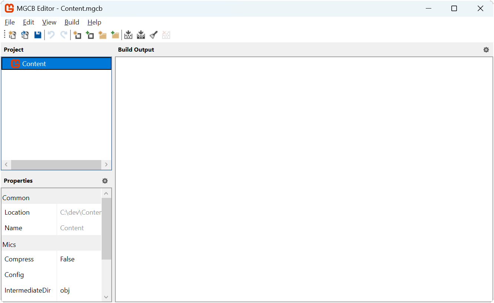

Every game has assets: images to represent the visual graphics to players, audio to provide sound effects and background music, fonts to render text with, and much more.  These assets start out as raw files (e.g. *.png* image files or *.mp3* audio files), which you will need to load into the game to use.

## Loading Assets

Loading assets can be done during runtime directly from file, or it can be loaded through the **Content Pipeline**.  Both of these methods are two sides of the same coin, and there are trade offs to each approach.

For instance, to load an image file directly at runtime, you would need to:

1. Add the image file to your project.
2. Configure the project to copy the image file on build to the build output folder.
3. Load the image file as a texture at runtime using the [**Texture2D.FromFile**](xref:Microsoft.Xna.Framework.Graphics.Texture2D.FromFile(Microsoft.Xna.Framework.Graphics.GraphicsDevice,System.String)) method.

> [!IMPORTANT]
> One major drawback of loading an image file as a texture directly at runtime is that the data is in a compressed format, such as .png or .jpg. These compression formats are not understood by a Graphics Processing Unit (GPU). In order to be used by your game, this data will need to be decompressed into raw bytes, a format that the GPU understands. This operation can potentially leave a larger memory footprint for your assets. You will also need to handle how different compression formats work on the platform you are targeting, such as desktops, mobile and consoles.

On the other side of the coin, MonoGame offers the **Content Pipeline**; a workflow for managing assets. The workflow is made up of a set of tools and utilities that are automatically added by default when you create a new MonoGame project using the MonoGame project templates. To use this workflow, you need to:

1. Add the asset file to your content project (*Content.mgcb* file) using the *MonoGame Content Builder Editor* (MGCB Editor).
2. Perform a project build. This will cause the *MonoGame.Content.Builder.Tasks* NuGet reference to compile the assets defined in the content project, optimized for the target platform, and automatically copy them to the game project build folder.
3. Load the compiled asset at runtime using the [**ContentManager**](xref:Microsoft.Xna.Framework.Content.ContentManager).

For the same amount of steps, you also get the benefit of the assets being pre-processed and compiled to an optimized format for the target platform.  For instance, image files can be compiled using [DXT compression](https://en.wikipedia.org/wiki/S3\_Texture\_Compression), which is a format that is understood by GPUs without needing to be decompressed first, reducing the memory footprint.

> [!NOTE]
> For more information on the benefits of compiling assets and what optimizations it can offer, see the [Content Pipeline](../../../getting_started/content_pipeline/index.md) documentation.

For this tutorial series, we are going to focus on using the content pipeline workflow to load assets.  Doing this will allow you, as the developer, to get accustomed to using the content pipeline tools, and also give the benefits of having assets pre-compiled to optimized formats.

## The MGCB Editor

As mentioned previously, the content pipeline workflow in MonoGame is made up of a set of tools that come with every new MonoGame project.  At the center of this workflow is the MGCB Editor; a graphical tool for managing your game's content.

Opening the MGCB Editor can be done in different ways depending on which IDE and development environment you have.  Choose the one you are using below to open the MGCB Editor so we can explore its interface:

### [Visual Studio Code](#tab/vscode)

To open the *Content.mgcb* content project file in the MGCB Editor from Visual Studio Code, you can use the *MonoGame for VSCode* extension. You should already have installed this extension in [Chapter 02](../02_getting_started/index.md#installing-the-monogame-for-vscode-extension).  With this extension installed, anytime you have a code file open, you will see the MonoGame logo in the top-right of the code window like below:

|  |
| :------------------------------------------------------------------------------: |
|                **Figure 5-1: MonoGame for VSCode extension icon**                |

Clicking the MonoGame logo here will open the *Content.mgcb* content project file from the current project in the MGCB Editor.

### [Visual Studio 2022](#tab/vs2022)

To open the *Content.mgcb* content project file in the MGCB Editor from Visual Studio 2022, you can use the *MonoGame Framework C# project templates* extension. Despite the name, this extension does more than just install the MonoGame project templates. With this extension installed, simply double-click the *Content.mgcb* content project file in the Solution Explorer panel to open it in the MGCB Editor.

### [dotnet CLI](#tab/dotnetcli)

To open the *Content.mgcb* content project file in the MGCB Editor using the dotnet CLI commands, perform the following:

1. Open a new Command Prompt or Terminal window in the same folder as the *DungeonSlime.csproj* project file (your main game project).
2. Enter the following dotnet CLI command

    ```sh
    dotnet mgcb-editor ./Content/Content.mgcb
    ```

---

> [!TIP]
> If for any reason the MGCB editor fails to load or you are hit with MGCB errors when you build your project, it is likely the MGCB references from the `dotnet-tools.json` configuration located in your projects `.config` folder have not been loaded/initialized.
>
> To correct this, simply run the following from a terminal/command prompt in your projects directory (there the `.config` folder is located)
>
> ```sh
>   dotnet tool restore
> ```
>
> This should restore the tool with the version that is configured.  If at any time you update your `dotnet-tools.json` configuration, e.g. when upgrading to a newer version of MonoGame, **you will need to run this command again**

|  |
| :-------------------------------------------------------------------------------------------: |
|             **Figure 5-2: MonoGame Content Builder Editor (MGCB Editor) Window**              |

In *Figure 5-2* above, you can see the user interface for the MGCB Editor:

- **Toolbar**: Contains icon buttons for common actions such as creating new items, opening files, saving changes, and building content.
- **Project Panel**: Located on the left side of the MGCB Editor, it displays a hierarchical tree view of all content items added to the content project.  The root node *Content* represents the root of the content project.
- **Properties Panel**: Located in the lower left corner of the MGCB Editor, it lists the properties of the currently selected item in the project panel. The available properties are based on the selected element type.
- **Build Output Panel**: The large area to the right side outputs build messages, warnings, and errors when content is processed.

### Creating Folders to Organize Content

Organizing your game assets into folders helps keep your content project manageable as it grows. For now, we will add a new folder that will hold the image assets we will add to the game throughout this tutorial series.  In the MGCB Editor:

1. In the Project Panel, select the root `Content` node.
2. Right-click it and choose `Add > New Folder...` from the context menu.
3. Type `images` for the folder name and click the `Ok` button.

|  |
| :-------------------------------------------------------------: |
|                **Figure 5-3: New folder pop-up**                |

You have now created a folder that will help organize the game's image assets.  As we continue through this tutorial series, we will be adding additional folders for organization of content such as audio, fonts, and effects.

> [!NOTE]
> If you try to add a new folder that already exists in the file system but is not showing in the MGCB editor, you will get an error.  Either remove the folder or use `Add Existing Folder` instead.

### Adding Your First Asset

Now that we have a folder structure, we can add our first image asset to the project.  For this example, we will use the MonoGame logo.  Perform the following:

1. First, download the MonoGame logo by right-clicking the following image and saving it as `logo.png` somewhere on your computer:

    |  |
    | :--------------------------------------------------------: |
    |          **Figure 5-4: MonoGame Horizontal Logo**          |

2. In the MGCB Editor, select the `images` folder you created earlier.
3. Right-click it and choose `Add > Existing Item...` from the context menu.
4. Navigate to the location of the `logo.png` file you just downloaded and select it.
5. Click the `Open` button
6. When prompted in the add existing file popup, choose `Copy the file to the directory.`

    |  |
    | :------------------------------------------------------------------: |
    |               **Figure 5-5: Add existing file pop-up**               |

7. Save the changes to the content project by selecting `File > Save` from the top menu or pressing `CTRL+S`.

|  |
| :---------------------------------------------------------------------------------------------------------: |
|               **Figure 5-6: The logo image added to the content project in the MGCB Editor**                |

> [!IMPORTANT]
> After changes have been made in the MGCB Editor, ensure that you save the changes.  They are not automatically saved, though you will be warned if you close the editor and have not saved changes. You can tell that changes have not been saved by looking at the title bar of the MGCB editor window.  If it has an '*' at the end of the window title, this means changes have not been saved.

## Understanding the Content Pipeline Workflow

Now that we have added our first asset, we can take a moment to understand what happens to this asset in the Content Pipeline workflow:

1. You create source files for your game assets such as images, audio, fonts, effects, and 3D models.
2. Using the MGCB Editor, add these assets your content project (the `Content.mgcb` file).
3. When you perform a build of your project, the `MonoGame.Content.Builder.Task` NuGet reference will:
   1. Compile the assets defined in the content project using the **MonoGame Content Builder (MGCB)** tool into `.xnb` files.
   2. Copy the compiled `.xnb` files from the content project's build folder to your game project's build folder.
4. At runtime, you load the compiled assets using the [ContentManager](xref:Microsoft.Xna.Framework.Content.ContentManager).

The following diagram demonstrates this workflow:

|  |
| :----------------------------------------------------------------------------------------------------------------------------------------------------------------------------------------------------------------------------------------------------------------------------------------------------------------------------------------------------------------------------------------------------------------------------------: |
|                       **Figure 5-7: MonoGame Content Pipeline Workflow diagram showing the process flow from source files (Images, Audio, Fonts, Effects, Models) through the MGCB Editor to generate the Content.mgcb file, which is then processed by MonoGame.Content.Builder.Tasks to create compiled .xnb assets (Xnb formats for each type), which are finally loaded by the ContentManager at runtime**                       |

The Content Pipeline offers significant advantages:

- Assets are pre-processed and optimized for your target platform.
- Image files can be compiled using formats like DXT compression, which GPU's understand natively.
- Asset loading is simplified and consistent across platforms.

## The ContentManager Class

To load assets in your game code, MonoGame provides the [**ContentManager**](xref:Microsoft.Xna.Framework.Content.ContentManager) class. The [**Game**](xref:Microsoft.Xna.Framework.Game) already has a [**Content**](xref:Microsoft.Xna.Framework.Game.Content) property which is a ready-to-use instance of the [**ContentManager**](xref:Microsoft.Xna.Framework.Content.ContentManager)

### ContentManager Methods

The key methods for asset loading are:

| Method                                                                                                    | Returns | Description                                                                  |
| --------------------------------------------------------------------------------------------------------- | ------- | ---------------------------------------------------------------------------- |
| [**Load&lt;T&gt;(string)**](xref:Microsoft.Xna.Framework.Content.ContentManager.Load``1(System.String))   | `T`     | Loads the asset of type `T` that has been processed by the content pipeline. |
| [**Unload**](xref:Microsoft.Xna.Framework.Content.ContentManager.Unload)                                  | `void`  | Unloads all assets that have been loaded by that content manager instance.   |

> [!TIP]
> When an asset is loaded for the first time, the [**ContentManager**](xref:Microsoft.Xna.Framework.Content.ContentManager) internally caches it.  Loading the same asset again will return the cached version, avoiding extra disk reads.

## Understanding Content Paths

When loading content, you need to specify the path to the asset, minus the extension.  This path is relative to the ContentManager's [**RootDirectory**](xref:Microsoft.Xna.Framework.Content.ContentManager.RootDirectory) property, which is set to **"Content"** by default in the `Game1` constructor.

For example, with our newly added logo in the "images" folder,the path would be "images/logo" (without the file extension).  The reason for this relates to the build process.  When you build your project, the *MonoGame.Content.Builder.Tasks* NuGet reference [compiles your assets and copies them to the game's output folder](#understanding-the-content-pipeline-workflow).

This creates a folder structure in your output directory similar to:

```sh
DungeonSlime/
    └── bin/
        └── Debug/
            └── net8.0/
                ├── DungeonSlime.exe
                └── Content/
                    └── images/
                        └── logo.xnb
```

> [!NOTE]
> Notice that the compiled asset has an .xnb extension, but when loading the asset in code, you refer to it without any extension.

## Loading and Displaying Your First Asset

Now that we have the MonoGame logo added as an asset in the content project, we can modify the game to display the logo.  In the *DungeonSlime* project, open the `Game1.cs` file and perform the following:

1. Add a field to store the logo texture by inserting this line after the class declaration:

    ```cs
    // The MonoGame logo texture
    private Texture2D _logo;
    ```

2. In the [**LoadContent**](xref:Microsoft.Xna.Framework.Game.LoadContent) method, add this line to load the logo texture:

    ```cs
    _logo = Content.Load<Texture2D>("images/logo");
    ```

3. Finally, in the [**Draw**](xref:Microsoft.Xna.Framework.Game.Draw(Microsoft.Xna.Framework.GameTime)) method, add these lines before the `base.Draw(gameTime);` call:

    ```cs
    // Begin the sprite batch to prepare for rendering.
    SpriteBatch.Begin();

    // Draw the logo texture
    SpriteBatch.Draw(_logo, Vector2.Zero, Color.White);

    // Always end the sprite batch when finished.
    SpriteBatch.End();
    ```

    > [!NOTE]
    > We will go into more details about the [**SpriteBatch**](xref:Microsoft.Xna.Framework.Graphics.SpriteBatch) in the next chapter.

The complete updated `Game1.cs` file should now look like this:

[!code-csharp[](./snippets/game1.cs?highlight=10-11,27,44-51)]

Running the game now will show the MonoGame logo displayed in the upper-left corner of the game window.

|  |
| :--------------------------------------------------------------------------------: |
|             **Figure 5-8: The MonoGame logo drawn to the game window**             |

## Adding Built-In Asset Types

The MGCB Editor can also create certain built-in asset types.  In this section we will explore these types and this functionality.  If not already open, [open the MGCB Editor](#the-mgcb-editor) and perform the following:

1. Select the `Content` node.
2. Right-click it and choose `Add > New Item...` from the context menu.
3. In the dialog that appears, you will see the available built-in types.

    |  |
    | :---------------------------------------------------------: |
    |               **Figure 5-9: New file pop-up**               |

The available built-in types include:

- **Effect (.fx)**: A shader file that creates custom visual effects by controlling how graphics are rendered on the GPU.
- **SpriteFont Description (.spritefont)**: A configuration file that defines how text will be displayed in your game, including character set and font properties.
- **Sprite Effect (.fx)**: A shader specifically designed for use with 2D sprites to create special visual effects.
- **Xml Content (.xml)**: A structured data file for storing game information like levels, dialogues, or configuration settings.
- **LocalizedSpriteFont Description (.spritefont)**: A configuration file for creating fonts with support for multiple languages.

> [!NOTE]
> Each built-in asset type comes with a template that includes the minimum required structure and settings.

For now, click the `Cancel` button on the new file dialog.  We will explore these built-in types further in later chapters when we need them.

## Conclusion

In this chapter, you accomplished the following:

- You learned about the advantages of loading assets using the **Content Pipeline**.
- You opened the MGCB Editor and explored its interface.
- You created a folder structure to organize your game assets.
- You added an image file asset to the content project.
- You understood the Content Pipeline workflow and how MonoGame automates the process.
- You loaded and displayed your first asset using the [**ContentManager**](xref:Microsoft.Xna.Framework.Content.ContentManager).

In the next chapter, we will explore working with textures in more detail and learn about different rendering options.

## Test Your Knowledge

1. What are the two main ways of loading a texture, and what are the pros and cons of each approach?

    :::question-answer
    The two main ways to load a texture in MonoGame are:

    1. Directly from file using [**Texture2D.FromFile**](xref:Microsoft.Xna.Framework.Graphics.Texture2D.FromFile(Microsoft.Xna.Framework.Graphics.GraphicsDevice,System.String)).   This method requires manually setting up file copying, offers no pre-processing benefits, and can have a higher memory footprint.

    2. Using the content pipeline with [**Content.Load\<Texture2D>**](xref:Microsoft.Xna.Framework.Content.ContentManager.Load``1(System.String)).  Using the content pipeline optimizes textures into formats for the target platform(s), automatically handles compiling and copying assets during build, and reduces memory footprint, but requires additional setup using the MGCB Editor.
    :::

2. During the MonoGame content pipeline workflow, assets are compiled and then copied to the project output folder.  What is responsible for performing this task?

    :::question-answer
    The *MonoGame.Content.Builder.Tasks* NuGet reference.
    :::
