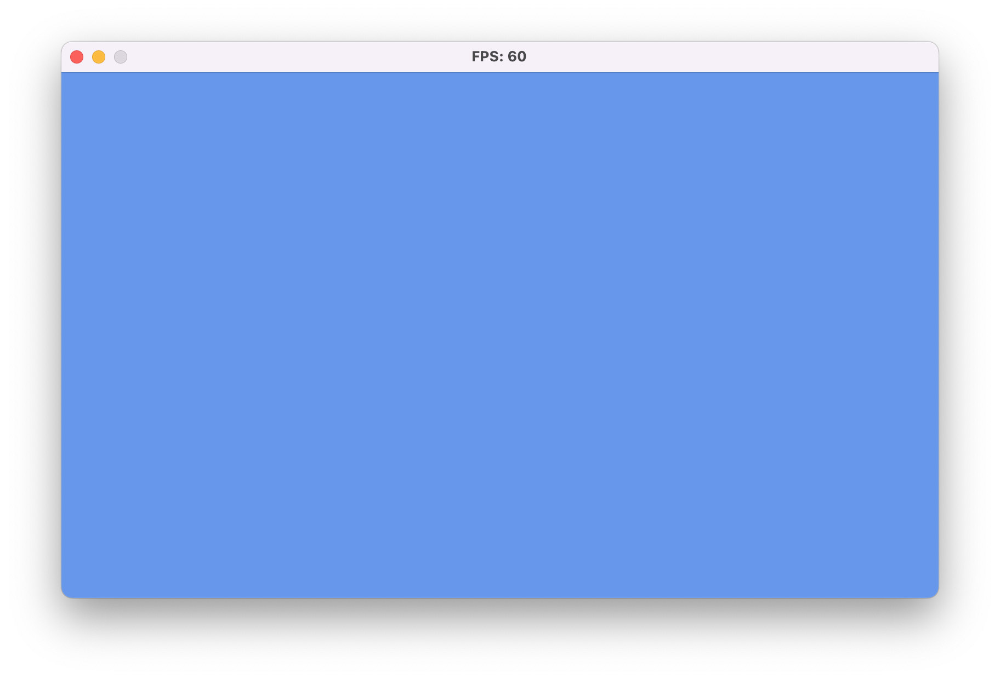

In [Chapter 03](../03_the_game1_file/index.md#the-game-loop) you learned about the [**Game**](xref:Microsoft.Xna.Framework.Game) class and how MonoGame manages the game loop through its [**Update**](xref:Microsoft.Xna.Framework.Game.Update(Microsoft.Xna.Framework.GameTime)) and [**Draw**](xref:Microsoft.Xna.Framework.Game.Draw(Microsoft.Xna.Framework.GameTime)) methods. While you could implement all your game's logic directly in these methods, MonoGame provides a component system that helps organize code into reusable pieces.

In this chapter, you will:

- Learn about MonoGame's component interfaces and base classes.
- Understand how components integrate with the game loop.
- Create reusable game components.
- Manage components through the game's component collection.

Let's start by understanding what game components are and how they work.

## Understanding Game Components

Game components are self-contained pieces of game functionality that can be easily added to or removed from a game. Components can:

- Automatically receive updates each frame.
- Handle their own drawing if needed.
- Be enabled or disabled as needed.
- Clean up their resources when disposed.

MonoGame provides several interfaces and base classes for creating components:

- [**IUpdateable**](xref:Microsoft.Xna.Framework.IUpdateable): Interface for components that need to update each frame.
- [**IDrawable**](xref:Microsoft.Xna.Framework.IDrawable): Interface for components that need to draw to the screen.
- [**GameComponent**](xref:Microsoft.Xna.Framework.GameComponent): Base class for updateable components.
- [**DrawableGameComponent**](xref:Microsoft.Xna.Framework.DrawableGameComponent): Base class for components that both update and draw.

### The IUpdatable Interface

The [**IUpdateable**](xref:Microsoft.Xna.Framework.IUpdateable) interface defines the contract for objects that can be updated each frame. It contains the following members:

[!code-csharp]

Key aspects of [**IUpdateable**](xref:Microsoft.Xna.Framework.IUpdateable):

- [**Enabled**](xref:Microsoft.Xna.Framework.IUpdateable.Enabled): Controls whether the component should receive updates.
- [**UpdateOrder**](xref:Microsoft.Xna.Framework.IUpdateable.UpdateOrder): Determines the order components are updated relative to each other.
- [**Update**](xref:Microsoft.Xna.Framework.IUpdateable.Update(Microsoft.Xna.Framework.GameTime)): The method called each frame to update the component's state.

> [!NOTE]
> The [**EnabledChanged**](xref:Microsoft.Xna.Framework.IUpdateable.EnabledChanged) and [**UpdateOrderChanged**](xref:Microsoft.Xna.Framework.IUpdateable.UpdateOrderChanged) events notify when these properties change. This allows other components to react to these changes if needed.

### The IDrawable Interface

The [**IDrawable**](xref:Microsoft.Xna.Framework.IDrawable) interface defines the contract for objects that can draw to the screen. It contains the following members:

[!code-csharp]

Key aspects of [**IDrawable**](xref:Microsoft.Xna.Framework.IDrawable):

- [**Visible**](xref:Microsoft.Xna.Framework.IDrawable.Visible): Controls whether the component should be drawn.
- [**DrawOrder**](xref:Microsoft.Xna.Framework.IDrawable.DrawOrder): Determines the order components are drawn relative to each other.
- [**Draw**](xref:Microsoft.Xna.Framework.IDrawable.Draw(Microsoft.Xna.Framework.GameTime)): The method called each frame to draw the component.

> [!NOTE]
> Like [**IUpdateable**](xref:Microsoft.Xna.Framework.IUpdateable), the events notify when these properties change.

### The GameComponent Class

While you could implement [**IUpdateable**](xref:Microsoft.Xna.Framework.IUpdateable) directly, MonoGame provides the [**GameComponent**](xref:Microsoft.Xna.Framework.GameComponent) base class that handles most of the boilerplate code:

[!code-csharp]

The [**GameComponent**](xref:Microsoft.Xna.Framework.GameComponent) class:

- Requires a reference to the [**Game**](xref:Microsoft.Xna.Framework.Game) instance it belongs to.
- Implements [**IUpdateable**](xref:Microsoft.Xna.Framework.IUpdateable) and handles the events.
- Virtual [**Initialize**](xref:Microsoft.Xna.Framework.GameComponent.Initialize) and [**Update**](xref:Microsoft.Xna.Framework.GameComponent.Update(Microsoft.Xna.Framework.GameTime)) methods you can override.

### The DrawableGameComponent Class

For components that need both update and draw functionality, MonoGame provides the [**DrawableGameComponent**](xref:Microsoft.Xna.Framework.DrawableGameComponent) class. This class inherits from [**GameComponent**](xref:Microsoft.Xna.Framework.GameComponent) and implements [**IDrawable**](xref:Microsoft.Xna.Framework.IDrawable).

[!code-csharp]

[**DrawableGameComponent**](xref:Microsoft.Xna.Framework.DrawableGameComponent) provides:

- All the features of [**GameComponent**](xref:Microsoft.Xna.Framework.GameComponent).
- Implementation of [**IDrawable**](xref:Microsoft.Xna.Framework.IDrawable).
- Access to the [**GraphicsDevice**](xref:Microsoft.Xna.Framework.Graphics.GraphicsDevice).
- Virtual [**LoadContent**](xref:Microsoft.Xna.Framework.DrawableGameComponent.LoadContent),  [**UnloadContent**](xref:Microsoft.Xna.Framework.DrawableGameComponent.UnloadContent), and [**Draw**](xref:Microsoft.Xna.Framework.DrawableGameComponent.Draw(Microsoft.Xna.Framework.GameTime)) methods you can override.

## Component Order and Dependencies

When you have multiple components, you might need to control their update and draw order. Components provide two ways to handle this:

1. Using the [**UpdateOrder**](xref:Microsoft.Xna.Framework.IUpdateable.UpdateOrder) and [**DrawOrder**](xref:Microsoft.Xna.Framework.IDrawable.DrawOrder) properties:

    [!code-csharp]

2. Using the [**GameComponentCollection**](xref:Microsoft.Xna.Framework.GameComponentCollection) to order components:

    [!code-csharp]

    > [!TIP]
    > Use [**UpdateOrder**](xref:Microsoft.Xna.Framework.IUpdateable.UpdateOrder) and [**DrawOrder**](xref:Microsoft.Xna.Framework.IDrawable.DrawOrder) when components have specific dependencies. Use the Components collection order for general layering.

## Creating Our First Game Component

Let's convert our existing `FramesPerSecondCounter` from [Chapter 04](../04_creating_a_class_library/index.md#creating-our-first-library-module) into a proper game component.  

Open the *FramesPerSecond.cs* file and perform the following changes:

[!code-csharp]

The key changes made here are:

1. The class signature was updated so that it now inherits from [**DrawableGameComponent**](xref:Microsoft.Xna.Framework.DrawableGameComponent)
2. The constructor was updated to take in a [**Game**](xref:Microsoft.Xna.Framework.Game) parameter and pass it to the base constructor since this is required from the [**DrawableGameComponent**](xref:Microsoft.Xna.Framework.DrawableGameComponent) inheritance.
3. The `Update` method signature was changed to `override` since it is now overriding the base method from [**DrawableGameComponent**](xref:Microsoft.Xna.Framework.DrawableGameComponent).
4. The `UpdateCounter` method was renamed to `Draw` which override the base [**DrawableGameComponent**](xref:Microsoft.Xna.Framework.DrawableGameComponent) method.
5. The logic to update the game's window title was moved here to the `Draw` method.

## Adding the Game Component to Our Game

Now that the `FramesPerSecondCounter` has been converted to a game component, let's update the game to use it as a component.  Open the *Game1.cs* file and make the following changes:

[!code-csharp]

The key changes made here are:

1. The private field `_fpsCounter` was removed.  We no longer need to track a reference to it since the `Update` and `Draw` methods will be called automatically.
2. In the constructor, a new `FramesPerSecondCounter` instance is created and added to the game's component collection.
3. In [**Update**](xref:Microsoft.Xna.Framework.Game.Update(Microsoft.Xna.Framework.GameTime)), the `_fpsCounter.Update(gameTime)` call was removed.  We no longer need this since the component will automatically be updated when `base.Update()` is called.

    > [!TIP]
    > When `base.Update(gameTime)` is called, the game handles updating all [**IUpdateable**](xref:Microsoft.Xna.Framework.IUpdateable) components in the games's [**GameComponentCollection**](xref:Microsoft.Xna.Framework.GameComponentCollection).  You don't need to manually update them in your game's [**Update**](xref:Microsoft.Xna.Framework.Game.Update(Microsoft.Xna.Framework.GameTime)) method anymore.

4. In [**Draw**](xref:Microsoft.Xna.Framework.Game.Draw(Microsoft.Xna.Framework.GameTime)), the `_fpsCounter.UpdateCounter()` call was removed and the window title update call was removed.  We no longer need these since they will be performed automatically when the `base.Draw()` is called.

    > [!TIP]
    > Just like in [**Update**](xref:Microsoft.Xna.Framework.Game.Update(Microsoft.Xna.Framework.GameTime)), when `base.Draw(gameTime)` is called, the game handles drawing all [**IDrawable**](xref:Microsoft.Xna.Framework.IUpdateable) components in the games's [**GameComponentCollection**](xref:Microsoft.Xna.Framework.GameComponentCollection).  You don't need to manually draw them in your game's [**Draw**](xref:Microsoft.Xna.Framework.Game.Draw(Microsoft.Xna.Framework.GameTime)) method anymore.

Running the game now, the `FramesPerSecondCounter` is created, added to the game's component collection, and automatically updated and drawn.  You should still see the calculated FPS displayed as the game's window title.

|  |
| :---: |
| **Figure 5-1: The game window showing the frames per second in the title bar of the window** |

## Conclusion

Let's review what you accomplished in this chapter:

- Learned about MonoGame's component interfaces and their purposes.
- Explored the [**GameComponent**](xref:Microsoft.Xna.Framework.GameComponent) and [**DrawableGameComponent**](xref:Microsoft.Xna.Framework.DrawableGameComponent) base classes.
- Converted our FPS counter into a proper game component.
- Understood how to manage component order and dependencies.

In the next chapter, we'll learn about the Content Pipeline and how to load game assets.

## Test Your Knowledge

1. What is the main difference between [**GameComponent**](xref:Microsoft.Xna.Framework.GameComponent) and [**DrawableGameComponent**](xref:Microsoft.Xna.Framework.DrawableGameComponent)?

    :::question-answer
    [**DrawableGameComponent**](xref:Microsoft.Xna.Framework.DrawableGameComponent) inherits from [**GameComponent**](xref:Microsoft.Xna.Framework.GameComponent) and adds drawing capabilities by implementing [**IDrawable**](xref:Microsoft.Xna.Framework.IDrawable). This makes it suitable for components that need both update and draw functionality.
    :::

2. How does MonoGame handle calling [**Update**](xref:Microsoft.Xna.Framework.GameComponent.Update(Microsoft.Xna.Framework.GameTime)) and [**Draw**](xref:Microsoft.Xna.Framework.DrawableGameComponent.Draw(Microsoft.Xna.Framework.GameTime)) on components?

    :::question-answer
    The [**Game**](xref:Microsoft.Xna.Framework.Game) class automatically calls [**Update**](xref:Microsoft.Xna.Framework.GameComponent.Update(Microsoft.Xna.Framework.GameTime)) during `base.Update()` and [**Draw**](xref:Microsoft.Xna.Framework.DrawableGameComponent.Draw(Microsoft.Xna.Framework.GameTime)) during `base.Draw()` on all components in its [**Components**](xref:Microsoft.Xna.Framework.Game.Components) collection. Components are processed in order based on their [**UpdateOrder**](xref:Microsoft.Xna.Framework.IUpdateable.UpdateOrder)/[**DrawOrder**](xref:Microsoft.Xna.Framework.IDrawable.DrawOrder) properties and the order they were added to the collection.
    :::

3. What advantages did we gain by converting our FPS counter to a proper game component?

    :::question-answer
    Converting to a game component:

    - Eliminated manual `Update` and `Draw` calls in the game class.
    - Provided automatic lifecycle management.
    - Made the component more reusable.
    - Added enable/disable functionality.
    :::
